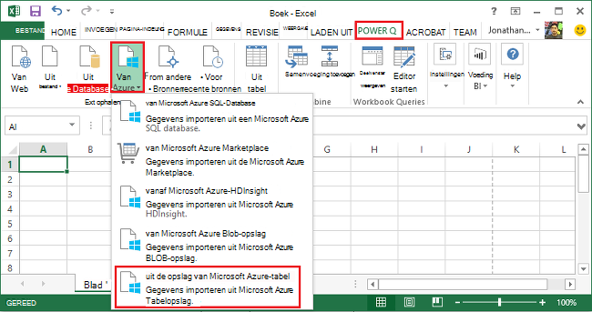
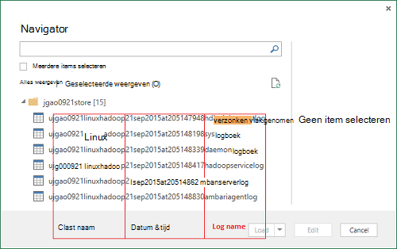
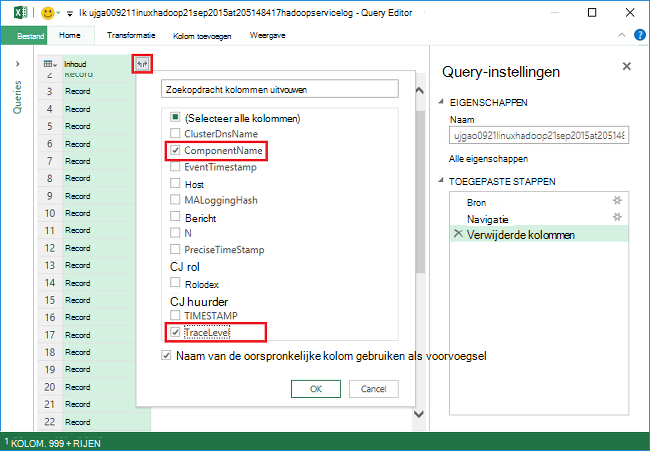
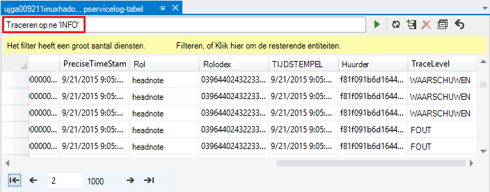
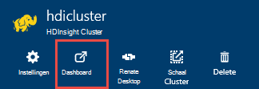
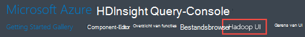
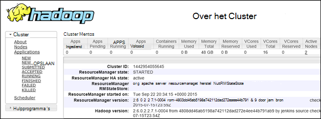

<properties
    pageTitle="Debug Hadoop in HDInsight: logboeken bekijken en interpreteren van foutberichten | Microsoft Azure"
    description="Informatie over de foutberichten ontvangt u mogelijk wanneer u HDInsight met PowerShell beheert en de stappen die u kunt nemen om te herstellen."
    services="hdinsight"
    tags="azure-portal"
    editor="cgronlun"
    manager="jhubbard"
    authors="mumian"
    documentationCenter=""/>

<tags
    ms.service="hdinsight"
    ms.workload="big-data"
    ms.tgt_pltfrm="na"
    ms.devlang="na"
    ms.topic="article"
    ms.date="09/02/2016"
    ms.author="jgao"/>

# HDInsight, logboekbestanden analyseren

Elk cluster Hadoop in Azure HDInsight heeft een Azure opslag-account gebruikt als het standaardbestandssysteem. De opslag-account wordt als standaardaccount opslag verwezen. Een cluster wordt gebruikt de tabel Azure opslag en de Blob-opslag op de standaard opslag-account voor het opslaan van de logboekbestanden.  Zie als u wilt weten wat de standaard opslag-account voor uw cluster, [clusters beheren Hadoop in HDInsight](hdinsight-administer-use-management-portal.md#find-the-default-storage-account). De logboeken behouden in de opslag, zelfs nadat de cluster is verwijderd.

##Logboeken geschreven naar Azure tabellen

De logboeken geschreven naar Azure tabellen bieden een beter inzicht in wat er met een HDInsight-cluster gebeurt.

Wanneer u een HDInsight-cluster maakt, worden automatisch 6 tabellen gemaakt voor Linux gebaseerde clusters in de tabel standaard opslag:

- hdinsightagentlog
- Syslog
- daemonlog
- hadoopservicelog
- ambariserverlog
- ambariagentlog

3-tabellen worden gemaakt voor Windows-gebaseerde clusters:

- bestand: logboek met gebeurtenissen/uitzonderingen opgetreden in het inrichten/instellen van clusters van HDInsight.
- hadoopinstalllog: logboek met gebeurtenissen/uitzonderingen opgetreden tijdens het installeren van Hadoop op het cluster. Deze tabel kan zijn handig bij het opsporen van fouten met betrekking tot clusters met aangepaste parameters gemaakt.
- hadoopservicelog: gebeurtenissen/uitzonderingen voor logboekregistratie door alle Hadoop-services. Deze tabel kan zijn handig bij het opsporen van fouten met betrekking tot storingen op clusters HDInsight taak.

De naam van de tabel **u<ClusterName>DDMonYYYYatHHMMSSsss<TableName>**.

Deze tabellen bevat de volgende velden:

- ClusterDnsName
- NaamOnderdeel
- EventTimestamp
- Host
- MALoggingHash
- Bericht
- N
- PreciseTimeStamp
- Rol
- RowIndex
- Huurder
- TIJDSTEMPEL
- TraceLevel

### Hulpmiddelen voor toegang tot de logboeken

Er zijn veel hulpmiddelen beschikbaar voor toegang tot de gegevens in deze tabellen:

-  Visual Studio
-  Azure Opslagverkenner
-  Power Query voor Excel

#### Power Query gebruiken voor Excel

Power Query kan worden geïnstalleerd vanaf [www.microsoft.com/en-us/download/details.aspx?id=39379]( http://www.microsoft.com/en-us/download/details.aspx?id=39379). Zie de downloadpagina voor de systeemvereisten

**Met Power Query openen en analyseren van het logboek van de service**

1. Open **Microsoft Excel**.
2. In het menu **Power Query** op **Azure uit**en klik vervolgens op **opslag van Azure tabel**.
 
    
3. Voer de naam van de opslag. Dit is de korte naam of de FQDN-naam.
4. Geef de sleutel opslag account. Er wordt een lijst met tabellen:

    
5. Klik met de rechtermuisknop op de tabel hadoopservicelog in het deelvenster **Navigator** en selecteer **bewerken**. Er zijn 4 kolommen. Eventueel de **Partitiesleutel**, **De sleutel rij**en **tijdstempel** kolommen verwijderen door ze te selecteren en vervolgens te klikken op **Kolommen verwijderen** uit de opties in het lint.
6. Klik op het uitvouwpictogram op de kolom inhoud kiezen van de kolommen die u wilt importeren in het Excel-werkblad. Voor deze demonstratie wordt gekozen TraceLevel en NaamOnderdeel: het me enkele basisgegevens waarop onderdelen had problemen kan geven.

    
7. Klik op **OK** om de gegevens te importeren.
8. Selecteer de kolommen **TraceLevel**, rol en **NaamOnderdeel** en klik vervolgens op **Groeperen op** besturingselement in het lint.
9. Klik op **OK** in het dialoogvenster Groeperen op
10. Klik op** toepassen en sluiten**.
 
Nu kunt u Excel gebruiken om te filteren en sorteren indien nodig. U kunt uiteraard andere kolommen (bv. bericht) om een drilldownbewerking uitvoeren op problemen wanneer zij zich voordoen, maar selecteren en groeperen van de hierboven beschreven kolommen een goede beeld biedt van wat er met Hadoop services gebeurt omvatten. Het dezelfde idee kan worden toegepast op de tabellen Setuplog.txt en hadoopinstalllog.

#### Visual Studio gebruiken

**Visual Studio gebruiken**

1. Open de Visual Studio.
2. Klik in het menu **Beeld** op **Cloud Explorer**. Of klik op **CTRL +\, CTRL + X**.
3. Selecteer in de **Cloud Explorer** **Brontypen**.  De beschikbare optie is **Resourcegroepen**.
4. Vouw **Opslag rekeningen**, de standaard opslag-account voor uw cluster en **tabellen**.
5. Dubbelklik op **hadoopservicelog**.
6. Een filter toevoegen. Bijvoorbeeld:
    
        TraceLevel eq 'ERROR'

    

    Zie voor meer informatie over het maken van filters [Samenstellen van tekenreeksen voor de ontwerpfunctie voor tabellen](../vs-azure-tools-table-designer-construct-filter-strings.md).
 
##Logboeken geschreven naar Azure Blob-opslag

[De logboeken geschreven naar Azure tabellen](#log-written-to-azure-tables) bieden een beter inzicht in wat er met een HDInsight-cluster gebeurt. Deze tabellen bieden echter niet in op taakniveau zich aanmeldt, worden in het boren dieper in de problemen wanneer ze zich voordoen. Deze volgende detailniveau, HDInsight clusters geconfigureerd om te schrijven taak zich aanmeldt bij uw account Blob-opslag voor een taak die is ingediend door de Templeton. Dit betekent in de praktijk betekent projecten ingediend met behulp van de Microsoft Azure PowerShell-cmdlets of het .NET taak indiening API's, geen projecten ingediend via RDP/vanaf de opdrachtregel-line toegang tot het cluster. 

De logboeken Zie [toepassingslogboeken Access garens op Linux-gebaseerde HDInsight](hdinsight-hadoop-access-yarn-app-logs-linux.md).

Zie voor meer informatie over de toepassingslogboeken [Simplifying gebruiker logboeken en in GAREN](http://hortonworks.com/blog/simplifying-user-logs-management-and-access-in-yarn/).
 
 
## Cluster gezondheids- en logboeken weergeven

###Hadoop gebruikersinterface in Access

Klik op de naam van een cluster HDInsight de bladeserver met cluster openen vanaf de Portal Azure. Uit het cluster blade, klikt u op het **Dashboard**.

Voer desgevraagd de cluster administrator-referenties. Klik op **Hadoop UI**in de Query-Console wordt geopend.

###Toegang tot het garen UI

Klik op de naam van een cluster HDInsight de bladeserver met cluster openen vanaf de Portal Azure. Uit het cluster blade, klikt u op het **Dashboard**. Voer desgevraagd de cluster administrator-referenties. In de Query-Console wordt geopend, klikt u op **Garens UI**.

De gebruikersinterface voor het GAREN kunt u het volgende doen:

* **Opvragen van de status van het cluster**. Vouw **Cluster**in het linkerdeelvenster en klikt u op **Info**. Deze present status details, zoals Totaal toegewezen geheugen, cores gebruikt, de status van het cluster resourcemanager cluster, cluster versie enz.

    

* **De status van het knooppunt ophalen**. Vouw **Cluster**in het linkerdeelvenster en klik op de **knooppunten**. Hier ziet u alle knooppunten in het cluster, HTTP-adres van elk knooppunt resources toegewezen aan elk knooppunt, enz.

* De **status van de monitor**. **Cluster**Vouw in het linkerdeelvenster en klik op **toepassingen** als u alle taken in het cluster. Als u wilt kijken taken in een bepaalde status (zoals nieuw, verzonden, actief, enz.), klikt u op de desbetreffende koppeling onder **toepassingen**. Verder kunt u de naam van de taak voor meer informatie over de taak die met inbegrip van de uitvoer, Logboeken, enz.

###Toegang krijgen tot de gebruikersinterface HBase

Klik op een HDInsight HBase clusternaam de bladeserver met cluster openen vanaf de Portal Azure. Uit het cluster blade, klikt u op het **Dashboard**. Voer desgevraagd de cluster administrator-referenties. Klik op **HBase UI**in de Query-Console wordt geopend.

## Foutcodes HDInsight

De foutberichten die zijn gespecificeerd in deze sectie worden geleverd aan de gebruikers van Hadoop in Azure HDInsight mogelijke fouten die ze optreden kunnen bij het beheren van de service met Azure PowerShell uitleggen en hen te adviseren over de stappen die kunnen worden genomen om te herstellen van de fout.

Sommige van deze foutberichten kan ook worden gezien in de Portal Azure wanneer deze wordt gebruikt voor het beheren van clusters van HDInsight. Andere foutberichten die kunnen optreden, maar er zijn minder versnipperd als gevolg van de beperkingen op de herstelmaatregelen mogelijk in deze context. Andere foutberichten worden geleverd in de context waarin de oplossing duidelijk is. 

### AtleastOneSqlMetastoreMustBeProvided
- **Omschrijving**: Geef informatie over de Azure SQL database voor ten minste één onderdeel kunt u aangepaste instellingen gebruiken voor component- en Oozie metastores.
- **Oplossing**: de gebruiker moet een geldige SQL Azure metastore op te geven en de aanvraag opnieuw.  

### AzureRegionNotSupported
- **Beschrijving**: kan geen cluster maken in de regio *nameOfYourRegion*. Gebruik een geldige HDInsight regio en probeer opnieuw de aanvraag.
- **Oplossing**: het cluster de regio die op dit moment worden ondersteund door klant moet maken: Zuidoost-Azië, West-Europa, Noord-Europa, Oost-VS of VS West.  

### ClusterContainerRecordNotFound
- **Beschrijving**: de server kan de gevraagde cluster record niet vinden.  
- **Oplossing**: probeer de bewerking opnieuw.

### ClusterDnsNameInvalidReservedWord
- **Beschrijving**: Cluster DNS naam *yourDnsName* is ongeldig. Zorg ervoor dat de naam begint en eindigt met alfanumerieke en mogen alleen '-' speciaal teken  
- **Oplossing**: Controleer of u hebt een geldige DNS-naam gebruikt voor het cluster die begint en eindigt met alfanumerieke en bevat geen speciale tekens, andere dan het streepje '-' en probeer de bewerking vervolgens opnieuw.

### ClusterNameUnavailable
- **Beschrijving**: Cluster naam *yourClusterName* is niet beschikbaar. Kies een andere naam.  
- **Oplossing**: de gebruiker moet geven een clusternaam die uniek is en niet bestaat en probeer het opnieuw. Als de gebruiker via de Portal, waarschuwt de UI ze als de naam van een cluster al wordt gebruikt tijdens de stappen maken.

### ClusterPasswordInvalid
- **Beschrijving**: Cluster wachtwoord is ongeldig. Wachtwoord moet ten minste 10 tekens lang zijn en moet ten minste één cijfer, hoofdletter, kleine letter en speciale tekens zonder spaties bevatten en mag niet de gebruikersnaam als onderdeel van deze bevatten.  
- **Beperking**: een cluster geldig wachtwoord en probeer het opnieuw.

### ClusterUserNameInvalid
- **Beschrijving**: Cluster gebruikersnaam is ongeldig. Controleer of de gebruikersnaam bevat geen speciale tekens of spaties.  
- **Beperking**: een cluster van geldige gebruikersnaam opgeven en probeer het opnieuw.

### ClusterUserNameInvalidReservedWord
- **Beschrijving**: Cluster DNS naam *yourDnsClusterName* is ongeldig. Zorg ervoor dat de naam begint en eindigt met alfanumerieke en mogen alleen '-' speciaal teken  
- **Oplossing**: Geef een geldige DNS-cluster gebruikersnaam en probeer het opnieuw.

### ContainerNameMisMatchWithDnsName
- **Beschrijving**: naam van de Container in de URI- *yourcontainerURI* en de DNS-naam *yourDnsName* in het hoofdgedeelte van de aanvraag moeten hetzelfde zijn.  
- **Oplossing**: Controleer of de naam van de container en de DNS-naam hetzelfde zijn en probeer het opnieuw.

### DataNodeDefinitionNotFound
- **Beschrijving**: ongeldige clusterconfiguratie. Kan niet zoeken naar elk knooppunt gegevensdefinities in grootte van knooppunt.  
- **Oplossing**: probeer de bewerking opnieuw.

### DeploymentDeletionFailure
- **Beschrijving**: verwijderen van de installatie is mislukt voor het Cluster  
- **Oplossing**: probeer de bewerking opnieuw.

### DnsMappingNotFound
- **Beschrijving**: fout in de configuratie-Service. Vereiste gegevens van DNS-toewijzing niet gevonden.  
- **Oplossing**: cluster verwijderen en een nieuw cluster maken.

### DuplicateClusterContainerRequest
- **Beschrijving**: cluster container maken geprobeerd te dupliceren. Record bestaat voor de *nameOfYourContainer* maar Etags komen niet overeen.
- **Oplossing**: Geef een unieke naam voor de container en probeer het opnieuw maken.

### DuplicateClusterInHostedService
- **Beschrijving**: gehoste service *nameOfYourHostedService* bevat al een cluster. Een gehoste service mag niet meerdere clusters  
- **Oplossing**: de cluster in een andere gehoste service Host.

### FailureToUpdateDeploymentStatus
- **Beschrijving**: de server kan de status van de implementatie van het cluster niet bijwerken.  
- **Oplossing**: probeer de bewerking opnieuw. Als dit meermaals gebeurt, neem dan contact op met CSS.

### HdiRestoreClusterAltered
- **Beschrijving**: Cluster *yourClusterName* als onderdeel van het onderhoud is verwijderd. Voer het cluster opnieuw.
- **Oplossing**: het cluster opnieuw maken.

### HeadNodeConfigNotFound
- **Beschrijving**: ongeldige clusterconfiguratie. Vereiste configuratie head knooppunt niet vinden in de grootte van het knooppunt.
- **Oplossing**: probeer de bewerking opnieuw.

### HostedServiceCreationFailure
- **Beschrijving**: kan niet worden gemaakt van de gehoste service *nameOfYourHostedService*. Probeer de aanvraag.  
- **Oplossing**: probeer de aanvraag opnieuw.

### HostedServiceHasProductionDeployment
- **Beschrijving**: gehoste Service *nameOfYourHostedService* heeft al een productie-implementatie. Een gehoste service mag niet meerdere productie-installaties. Het verzoek met de naam van een ander cluster opnieuw.
- **Oplossing**: gebruik een ander clusternaam en probeer opnieuw de aanvraag.

### HostedServiceNotFound
- **Beschrijving**: gehoste Service *nameOfYourHostedService* voor het cluster kan niet worden gevonden.  
- **Oplossing**: als het cluster zich in een foutstatus, verwijderen en probeer het opnieuw.

### HostedServiceWithNoDeployment
- **Beschrijving**: gehoste Service *nameOfYourHostedService* heeft geen bijbehorende implementatie.  
- **Oplossing**: als het cluster zich in een foutstatus, verwijderen en probeer het opnieuw.

### InsufficientResourcesCores
- **Beschrijving**: de SubscriptionId *yourSubscriptionId* heeft geen links cores cluster *yourClusterName*maken. Beschikbare vereist: *resourcesRequired*: *resourcesAvailable*.  
- **Oplossing**: vrij te maken van bronnen in uw abonnement of vergroot de beschikbare bronnen voor het abonnement en probeer het opnieuw maken van het cluster.

### InsufficientResourcesHostedServices
- **Beschrijving**: abonnement-ID *yourSubscriptionId* is geen quota voor een nieuwe HostedService voor het maken van cluster *yourClusterName*.  
- **Oplossing**: vrij te maken van bronnen in uw abonnement of vergroot de beschikbare bronnen voor het abonnement en probeer het opnieuw maken van het cluster.

### InternalErrorRetryRequest
- **Beschrijving**: de server is een interne fout opgetreden. Probeer de aanvraag.  
- **Oplossing**: probeer de aanvraag opnieuw.

### InvalidAzureStorageLocation
- **Beschrijving**: Azure opslag locatie *dataRegionName* is geen geldige locatie. Controleer of de regio en de aanvraag opnieuw.
- **Oplossing**: Selecteer een opslaglocatie die HDInsight ondersteunt, Controleer of het cluster reserveren is en probeer het opnieuw.

### InvalidNodeSizeForDataNode
- **Beschrijving**: ongeldige VM-grootte voor gegevensknooppunten. Alleen 'Grote VM' grootte wordt voor alle gegevensknooppunten ondersteund.  
- **Oplossing**: Geef de grootte van het ondersteunde knooppunt voor het gegevensknooppunt en probeer het opnieuw.

### InvalidNodeSizeForHeadNode
- **Beschrijving**: ongeldige VM-grootte voor hoofd-knooppunt. Alleen 'Zijn VM' grootte wordt ondersteund voor hoofd-knooppunt.  
- **Oplossing**: het ondersteunde knooppunt grootte opgeven voor het knooppunt head en probeer het opnieuw

### InvalidRightsForDeploymentDeletion
- **Beschrijving**: abonnement-ID *yourSubscriptionId* wordt gebruikt, heeft geen machtigingen voor de cluster *yourClusterName*bewerking uitvoeren.  
- **Oplossing**: als het cluster zich in een foutstatus, neer en probeer het opnieuw.  

### InvalidStorageAccountBlobContainerName
- **Beschrijving**: externe opslag account blob container naam *yourContainerName* is ongeldig. Zorg ervoor dat de naam begint met een letter en bevat alleen kleine letters, cijfers en streepjes.  
- **Oplossing**: Geef een geldige account blob containernaam en probeer de bewerking opnieuw.

### InvalidStorageAccountConfigurationSecretKey
- **Beschrijving**: configuratie voor externe opslag account *yourStorageAccountName* is vereist om details van geheime sleutel moet worden ingesteld.  
- **Oplossing**: Geef een geldig geheime sleutel voor de opslag en probeer de bewerking opnieuw.

### InvalidVersionHeaderFormat
- **Beschrijving**: versie header *yourVersionHeader* is geen geldige notatie jjjj-mm-dd.  
- **Oplossing**: Geef een geldige notatie voor de kop van de versie en de aanvraag opnieuw.

### MoreThanOneHeadNode
- **Beschrijving**: ongeldige clusterconfiguratie. Meer dan één hoofd knooppuntconfiguratie gevonden.  
- **Oplossing**: de configuratie bewerken zodat dat onloy één hoofd knooppunt is opgegeven.

### OperationTimedOutRetryRequest
- **Beschrijving**: de bewerking kan niet worden voltooid binnen de toegestane tijd of het maximale aantal nieuwe pogingen mogelijk. Probeer de aanvraag.  
- **Oplossing**: probeer de aanvraag opnieuw.

### ParameterNullOrEmpty
- **Beschrijving**: Parameter *yourParameterName* kan niet null of leeg.  
- **Oplossing**: Geef een geldige waarde voor de parameter.

### PreClusterCreationValidationFailure
- **Beschrijving**: een of meer van de cluster maken aanvraag ingangen is niet geldig. Controleer of de ingevoerde waarden juist zijn en de aanvraag opnieuw.  
- **Oplossing**: Controleer of de ingevoerde waarden juist zijn en de aanvraag opnieuw.

### RegionCapabilityNotAvailable
- **Beschrijving**: regio mogelijk niet beschikbaar voor de regio *yourRegionName* en abonnement-ID *yourSubscriptionId*.  
- **Oplossing**: Geef een regio die clusters van HDInsight ondersteunt. Zijn de algemeen ondersteunde regio's: Zuidoost-Azië, West-Europa, Noord-Europa, Oost-VS of VS West.

### StorageAccountNotColocated
- **Beschrijving**: opslag account *yourStorageAccountName* is in de regio *currentRegionName*. Moet hetzelfde zijn als het cluster regio *yourClusterRegionName*.  
- **Oplossing**: Geef een account voor de opslag in hetzelfde gebied waarin het cluster zich bevindt of als de gegevens al in de opslag, een nieuw cluster maken in hetzelfde gebied, als de bestaande account voor de opslag. Als u de Portal gebruikt, wordt de gebruikersinterface van dit probleem vooraf in kennis stellen.

### SubscriptionIdNotActive
- **Beschrijving**: de abonnement-ID opgegeven *yourSubscriptionId* is niet actief.  
- **Beperking**: uw abonnement opnieuw activeren of een nieuw geldig abonnement ophalen.

### SubscriptionIdNotFound
- **Beschrijving**: abonnement-ID *yourSubscriptionId* kan niet worden gevonden.  
- **Oplossing**: Controleer of uw abonnements-ID ongeldig is en probeer de bewerking opnieuw.

### UnableToResolveDNS
- **Beschrijving**: kan niet worden omgezet met DNS- *yourDnsUrl*. Controleer of dat de volledige URL voor het eindpunt van de blob wordt geleverd.  
- **Oplossing**: blob geldige URL opgeeft. De URL moet volledig geldig, met inbegrip van met *http://* begint en eindigt op *.com*.

### UnableToVerifyLocationOfResource
- **Beschrijving**: kan niet controleren of de locatie van de bron *yourDnsUrl*. Controleer of dat de volledige URL voor het eindpunt van de blob wordt geleverd.  
- **Oplossing**: blob geldige URL opgeeft. De URL moet volledig geldig, met inbegrip van met *http://* begint en eindigt op *.com*.

### VersionCapabilityNotAvailable
- **Beschrijving**: versie mogelijk niet beschikbaar voor versie *specifiedVersion* en abonnement-ID *yourSubscriptionId*.  
- **Oplossing**: Kies een versie die beschikbaar is en probeer de bewerking opnieuw.

### VersionNotSupported
- **Beschrijving**: versie *specifiedVersion* niet ondersteund.
- **Oplossing**: Kies een versie die wordt ondersteund en probeer de bewerking opnieuw.

### VersionNotSupportedInRegion
- **Beschrijving**: versie *specifiedVersion* is niet beschikbaar in Azure regio *specifiedRegion*.  
- **Oplossing**: Kies een versie die wordt ondersteund in de regio en probeer de bewerking opnieuw.

### WasbAccountConfigNotFound
- **Beschrijving**: ongeldige clusterconfiguratie. Vereiste WASB accountconfiguratie niet gevonden in externe accounts.  
- **Oplossing**: Controleer of de account bestaat en correct is opgegeven in de configuratie en probeer het opnieuw.

## Volgende stappen

- [Ambari weergaven gebruiken voor foutopsporing Tez taken op HDInsight](hdinsight-debug-ambari-tez-view.md)
- [Heap-dumps voor Hadoop services op Linux-gebaseerde HDInsight inschakelen](hdinsight-hadoop-collect-debug-heap-dump-linux.md)
- [HDInsight clusters beheren met behulp van de gebruikersinterface van de Web Ambari](hdinsight-hadoop-manage-ambari.md)
