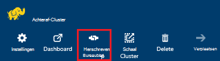
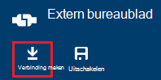
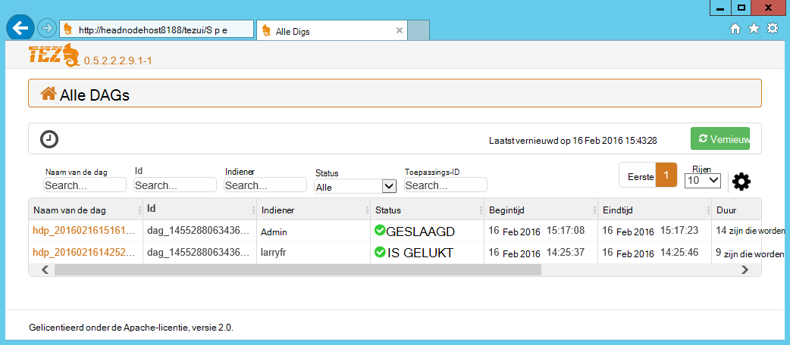
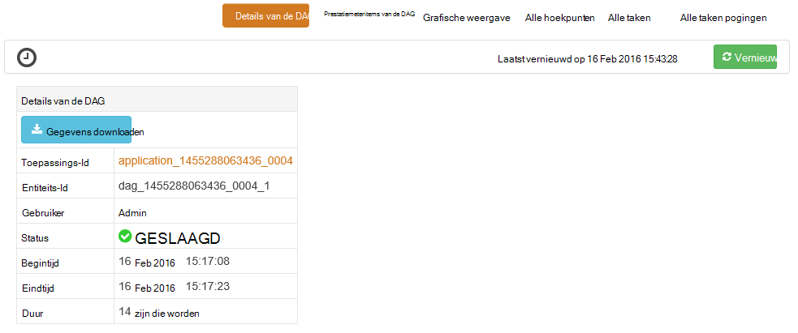
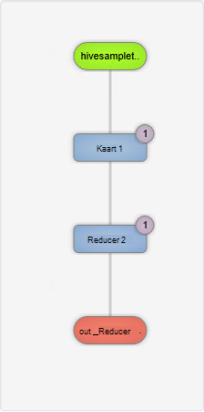
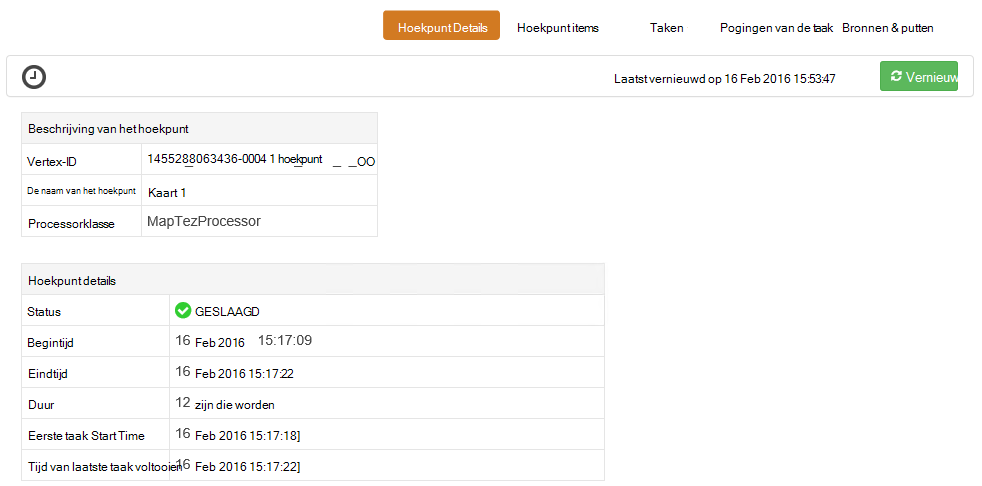
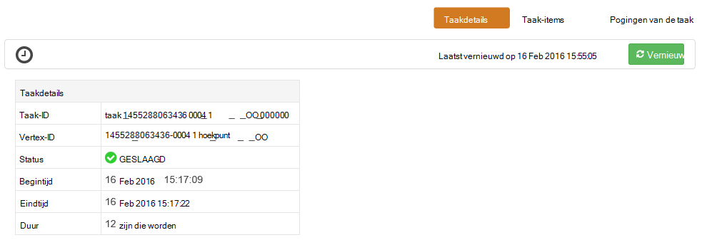

<properties
pageTitle="Tez UI gebruiken met Windows-gebaseerde HDInsight | Azure"
description="Informatie over het gebruik van de UI Tez voor foutopsporing Tez taken op Windows gebaseerde HDInsight HDInsight."
services="hdinsight"
documentationCenter=""
authors="Blackmist"
manager="jhubbard"
editor="cgronlun"/>

<tags
ms.service="hdinsight"
ms.devlang="na"
ms.topic="article"
ms.tgt_pltfrm="na"
ms.workload="big-data"
ms.date="10/04/2016"
ms.author="larryfr"/>

# De UI Tez gebruiken voor foutopsporing Tez taken op Windows gebaseerde HDInsight

De UI Tez is een webpagina die kan worden gebruikt voor het begrijpen en functies die gebruikmaken van Tez als de engine worden uitgevoerd op Windows gebaseerde HDInsight clusters voor foutopsporing. De UI Tez kunt u de taak als van de gekoppelde items in een grafiek te visualiseren, analyseren in elk item en statistieken en registratie-informatie ophalen.

> [AZURE.NOTE] De informatie in dit document is specifiek voor de HDInsight op basis van Windows-clusters. Zie voor informatie over het weergeven en foutopsporing Tez op Linux-gebaseerde HDInsight, [Gebruik Ambari weergaven voor foutopsporing Tez taken op HDInsight](hdinsight-debug-ambari-tez-view.md).

## Vereisten

* Een cluster van Windows-gebaseerde HDInsight. Zie [aan de slag met Windows-gebaseerde HDInsight](hdinsight-hadoop-tutorial-get-started-windows.md)voor stapsgewijze instructies over het maken van een nieuw cluster.

    > [AZURE.IMPORTANT] De UI Tez is alleen beschikbaar op Windows gebaseerde HDInsight clusters gemaakt na 8 februari 2016.

* Een externe Windows-bureaublad-client.

## Wat zijn Tez

Tez is een uitbreidbare raamwerk voor gegevensverwerking in Hadoop met snelheden van meer dan traditionele MapReduce verwerking. HDInsight op basis van Windows-clusters is een optionele motor die u met de volgende opdracht als onderdeel van uw query component voor component kunt inschakelen:

    set hive.execution.engine=tez;

Werk bij Tez wordt ingediend, wordt een gericht acyclische grafiek (DAG) dat de volgorde van uitvoering van de acties die nodig zijn door de taak beschrijft gemaakt. Afzonderlijke acties hoekpunten worden genoemd, en een stuk van de algehele taak uitvoeren. De daadwerkelijke uitvoering van het werk dat wordt beschreven door een hoekpunt een taak wordt genoemd, en kan worden verdeeld over meerdere knooppunten in het cluster.

### Wat is de gebruikersinterface Tez?

De UI Tez is dat een webpagina biedt informatie over de processen die worden uitgevoerd, of een ouder met Tez. Hiermee kunt u de DAG gegenereerd door Tez, bekijken hoe deze wordt verdeeld over de clusters, items zoals geheugen gebruikt door taken en hoekpunten en informatie over fouten. Deze bieden nuttige informatie in de volgende scenario's:

* Langdurige bewaking worden verwerkt, de voortgang van de kaart te bekijken en taken beperken.

* Historische gegevens analyseren voor geslaagde of mislukte processen om te leren hoe de verwerking kan worden verbeterd of de oorzaak van de fout.

## Een DAG genereren

De UI Tez bevat alleen gegevens als een taak die wordt de engine Tez actief is of is geweest in het verleden is uitgevoerd. Eenvoudige component query's kunnen meestal worden opgelost zonder Tez, maar complexe query's filteren, groeperen, bestellen, joins, enz., wordt u doorgaans Tez.

Gebruik de volgende stappen uit te voeren van een component-query die wordt uitgevoerd met behulp van Tez.

1. Ga naar https://CLUSTERNAME.azurehdinsight.net, waar de __CLUSTERNAAM__ de naam van het cluster HDInsight is in een webbrowser.

2. Selecteer de __Component Editor__in het menu aan de bovenkant van de pagina. Een pagina met de volgende voorbeeldquery wordt weergegeven.

        Select * from hivesampletable

    De voorbeeldquery te wissen en vervangen door het volgende.

        set hive.execution.engine=tez;
        select market, state, country from hivesampletable where deviceplatform='Android' group by market, country, state;

3. Selecteer __de verzendknop__ . De sectie __Taak sessie__ onderaan de pagina, wordt de status van de query weergegeven. Zodra de status wordt gewijzigd in __afgesloten__, selecteert u de koppeling __Details weergeven__ om de resultaten te bekijken. De __Uitvoer van de taak__ moet worden met de volgende strekking:
        
        en-GB   Hessen      Germany
        en-GB   Kingston    Jamaica
        en-GB   Nairobi Area    Kenya

## Gebruik de gebruikersinterface Tez

> [AZURE.NOTE] De UI Tez is alleen beschikbaar vanaf het bureaublad van de clusterknooppunten hoofd zodat moet u extern bureaublad verbinding maken met de hoofd-knooppunten.

1. Selecteer het cluster HDInsight de [Azure portal](https://portal.azure.com). Selecteer het pictogram van __Extern bureaublad__ vanaf de bovenkant van het blad HDInsight. De bladeserver met extern bureaublad wordt weergegeven

    

2. Selecteer de bladeserver met extern bureaublad __verbinding maken__ met verbinding maken met het hoofd clusterknooppunt. Wanneer dat wordt gevraagd, cluster extern bureaublad gebruikersnaam en hetzelfde wachtwoord gebruiken om de verbinding te verifiëren.

    

    > [AZURE.NOTE] Als u verbinding met extern bureaublad niet hebt ingeschakeld, een gebruikersnaam, wachtwoord en vervaldatum opgeven en selecteer vervolgens __inschakelen__ voor het inschakelen van extern bureaublad. Eenmaal is ingeschakeld, gebruikt u de vorige stappen om verbinding te maken.

3. Wanneer een verbinding, open Internet Explorer op het externe bureaublad, selecteer het vistuig-pictogram in de rechterbovenhoek van de browser en selecteer vervolgens de __Instellingen voor de Compatibiliteitsweergave__.

4. Schakel het selectievakje in voor __compatibiliteit met Microsoft lijsten__en __sites op het intranet in de Compatibiliteitsweergave weergeven__ vanaf de onderkant van de __Instellingen voor de Compatibiliteitsweergave__en selecteer vervolgens __sluiten__.

5. Ga in Internet Explorer naar tezui-http://headnodehost:8188 / #/. De UI Tez wordt weergegeven

    

    Wanneer de UI Tez wordt geladen, ziet u een lijst met DAGs die momenteel worden uitgevoerd, of zijn uitgevoerd op het cluster. De standaardweergave bevat de Dag Name, Id indiener, Status, begintijd, eindtijd, duur, toepassings-ID en wachtrij. Meer kolommen kunnen worden toegevoegd met behulp van het vistuig-pictogram aan de rechterkant van de pagina.

    Als er slechts één post, worden voor de query die u in de vorige sectie hebt uitgevoerd. Als u meerdere posten hebt, kunt u zoeken met zoekcriteria invoeren in de velden boven het DAGs vervolgens druk op __Enter__.

4. Selecteer de __Naam van de Dag__ voor de meest recente post van de DAG. Hiermee worden gegevens over de DAG, en de optie voor het downloaden van een zip van JSON bestanden die informatie over de DAG bevatten weergegeven.

    

5. Boven de __Details van de DAG__ zijn verschillende koppelingen waarmee u informatie wilt weergeven over de DAG.

    * __DAG items__ worden items van deze DAG.
    
    * __Grafische weergave__ ziet u een grafische weergave van deze DAG.
    
    * __Alle hoekpunten__ geeft een overzicht van de hoekpunten in deze DAG.
    
    * __Alle taken__ geeft een overzicht van de taken voor alle hoekpunten in deze DAG.
    
    * __Alle TaskAttempts__ wordt informatie weergegeven over de pogingen om uit te voeren taken voor deze DAG.
    
    > [AZURE.NOTE] Als u de kolom weergegeven voor hoekpunten, taken en TaskAttempts schuift, ziet u dat er koppelingen zijn naar __items__ en __bekijken of downloaden van Logboeken__ voor elke rij weergeven.

    Als er een fout opgetreden met de taak is, worden de Details van de DAG de status mislukt, en koppelingen naar informatie over de mislukte taak weergegeven. Diagnostische gegevens wordt weergegeven onder de details van de DAG.

7. Selecteer de __grafische weergave__. Een grafische weergave van de DAG worden weergegeven. U kunt de muis over elk hoekpunt in de weergave voor informatie over het plaatsen.

    

8. Op een hoekpunt te klikken wordt het __Hoekpunt Details__ voor dat item wordt geladen. Klik op de __plattegrond 1__ hoekpunt om details van dit item weer te geven. Selecteer __bevestigen__ om te bevestigen de navigatie.

    

9. Houd er rekening mee dat u hebt nu links boven aan de pagina die betrekking hebben op de hoekpunten en taken.

    > [AZURE.NOTE] U kunt ook teruggaan naar de __Details van de DAG__, selecteert u __Hoekpunt Details__en vervolgens te klikken op het hoekpunt __1 kaart__ op deze pagina komen.

    * __Hoekpunt items__ worden itemgegevens voor dit hoekpunt weergegeven.
    
    * __Taken__ worden taken voor dit hoekpunt weergegeven.
    
    * Informatie over pogingen om uit te voeren taken voor deze __Taak probeert__ worden weergegeven.
    
    * __Bronnen & put__ gegevensbronnen weergeeft en PUT voor dit hoekpunt.

    > [AZURE.NOTE] Als met het vorige menu kunt u bladeren om de kolom weergeven voor taken, taak pogingen, en bronnen en Sinks__ koppelingen naar meer informatie over elk item weergeven.

10. Selecteer __taken__en klik vervolgens op het item met de naam __00_000000__. __De Details__ wordt voor deze taak weergegeven. Vanuit dit scherm, kunt u __Items van de taak__ en __Taak pogingen__weergeven.

    

## Volgende stappen

U hebt geleerd hoe u de weergave van Tez, weten [Met behulp van de component op HDInsight](hdinsight-use-hive.md).

Zie voor meer gedetailleerde technische informatie over Tez, de [pagina op Hortonworks Tez](http://hortonworks.com/hadoop/tez/).
