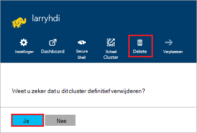

<properties
pageTitle="Het verwijderen van een cluster HDInsight | Azure"
description="Informatie over de verschillende manieren dat u een HDInsight-cluster kunt verwijderen."
services="hdinsight"
documentationCenter=""
authors="Blackmist"
manager="jhubbard"
editor="cgronlun"/>

<tags
ms.service="hdinsight"
ms.devlang="na"
ms.topic="article"
ms.tgt_pltfrm="na"
ms.workload="big-data"
ms.date="10/28/2016"
ms.author="larryfr"/>

#Het verwijderen van een cluster van HDInsight

HDInsight cluster facturering wordt gestart zodra er een cluster wordt gemaakt en wordt beëindigd als het cluster verwijderd en is pro rato berekend per minuut, zodat het cluster moet altijd worden verwijderd wanneer het niet langer in gebruik is. In dit document leert u hoe u een cluster met behulp van de Portal Azure, Azure PowerShell en de CLI Azure verwijdert.

> [AZURE.IMPORTANT] Als een HDInsight-cluster, verwijdert niet de Azure opslag (s) die is gekoppeld aan het cluster. Hiermee kunt u bewaren en opnieuw gebruiken van gegevens die zijn opgeslagen door het cluster.

##Azure Portal

1. Meld u aan bij de [Azure portal](https://portal.azure.com) en selecteer het cluster HDInsight. Als het cluster HDInsight niet aan het dashboard is vastgemaakt, kunt u zoeken voor het door de naam van het zoekveld (vergrootglaspictogram), aan de rechterkant van de navigatiebalk.

    

2. Nadat de bladeserver voor het cluster wordt geopend, selecteert u het pictogram __verwijderen__ . Wanneer dat wordt gevraagd, selecteert u __Ja__ om het cluster te verwijderen.

    

##Azure PowerShell

Gebruik de volgende opdracht om het cluster te verwijderen uit een PowerShell-prompt:

    Remove-AzureRmHDInsightCluster -ClusterName CLUSTERNAME

__CLUSTERNAAM__ vervangen door de naam van het cluster HDInsight.

##Azure CLI

Gebruik de volgende verwijderen van het cluster vanaf een opdrachtprompt:

    azure hdinsight cluster delete CLUSTERNAME
    
__CLUSTERNAAM__ vervangen door de naam van het cluster HDInsight.
