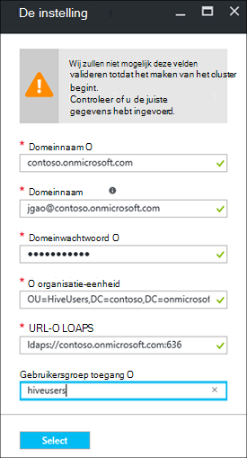

<properties
    pageTitle="HDInsight domein behoren clusters configureren | Microsoft Azure"
    description="Meer informatie over het instellen en configureren van de clusters deel uitmaakt van een domein HDInsight"
    services="hdinsight"
    documentationCenter=""
    authors="saurinsh"
    manager="jhubbard"
    editor="cgronlun"
    tags=""/>

<tags
    ms.service="hdinsight"
    ms.devlang="na"
    ms.topic="article"
    ms.tgt_pltfrm="na"
    ms.workload="big-data"
    ms.date="10/26/2016"
    ms.author="saurinsh"/>

# Configureren van de clusters deel uitmaakt van een domein HDInsight (voorbeeld)

Informatie over het instellen van een cluster Azure HDInsight met Azure Active Directory (AD Azure) en [Apache Zwerver](http://hortonworks.com/apache/ranger/) te profiteren van de sterke verificatie en rijke rolgebaseerde (RBAC) opstellen.  HDInsight deel uitmaakt van een domein kan alleen worden geconfigureerd op Linux gebaseerde clusters. Zie [HDInsight introduceren domein behoren clusters](hdinsight-domain-joined-introduction.md)voor meer informatie.

Dit artikel is de eerste zelfstudie van een reeks:

- Maak een HDInsight-cluster verbonden met Azure AD (via de mogelijkheid Azure Directory Domain Services) met Apache Zwerver ingeschakeld.
- Maken en component beleid via Apache Zwerver toepassen (bijvoorbeeld gegevens wetenschappers) gebruikers verbinding kunnen maken met de component met behulp van ODBC-hulpprogramma's, zoals Excel, Tableau enz. Microsoft werkt aan een andere belasting, zoals HBase en Spark, Storm, toe te voegen aan snel HDInsight domein behoren.

Een voorbeeld van de uiteindelijke topologie ziet er als volgt uit:

Omdat momenteel Azure AD ondersteunt alleen klassieke virtuele netwerken (VNets) en HDInsight op basis van Linux-clusters alleen ondersteuning voor Azure Resource Manager op basis van VNets, HDInsight Azure AD-integratie vereist twee VNets en een peering ertussen. Zie voor de informatie over de vergelijking tussen de twee implementatiemodellen, [Azure Resource Manager versus klassiek implementatie: implementatiemodellen en de status van uw resources](../resource-manager-deployment-model.md). De twee VNets moet zich in hetzelfde gebied, als de Azure AD DS.

Azure servicenamen moeten uniek zijn. De volgende namen worden gebruikt in deze zelfstudie. Contoso is een fictief. Wanneer u de zelfstudie doorloopt, moet u *contoso* vervangen door een andere naam. 
    
**Namen:**

|Eigenschap|Waarde|
|--------|-----|
| Azure AD-VNet|contosoaadvnet|
| AD Azure Virtual Machine (VM)|contosoaadadmin. Deze VM wordt organisatie-eenheid configureren en reverse DNS-zone gebruikt.|
| Azure AD directory|contosoaaddirectory|
| Azure AD-domeinnaam|Contoso (contoso.onmicrosoft.com)|
| HDInsight VNet|contosohdivnet|
| Resourcegroep HDInsight VNet|contosohdirg|
| HDInsight cluster|contosohdicluster|

Deze zelfstudie bevat de stappen voor het configureren van een cluster HDInsight domein behoren. Elke sectie bevat koppelingen naar andere artikelen met meer achtergrondinformatie.

## Let op:

- Lees [Azure AD Domain Services](https://azure.microsoft.com/services/active-directory-ds/) de structuur [prijzen](https://azure.microsoft.com/pricing/details/active-directory-ds/) .
- Zorg ervoor dat uw abonnement whitelisted voor deze openbare preview. U kunt dit doen door een e-mail te sturen hdipreview@microsoft.com met uw abonnement-ID.
- Een SSL-certificaat dat is ondertekend door een instantie van de ondertekening voor uw domein. Het certificaat is vereist voor het configureren van beveiligde LDAP. Zelfondertekende certificaten kunnen niet worden gebruikt.

## Procedures

1. Maak een Azure klassieke VNet voor uw advertentie Azure.  
2. Maak en configureer AD Azure en Azure AD DS.
3. Een VM toevoegen aan het klassieke VNet voor het maken van organisatie-eenheid. 
4. Maak een organisatie-eenheid voor Azure AD DS.
5. Maak een HDInsight VNet in de modus Azure resource management.
6. Setup Reverse DNS-zones voor de Azure AD DS.
6. Peer de twee VNets.
7. Maak een cluster HDInsight.

> [AZURE.NOTE] In deze zelfstudie wordt ervan uitgegaan dat er geen een advertentie Azure. Als u hebt, kunt u het gedeelte in stap 2 overslaan.
    
## Maak een Azure klassieke VNet

In dit gedeelte maakt u een klassieke VNet met behulp van de portal Azure. In de volgende sectie kunt u de Azure AD DS inschakelen voor uw advertentie Azure in de klassieke VNet. Zie voor meer informatie over de volgende procedure en het gebruik van andere methoden voor het maken van VNet [(klassiek) met behulp van de portal Azure virtueel netwerk maken](../virtual-network/virtual-networks-create-vnet-classic-portal.md).

**Voor het maken van een klassieke VNet**

1. Aanmelden op de [portal Azure](https://portal.azure.com). 
2. Klik op **nieuwe** > **netwerk** > **virtueel netwerk**.
3. In **een implementatiemodel selecteren**, selecteer **Classic**en klik op **maken**.
4. Typ of Selecteer de volgende waarden:

    - **Naam**: contosoaadvnet
    - **Adres**: 10.1.0.0/16
    - **Subnetnaam**: Subnet1
    - **Subnet-adresbereik**: 10.1.0.0/24
    - **Abonnement**: (Selecteer een abonnement gebruikt voor het maken van dit VNet.)
    - **ResourceGroup**:
    - **Locatie**: (Selecteer een regio voor uw cluster HDInsight.)

        > [AZURE.IMPORTANT] Kies een locatie die Azure AD DS ondersteunt. Zie voor meer informatie, [producten die beschikbaar zijn per regio](https://azure.microsoft.com/en-us/regions/services/). 
        >
        > Zowel het klassieke VNet en het VNet Resource groep moeten zich in hetzelfde gebied, als de Azure AD DS.

5. Klik op **maken** om de VNet te maken.

## Maak en configureer Azure AD DS voor uw advertentie Azure

In deze sectie kunt u het volgende doen:

1. Maak een advertentie Azure.
2. Azure AD-gebruikers maken. Deze gebruikers zijn gebruikers van een domein. De eerste gebruiker die wordt gebruikt voor het configureren van de cluster HDInsight met de Azure AD.  De twee gebruikers zijn optioneel voor deze zelfstudie. Ze worden gebruikt in het [beleid voor een domein behoren HDInsight clusters configureren component](hdinsight-domain-joined-run-hive.md) bij het configureren van Apache Zwerver beleid.
3. De groep Administrators van AAD DC maken en de Azure AD gebruiker toevoegen aan de groep. Met deze gebruiker kunt u de organisatie-eenheid maken.
4. Azure AD (Azure AD DS Domain Services) voor de advertentie Azure inschakelen.
7. Configureren van LDAPS voor de advertentie Azure. Lightweight Directory Access Protocol (LDAP) wordt gebruikt voor het lezen van en schrijven naar AD Azure.

Als u liever een bestaande Azure advertentie, kunt u stap 1 en 2 overslaan.

**Een Azure advertentie maken**

1. Vanuit de [Azure klassieke portal](https://manage.windowsazure.com), klikt u op **Nieuw** > **App Services** > **Active Directory** > **map** > **Aangepaste maken**. 
3. Typ of Selecteer de volgende waarden:

    - **Naam**: contosoaaddirectory
    - **Domeinnaam**: contoso.  Deze naam moet uniek zijn.
    - **Land of regio**: Selecteer uw land of regio.
4. Klik op **Voltooien**.

**Azure AD gebruikers maken**

1. Klik op **Active Directory**van het [Azure klassieke portal](https://manage.windowsazure.com) -> **contosoaaddirectory**. 
3. Klik op **gebruikers** in het bovenste menu.
4. Klik op **gebruiker toevoegen**.
4. Voer **Gebruikersnaam**in en klik op **volgende**. 
5. Configureren gebruikersprofiel; Selecteer in de **rol**, **Globale Admin**; en klik vervolgens op **volgende**.  De rol Admin globale is nodig voor het maken van organisatie-eenheden.
6. Klik op **maken** als u een tijdelijk wachtwoord.
7. Maak een kopie van het wachtwoord en klik vervolgens op **Voltooien**. Verderop in deze zelfstudie gebruikt u deze globale admin-gebruiker aan te melden op de admin VM voor het maken van een organisatie-eenheid en reverse DNS configureren.

Volg de procedure twee meer om gebruikers te maken met de rol van **gebruiker** , hiveuser1 en hiveuser2. De volgende gebruikers wordt in het [beleid voor een domein behoren HDInsight clusters configureren component](hdinsight-domain-joined-run-hive.md)gebruikt.

**DC beheerders van de AAD groep maken en een Azure AD gebruiker toevoegen**

1. Klik op **Active Directory**van het [Azure klassieke portal](https://manage.windowsazure.com) > **contosoaaddirectory**. 
3. Klik op **groepen** in het bovenste menu.
4. Klik op **een groep toevoegen** of **groep toevoegen**.
5. Typ of Selecteer de volgende waarden:

    - **Naam**: AAD DC beheerders.  Naam van de groep worden niet gewijzigd.
    - **Groepstype**: beveiliging.
6. Klik op **Voltooien**.
7. Klik op **AAD DC Administrators** als de groep wilt openen.
8. Klik op **leden toevoegen**.
9. Selecteer de eerste gebruiker die u in de vorige stap hebt gemaakt en klik vervolgens op **Voltooien**.
10. Herhaal de stappen voor het maken van een andere groep met de naam **HiveUsers**en de twee component gebruikers toevoegen aan de groep.

Voor meer informatie Zie [Azure AD Domain Services (voorbeeld) - de groep ' beheerders AAD DC' maken](../active-directory-domain-services/active-directory-ds-getting-started.md).

**Azure AD DS inschakelen voor uw advertentie Azure**

1. Klik op **Active Directory**van het [Azure klassieke portal](https://manage.windowsazure.com) > **contosoaaddirectory**. 
3. Klik op **configureren** in het bovenste menu.
4. Ga naar **Domain Services**en stel de volgende waarden:

    - **Van domeinservices voor deze map in te schakelen**: Ja.
    - **DNS-domeinnaam van het domeinservices**: dit geeft de standaard DNS-naam van de map Azure. Bijvoorbeeld contoso.onmicrosoft.com.
    - **Domain services verbinding maken met deze virtuele netwerk**: Selecteer de klassieke virtueel netwerk die u eerder hebt gemaakt, dat wil zeggen **contosoaadvnet**.
    
6. Klik op **Opslaan** vanaf de onderkant van de pagina. Ziet u **in behandeling...** naast het **inschakelen van deze directory-domeinservices**.  
7. Wachten tot **in behandeling...** verdwijnt, en **IP-adres** automatisch wordt ingevuld. Twee IP-adressen wordt u gevuld. Dit zijn de IP-adressen van de domeincontrollers die zijn ingericht door Domain Services. Elk IP-adres worden zichtbaar nadat de bijbehorende domeincontroller ingerichte en gereed is. De twee IP-adressen noteren. U moet ze later.

Zie [AD-domein Azure diensten (voorbeeld) - Azure AD-domein inschakelen](../active-directory-domain-services/active-directory-ds-getting-started-enableaadds.md)voor meer informatie.

**Voor het synchroniseren van wachtwoord**

Als u uw eigen domein, moet u het wachtwoord gesynchroniseerd. Zie [inschakelen van Wachtwoordsynchronisatie Azure AD domain Services voor een Azure cloud alleen-lezen AD directory](../active-directory-domain-services/active-directory-ds-getting-started-password-sync.md).

**Voor het configureren van LDAPS voor de Azure advertentie**

1. Krijg een SSL-certificaat dat is ondertekend door een instantie van de ondertekening voor uw domein. Zelfondertekende certificaten kunnen niet worden gebruikt. Als u niet een SSL-certificaat, neem bereiken hdipreview@microsoft.com voor een uitzondering.
1. Klik op **Active Directory**van het [Azure klassieke portal](https://manage.windowsazure.com) > **contosoaaddirectory**. 
3. Klik op **configureren** in het bovenste menu.
4. Ga naar **domeinservices**.
5. Klik op **certificaat configureren**.
6. Volg de aanwijzingen op het certificaatbestand en het wachtwoord opgeven. Ziet u **in behandeling...** naast het **inschakelen van deze directory-domeinservices**.  
7. Wachten tot **in behandeling...** verdwijnt, en **Secure LDAP-certificaat** hebt gevuld.  Dit kan tot 10 minuten of langer duren.
 
>[AZURE.NOTE] Als bepaalde achtergrondtaken worden uitgevoerd op de Azure AD DS, wordt er een fout bij het uploaden van certificaat - <i>Er is een bewerking die wordt uitgevoerd voor deze huurder. Probeer later opnieuw</i>.  Als deze fout zich voordoet, probeert u het later opnieuw. Het tweede domeincontroller IP kan duren tot 3 uur worden ingericht.

Zie [Configureren van veilige LDAP (LDAPS) gebruiken voor een AD-domein Azure Services beheerd domein](../active-directory-domain-services/active-directory-ds-admin-guide-configure-secure-ldap.md)voor meer informatie.

## Een organisatie-eenheid configureren en reverse DNS

In deze sectie, een virtuele machine toevoegen aan de AD-VNet van Azure en Systeembeheer op deze VM installeren zodat u kunt een organisatie-eenheid configureren en reverse DNS. Achterwaartse DNS-zoekopdracht is vereist voor Kerberos-verificatie.

**Een virtuele machine maken in het virtuele netwerk**

1. Vanuit de [Azure klassieke portal](https://manage.windowsazure.com), klikt u op **Nieuw** > **berekenen** > **virtuele Machine** > **Uit galerie**.
3. Selecteer een afbeelding en klik vervolgens op **volgende**.  Als u niet welk lettertype weet moet worden gebruikt, selecteert u de standaard **Windows Server 2012 R2 Datacenter**.
4. Typ of Selecteer de volgende waarden:

    - De naam van de virtuele Machine: **contosoaadadmin**
    - **Fundamentele** niveaus:
    - Nieuwe gebruikersnaam: (Gebruikersnaam)
    - Wachtwoord: (Wachtwoord invoeren)
    
    Houd er rekening mee dat de gebruikersnaam en het wachtwoord voor de lokale beheerder is.
    
5. Klik op **volgende**
6. Selecteer het nieuwe virtuele netwerk dat u hebt gemaakt in de laatste stap (contosoaadvnet) in **De regio/virtueel netwerk**, en klik op **volgende**.
7. Klik op **Voltooien**.

**Met RDP voor VM**

1. Klik op **virtuele Machines**vanuit [Azure klassieke portal](https://manage.windowsazure.com) > **contosoaadadmin**.
3. Klik op **Dashboard** in het bovenste menu.
4. Klik op **verbinding maken** vanaf de onderkant van de pagina.
5. Volg de instructies en lokale admin gebruikersnaam en wachtwoord gebruiken om verbinding te maken.

**VM toevoegen aan de Azure AD-domein**

1. Van de RDP-sessie, klikt u op **Start**en klik vervolgens op **Serverbeheer**.
2. Klik op **Lokale Server** in het linkermenu.
3. Klik op **werkgroep**-werkgroep.
4. Klik op **wijzigen**.
5. Klik op **domein**, typ **contoso.onmicrosoft.com**en klik op **OK**.
6. Voer de gebruikersreferenties voor domein en klik vervolgens op **OK**.
7. Klik op **OK**.
8. Klik op **OK** om de computer opnieuw opstarten te accepteren.
9. Klik op **sluiten**.
10. Klik op **nu opnieuw opstarten**.

Zie [lid worden van een Windows Server virtuele machine naar een beheerde domein](../active-directory-domain-services/active-directory-ds-admin-guide-join-windows-vm.md)voor meer informatie.

**Beheerprogramma's van Active Directory en DNS-hulpprogramma's installeren**

1. RDP in **contosoaadadmin** met de Azure AD-gebruikersaccount.
2. Klik op **Start**en klik vervolgens op **Serverbeheer**.
3. Klik op **Dashboard** in het linkermenu.
4. Klik op **beheren**en klik vervolgens op **functies toevoegen en onderdelen**.
5. Klik op **volgende**.
6. **Installatie op basis van de rol of functie**te selecteren en klik vervolgens op **volgende**.
7. De huidige virtuele machine te selecteren uit de groep van de server en klik op **volgende**.
8. Klik op **volgende** om rollen overslaan.
9. Vouw **Externe-serverbeheerprogramma's**, **beheerprogramma's**voor functies, selecteert u **AD DS en AD LDS-hulpprogramma's** en **Hulpprogramma's voor DNS-Server**en klik op **volgende**. 
10. Klik op **volgende**
10. Klik op **installeren**.

Zie voor meer informatie de [installatie van Active Directory-beheerprogramma's op de virtuele machine](../active-directory-domain-services/active-directory-ds-admin-guide-administer-domain.md#task-2---install-active-directory-administration-tools-on-the-virtual-machine).

**Reverse DNS configureren**

1. RDP aan met de gebruikersaccount Azure AD contosoaadadmin.
2. Klik op **Start**, klik op **Systeembeheer**en klik vervolgens op **DNS**. 
3. Klik op **Nee** als u wilt overslaan ContosoAADAdmin toe te voegen.
4. Selecteer **een andere computer**, voert u het IP-adres van de eerste DNS-server die u eerder hebt geconfigureerd en klik op **OK**.  Er wordt dat de DC/DNS-server wordt toegevoegd aan het linkerdeelvenster.
3. Vouw de DC/DNS-server, klik met de rechtermuisknop op **Zones voor Reverse Lookup**en klik vervolgens op **Nieuwe Zone**. Hiermee opent u de Wizard Nieuwe Zone.
4. Klik op **volgende**.
5. Selecteer **primaire zone**en klik op **volgende**.
6. **Naar alle DNS-servers die worden uitgevoerd op domeincontrollers in dit domein**selecteren en klik vervolgens op **volgende**.
6. Selecteer de **Zone voor Reverse Lookup IPv4**en klik vervolgens op **volgende**.
7. Typ het voorvoegsel voor het netwerkbereik HDInsight VNET in de **Netwerk-ID**, en klik op **volgende**. In het volgende gedeelte maakt u de HDInsight VNet.
8. Klik op **volgende**.
9. Klik op **volgende**.
10. Klik op **Voltooien**.

De organisatie-eenheid die u maakt wordt vervolgens gebruikt bij het maken van het cluster HDInsight. Hadoop gebruikers- en computeraccounts worden in deze organisatie-eenheid worden geplaatst.

**Maak een organisatie-eenheid (OU) op een beheerde Azure AD Domain Services-domein**

1. RDP in **contosoaadadmin** met de domeinaccount in de groep **Administrators van AAD DC** .
2. Klik op **Start**, klik op **Systeembeheer**en klik op **Beheerderscentrum voor Active Directory**.
5. Klik op de domeinnaam in het linkerdeelvenster. Bijvoorbeeld contoso.
6. Klik op **Nieuw** onder de domeinnaam in **het taakvenster** en klik vervolgens op **Organisatie-eenheid**.
7. Voer een naam, bijvoorbeeld **HDInsightOU**, en klik vervolgens op **OK**. 

Zie [een organisatie-eenheid (OU) op een AD-domein Azure Services beheerd domein maken](../active-directory-domain-services/active-directory-ds-admin-guide-create-ou.md)voor meer informatie.

## Een Resource Manager VNet voor HDInsight-cluster maken

In dit gedeelte maakt u een Azure Resource Manager VNet die wordt gebruikt voor het cluster HDInsight. Zie voor meer informatie over het maken van Azure VNET met andere methoden [maken een virtueel netwerk](../virtual-network/virtual-networks-create-vnet-arm-pportal.md)

Na het maken van de VNet, configureert u de Resource Manager VNet voor het gebruik van DNS-servers voor de Azure AD-VNet. Als u de stappen in deze zelfstudie voor het maken van de klassieke VNet en de Azure AD gevolgd, wordt de DNS-servers zijn 10.1.0.4 en 10.1.0.5.

**Voor het maken van een Resource Manager-VNet**

1. Aanmelden op de [portal Azure](https://portal.azure.com).
2. Klik op **Nieuw**, **netwerken**en vervolgens **virtuele netwerken**. 
3. In **een implementatiemodel selecteren**, selecteert u **Resource Manager**en klik op **maken**.
4. Typ of Selecteer de volgende waarden:

    - **Naam**: contosohdivnet
    - **Adres**: 10.2.0.0/16. Zorg ervoor dat het adresbereik van het IP-adresbereik van het klassieke VNet kan overlappen.
    - **Subnetnaam**: Subnet1
    - **Subnet-adresbereik**: 10.2.0.0/24
    - **Abonnement**: (Selecteer uw abonnement Azure.)
    - **Resourcegroep**: contosohdirg
    - **Locatie**: (Selecteer dezelfde locatie als de Azure AD-VNet, d.w.z. contosoaadvnet).

5. Klik op **maken**.

**DNS configureren voor de Resource Manager-VNet**

1. Klik op **meer services**vanuit [Azure portal](https://portal.azure.com) -> **virtuele netwerken**. Ervoor zorgen dat geen **virtuele netwerken (klassiek)**klikt u op.
2. Klik op **contosohdivnet**.
4. Klik op **DNS-servers** vanaf de linkerkant van het nieuwe blad.
6. Klik op **aangepast**en voert u de volgende waarden:

    - 10.1.0.4
    - 10.1.0.5

    Deze IP-adressen van DNS-server moeten overeenkomen met de DNS-servers in de Azure AD VNet (klassieke VNet).
7. Klik op **Opslaan**.

## De Azure AD-VNet en de HDInsight VNet van peer

**Om de twee VNet van peer**

1. Aanmelden op de [portal Azure](https://portal.azure.com).
2. Klik op **meer services** in het linkermenu.
3. Klik op de **virtuele netwerken**. Klik niet op **virtuele netwerken (klassiek)**.
4. Klik op **contosohdivnet**.  Dit is de HDInsight VNet.
5. **Peerings** Klik op het linkermenu van de bladeserver.
6. Klik op **toevoegen** in het bovenste menu. De blade **peering toevoegen** wordt geopend.
7. Op het blad **peering toevoegen** of Selecteer de volgende waarden:

    - **Naam**: ContosoAADHDIVNetPeering
    - **Virtueel netwerk implementatiemodel**: klassiek
    - **Abonnement**: Selecteer de abonnementsnaam van uw voor de klassieke (Azure AD) vnet gebruikt.
    - **Virtueel netwerk**: contosoaadvnet.
    - **Virtueel netwerk inbellen**: (controleren)
    - **Toestaan doorgestuurd verkeer**: (controleren). De twee selectievakjes uitgeschakeld laat.

8. Klik op **OK**.

## HDInsight cluster maken

In dit gedeelte vindt maken u een Linux-gebaseerde Hadoop cluster in HDInsight met de Azure portal of [bronnenbeheerder Azure sjabloon](../resource-group-template-deploy.md). De instellingen, Zie [clusters maken HDInsight](hdinsight-hadoop-provision-linux-clusters.md)voor andere methoden voor het cluster maken en inzicht. Zie voor meer informatie over het gebruik van Resource Manager sjabloon voor het maken van clusters van Hadoop in HDInsight [clusters in HDInsight met behulp van bronbeheer sjablonen maken Hadoop](hdinsight-hadoop-create-windows-clusters-arm-templates.md)

**Voor het maken van een domein behoren HDInsight-cluster met behulp van de portal Azure**

1. Aanmelden op de [portal Azure](https://portal.azure.com).
2. Klik op **Nieuw**, **Intelligence + analytics**en vervolgens **HDInsight**.
3. Voer in de blade **HDInsight nieuwe cluster** of selecteert u de volgende waarden:

    - **Naam van het cluster**: Voer een nieuwe clusternaam voor het cluster HDInsight domein behoren.
    - **Abonnement**: Selecteer een Azure abonnement gebruikt voor het maken van dit cluster.
    - **Configuratie van het cluster**:

        - **Clustertype**: Hadoop. HDInsight deel uitmaakt van een domein wordt momenteel alleen ondersteund op Hadoop-clusters.
        - **Besturingssysteem**: Linux.  HDInsight deel uitmaakt van een domein wordt alleen ondersteund op Linux-gebaseerde HDInsight clusters.
        - **Versie**: Hadoop punt 2.7.3 (HDI 3.5). HDInsight deel uitmaakt van een domein, wordt alleen ondersteund op HDInsight cluster versie 3.5.
        - **Clustertype**: PREMIUM

        Klik op **selecteren** om de wijzigingen opslaan.

    - **Referenties**: de referenties voor de gebruiker van het cluster en de SSH gebruiker configureren.
    - **Gegevensbron**: een nieuwe opslag-account maken of een bestaande opslag account als standaardaccount instellen voor opslag gebruiken voor het cluster HDInsight. De locatie moet hetzelfde zijn als de twee VNets.  De locatie is ook de locatie van het cluster HDInsight.
    - **Prijs**: Selecteer het nummer van de werknemer knooppunten van het cluster.
    - **Geavanceerde configuraties**: 

        - **Lid worden van een domein & Vnet-en Subnet**: 

            - **Instellingen voor domein**: 

                - **Domeinnaam**: contoso.onmicrosoft.com
                - **Gebruikersnaam**: Geef een gebruikersnaam voor het domein. Dit domein moet beschikken over de volgende bevoegdheden: computers toevoegen aan het domein en plaatst u deze in de organisatie-eenheid die u ingesteld eerder; Service-principals binnen de organisatie-eenheid die u eerder; geconfigureerd maken Reverse DNS-vermeldingen maken. Deze domeingebruiker, worden de beheerder van dit cluster HDInsight domein behoren.
                - **Wachtwoord voor domein**: Voer het wachtwoord van de gebruiker domein.
                - **Organisatie-eenheid**: Geef de DN-naam van de organisatie-eenheid tht die u eerder hebt geconfigureerd. Bijvoorbeeld: OU = HDInsightOU, DC = contoso, DC = onmicrosoft, DC = com
                - **LDAPS-URL**: ldaps://contoso.onmicrosoft.com:636
                - **Gebruikersgroep toegang**: de beveiligingsgroep waarvan de gebruikers u wan te synchroniseren met het cluster opgeven. Bijvoorbeeld HiveUsers.

                Klik op **selecteren** om de wijzigingen opslaan.

                
            - **Virtueel netwerk**: contosohdivnet
            - **Subnetmasker**: Subnet1

            Klik op **selecteren** om de wijzigingen opslaan.       
        Klik op **selecteren** om de wijzigingen opslaan.
    - **Resourcegroep**: Selecteer de resourcegroep die wordt gebruikt voor de HDInsight VNet (contosohdirg).

4. Klik op **maken**.  

Een andere optie voor het maken van een domein behoren HDInsight cluster is Azure Resource Management sjabloon te gebruiken. De volgende procedure ziet u hoe:

**Voor het maken van een domein behoren HDInsight-cluster met behulp van een sjabloon voor Resource Management**

1. Klik op de onderstaande afbeelding een bronnenbeheerder als sjabloon wilt openen in de portal Azure. De bronnenbeheerder sjabloon bevindt zich in een openbare blob-container. 

    

2. Voer de volgende waarden van de bladeserver **Parameters** :

    - **Abonnement**: (Selecteer uw abonnement Azure).
    - **Resourcegroep**: klik op de **bestaande**, en geef het dezelfde resourcegroep die u hebt gebruikt.  Bijvoorbeeld contosohdirg. 
    - **Locatie**: Geef de locatie van een resource.
    - **Naam van het cluster**: Voer een naam voor het Hadoop-cluster dat u wilt maken. Bijvoorbeeld contosohdicluster.
    - **Type Cluster**: een cluster selecteren.  De standaardwaarde is **hadoop**.
    - **Locatie**: Selecteer een locatie voor het cluster.  De standaardaccount voor opslag maakt gebruik van dezelfde locatie.
    - **Clusterknooppunt werknemer tellen**: Selecteer het nummer van de knooppunten van de werknemer.
    - **Cluster-aanmeldingsnaam en wachtwoord**: de standaard login-naam **admin**is.
    - **SSH-gebruikersnaam en wachtwoord**: de standaardgebruikersnaam is **sshuser**.  U kunt deze wijzigen. 
    - **Virtueel netwerk-Id**: /subscriptions/&lt;SubscriptionID > /resourceGroups/&lt;ResourceGroupName > /providers/Microsoft.Network/virtualNetworks/&lt;VNetName >
    - **Virtueel netwerk Subnet**: /subscriptions/&lt;SubscriptionID > /resourceGroups/&lt;ResourceGroupName > /providers/Microsoft.Network/virtualNetworks/&lt;VNetName >/subnetten/Subnet1
    - **Domeinnaam**: contoso.onmicrosoft.com
    - **Organisatie-eenheid DN**: OU = HDInsightOU, DC = contoso, DC = onmicrosoft, DC = com
    - **Cluster gebruikers groep D Ns**: "\"CN = HiveUsers, OU = AADDC Users, DC =<DomainName>, DC = onmicrosoft, DC = com\""
    - **LDAPUrls**: ['ldaps://contoso.onmicrosoft.com:636']
    - **DomainAdminUserName**: (naam van het domein admin-gebruiker invoeren)
    - **DomainAdminPassword**: (domein admin gebruikerswachtwoord invoeren)
    - **Ik ga akkoord met de bovenstaande voorwaarden**: (Controleer)
    - **Dashboard pincode**: (controleren)

6. Klik op **Inkoop**. Ziet u een nieuwe tegel met de titel **sjabloon distribueren implementatie**. Duurt ongeveer 20 minuten over het maken van een cluster. Als het cluster is gemaakt, klikt u op het cluster blade in de portal te openen.

Nadat u de zelfstudie hebt voltooid, kunt u het cluster te verwijderen. Uw gegevens worden opgeslagen in Azure-opslag met HDInsight, zodat u een cluster veilig verwijderen kunt wanneer het niet in gebruik. Er zijn ook in rekening gebracht voor een cluster HDInsight, zelfs wanneer deze niet in gebruik. Aangezien de kosten voor het cluster vele malen meer dan de kosten voor opslag zijn, is het zinvol economische clusters verwijderen wanneer ze niet in gebruik zijn. Zie voor de instructies van het verwijderen van een cluster, [clusters beheren Hadoop in HDInsight met behulp van de portal Azure](hdinsight-administer-use-management-portal.md#delete-clusters).

## Volgende stappen

- Zie [beleid voor een domein behoren HDInsight clusters component configureren](hdinsight-domain-joined-run-hive.md)voor het configureren van beleid van de component en component-query's uitvoeren.
- Voor het uitvoeren van de component query's via SSH op clusters deel uitmaakt van een domein HDInsight Zie [Gebruik SSH met Linux-gebaseerde Hadoop op HDInsight van Linux, Unix, of OS X](hdinsight-hadoop-linux-use-ssh-unix.md#connect-to-a-domain-joined-hdinsight-cluster).
