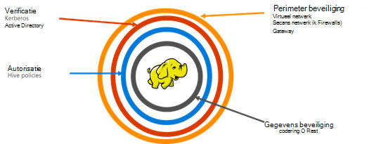

<properties
    pageTitle="Secure HDInsight overzicht | Microsoft Azure"
    description="Meer informatie..."
    services="hdinsight"
    documentationCenter=""
    authors="saurinsh"
    manager="jhubbard"
    editor="cgronlun"
    tags="azure-portal"/>

<tags
    ms.service="hdinsight"
    ms.devlang="na"
    ms.topic="hero-article"
    ms.tgt_pltfrm="na"
    ms.workload="big-data"
    ms.date="10/24/2016"
    ms.author="saurinsh"/>

# Invoering van de clusters deel uitmaakt van een domein HDInsight (voorbeeld)

Azure HDInsight tot vandaag ondersteund slechts een enkele gebruiker lokaal beheerder. Dit werkt geweldig voor kleinere toepassing teams of afdelingen. Hadoop op basis van werkbelasting opgedaan meer populariteit in de sector van de onderneming, de noodzaak van enterprise grade mogelijkheden zoals active directory op basis van verificatie, ondersteuning voor meerdere gebruikers en rollen gebaseerd toegangsbeheer steeds belangrijker is geworden. Met clusters van HDInsight deel uitmaakt van een domein, kunt u een HDInsight-cluster dat is gekoppeld aan een Active Directory-domein maakt, een lijst met werknemers van de onderneming die kan worden geverifieerd via Azure Active Directory aan te melden op HDInsight cluster configureren. Iedereen buiten de onderneming kan zich aanmelden of toegang tot het cluster HDInsight. De ondernemingsbeheerder kunt rollen gebaseerd toegangsbeheer voor component beveiliging met behulp van [Apache Zwerver](http://hortonworks.com/apache/ranger/), dus de toegang tot de gegevens alleen als nodig is. Admin kan ten slotte de toegang tot de door de werknemers, en eventuele wijzigingen gedaan-besturingselement beleid, dus het bereiken van een hoge mate van bestuur voor hun bedrijfsnetwerken controleren.

[AZURE.NOTE]> De nieuwe functies die in dit voorbeeld worden beschreven zijn alleen beschikbaar op Linux-gebaseerde HDInsight van clusters voor de werkbelasting van de component. De werkbelasting, zoals HBase, Spark, Storm en Kafka, wordt in toekomstige releases ingeschakeld. 

## Voordelen

Bedrijfsbeveiliging bevat vier grote pijlers: beveiliging, verificatie, machtiging en codering.

.

### Beveiliging van de buitengrenzen

Beveiliging van de buitengrenzen in HDInsight wordt bereikt met behulp van virtuele netwerken en gatewayservice. Vandaag de dag een ondernemingsadministrator maken van een cluster van HDInsight in een virtueel netwerk en netwerk-beveiligingsgroepen (binnenkomende of uitgaande firewallregels) gebruiken om toegang te beperken tot het virtuele netwerk. Alleen de IP-adressen die wordt gedefinieerd in de binnenkomende firewallregels om te communiceren met het cluster HDInsight, aldus beveiliging kunnen worden. Een andere laag van beveiliging wordt bereikt met behulp van gatewayservice. De Gateway is de service die als eerste verdedigingslinie voor alle inkomende verzoeken aan het cluster HDInsight fungeert. Het verzoek accepteert, evalueert deze en alleen dan kan het verzoek worden doorgegeven aan de andere knooppunten in het cluster, aldus de beveiliging van de andere knooppunten en de gegevens in het cluster.

### Verificatie

Een ondernemingsbeheerder kan een cluster HDInsight domein behoren, in een [virtueel netwerk](https://azure.microsoft.com/services/virtual-network/)inrichten van deze public preview. De knooppunten van het cluster HDInsight zal worden toegevoegd aan het domein beheerd door de onderneming. Dit wordt bereikt door het gebruik van [Azure Active Directory Domain Services](https://technet.microsoft.com/library/cc770946.aspx). Alle knooppunten in het cluster worden toegevoegd aan een domein die door de onderneming wordt beheerd. Met deze instelling kunnen de werknemers van de onderneming aanmelden bij de clusterknooppunten met domeinreferenties. Ze kunnen ook hun domeinreferenties gebruiken voor verificatie met andere goedgekeurde eindpunten zoals tint, Ambari, weergaven, ODBC, JDBC, PowerShell en REST API's voor de interactie met het cluster. De beheerder heeft volledige controle over een beperkt aantal gebruikers interactie met het cluster via deze eindpunten.

### Autorisatie

Beste gevolgd door de meeste bedrijven is dat niet elke werknemer toegang tot alle ondernemingsresources heeft. Ook met deze release kunt admin opstellen op basis van rollen voor de clusterbronnen. De admin kan bijvoorbeeld [Apache Zwerver](http://hortonworks.com/apache/ranger/) access control als beleidsregels wilt instellen voor component configureren. Deze functionaliteit zorgt ervoor dat werknemers zal alleen toegang tot alle gegevens die zij nodig hebben om te slagen in hun werk. SSH toegang tot het cluster is ook beperkt tot de beheerder.

### Controle

Samen met de clusterbronnen HDInsight onbevoegde gebruikers te beschermen en beveiligen van de gegevens, is controle van alle toegang tot de clusterbronnen en de gegevens noodzakelijk voor het bijhouden van ongeoorloofde of onbedoelde toegang tot bronnen. Met dit voorbeeld, de admin weergeven en alle toegang tot clusterbronnen HDInsight en gegevens rapporteren. Admin ook weergeven en alle wijzigingen aan het besturingselement toegangsbeleid gedaan in Apache Zwerver ondersteund eindpunten verslag. Een cluster HDInsight deel uitmaakt van een domein gebruikt de vertrouwde gebruikersinterface van Apache Zwerver controlelogboeken zoeken. Op de backend, Zwerver [Apache Solr]( http://hortonworks.com/apache/solr/) gebruikt voor het opslaan en de logboeken te zoeken.

### Codering

Bescherming van gegevens is belangrijk voor de vergadering organisatorische beveiliging en naleving van voorschriften en met het beperken van toegang tot gegevens van niet-geautoriseerde medewerkers, het moet ook worden beveiligd door deze te coderen. Zowel de gegevensopslag voor clusters, Azure opslag Blob en Azure Lake gegevensopslag HDInsight ondersteunen transparante server-side [codering van gegevens](../storage/storage-service-encryption.md) in rust. Veilige HDInsight clusters naadloos met deze server side codering van gegevens op de mogelijkheden van de rest werkt.

## Volgende stappen

- Zie [clusters HDInsight deel uitmaakt van een domein configureren](hdinsight-domain-joined-configure.md)voor het configureren van een cluster HDInsight domein behoren.
- Een domein behoren HDInsight clusters, Zie voor het beheren van [clusters beheren domein behoren HDInsight](hdinsight-domain-joined-manage.md).
- Zie [beleid voor een domein behoren HDInsight clusters component configureren](hdinsight-domain-joined-run-hive.md)voor het configureren van beleid van de component en component-query's uitvoeren.
- Voor het uitvoeren van de component query's via SSH op clusters deel uitmaakt van een domein HDInsight Zie [Gebruik SSH met Linux-gebaseerde Hadoop op HDInsight van Linux, Unix, of OS X](hdinsight-hadoop-linux-use-ssh-unix.md#connect-to-a-domain-joined-hdinsight-cluster).