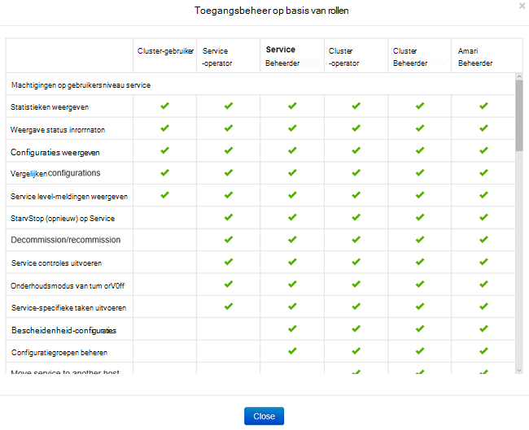
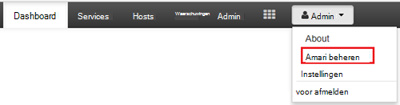
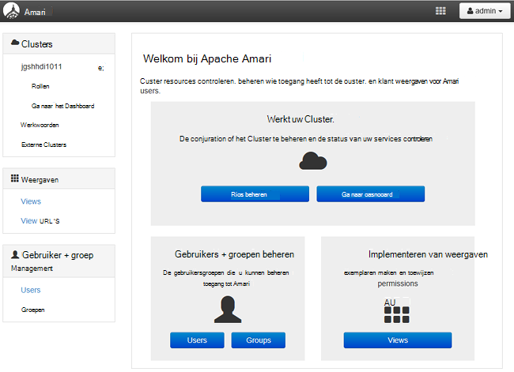
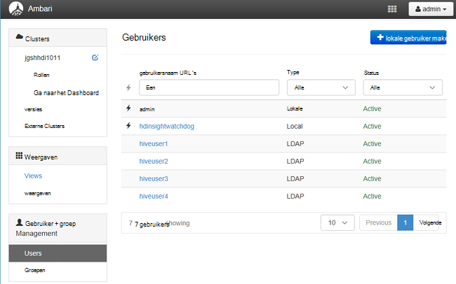
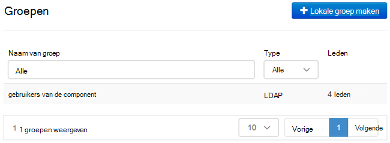
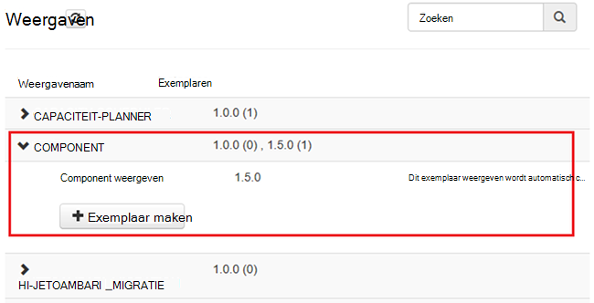
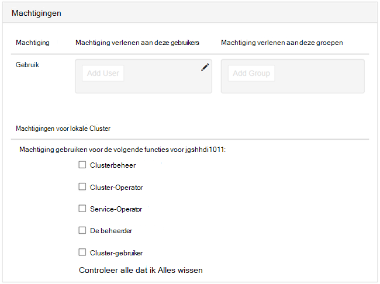

<properties
    pageTitle="HDInsight domein behoren clusters beheren | Microsoft Azure"
    description="Informatie over het beheren van clusters deel uitmaakt van een domein HDInsight"
    services="hdinsight"
    documentationCenter=""
    authors="saurinsh"
    manager="jhubbard"
    editor="cgronlun"
    tags=""/>

<tags
    ms.service="hdinsight"
    ms.devlang="na"
    ms.topic="article"
    ms.tgt_pltfrm="na"
    ms.workload="big-data"
    ms.date="10/25/2016"
    ms.author="saurinsh"/>

# Beheren van clusters deel uitmaakt van een domein HDInsight (voorbeeld)

Informatie over de gebruikers en de rollen in het HDInsight domein behoren, en het beheren van clusters van HDInsight domein behoren.

## Gebruikers van de clusters deel uitmaakt van een domein HDInsight

Een cluster van HDInsight die geen domein-lid heeft twee gebruikersaccounts die zijn gemaakt tijdens het maken van het cluster:

- **Ambari admin**: deze account staat ook bekend als *gebruiker Hadoop* of *HTTP*. Deze account kan worden gebruikt voor aanmelding bij de Ambari op https://&lt;Clusternaam >. azurehdinsight.net. Het kan ook query's uitvoeren op Ambari weergaven, uitvoeren van taken via externe hulpprogramma's (dat wil zeggen PowerShell, Templeton, Visual Studio) en verificatie met de component ODBC-stuurprogramma en BI-hulpprogramma's (Excel, PowerBI, of Tableau) gebruikt.

- **SSH gebruiker**: deze account kan worden gebruikt met SSH en sudo-opdrachten worden uitgevoerd. Root privileges om de Linux VMs heeft.

Een domein behoren HDInsight cluster heeft drie nieuwe gebruikers naast Ambari Admin en SSH gebruiker.

- **Zwerver admin**: deze account is de account lokale Apache Zwerver. Het is niet een gebruiker van active directory-domein. Deze account kan worden gebruikt om beleid instellen en andere gebruikers, beheerders of overgedragen beheerders (zodat die gebruikers beleid beheren kunnen). Standaard gebruikersnaam is *admin* en het wachtwoord is hetzelfde als de admin-wachtwoord Ambari. Het wachtwoord kan worden bijgewerkt vanaf de pagina instellingen van Zwerver.

- **Cluster Administrator domeingebruiker**: dit is een active directory-domeingebruiker aangewezen als de Hadoop cluster admin, met inbegrip van Ambari en een Zwerver. Tijdens het maken van het cluster, moet u de referenties van de gebruiker opgeven. Deze gebruiker heeft de volgende bevoegdheden:

    - Computers toevoegen aan het domein en plaats deze binnen de organisatie-eenheid die u tijdens het maken van het cluster opgeeft.
    - Service-principals binnen de organisatie-eenheid die u tijdens het maken van een cluster opgeeft maken. 
    - Reverse DNS-vermeldingen maken.

    Let op: de AD-gebruikers hebben ook deze bevoegdheden. 

    Er zijn bepaalde eindpunten binnen het cluster (bijvoorbeeld Templeton) die niet worden beheerd met Zwerver en daarom niet veilig zijn. Deze eindpunten worden vergrendeld voor alle gebruikers behalve de domeingebruiker cluster Administrator. 

- **Gewone**: tijdens het maken van het cluster, kunt u meerdere active directory-groepen bieden. De gebruikers van deze groepen wordt gesynchroniseerd met de Zwerver en Ambari. Deze gebruikers zijn gebruikers van een domein en toegang tot alleen Zwerver beheerd eindpunten (bijvoorbeeld Hiveserver2). De RBAC-beleid en controle zal gelden voor deze gebruikers.

## Rollen van de clusters deel uitmaakt van een domein HDInsight

HDInsight domein behoren de volgende functies hebben:

- Clusterbeheer
- Cluster-Operator
- De beheerder
- Service-Operator
- Cluster-gebruiker

**Voor een overzicht van de machtigingen van deze rollen**

1. Ambari Management UI te openen.  Zie [Ambari Management UI te openen](#open-the-ambari-management-ui).
2. Klik in het linkermenu op **rollen**.
3. Klik op het blauwe vraagteken als u wilt zien welke machtigingen:

    

## Open het Ambari beheer UI

1. Aanmelden op de [portal Azure](https://portal.azure.com).
2. Open uw cluster HDInsight in een bladeserver. Zie de [lijst weergeven en de clusters](hdinsight-administer-use-management-portal.md#list-and-show-clusters).
3. Klik op **Dashboard** in het bovenste menu voor het openen van Ambari.
4. Aanmelden bij Ambari met de cluster administrator domeingebruikersnaam en wachtwoord.
5. Klik op de keuzelijst **beheer** van de rechterbovenhoek en klik op **Ambari beheren**.

    

    De gebruikersinterface ziet:

    

## De domein-gebruikers gesynchroniseerd van uw Active Directory

1. Ambari Management UI te openen.  Zie [Ambari Management UI te openen](#open-the-ambari-management-ui).
2. Klik op **gebruikers**in het linkermenu. U moet alle gebruikers van uw Active Directory wordt gesynchroniseerd met het cluster HDInsight zien.

    

## De domein-groepen gesynchroniseerd van uw Active Directory

1. Ambari Management UI te openen.  Zie [Ambari Management UI te openen](#open-the-ambari-management-ui).
2. Klik in het linkermenu op **groepen**. U dient alle groepen synchroniseren met Active Directory aan het cluster HDInsight zien.

    

## Weergaven component machtigingen configureren

1. Ambari Management UI te openen.  Zie [Ambari Management UI te openen](#open-the-ambari-management-ui).
2. Klik in het linkermenu op **weergaven**.
3. Klik op de **component** om de details weer te geven.

    

4. Klik op de **Component-weergave** om de component-weergaven configureren.
5. Ga naar de sectie **machtigingen** .

    

6. Klik op **Toevoegen gebruiker** of **Groep toevoegen**en geef vervolgens de gebruikers of groepen die component weergaven kunnen gebruiken. 

## Gebruikers van de rollen configureren

 Zie voor een overzicht van de rollen en machtigingen [clusters HDInsight rollen van domein behoren](#roles-of-domain---joined-hdinsight-clusters).

1. Ambari Management UI te openen.  Zie [Ambari Management UI te openen](#open-the-ambari-management-ui).
2. Klik in het linkermenu op **rollen**.
3. Klik op **Gebruiker toevoegen** of **Groep toevoegen** om gebruikers en groepen toewijzen aan rollen.
 
## Volgende stappen

- Zie [clusters HDInsight deel uitmaakt van een domein configureren](hdinsight-domain-joined-configure.md)voor het configureren van een cluster HDInsight domein behoren.
- Zie [beleid voor een domein behoren HDInsight clusters component configureren](hdinsight-domain-joined-run-hive.md)voor het configureren van beleid van de component en component-query's uitvoeren.
- Voor het uitvoeren van de component query's via SSH op clusters deel uitmaakt van een domein HDInsight Zie [Gebruik SSH met Linux-gebaseerde Hadoop op HDInsight van Linux, Unix, of OS X](hdinsight-hadoop-linux-use-ssh-unix.md#connect-to-a-domain-joined-hdinsight-cluster).
