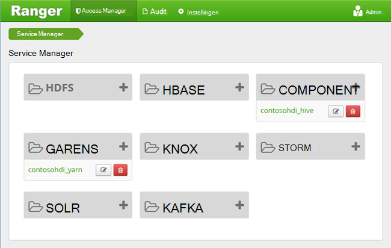
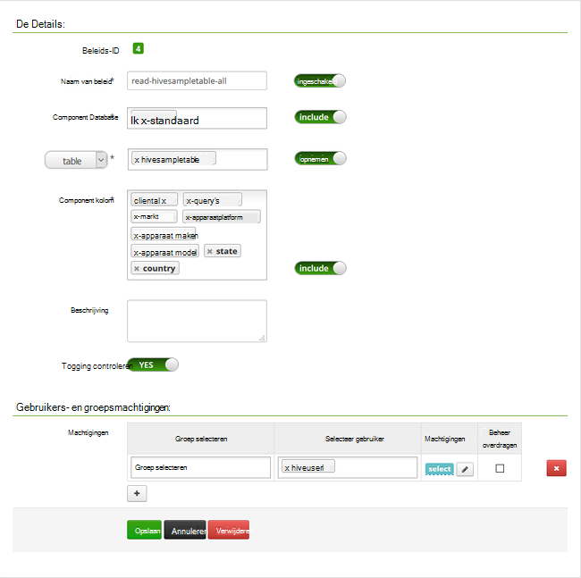

<properties
    pageTitle="Component-beleid configureren in een domein behoren HDInsight | Microsoft Azure"
    description="Meer informatie..."
    services="hdinsight"
    documentationCenter=""
    authors="saurinsh"
    manager="jhubbard"
    editor="cgronlun"
    tags="azure-portal"/>

<tags
    ms.service="hdinsight"
    ms.devlang="na"
    ms.topic="hero-article"
    ms.tgt_pltfrm="na"
    ms.workload="big-data"
    ms.date="10/25/2016"
    ms.author="saurinsh"/>

# Component-beleid configureren in een domein behoren HDInsight (voorbeeld)

Informatie over het beleid van Zwerver Apache configureren voor component. In dit artikel maakt u twee Zwerver beleidsregels om toegang te beperken tot de hivesampletable. De hivesampletable wordt geleverd met clusters van HDInsight. Nadat u het beleid hebt geconfigureerd, kunt u Excel en het ODBC-stuurprogramma verbinding maken met tabellen in HDInsight component.

## Vereisten

- Een cluster HDInsight domein behoren. Zie [de clusters deel uitmaakt van een domein configureren HDInsight](hdinsight-domain-joined-configure.md).
- Een workstation met Office 2016, Office 2013 Professional Plus, Office 365 Pro Plus, Excel 2013 zelfstandig of Office 2010 Professional Plus.

## Verbinding maken met Apache Zwerver Admin UI

**Verbinding maken met de Zwerver Admin UI**

1. Via een browser verbinding maken met Zwerver Admin UI. De URL is https://&lt;Clusternaam >.azurehdinsight.net/Ranger/. 

    >[AZURE.NOTE] Zwerver gebruikt andere referenties dan Hadoop cluster. Met InPrivate-venster om te voorkomen dat met behulp van referenties uit de cache Hadoop browsers, verbinding maken met de Zwerver Admin UI.
4. Meld u aan met de cluster administrator domeingebruikersnaam en het wachtwoord:

    

    Zwerver werkt momenteel alleen met garen en component.

## Gebruikers van een domein maken

U hebt in [de clusters deel uitmaakt van een domein configureren HDInsight](hdinsight-domain-joined-configure.md#create-and-configure-azure-ad-ds-for-your-azure-ad), hiveruser1 en hiveuser2 gemaakt. De twee gebruikersaccount gebruikt u in deze zelfstudie.

## Zwerver beleid maken

In dit gedeelte maakt u twee beleidsregels voor Zwerver voor toegang tot hivesampletable. Selecteer toestemming geeft u op een andere reeks kolommen. Beide gebruikers zijn gemaakt in [de clusters deel uitmaakt van een domein configureren HDInsight](hdinsight-domain-joined-configure.md#create-and-configure-azure-ad-ds-for-your-azure-ad).  In de volgende sectie test u de twee beleidsregels in Excel.

**Zwerver beleid maken**

1. Open de Zwerver Admin UI. Zie [verbinding maken met Apache Zwerver Admin UI](#connect-to-apache-ranager-admin-ui).
2. Klik op ** &lt;Clusternaam > _hive**, onder de **component**. Er zijn twee vooraf configureren van beleid.
3. Klik op **Nieuw beleid toevoegen**en voer de volgende waarden:

    - Beleidsnaam: lezen-hivesampletable-alles
    - Component Database: standaard
    - tabel: hivesampletable
    - Kolom component: *
    - Selecteer gebruiker: hiveuser1
    - Machtigingen: selecteren

    .

    >[AZURE.NOTE] Als een gebruiker niet in het dialoogvenster gebruiker selecteren is gevuld, wacht even voor Zwerver te synchroniseren met AAD.

4. Klik op **toevoegen** om op te slaan van het beleid.
5. Herhaal de laatste twee stappen voor het maken van een ander beleid met de volgende eigenschappen:

    - Beleidsnaam: lezen-hivesampletable-devicemake
    - Component Database: standaard
    - tabel: hivesampletable
    - Kolom component: clientid, devicemake
    - Selecteer gebruiker: hiveuser2
    - Machtigingen: selecteren

## Component ODBC-gegevensbron maken

De instructies vindt u in [maakt component ODBC-gegevensbron](hdinsight-connect-excel-hive-odbc-driver.md).  

    Eigenschap|Beschrijving
    ---|---
    De naam van gegevensbron|Geef een naam voor de gegevensbron
    Host|Voer &lt;HDInsightClusterName >. azurehdinsight.net. Bijvoorbeeld: myHDICluster.azurehdinsight.net
    Poort|<strong>443</strong>gebruiken. (Deze poort is gewijzigd van 563 op 443.)
    Database|Gebruik <strong>standaard</strong>.
    Component servertype|Selecteer de <strong>Component Server 2</strong>
    Mechanisme|Selecteer <strong>Azure HDInsight Service</strong>
    HTTP-pad|Laat dit vak leeg.
    Gebruikersnaam|Voer hiveuser1@contoso158.onmicrosoft.com. Naam van het domein bijwerken als het andere.
    Wachtwoord|Voer het wachtwoord voor hiveuser1.
    </table>

Zorg ervoor dat u **Test** voordat de gegevensbron wordt opgeslagen.

##Gegevens importeren in Excel van HDInsight

U kunt twee beleidsregels hebt geconfigureerd in de laatste sectie.  hiveuser1 heeft de machtiging select voor alle kolommen en hiveuser2 heeft de machtiging select voor twee kolommen. In deze sectie kunt imiteren u de twee gebruikers om gegevens te importeren in Excel.

1. Een nieuwe of bestaande werkmap openen in Excel.
2. Klik op **Uit andere gegevensbronnen**vanuit het tabblad **gegevens** en klik vervolgens op **Vanuit Wizard Gegevensverbinding** om de **Wizard Gegevensverbinding**te starten.

    ! [Open wizard Gegevensverbinding] [img hdi simbahiveodbc.excel.dataconnection]

3. **ODBC DSN** als gegevensbron selecteren en klik vervolgens op **volgende**.
4. Van ODBC-gegevensbronnen, selecteert u de naam van de gegevensbron die u in de vorige stap hebt gemaakt en klik op **volgende**.
5. Voer het wachtwoord voor de cluster in de wizard en klik vervolgens op **OK**. Wacht tot het dialoogvenster **Database en tabel selecteren** te openen. Dit kan enkele seconden duren.
8. Selecteer **hivesampletable**en klik vervolgens op **volgende**. 
8. Klik op **Voltooien**.
9. U kunt wijzigen of de query opgeven in het dialoogvenster **Gegevens importeren** . Hiertoe klikt u op **Eigenschappen**. Dit kan enkele seconden duren. 
10. Klik op het tabblad **definitie** . Tekst van de opdracht is:

        SELECT * FROM "HIVE"."default"."hivesampletable"

    Door het Zwerver beleid dat u hebt gedefinieerd, heeft hiveuser1 machtiging select voor alle kolommen.  Dus deze query werkt met de referenties van de hiveuser1, maar dit niet werkt niet met de referenties van de hiveuser2.

    ! [Eigenschappen] [img-hdi-simbahiveodbc-excel-connectionproperties]

11. Klik op **OK** om het dialoogvenster Eigenschappen te sluiten.
12. Klik op **OK** om het dialoogvenster **Gegevens importeren** te sluiten.  
13. Geef het wachtwoord voor de hiveuser1 opnieuw in en klik op **OK**. Het duurt enkele seconden voordat gegevens naar Excel wordt geïmporteerd. Wanneer deze is voltooid, ziet u 11 kolommen met gegevens.

De tweede beleidsregel (Lees-hivesampletable-devicemake) u hebt gemaakt in de laatste sectie testen

1. Voeg een nieuw werkblad in Excel.
2. Volg de laatste procedure om de gegevens te importeren.  De enige wijziging die u maakt is de referenties van de hiveuser2 gebruiken in plaats van de hiveuser1. Dit mislukt omdat de hiveuser2 alleen gemachtigd is om te zien van twee kolommen. U moet de volgende fout:

        [Microsoft][HiveODBC] (35) Error from Hive: error code: '40000' error message: 'Error while compiling statement: FAILED: HiveAccessControlException Permission denied: user [hiveuser2] does not have [SELECT] privilege on [default/hivesampletable/clientid,country ...]'.

3. Volg de procedure om gegevens te importeren. Deze keer hiveuser2 van referenties gebruikt, en ook uit de select-instructie te wijzigen:

        SELECT * FROM "HIVE"."default"."hivesampletable"

    Aan:

        SELECT clientid, devicemake FROM "HIVE"."default"."hivesampletable"

    Wanneer deze is voltooid, ziet u twee kolommen van de geïmporteerde gegevens.

## Volgende stappen

- Zie [clusters HDInsight deel uitmaakt van een domein configureren](hdinsight-domain-joined-configure.md)voor het configureren van een cluster HDInsight domein behoren.
- Een domein behoren HDInsight clusters, Zie voor het beheren van [clusters beheren domein behoren HDInsight](hdinsight-domain-joined-manage.md).
- Voor het uitvoeren van de component query's via SSH op clusters deel uitmaakt van een domein HDInsight Zie [Gebruik SSH met Linux-gebaseerde Hadoop op HDInsight van Linux, Unix, of OS X](hdinsight-hadoop-linux-use-ssh-unix.md#connect-to-a-domain-joined-hdinsight-cluster).
- Zie voor verbinden component JDBC component gebruiken, [verbinding maken met de component in Azure HDInsight met behulp van de component JDBC-stuurprogramma](hdinsight-connect-hive-jdbc-driver.md)
- Zie voor de verbinding met Excel met behulp van ODBC component Hadoop, [Hadoop met het Microsoft Component ODBC station verbinding maken met Excel](hdinsight-connect-excel-hive-odbc-driver.md)
- Zie voor de verbinding met Excel met Power Query Hadoop, [Hadoop met Power Query verbinding maken met Excel](hdinsight-connect-excel-power-query.md)