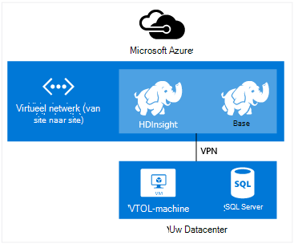
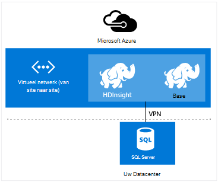

<properties
    pageTitle="HDInsight met een virtueel netwerk uitbreiden | Microsoft Azure"  
    description="Informatie over het gebruik van Azure Virtual Network HDInsight verbinding met andere cloud resources of resources in uw datacenter"
    services="hdinsight"
    documentationCenter=""
    authors="Blackmist"
    manager="jhubbard"
    editor="cgronlun"/>

<tags
   ms.service="hdinsight"
   ms.devlang="na"
   ms.topic="article"
   ms.tgt_pltfrm="na"
   ms.workload="big-data"
   ms.date="10/21/2016"
   ms.author="larryfr"/>


#<a name="extend-hdinsight-capabilities-by-using-azure-virtual-network"></a>HDInsight mogelijkheden uitbreiden door middel van het virtuele netwerk Azure

Azure Virtual Network kunt u uw Hadoop oplossingen te nemen van bronnen zoals SQL Server op locatie, het combineren van meerdere HDInsight clustertypen of voor het maken van beveiligde particuliere netwerken tussen resources in de cloud uit te breiden.

[AZURE.INCLUDE [upgrade-powershell](../../includes/hdinsight-use-latest-powershell-and-cli.md)]


##<a id="whatis"></a>Wat is Azure Virtual Network?

[Azure virtueel netwerk](https://azure.microsoft.com/documentation/services/virtual-network/) kunt u een veilige, permanente netwerk met de resources die u nodig hebt voor uw oplossing. Een virtueel netwerk kunt u:

* Verbinding maken met bronnen samen in een particulier netwerk (alleen cloud) wolk.

    

    Met behulp van virtueel netwerk koppelen Azure services met Azure HDInsight kan de volgende scenario's:

    * **HDInsight aanroepen van services of taken** van Azure websites of services die worden uitgevoerd in Azure virtuele machines.

    * **Rechtstreeks overbrengen van gegevens** tussen HDInsight en Azure SQL-Database, SQL Server of een andere oplossing voor opslag op een virtuele machine wordt uitgevoerd.

    * Het **combineren van meerdere HDInsight servers** in één enkele oplossing. HDInsight clusters komen in verschillende typen die met de technologie die het cluster is afgestemd corresponderen voor werkbelasting. Er is geen ondersteunde methode voor het maken van een cluster dat een combinatie van meerdere typen, zoals Storm en HBase op één cluster. Met behulp van een virtueel netwerk kan meerdere clusters rechtstreeks met elkaar communiceren.

* Verbinding maken met uw cloud resources aan uw lokale datacenter-netwerk (site naar site of punt-naar-site) via een virtueel particulier netwerk (VPN).

    Website configuratie kunt u verbinding maken met meerdere resources van uw datacenter met de Azure virtueel netwerk via een VPN-hardware of de Routing and Remote Access-service.

    

    Punt-tot-site-configuratie kunt u verbinding maken met een specifieke resource de Azure virtueel netwerk met behulp van VPN-software.

    

    Virtueel netwerk via de cloud en uw datacenter te koppelen, kunt scenario's in de configuratie van de wolk alleen-lezen. Maar dus niet beperkt tot de bronnen in de cloud werkt, kunt u ook werken met de resources in uw datacenter.

    * **Rechtstreeks overbrengen van gegevens** tussen HDInsight en uw datacenter. Een voorbeeld van de Sqoop gebruikt om de overdracht van gegevens naar SQL Server of lezen van gegevens die zijn gegenereerd door een toepassing line of business (LOB).

    * **HDInsight aanroepen van services of taken** van een LOB-toepassing. Een voorbeeld voor het opslaan en ophalen van gegevens uit een cluster HDInsight HBase HBase Java API's gebruikt.

Zie [overzicht van Azure Virtual Network](../virtual-network/virtual-networks-overview.md)voor meer informatie over functies, voordelen en mogelijkheden van virtueel netwerk.

> [AZURE.NOTE] Voordat u een HDInsight-cluster wordt ingericht, moet u de Azure virtueel netwerk maken. Zie [virtuele netwerken uitvoeren](https://azure.microsoft.com/documentation/services/virtual-network/)voor meer informatie.

## <a name="virtual-network-requirements"></a>Virtueel netwerkvereisten

> [AZURE.IMPORTANT] Een HDInsight-cluster maakt op een virtueel netwerk vereist specifieke virtuele netwerkconfiguraties die in deze sectie worden beschreven.

###<a name="location-based-virtual-networks"></a>Virtuele netwerken op basis van locatie

Azure HDInsight ondersteunt alleen locatie gebaseerde virtuele netwerken en werkt momenteel niet met virtuele netwerken op basis van affiniteit groep.

###<a name="classic-or-v2-virtual-network"></a>Klassieke of v2 virtueel netwerk

Windows-gebaseerde clusters vereisen een klassieke virtueel netwerk, terwijl Linux gebaseerde clusters een virtueel netwerk van Azure Resource Manager vereisen. Als u niet het juiste type netwerk hebt, meer deze niet bruikbaar bij het maken van het cluster.

Als u bronnen op een virtueel netwerk die niet kan worden gebruikt door het cluster dat u wilt maken hebt, kunt u maakt een nieuwe virtuele netwerk dat kan worden gebruikt door het cluster en verbinden met het virtuele netwerk dat niet compatibel. Vervolgens kunt u het cluster maken in de versie die is vereist en het mag voor toegang tot bronnen in het andere netwerk sinds de twee zijn gekoppeld. Zie voor meer informatie over klassieke en nieuwe virtuele netwerken met elkaar verbinden, [klassieke VNets verbinding maken met nieuwe VNets](../vpn-gateway/vpn-gateway-connect-different-deployment-models-portal.md).

###<a name="custom-dns"></a>Aangepaste DNS

Bij het maken van een virtueel netwerk voorziet Azure in naamomzetting standaard Azure services zoals HDInsight die in het netwerk zijn geïnstalleerd. Mogelijk moet u echter uw eigen domein naam systeem (DNS) gebruiken voor situaties, zoals cross-netwerk Domeinnaamomzetting. Bijvoorbeeld, wanneer communicatie tussen services zich bevinden lid twee van virtuele netwerken. HDInsight ondersteunt zowel de standaard Azure naamomzetting als aangepaste DNS gebruikt in combinatie met Azure Virtual Network.

Zie de sectie __naamomzetting met DNS-server__ van de [Naamomzetting voor VMs en rol exemplaren](../virtual-network/virtual-networks-name-resolution-for-vms-and-role-instances.md#name-resolution-using-your-own-dns-server) document voor meer informatie over het gebruik van uw eigen DNS-server met Azure Virtual Network.

###<a name="secured-virtual-networks"></a>Beveiligde virtuele netwerken

De HDInsight-service is een beheerde service en toegang tot het Internet vereist tijdens het inrichten en tijdens de uitvoering. Dit is dus die Azure kan de status van het cluster, bewaken initiëren van failover van clusterbronnen, het aantal knooppunten in het cluster via schaal bewerkingen en andere taken te wijzigen.

Als u HDInsight in een beveiligde virtuele netwerk installeert, moet u de binnenkomende toegang via poort 443 voor het volgende IP-adressen, waardoor Azure voor het beheren van het cluster HDInsight toestaan.

* 168.61.49.99
* 23.99.5.239
* 168.61.48.131
* 138.91.141.162

Toestaan van binnenkomende toegang via poort 443 voor deze adressen kunt u HDInsight in een beveiligde virtuele netwerk installeren.

> [AZURE.IMPORTANT] HDInsight ondersteunt geen uitgaand verkeer, alleen binnenkomend verkeer te beperken. Bij het definiëren van regels voor het subnet HDInsight met netwerk-beveiligingsgroep alleen regels voor binnenkomende verbindingen te gebruiken.

De volgende voorbeelden laten zien hoe een nieuw netwerk beveiligingsgroep die staat de benodigde adressen en de groep van toepassing is op een subnet binnen het virtuele netwerk maken. Deze stappen wordt ervan uitgegaan dat u al hebt gemaakt een virtueel netwerk en subnet dat u wilt installeren van HDInsight in.

__Azure PowerShell gebruiken__

    $vnetName = "Replace with your virtual network name"
    $resourceGroupName = "Replace with the resource group the virtual network is in"
    $subnetName = "Replace with the name of the subnet that HDInsight will be installed into"
    # Get the Virtual Network object
    $vnet = Get-AzureRmVirtualNetwork `
        -Name $vnetName `
        -ResourceGroupName $resourceGroupName
    # Get the region the Virtual network is in.
    $location = $vnet.Location
    # Get the subnet object
    $subnet = $vnet.Subnets | Where-Object Name -eq $subnetName
    # Create a new Network Security Group.
    # And add exemptions for the HDInsight health and management services.
    $nsg = New-AzureRmNetworkSecurityGroup `
        -Name "hdisecure" `
        -ResourceGroupName $resourceGroupName `
        -Location $location `
        | Add-AzureRmNetworkSecurityRuleConfig `
            -name "hdirule1" `
            -Description "HDI health and management address 168.61.49.99" `
            -Protocol "*" `
            -SourcePortRange "*" `
            -DestinationPortRange "443" `
            -SourceAddressPrefix "168.61.49.99" `
            -DestinationAddressPrefix "VirtualNetwork" `
            -Access Allow `
            -Priority 300 `
            -Direction Inbound `
        | Add-AzureRmNetworkSecurityRuleConfig `
            -Name "hdirule2" `
            -Description "HDI health and management 23.99.5.239" `
            -Protocol "*" `
            -SourcePortRange "*" `
            -DestinationPortRange "443" `
            -SourceAddressPrefix "23.99.5.239" `
            -DestinationAddressPrefix "VirtualNetwork" `
            -Access Allow `
            -Priority 301 `
            -Direction Inbound `
        | Add-AzureRmNetworkSecurityRuleConfig `
            -Name "hdirule3" `
            -Description "HDI health and management 168.61.48.131" `
            -Protocol "*" `
            -SourcePortRange "*" `
            -DestinationPortRange "443" `
            -SourceAddressPrefix "168.61.48.131" `
            -DestinationAddressPrefix "VirtualNetwork" `
            -Access Allow `
            -Priority 302 `
            -Direction Inbound `
        | Add-AzureRmNetworkSecurityRuleConfig `
            -Name "hdirule4" `
            -Description "HDI health and management 138.91.141.162" `
            -Protocol "*" `
            -SourcePortRange "*" `
            -DestinationPortRange "443" `
            -SourceAddressPrefix "138.91.141.162" `
            -DestinationAddressPrefix "VirtualNetwork" `
            -Access Allow `
            -Priority 303 `
            -Direction Inbound
    # Set the changes to the security group
    Set-AzureRmNetworkSecurityGroup -NetworkSecurityGroup $nsg
    # Apply the NSG to the subnet
    Set-AzureRmVirtualNetworkSubnetConfig `
        -VirtualNetwork $vnet `
        -Name $subnetName `
        -AddressPrefix $subnet.AddressPrefix `
        -NetworkSecurityGroupId $nsg

__Met behulp van de CLI Azure__

1. Gebruik de volgende opdracht maakt u een nieuw netwerk beveiligingsgroep met de naam `hdisecure`. __RESOURCEGROUPNAME__ en __locatie__ vervangen door de resourcegroep met het virtuele netwerk Azure en de locatie (regio), die in de groep is gemaakt.

        azure network nsg create RESOURCEGROUPNAME hdisecure LOCATION
    
    Wanneer u de groep hebt gemaakt, ontvangt u informatie over de nieuwe groep. Ga naar de regel met de volgende strekking en sla de `/subscriptions/GUID/resourceGroups/RESOURCEGROUPNAME/providers/Microsoft.Network/networkSecurityGroups/hdisecure` informatie. Het wordt gebruikt in een latere stap.
    
        data:    Id                              : /subscriptions/GUID/resourceGroups/RESOURCEGROUPNAME/providers/Microsoft.Network/networkSecurityGroups/hdisecure

2. Gebruik de volgende regels toevoegen aan de nieuwe netwerkgroep waarmee inkomende communicatie via poort 443 uit de Azure HDInsight gezondheids- en service. __RESOURCEGROUPNAME__ vervangen door de naam van de resourcegroep met het virtuele netwerk Azure.

        azure network nsg rule create RESOURCEGROUPNAME hdisecure hdirule1 -p "*" -o "*" -u "443" -f "168.61.49.99" -e "VirtualNetwork" -c "Allow" -y 300 -r "Inbound"
        azure network nsg rule create RESOURCEGROUPNAME hdisecure hdirule2 -p "*" -o "*" -u "443" -f "23.99.5.239" -e "VirtualNetwork" -c "Allow" -y 301 -r "Inbound"
        azure network nsg rule create RESOURCEGROUPNAME hdisecure hdirule3 -p "*" -o "*" -u "443" -f "168.61.48.131" -e "VirtualNetwork" -c "Allow" -y 302 -r "Inbound"
        azure network nsg rule create RESOURCEGROUPNAME hdisecure hdirule4 -p "*" -o "*" -u "443" -f "138.91.141.162" -e "VirtualNetwork" -c "Allow" -y 303 -r "Inbound"

3. Nadat u de regels hebt gemaakt, gebruikt u de volgende groep met het nieuwe netwerk toepassen op een subnet. __RESOURCEGROUPNAME__ vervangen door de naam van de resourcegroep met het virtuele netwerk Azure. __VNETNAME__ en __SUBNETNAME__ vervangen door de naam van het virtuele netwerk Azure en het subnet dat u gebruiken wilt bij het installeren van HDInsight.

        azure network vnet subnet set RESOURCEGROUPNAME VNETNAME SUBNETNAME -w "/subscriptions/GUID/resourceGroups/RESOURCEGROUPNAME/providers/Microsoft.Network/networkSecurityGroups/hdisecure"
    
    Nadat deze opdracht is voltooid, kunt u HDInsight in het beveiligde virtuele netwerk op het subnet gebruikt in deze stappen installeren.

> [AZURE.IMPORTANT] Met behulp van de bovenstaande stappen alleen toegang tot de service van gezondheids- en HDInsight van de wolk Azure. Hiermee kunt u een cluster HDInsight installeren in het subnet, maar wel toegang tot het cluster HDInsight van buiten het netwerk van de virtuele standaard geblokkeerd. U moet extra beveiliging netwerkgroep regels toevoegen als u wilt toegang van buitenaf het virtuele netwerk inschakelen.
>
> Bijvoorbeeld, als u SSH toegang vanaf het internet, moet u een vergelijkbaar met de volgende regel toevoegen: 
>
> * Azure PowerShell-```Add-AzureRmNetworkSecurityRuleConfig -Name "SSSH" -Description "SSH" -Protocol "*" -SourcePortRange "*" -DestinationPortRange "22" -SourceAddressPrefix "*" -DestinationAddressPrefix "VirtualNetwork" -Access Allow -Priority 304 -Direction Inbound```
> * Azure CLI-```azure network nsg rule create RESOURCEGROUPNAME hdisecure hdirule4 -p "*" -o "*" -u "22" -f "*" -e "VirtualNetwork" -c "Allow" -y 304 -r "Inbound"```

Zie voor meer informatie over beveiligingsgroepen netwerk [netwerk beveiligingsgroepen, overzicht](../virtual-network/virtual-networks-nsg.md). Zie de [gebruiker gedefinieerde Routes en IP-doorsturen](../virtual-network/virtual-networks-udr-overview.md)voor meer informatie over het beheren van routering in een virtueel netwerk Azure.

##<a id="tasks"></a>Taken en informatie

Deze sectie bevat informatie over veelgebruikte taken en informatie u moet bij gebruik van HDInsight met een virtueel netwerk.

###<a name="determine-the-fqdn"></a>De FQDN-naam bepalen

Het cluster HDInsight wordt toegewezen aan een specifieke volledig gekwalificeerde domeinnaam (FQDN) voor de virtuele netwerkinterface. Dit is het adres dat u gebruiken moet wanneer u verbinding maakt met het cluster uit andere bronnen op het virtuele netwerk. Met de volgende URL om te bepalen de FQDN-naam, de Ambari management-service query:

    https://<clustername>.azurehdinsight.net/ambari/api/v1/clusters/<clustername>.azurehdinsight.net/services/<servicename>/components/<componentname>

> [AZURE.NOTE] Zie [Monitor Hadoop clusters in het HDInsight de Ambari-API gebruiken](hdinsight-monitor-use-ambari-api.md)voor meer informatie over het gebruik van Ambari met HDInsight.

U moet de naam van het cluster en een service en de component die wordt uitgevoerd op het cluster, zoals de bronnenbeheerder GAREN.

> [AZURE.NOTE] De geretourneerde gegevens is een JavaScript Object Notation (JSON) document dat veel informatie over het onderdeel bevat. Als alleen de FQDN-naam, moet u een JSON parser voor het ophalen van de `host_components[0].HostRoles.host_name` waarde.

Bijvoorbeeld, om terug te keren de FQDN-naam van een cluster HDInsight Hadoop, kunt u een van de volgende methoden om de gegevens op te halen voor de bronnenbeheerder garens:

* [Azure PowerShell](../powershell-install-configure.md)

        $ClusterDnsName = <clustername>
        $Username = <cluster admin username>
        $Password = <cluster admin password>
        $DnsSuffix = ".azurehdinsight.net"
        $ClusterFQDN = $ClusterDnsName + $DnsSuffix

        $webclient = new-object System.Net.WebClient
        $webclient.Credentials = new-object System.Net.NetworkCredential($Username, $Password)

        $Url = "https://" + $ClusterFQDN + "/ambari/api/v1/clusters/" + $ClusterFQDN + "/services/yarn/     components/resourcemanager"
        $Response = $webclient.DownloadString($Url)
        $JsonObject = $Response | ConvertFrom-Json
        $FQDN = $JsonObject.host_components[0].HostRoles.host_name
        Write-host $FQDN

* [cURL-](http://curl.haxx.se/) en [jq](http://stedolan.github.io/jq/)

        curl -G -u <username>:<password> https://<clustername>.azurehdinsight.net/ambari/api/v1/clusters/<clustername>.azurehdinsight.net/services/yarn/components/resourcemanager | jq .host_components[0].HostRoles.host_name

###<a name="connecting-to-hbase"></a>Verbinding maken met HBase

Op HBase externe verbinding met de API voor Java, moet u de adressen ZooKeeper quorumbron voor het cluster HBase bepalen en geef dit in uw toepassing.

Als u de ZooKeeper quorum adres, gebruikt u een van de volgende methoden om te vragen de Ambari management-service:

* [Azure PowerShell](../powershell-install-configure.md)

        $ClusterDnsName = <clustername>
        $Username = <cluster admin username>
        $Password = <cluster admin password>
        $DnsSuffix = ".azurehdinsight.net"
        $ClusterFQDN = $ClusterDnsName + $DnsSuffix

        $webclient = new-object System.Net.WebClient
        $webclient.Credentials = new-object System.Net.NetworkCredential($Username, $Password)

        $Url = "https://" + $ClusterFQDN + "/ambari/api/v1/clusters/" + $ClusterFQDN + "/configurations?type=hbase-site&tag=default&fields=items/properties/hbase.zookeeper.quorum"
        $Response = $webclient.DownloadString($Url)
        $JsonObject = $Response | ConvertFrom-Json
        Write-host $JsonObject.items[0].properties.'hbase.zookeeper.quorum'

* [cURL-](http://curl.haxx.se/) en [jq](http://stedolan.github.io/jq/)

        curl -G -u <username>:<password> "https://<clustername>.azurehdinsight.net/ambari/api/v1/clusters/<clustername>.azurehdinsight.net/configurations?type=hbase-site&tag=default&fields=items/properties/hbase.zookeeper.quorum" | jq .items[0].properties[]

> [AZURE.NOTE] Zie [Monitor Hadoop clusters in het HDInsight de Ambari-API gebruiken](hdinsight-monitor-use-ambari-api.md)voor meer informatie over het gebruik van Ambari met HDInsight.

Zodra u de quorumbron gegevens hebt, gebruikt u in de clienttoepassing.

U zou voor een Java-toepassing die gebruikmaakt van de API HBase, bijvoorbeeld een bestand **hbase site.xml** toevoegen aan het project en de quorumbron gegevens als volgt opgeven in het bestand:

```
<configuration>
  <property>
    <name>hbase.cluster.distributed</name>
    <value>true</value>
  </property>
  <property>
    <name>hbase.zookeeper.quorum</name>
    <value>zookeeper0.address,zookeeper1.address,zookeeper2.address</value>
  </property>
  <property>
    <name>hbase.zookeeper.property.clientPort</name>
    <value>2181</value>
  </property>
</configuration>
```

###<a name="verify-network-connectivity"></a>Netwerkconnectiviteit controleren

Sommige services, zoals SQL Server, kunnen binnenkomende netwerkverbindingen te beperken. Hierdoor kunnen HDInsight met succes werken met deze services.

Als u problemen hebt met het openen van een service uit HDInsight, raadpleegt u de documentatie bij de service om ervoor te zorgen dat u toegang tot het netwerk hebt ingeschakeld. U kunt ook controleren of toegang tot het netwerk door een Azure virtuele machine maken in hetzelfde virtuele netwerk en client-hulpprogramma's gebruiken om te controleren of de virtuele machine kan verbinding met de service via het virtuele netwerk.

##<a id="nextsteps"></a>Volgende stappen

De volgende voorbeelden ziet hoe u HDInsight met Azure Virtual Network:

* [Sensor-gegevens analyseren met Storm en HBase in HDInsight](hdinsight-storm-sensor-data-analysis.md) - ziet u een cluster Storm en HBase configureren in een virtueel netwerk zoals het schrijven van gegevens op afstand naar HBase van Storm.

* [Bepaling Hadoop clusters in het HDInsight](hdinsight-hadoop-provision-linux-clusters.md) - vindt u informatie over het inrichten van Hadoop clusters, met inbegrip van informatie over het gebruik van Azure Virtual Network.

* [Gebruik Sqoop met Hadoop in HDInsight](hdinsight-use-sqoop-mac-linux.md) - vindt u informatie over het gebruik van Sqoop voor de overdracht van gegevens met SQL Server via een virtueel netwerk.

Zie voor meer informatie over virtuele netwerken Azure, [Azure Virtual Network overzicht](../virtual-network/virtual-networks-overview.md).
