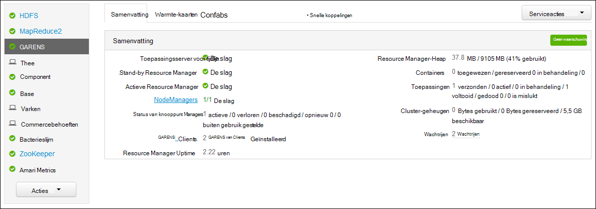
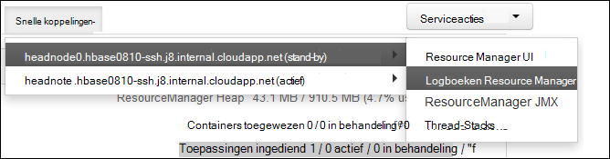

<properties
    pageTitle="Toegang Hadoop GAREN toepassingslogboeken op Linux-gebaseerde HDInsight | Microsoft Azure"
    description="Informatie over toegang tot de toepassingslogboeken GAREN op een Linux-gebaseerde HDInsight (Hadoop)-cluster met behulp van de opdrachtregel en een webbrowser."
    services="hdinsight"
    documentationCenter=""
    tags="azure-portal"
    authors="Blackmist" 
    manager="jhubbard"
    editor="cgronlun"/>

<tags
    ms.service="hdinsight"
    ms.workload="big-data"
    ms.tgt_pltfrm="na"
    ms.devlang="na"
    ms.topic="article"
    ms.date="10/21/2016"
    ms.author="larryfr"/>

# Access toepassingslogboeken GAREN op Linux-gebaseerde HDInsight 

Dit document wordt uitgelegd hoe u de logboeken voor garens (nog een andere Resource onderhandelaar)-toepassingen die op een cluster Hadoop in Azure HDInsight hebt voltooid.

> [AZURE.NOTE] De informatie in dit document is specifiek voor de HDInsight op basis van Linux-clusters. Voor meer informatie over Windows-gebaseerde clusters, Zie [toepassingslogboeken GAREN toegang op Windows gebaseerde HDInsight](hdinsight-hadoop-access-yarn-app-logs.md)

## Vereisten

* Een HDInsight op basis van Linux-cluster.

* U moet [een SSH-tunnel maken](hdinsight-linux-ambari-ssh-tunnel.md) voordat u toegang hebt tot de webgebruikersinterface ResourceManager Logboeken.

## GARENS tijdlijn Server

De [Garens tijdlijn Server](http://hadoop.apache.org/docs/r2.4.0/hadoop-yarn/hadoop-yarn-site/TimelineServer.html) biedt algemene informatie over voltooide toepassingen zoals application framework-specifieke informatie via twee verschillende interfaces. Met name:

* Opslaan en ophalen van algemene toepassingsinformatie over clusters HDInsight is ingeschakeld met versie 3.1.1.374 of hoger.
* Het onderdeel application framework-specifieke informatie van de Server van de tijdlijn is momenteel niet beschikbaar op HDInsight-clusters.

Algemene informatie over toepassingen omvat de volgende soorten gegevens:

* De toepassings-ID, een unieke id van een toepassing
* De gebruiker die de toepassing heeft gestart
* Informatie over pogingen tot de toepassing voltooien
* De recipiënten die worden gebruikt door een bepaalde toepassing poging

## Logboeken voor toepassingen garens en

GARENS ondersteunt ontkoppeling Resourcemanagement van planning/controle van toepassingen meerdere programmeermodellen (MapReduce wordt één van beide). Dit wordt gedaan door middel van een globale *ResourceManager* (RM), per werknemer-knooppunt *NodeManagers* (NMs) en per toepassing *ApplicationMasters* (AMs). De AM per toepassing onderhandelt over de resources (CPU, geheugen, schijf, netwerk) voor het uitvoeren van uw toepassing met het RM. De RM werkt met NMs verlenen deze bronnen, worden toegekend als *containers*. De AM is verantwoordelijk voor het volgen van de voortgang van de containers die zijn toegewezen door de RM. Een toepassing mogelijk veel containers, afhankelijk van de aard van de toepassing.

Bovendien elke toepassing kan bestaan uit meerdere *toepassing probeert* te voltooien met vastlopen of door het verlies van de communicatie tussen een uur en een RM. Daarom worden containers verleend aan een specifieke poging van een toepassing. In zekere zin een container biedt de context voor de basiseenheid van het werk dat door een toepassing garens en al het werk dat wordt uitgevoerd binnen de context van een container wordt uitgevoerd op de werknemer één knooppunt waarop de container is toegewezen. Zie [Begrippen GAREN] [ YARN-concepts] voor verdere verwijzing.

Toepassingslogboeken (en de bijbehorende container Logboeken) zijn van cruciaal belang in de foutopsporing in toepassingen die problemen veroorzaken Hadoop. GARENS biedt een goed kader voor het verzamelen, aggregeren en toepassingslogboeken met de [Aggregatie van logboek] opslaan[ log-aggregation] functie. Het logboek aggregatie functie kunt u toegang tot toepassingslogboeken een deterministische manier aggregeert logboeken over alle containers op een knooppunt van de werknemer en worden opgeslagen als een geaggregeerde logboekbestand per werknemer knooppunt op het standaardbestandssysteem nadat een toepassing is voltooid. Uw toepassing kan honderden of duizenden containers gebruiken, maar altijd voor alle containers die worden uitgevoerd op een knooppunt met één werknemer worden samengevoegd in één bestand, wat resulteert in één logboekbestand per werknemer knooppunt gebruikt door de toepassing. Aggregatie van logboekbestanden is standaard ingeschakeld op clusters van HDInsight (versie 3.0 en hoger), en geaggregeerde logboeken kunnen u vinden in de standaardcontainer van het cluster op de volgende locatie:

    wasbs:///app-logs/<user>/logs/<applicationId>

Locatie van de *gebruiker* is de naam van de gebruiker die de toepassing heeft gestart en *applicationId* is de unieke id van een toepassing, zoals toegewezen door de RM. garens

De geaggregeerde logboeken zijn niet rechtstreeks kan worden gelezen, zoals ze zijn geschreven in een [TFile][T-file], [binaire indeling] [ binary-format] geïndexeerd door de container. Hebt u de CLI-hulpprogramma's of ResourceManager GAREN logboeken deze logboeken weergeven als tekst zonder opmaak voor toepassingen of containers van belang. 

##GARENS CLI hulpmiddelen

De garens CLI hulpmiddelen gebruiken, moet u eerst verbinding maken met het HDInsight-cluster met behulp van SSH. Gebruik een van de volgende documenten voor informatie over het gebruik van SSH in HDInsight:

- [SSH gebruiken met Linux-gebaseerde Hadoop op HDInsight van Linux, Unix of OS X](hdinsight-hadoop-linux-use-ssh-unix.md)

- [SSH met Linux-gebaseerde Hadoop op HDInsight van Windows gebruiken](hdinsight-hadoop-linux-use-ssh-windows.md)
    
U kunt deze logboeken als tekst zonder opmaak weergeven door een van de volgende opdrachten uit te voeren:

    yarn logs -applicationId <applicationId> -appOwner <user-who-started-the-application>
    yarn logs -applicationId <applicationId> -appOwner <user-who-started-the-application> -containerId <containerId> -nodeAddress <worker-node-address>
    
Geef de &lt;applicationId >, &lt;gebruiker-die-slag-de-toepassing >, &lt;IdContainer >, en & ltworker-node-adres > informatie bij het uitvoeren van deze opdrachten.

##GARENS ResourceManager UI

De ResourceManager GAREN UI wordt uitgevoerd op de headnode van het cluster en toegankelijk zijn via het web Ambari UI; echter, moet u eerst [een SSH-tunnel maken](hdinsight-linux-ambari-ssh-tunnel.md) voordat u toegang hebt tot de ResourceManager UI.

Als u een SSH-tunnel hebt gemaakt, gebruik dan de volgende stappen te bekijken van de logboeken garens:

1. Ga naar https://CLUSTERNAME.azurehdinsight.net in uw webbrowser. CLUSTERNAAM vervangen door de naam van het cluster HDInsight.

2. Selecteer in de lijst van diensten aan de linkerkant, __garens__.

    

3. In de vervolgkeuzelijst __Snelkoppelingen__ selecteert u een van de clusterknooppunten head en selecteer vervolgens de __ResourceManager logboek__.

    
    
    U krijgt een lijst met koppelingen naar Logboeken GAREN.

[YARN-timeline-server]:http://hadoop.apache.org/docs/r2.4.0/hadoop-yarn/hadoop-yarn-site/TimelineServer.html
[log-aggregation]:http://hortonworks.com/blog/simplifying-user-logs-management-and-access-in-yarn/
[T-file]:https://issues.apache.org/jira/secure/attachment/12396286/TFile%20Specification%2020081217.pdf
[binary-format]:https://issues.apache.org/jira/browse/HADOOP-3315
[YARN-concepts]:http://hortonworks.com/blog/apache-hadoop-yarn-concepts-and-applications/
