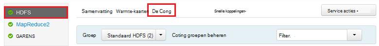
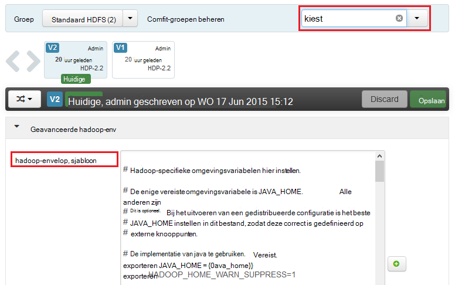
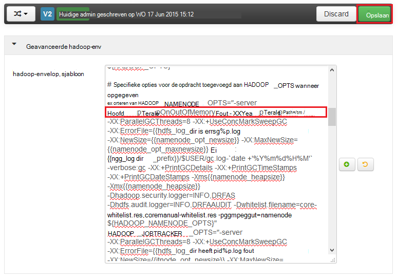
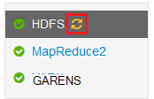
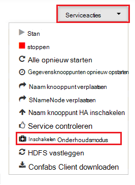
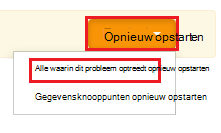

<properties
    pageTitle="Heap-dumps voor services op HDInsight Hadoop inschakelen | Microsoft Azure"
    description="Heap-dumps voor Hadoop services uit HDInsight op basis van Linux-clusters voor foutopsporing en analyse inschakelen."
    services="hdinsight"
    documentationCenter=""
    authors="Blackmist"
    manager="jhubbard"
    editor="cgronlun"
    tags="azure-portal"/>

<tags
    ms.service="hdinsight"
    ms.workload="big-data"
    ms.tgt_pltfrm="na"
    ms.devlang="na"
    ms.topic="article"
    ms.date="09/27/2016"
    ms.author="larryfr"/>

#Heap-dumps voor Hadoop services op Linux-gebaseerde HDInsight (voorbeeld) inschakelen

[AZURE.INCLUDE [heapdump-selector](../../includes/hdinsight-selector-heap-dump.md)]

Heap-dumps bevatten een momentopname van de toepassing, geheugen, met inbegrip van de waarden van variabelen op het moment dat de dump is gemaakt. Ze zijn erg handig voor het oplossen van problemen die tijdens de uitvoering optreden.

> [AZURE.NOTE] De informatie in dit artikel is alleen van toepassing op Linux-gebaseerde HDInsight. Zie voor informatie over Windows-gebaseerde HDInsight, [dumpen heap voor Hadoop services op Windows gebaseerde HDInsight inschakelen](hdinsight-hadoop-collect-debug-heap-dumps.md)

## Services

U kunt de heap dumps voor de volgende services inschakelen:

*  **hcatalog** - tempelton
*  **component** - hiveserver2, metastore, derbyserver
*  **mapreduce** - jobhistoryserver
*  **garens** - resourcemanager, nodemanager, timelineserver
*  **hdfs** - datanode, secondarynamenode, namenode

U kunt ook heap dumpen van de kaart en minder HDInsight processen uitgevoerd.

## Wat zijn heap dump configuratie

Heap dumpen door opties zijn ingeschakeld (soms bekend staat als kiest, of parameters) om de JVM wanneer een service wordt gestart. Voor de meeste services Hadoop, dit kunt u doen door het aanpassen van het shellscript gebruikt om de service te starten.

In elk script, is uitvoer voor ** \* \_OPTS**, waarin de opties die doorgegeven aan de JVM. Bijvoorbeeld in het script **hadoop-env.sh** de regel die begint met `export HADOOP_NAMENODE_OPTS=` bevat de opties voor de service NameNode.

Toewijzen en verminderen processen zijn enigszins afwijkend, wanneer deze een onderliggend proces van de MapReduce-service. Elk toewijzen of verminderen-proces wordt uitgevoerd in een onderliggende container en er zijn twee posten met de opties van de JVM voor deze. Beide opgenomen in de **mapred site.xml**:

* **mapreduce.Admin.map.child.Java.opts**
* **mapreduce.Admin.reduce.child.Java.opts**

> [AZURE.NOTE] Wij raden u aan Ambari met de scripts en de mapred-site.xml-instellingen wijzigen, zoals Ambari wijzigingen te repliceren tussen knooppunten in het cluster worden verwerkt. Zie de sectie [Met behulp van Ambari](#using-ambari) voor specifieke stappen.

###Heap-dumps inschakelen

De volgende optie kunt heap dumpen wanneer er een OutOfMemoryError optreedt:

    -XX:+HeapDumpOnOutOfMemoryError

De **+** geeft aan dat deze optie is ingeschakeld. De standaardinstelling is uitgeschakeld.

> [AZURE.WARNING] Heap dumpen zijn niet standaard ingeschakeld voor Hadoop services op HDInsight, als de bestanden kunnen vrij groot zijn. Als u ze voor het oplossen van inschakelt, moet u ze uitschakelen nadat u het probleem gereproduceerd en de dumpbestanden verzameld.

###Dump-locatie

De standaardlocatie voor het bestand is de huidige werkmap. U kunt bepalen waar het bestand is opgeslagen met de volgende optie:

    -XX:HeapDumpPath=/path

Bijvoorbeeld met behulp van `-XX:HeapDumpPath=/tmp` , zal de dumpbestanden worden opgeslagen in de map /tmp.

###Scripts

U kunt ook een script activeren wanneer een **OutOfMemoryError** plaatsvindt. Bijvoorbeeld activeren een melding zodat u weet dat de fout is opgetreden. Dit wordt bepaald met behulp van de volgende optie:

    -XX:OnOutOfMemoryError=/path/to/script

> [AZURE.NOTE] Hadoop is een gedistribueerd systeem, moet een script dat wordt gebruikt op alle knooppunten in het cluster dat de service wordt uitgevoerd op worden geplaatst.
>
> Het script moet ook worden op een locatie die toegankelijk is voor de account van de service wordt uitgevoerd en moet machtigingen voor uitvoeren. U wilt bijvoorbeeld scripts op te slaan `/usr/local/bin` en `chmod go+rx /usr/local/bin/filename.sh` verlenen lezen en machtigingen voor uitvoeren.

##Met behulp van Ambari

Om de configuratie van een service wijzigt, gebruikt u de volgende stappen uit:

1. Open het Ambari web UI voor uw cluster. De URL is https://YOURCLUSTERNAME.azurehdinsight.net.

    Wanneer dat wordt gevraagd, verifiëren bij de site met de naam van de HTTP-account (standaard: admin,) en het wachtwoord voor uw cluster.

    > [AZURE.NOTE] Mogelijk moet u een tweede keer door Ambari voor de gebruikersnaam en het wachtwoord. In dat geval alleen opnieuw invoeren dezelfde accountnaam en wachtwoord

2. Met behulp van de lijst aan de linkerkant, selecteer het servicegebied die u wilt wijzigen. Bijvoorbeeld **HDFS**. Selecteer het tabblad **configuraties** in het middengebied.

    

3. Gebruik de vermelding **Filter** **kiest**te geven. Dit zal de lijst filteren met configuratie-items om alleen die deze tekst bevatten en is een snelle manier naar de shellscript of **sjabloon** kan worden gebruikt voor het instellen van deze opties.

    

4. Zoek de ** \* \_OPTS** vermelding voor de service die u wilt dumpen heap voor inschakelen en de opties die u wilt inschakelen. Ik heb toegevoegd in de volgende afbeelding `-XX:+HeapDumpOnOutOfMemoryError -XX:HeapDumpPath=/tmp/` aan de **HADOOP\_NAMENODE\_OPTS** post:

    

    > [AZURE.NOTE] Wanneer inschakelen heap dumpen van de kaart of onderliggend proces verminderen, zoekt u in plaats daarvan de velden naam, **mapreduce.admin.map.child.java.opts** en **mapreduce.admin.reduce.child.java.opts**.

    Gebruik de knop **Opslaan** om de wijzigingen opslaan. U kan een korte notitie met een beschrijving van de wijzigingen.

5. Nadat de wijzigingen zijn toegepast, verschijnt het pictogram **opnieuw opstarten vereist** naast een of meer services.

    

6. Selecteer elke service waarvoor u opnieuw en gebruik de knop **Serviceacties** te **Schakelen in de onderhoudsmodus**. Hiermee voorkomt u dat waarschuwingen worden gegenereerd op basis van deze service wanneer u het programma opnieuw.

    

7. Nadat u de onderhoudsmodus hebt ingeschakeld, gebruikt u de knop **opnieuw starten** om de service te **Starten alle verrichte**

    

    > [AZURE.NOTE] de posten voor de knop **opnieuw opstarten** kunnen afwijken voor andere services.

8. Zodra de services opnieuw zijn gestart, gebruik de knop **Serviceacties** te **Schakelen uit in de onderhoudsmodus**. Deze Ambari controleren op waarschuwingen voor de service hervat.
