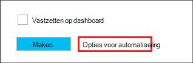

<properties
   pageTitle="Hadoop Linux gebaseerde clusters in HDInsight met behulp van bronbeheer Azure sjablonen maken | Microsoft Azure"
    description="Informatie over het maken van clusters voor Azure HDInsight met behulp van sjablonen Azure Azure Resource Manager."
   services="hdinsight"
   documentationCenter=""
   tags="azure-portal"
   authors="mumian"
   manager="jhubbard"
   editor="cgronlun"/>

<tags
   ms.service="hdinsight"
   ms.devlang="na"
   ms.topic="article"
   ms.tgt_pltfrm="na"
   ms.workload="big-data"
   ms.date="09/02/2016"
   ms.author="jgao"/>

# Hadoop Linux gebaseerde clusters in HDInsight met behulp van bronbeheer Azure sjablonen maken

[AZURE.INCLUDE [selector](../../includes/hdinsight-selector-create-clusters.md)]

Informatie over het HDInsight clusters met Azure Resource Manager(ARM) sjablonen maken. Zie [een toepassing met Azure Resource Manager sjabloon distribueren](../resource-group-template-deploy.md)voor meer informatie. Maken van het cluster andere hulpprogramma's en functies klikt u op het tabblad selecteren boven aan deze pagina of voor [methoden voor het Cluster maken](hdinsight-provision-clusters.md#cluster-creation-methods).

##Voorwaarden:

[AZURE.INCLUDE [delete-cluster-warning](../../includes/hdinsight-delete-cluster-warning.md)]

Voordat u de instructies in dit artikel, hebt u het volgende:

- [Azure-abonnement](https://azure.microsoft.com/documentation/videos/get-azure-free-trial-for-testing-hadoop-in-hdinsight/).
- Azure PowerShell en/of Azure CLI

    [AZURE.INCLUDE [use-latest-version](../../includes/hdinsight-use-latest-powershell-and-cli.md)]

### Access controle-eisen

[AZURE.INCLUDE [access-control](../../includes/hdinsight-access-control-requirements.md)]

## Sjablonen voor bronbeheer

Resource Manager sjabloon gemakkelijk voor het maken van clusters van HDInsight, hun afhankelijke bronnen (zoals de standaard opslag-account) en andere bronnen (zoals Azure SQL-Database te gebruiken van Apache Sqoop) voor de toepassing in een enkele, gecoördineerde werking. In de sjabloon voor de resources die nodig zijn voor de toepassing definiëren en implementatie-parameters voor het invoeren van waarden voor verschillende omgevingen opgeven. De sjabloon bestaat uit JSON en expressies waarmee u waarden voor de implementatie samenstellen.

Een sjabloon Resource Manager voor het maken van een cluster van HDInsight en de afhankelijke Azure opslag account vindt u in [Bijlage A](#appx-a-arm-template). Cross-platform [VSCode](https://code.visualstudio.com/#alt-downloads) met de [extensie Resource Manager](https://marketplace.visualstudio.com/items?itemName=msazurermtools.azurerm-vscode-tools) of een teksteditor gebruiken de sjabloon opgeslagen in een bestand op uw werkstation. U leert hoe u de sjabloon gebruikt verschillende methoden aanroepen.

Zie voor meer informatie over de sjabloon Resource Manager

- [Auteur Azure Resource Manager-sjablonen](../resource-group-authoring-templates.md)
- [Een toepassing met de sjabloon Azure Resource Manager](../resource-group-template-deploy.md)

Als u wilt weten voor bepaalde elementen de JSON-schema, kunt u de volgende procedure volgen:

1. [Azure portal](https://porta.azure.com) voor het maken van een cluster HDInsight opent.  Zie [maken Linux gebaseerde clusters in HDInsight met de Azure portal](hdinsight-hadoop-create-linux-clusters-portal.md).
2. De vereiste elementen en elementen die u nodig hebt de JSON-schema configureren.
3. Voordat u op **maken**klikt, klikt u op **Opties voor automatisering** zoals in de volgende schermafdruk:

    

    De portal maakt een Resource Manager-sjabloon op basis van uw configuraties.
## Met PowerShell implementeren

De volgende procedure maakt HDInsight op basis van Linux-cluster.

**Implementatie van een cluster met behulp van bronbeheer sjabloon**

1. Sla het bestand json in [bijlage A](#appx-a-arm-template) bij uw werkstation. In het PowerShell-script is de naam van het bestand *C:\HDITutorials-ARM\hdinsight-arm-template.json*.
2. De parameters en variabelen instellen als nodig is.
3. De sjabloon met behulp van de volgende PowerShell script uitvoeren:

        ####################################
        # Set these variables
        ####################################
        #region - used for creating Azure service names
        $nameToken = "<Enter an Alias>" 
        $templateFile = "C:\HDITutorials-ARM\hdinsight-arm-template.json"
        #endregion

        ####################################
        # Service names and varialbes
        ####################################
        #region - service names
        $namePrefix = $nameToken.ToLower() + (Get-Date -Format "MMdd")

        $resourceGroupName = $namePrefix + "rg"
        $hdinsightClusterName = $namePrefix + "hdi"
        $defaultStorageAccountName = $namePrefix + "store"
        $defaultBlobContainerName = $hdinsightClusterName

        $location = "East US 2"

        $armDeploymentName = $namePrefix
        #endregion

        ####################################
        # Connect to Azure
        ####################################
        #region - Connect to Azure subscription
        Write-Host "`nConnecting to your Azure subscription ..." -ForegroundColor Green
        try{Get-AzureRmContext}
        catch{Login-AzureRmAccount}
        #endregion

        # Create a resource group
        New-AzureRmResourceGroup -Name $resourceGroupName -Location $Location

        # Create cluster and the dependent storage accounge
        $parameters = @{clusterName="$hdinsightClusterName"}

        New-AzureRmResourceGroupDeployment `
            -Name $armDeploymentName `
            -ResourceGroupName $resourceGroupName `
            -TemplateFile $templateFile `
            -TemplateParameterObject $parameters

        # List cluster
        Get-AzureRmHDInsightCluster -ResourceGroupName $resourceGroupName -ClusterName $hdinsightClusterName 

    De PowerShell-script wordt alleen de naam van het cluster configureert. De naam van de opslag is hardcoded in de sjabloon. U wordt gevraagd om het wachtwoord voor de cluster gebruiker (de standaardgebruikersnaam is *admin*); en de SSH wachtwoord (de standaard SSH-gebruikersnaam is *sshuser*).  
    
Zie [met PowerShell distribueren](../resource-group-template-deploy.md#deploy-with-powershell)voor meer informatie.

## Implementatie van CLI Azure

In het volgende voorbeeld wordt een cluster en de account voor opslag afhankelijk en container gemaakt door het aanroepen van een Resource Manager-sjabloon:

    azure login
    azure config mode arm
    azure group create -n hdi1229rg -l "East US"
    azure group deployment create --resource-group "hdi1229rg" --name "hdi1229" --template-file "C:\HDITutorials-ARM\hdinsight-arm-template.json"
    
U wordt gevraagd de naam van het cluster, cluster gebruikerswachtwoord (de standaardgebruikersnaam is *admin*) en het SSH wachtwoord (de standaard SSH-gebruikersnaam is *sshuser*) in te voeren. In de regel parameters opgeven:

    azure group deployment create --resource-group "hdi1229rg" --name "hdi1229" --template-file "c:\Tutorials\HDInsightARM\create-linux-based-hadoop-cluster-in-hdinsight.json" --parameters '{\"clusterName\":{\"value\":\"hdi1229\"},\"clusterLoginPassword\":{\"value\":\"Pass@word1\"},\"sshPassword\":{\"value\":\"Pass@word1\"}}'

## Met REST API implementeren

Zie [implementeren met de REST API](../resource-group-template-deploy.md#deploy-with-the-rest-api).

## Implementeren met Visual Studio

Met Visual Studio kunt u een groep resourceproject maken en deze implementeren in Azure via de gebruikersinterface. Selecteert u het type van de resources in uw project wilt opnemen en deze resources automatisch worden toegevoegd aan de sjabloon Resource Manager. Het project biedt tevens een PowerShell script voor de implementatie van de sjabloon.

Zie voor een inleiding tot het gebruik van Visual Studio met resourcegroepen, [maken en implementeren van Azure resourcegroepen via Visual Studio](../vs-azure-tools-resource-groups-deployment-projects-create-deploy.md).

##Volgende stappen
In dit artikel, kunt u op verschillende manieren voor het maken van een HDInsight-cluster hebt geleerd. Voor meer informatie, Zie de volgende artikelen:

- Zie [bronnen implementeren met behulp van .NET bibliotheken en een sjabloon](../virtual-machines/virtual-machines-windows-csharp-template.md)voor een voorbeeld van de implementatie van bronnen via de .NET client library.
- Zie voor een uitgebreidere voorbeeld van de implementatie van een toepassing [bepaling en microservices voorspelbaar in Azure geïmplementeerd](../app-service-web/app-service-deploy-complex-application-predictably.md).
- Zie [ontwikkel- en testomgevingen in Microsoft Azure](../solution-dev-test-environments.md)voor instructies over het implementeren van uw oplossing in verschillende omgevingen.
- Meer informatie over de gedeelten van de sjabloon Azure Resource Manager, Zie [sjablonen ontwerpen](../resource-group-authoring-templates.md).
- Zie [functies van de sjabloon](../resource-group-template-functions.md)voor een lijst van de functies die u in een sjabloon Azure Resource Manager gebruiken kunt.

##Sjabloon toepassingX A: Resource Manager

De volgende Azure bronnenbeheerder doorgegeven sjabloon maakt u een Linux-gebaseerde Hadoop cluster met de afhankelijke Azure opslag account. 

> [AZURE.NOTE] Het monster bevat configuratie-informatie voor de component metastore en Oozie metastore.  De sectie te verwijderen of de sectie configureren voordat u de sjabloon gebruikt.

    {
    "$schema": "https://schema.management.azure.com/schemas/2015-01-01/deploymentTemplate.json#",
    "contentVersion": "1.0.0.0",
    "parameters": {
        "clusterName": {
        "type": "string",
        "metadata": {
            "description": "The name of the HDInsight cluster to create."
        }
        },
        "clusterLoginUserName": {
        "type": "string",
        "defaultValue": "admin",
        "metadata": {
            "description": "These credentials can be used to submit jobs to the cluster and to log into cluster dashboards."
        }
        },
        "clusterLoginPassword": {
        "type": "securestring",
        "metadata": {
            "description": "The password must be at least 10 characters in length and must contain at least one digit, one non-alphanumeric character, and one upper or lower case letter."
        }
        },
        "sshUserName": {
        "type": "string",
        "defaultValue": "sshuser",
        "metadata": {
            "description": "These credentials can be used to remotely access the cluster."
        }
        },
        "sshPassword": {
        "type": "securestring",
        "metadata": {
            "description": "The password must be at least 10 characters in length and must contain at least one digit, one non-alphanumeric character, and one upper or lower case letter."
        }
        },
        "location": {
        "type": "string",
        "defaultValue": "East US",
        "allowedValues": [
            "East US",
            "East US 2",
            "North Central US",
            "South Central US",
            "West US",
            "North Europe",
            "West Europe",
            "East Asia",
            "Southeast Asia",
            "Japan East",
            "Japan West",
            "Australia East",
            "Australia Southeast"
        ],
        "metadata": {
            "description": "The location where all azure resources will be deployed."
        }
        },
        "clusterType": {
        "type": "string",
        "defaultValue": "hadoop",
        "allowedValues": [
            "hadoop",
            "hbase",
            "storm",
            "spark"
        ],
        "metadata": {
            "description": "The type of the HDInsight cluster to create."
        }
        },
        "clusterWorkerNodeCount": {
        "type": "int",
        "defaultValue": 2,
        "metadata": {
            "description": "The number of nodes in the HDInsight cluster."
        }
        }
    },
    "variables": {
        "defaultApiVersion": "2015-05-01-preview",
        "clusterApiVersion": "2015-03-01-preview",
        "clusterStorageAccountName": "[concat(parameters('clusterName'),'store')]"
    },
    "resources": [
        {
        "name": "[variables('clusterStorageAccountName')]",
        "type": "Microsoft.Storage/storageAccounts",
        "location": "[parameters('location')]",
        "apiVersion": "[variables('defaultApiVersion')]",
        "dependsOn": [ ],
        "tags": { },
        "properties": {
            "accountType": "Standard_LRS"
        }
        },
        {
        "name": "[parameters('clusterName')]",
        "type": "Microsoft.HDInsight/clusters",
        "location": "[parameters('location')]",
        "apiVersion": "[variables('clusterApiVersion')]",
        "dependsOn": [ "[concat('Microsoft.Storage/storageAccounts/',variables('clusterStorageAccountName'))]" ],
        "tags": {

        },
        "properties": {
            "clusterVersion": "3.4",
            "osType": "Linux",
            "tier": "standard",
            "clusterDefinition": {
            "kind": "[parameters('clusterType')]",
            "configurations": {
                "gateway": {
                "restAuthCredential.isEnabled": true,
                "restAuthCredential.username": "[parameters('clusterLoginUserName')]",
                "restAuthCredential.password": "[parameters('clusterLoginPassword')]"
                },
                "hive-site": {
                    "javax.jdo.option.ConnectionDriverName": "com.microsoft.sqlserver.jdbc.SQLServerDriver",
                    "javax.jdo.option.ConnectionURL": "jdbc:sqlserver://myadla0901dbserver.database.windows.net;database=myhive20160901;encrypt=true;trustServerCertificate=true;create=false;loginTimeout=300",
                    "javax.jdo.option.ConnectionUserName": "johndole",
                    "javax.jdo.option.ConnectionPassword": "myPassword$"
                },
                "hive-env": {
                    "hive_database": "Existing MSSQL Server database with SQL authentication",
                    "hive_database_name": "myhive20160901",
                    "hive_database_type": "mssql",
                    "hive_existing_mssql_server_database": "myhive20160901",
                    "hive_existing_mssql_server_host": "myadla0901dbserver.database.windows.net",
                    "hive_hostname": "myadla0901dbserver.database.windows.net"
                },
                "oozie-site": {
                    "oozie.service.JPAService.jdbc.driver": "com.microsoft.sqlserver.jdbc.SQLServerDriver",
                    "oozie.service.JPAService.jdbc.url": "jdbc:sqlserver://myadla0901dbserver.database.windows.net;database=myhive20160901;encrypt=true;trustServerCertificate=true;create=false;loginTimeout=300",
                    "oozie.service.JPAService.jdbc.username": "johndole",
                    "oozie.service.JPAService.jdbc.password": "myPassword$",
                    "oozie.db.schema.name": "oozie"
                },
                "oozie-env": {
                    "oozie_database": "Existing MSSQL Server database with SQL authentication",
                    "oozie_database_name": "myhive20160901",
                    "oozie_database_type": "mssql",
                    "oozie_existing_mssql_server_database": "myhive20160901",
                    "oozie_existing_mssql_server_host": "myadla0901dbserver.database.windows.net",
                    "oozie_hostname": "myadla0901dbserver.database.windows.net"
                }            
            }
            },
            "storageProfile": {
            "storageaccounts": [
                {
                "name": "[concat(variables('clusterStorageAccountName'),'.blob.core.windows.net')]",
                "isDefault": true,
                "container": "[parameters('clusterName')]",
                "key": "[listKeys(resourceId('Microsoft.Storage/storageAccounts', variables('clusterStorageAccountName')), variables('defaultApiVersion')).key1]"
                }
            ]
            },
            "computeProfile": {
            "roles": [
                {
                "name": "headnode",
                "targetInstanceCount": "2",
                "hardwareProfile": {
                    "vmSize": "Standard_D3"
                },
                "osProfile": {
                    "linuxOperatingSystemProfile": {
                    "username": "[parameters('sshUserName')]",
                    "password": "[parameters('sshPassword')]"
                    }
                }
                },
                {
                "name": "workernode",
                "targetInstanceCount": "[parameters('clusterWorkerNodeCount')]",
                "hardwareProfile": {
                    "vmSize": "Standard_D3"
                },
                "osProfile": {
                    "linuxOperatingSystemProfile": {
                    "username": "[parameters('sshUserName')]",
                    "password": "[parameters('sshPassword')]"
                    }
                }
                }
            ]
            }
        }
        }
    ],
    "outputs": {
        "cluster": {
        "type": "object",
        "value": "[reference(resourceId('Microsoft.HDInsight/clusters',parameters('clusterName')))]"
        }
    }
    }
