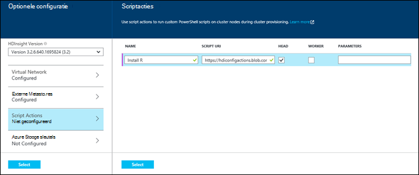
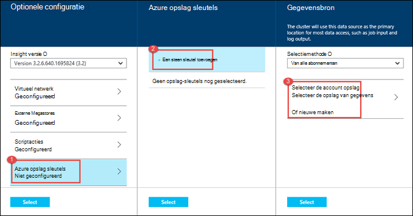

<properties
   pageTitle="Hadoop clusters maken in HDInsight | Microsoft Azure"
    description="Informatie over het maken van clusters voor Azure HDInsight via de Portal Azure."
   services="hdinsight"
   documentationCenter=""
   tags="azure-portal"
   authors="mumian"
   manager="jhubbard"
   editor="cgronlun"/>

<tags
   ms.service="hdinsight"
   ms.devlang="na"
   ms.topic="article"
   ms.tgt_pltfrm="na"
   ms.workload="big-data"
   ms.date="09/02/2016"
   ms.author="jgao"/>

# Hadoop Windows-gebaseerde clusters maken in met behulp van de Portal Azure HDInsight

[AZURE.INCLUDE [selector](../../includes/hdinsight-selector-create-clusters.md)]

Informatie over het maken van een cluster Hadoop in HDInsight met Azure Portal. De Microsoft [Azure portal](../azure-portal-overview.md) is een centrale plaats waar u inrichten en beheren van uw resources Azure. Azure Portal is een van de hulpprogramma's die kunt u Linux- of Windows Hadoop-cluster maken in de HDInsight. Maken van het cluster andere hulpprogramma's en functies klikt u op het tabblad selecteren boven aan deze pagina of voor [methoden voor het Cluster maken](hdinsight-provision-clusters.md#cluster-creation-methods).

##Voorwaarden:

[AZURE.INCLUDE [delete-cluster-warning](../../includes/hdinsight-delete-cluster-warning.md)]

Voordat u de instructies in dit artikel, hebt u het volgende:

- Een abonnement op Azure. Zie [Azure krijg gratis proefperiode](https://azure.microsoft.com/documentation/videos/get-azure-free-trial-for-testing-hadoop-in-hdinsight/).

### Access controle-eisen

[AZURE.INCLUDE [access-control](../../includes/hdinsight-access-control-requirements.md)]

## Clusters maken

**Voor het maken van een cluster van HDInsight**

1. Aanmelden bij de [Azure Portal](https://portal.azure.com).
2. Klik op **Nieuw**, klik op **Analytics gegevens**en klik op **HDInsight**.

    ![Een nieuw cluster in Azure Portal maken] (./media/hdinsight-provision-clusters/HDI.CreateCluster.1.png "Een nieuw cluster in Azure Portal maken")

3. Typ of Selecteer de volgende waarden:

    * **Naam van het cluster**: Voer een naam voor het cluster. Een groen vinkje verschijnt naast de naam van het cluster als de naam beschikbaar is.

    * **Clustertype**: **Hadoop**selecteren. Andere opties inclue **HBase**, **Storm**en **Spark**.

        > [AZURE.IMPORTANT] HDInsight clusters komen in verschillende typen die met de technologie die het cluster is afgestemd corresponderen voor werkbelasting. Er is geen ondersteunde methode voor het maken van een cluster dat een combinatie van meerdere typen, zoals Storm en HBase op één cluster.

    * **Cluster-besturingssysteem**: **Windows**selecteert. Een Linux-basis als cluster wilt maken, selecteert u **Linux**.
    * **Versie**: [HDInsight](hdinsight-component-versioning.md)-versies.
    * **Abonnement**: Selecteer de Azure abonnement die wordt gebruikt voor het maken van dit cluster.
    * **Resourcegroep**: Selecteer een bestaande of een nieuwe resourcegroep te maken. Deze vermelding wordt standaard een van de bestaande resourcegroepen, als deze beschikbaar zijn.
    * **Referenties**: de gebruikersnaam en het wachtwoord voor de gebruiker Hadoop (http-gebruiker) configureren. Als u extern bureaublad voor het cluster inschakelt, moet u de extern bureaublad-gebruikersnaam en wachtwoord en de verloopdatum van een account te configureren. Klik op **selecteren** onder de wijzigingen op te slaan.

        ![Cluster referenties] (./media/hdinsight-provision-clusters/HDI.CreateCluster.3.png "Cluster referenties")

    * **Gegevensbron**: een nieuwe maken of Selecteer een bestaande account Azure opslag moet worden gebruikt als het standaardbestandssysteem voor het cluster.

        ![Gegevensbron blade] (./media/hdinsight-provision-clusters/HDI.CreateCluster.4.png "Configuratie van de gegevensbron opgeven")

        * **Selectie-methode**: deze worden ingesteld **van alle abonnementen** bladeren van rekeningen van de opslag van uw abonnementen inschakelen. Als u wilt opgeven voor de **Opslag** en de **Toegangstoets** van een bestaande account voor opslag, moet u deze instellen op de **Toegangstoets** .
        * **Opslag account selecteren / Create nieuwe**: klik op **opslag account selecteren** om te bladeren en selecteer een bestaande opslag-account die u wilt koppelen aan het cluster. Of klik op **Nieuw** om een nieuwe opslag-account te maken. Gebruik het veld om het invoeren van de naam van de account van de opslag. Een groen vinkje wordt weergegeven als de naam beschikbaar is.
        * **Kies standaardcontainer**: Gebruik deze optie voert u de naam van de standaardcontainer te gebruiken voor het cluster. Terwijl u hier een naam invoert, wordt aangeraden met dezelfde naam als het cluster, zodat u gemakkelijk herkennen kunt dat de container wordt gebruikt voor deze specifieke clusterhost.
        * **Locatie**: de geografische regio die de account voor de opslag, of wordt gemaakt in. Deze locatie bepaalt de locatie van het cluster.  De standaardaccount voor de opslag en het cluster moeten samen in dezelfde Azure Datacenter vinden.
    
    * **Knooppunt prijzen lagen**: Stel het aantal knooppunten werknemer die u nodig hebt voor het cluster. De geschatte kosten van het cluster wordt weergegeven in het blad.
  

        ![Knooppunt prijzen lagen blade] (./media/hdinsight-provision-clusters/HDI.CreateCluster.5.png "Geef het aantal knooppunten in het servercluster")

    * **Optionele configuratie** , selecteert u de versie van het cluster, evenals andere optionele instellingen configureren zoals lid worden van een **Virtueel netwerk**, een **Externe Metastore** instellen voor het opslaan van gegevens voor component- en Oozie, scriptacties gebruiken voor het aanpassen van een cluster als u wilt aangepaste onderdelen installeren of extra opslagruimte accounts gebruiken voor het cluster.

    * **HDInsight versie**: Selecteer de versie die u wilt gebruiken voor het cluster. Zie voor meer informatie [HDInsight cluster versies](hdinsight-component-versioning.md).
    * **Virtueel netwerk**: Selecteer een Azure virtual network en het subnet als plaats voor het cluster in een virtueel netwerk.  

        ![Virtueel netwerk blade] (./media/hdinsight-provision-clusters/HDI.CreateCluster.6.png "Geef virtuele netwerkdetails")

        Zie voor meer informatie over het gebruik van HDInsight met een virtueel netwerk, met inbegrip van specifieke configuratievereisten voor het virtuele netwerk [capbilities HDInsight uitbreiden met behulp van een virtueel netwerk Azure](hdinsight-extend-hadoop-virtual-network.md).
  

        
    * **Externe Metastores**: Azure SQL-database voor het opslaan van metagegevens voor component en Oozie die is gekoppeld aan het cluster opgeven.
 
        > [AZURE.NOTE] Metastore configuratie is niet beschikbaar voor HBase clustertypen.

    ![Aangepaste metastores blade] (./media/hdinsight-provision-clusters/HDI.CreateCluster.7.png "Externe metastores opgeven")

    Voor metagegevens van **een bestaande SQL DB voor component gebruiken** , klikt u op **Ja**en selecteert u een SQL-database geeft u de gebruikersnaam en het wachtwoord voor de database. Herhaal deze stappen als u **Gebruik een bestaande SQL DB voor metagegevens van Oozie**. Klik op **selecteren** totdat u terug in de **Optionele configuratie** blade bent.

    >[AZURE.NOTE] De Azure SQL-database die wordt gebruikt voor de metastore moet toestaan verbinding met andere Azure diensten, met inbegrip van Azure HDInsight. Klik op de naam van de server op het dashboard Azure SQL-database, aan de rechterkant. Dit is de server waarop een exemplaar van de SQL-database wordt uitgevoerd. Zodra u op de serverweergave, klikt u op **configureren**en vervolgens **Azure Services**, klikt u op **Ja**en klik op **Opslaan**.

            &nbsp;

            > [AZURE.IMPORTANT] Bij het maken van een metastore, gebruik niet de naam van een database met streepjes of afbreekstreepjes, omdat dit leiden het ontwikkelingsproces van een cluster tot kan worden uitgevoerd.
        
        * **Script Actions** if you want to use a custom script to customize a cluster, as the cluster is being created. For more information about script actions, see [Customize HDInsight clusters using Script Action](hdinsight-hadoop-customize-cluster.md). On the Script Actions blade provide the details as shown in the screen capture.
    

            

        * **Azure Storage Keys**: Specify additional storage accounts to associate with the cluster. In the **Azure Storage Keys** blade, click **Add a storage key**, and then select an existing storage account or create a new account.
    

            

4. Klik op **maken**. **Pin om Startboard te** selecteren, wordt een tegel voor cluster toevoegen aan de Startboard van uw Portal. Het pictogram geeft aan dat het cluster wordt gemaakt en het pictogram HDInsight verandert als maken is voltooid.
    
    Het duurt enige tijd voor het cluster moet worden gemaakt, meestal ongeveer 15 minuten. De tegel op de Startboard of de vermelding van de **kennisgevingen** aan de linkerkant van de pagina gebruiken om te controleren op het inrichtingsproces.
    

5. Zodra het maken is voltooid, klikt u op de tegel voor het cluster uit de Startboard voor het starten van de cluster-blade. De cluster-bladeserver biedt essentiële informatie over de cluster, zoals de naam, de groep waartoe het behoort, de locatie, het besturingssysteem, de URL voor het cluster dashboard, enz.

    ![Cluster-blade] (./media/hdinsight-provision-clusters/HDI.Cluster.Blade.png "Eigenschappen van cluster")

    Gebruik de volgende te begrijpen van de pictogrammen aan de bovenkant van deze blade, en in de sectie **Essentials** :

    * **Instellingen** en **Alle instellingen**: het blad van de **Instellingen** voor het cluster waarmee u toegang tot de gedetailleerde configuratiegegevens van het cluster weergegeven.
    * **Dashboard** **Dashboard Cluster**en **URL**: dit zijn alle manieren om toegang te krijgen tot het cluster-dashboard is een webportaal uit te voeren taken op het cluster.
    * **Extern bureaublad**: kunt u met extern bureaublad in-/ uitschakelen op de clusterknooppunten.
    * **Cluster schaal**: Hiermee kunt u het aantal knooppunten van de werknemer voor dit cluster wijzigen.
    * **Verwijderen**: Hiermee verwijdert u het cluster HDInsight.
    * **QuickStart** (): hierin wordt informatie weergegeven die u aan de slag met HDInsight.
    * **Gebruikers** (): Hiermee kunt u machtigingen instellen voor _beheer van portal_ van dit cluster voor andere gebruikers op uw abonnement Azure.
    

        > [AZURE.IMPORTANT] Dit _alleen_ van invloed op toegang en machtigingen voor dit cluster in de Portal en heeft geen invloed op wie kan verbinding maken met of taken aan het cluster HDInsight.
        
    * **Tags** (): Tags kunt u instellen van sleutel/waarde-paren voor het definiëren van een aangepaste taxonomie van de cloud-services. U kan bijvoorbeeld een sleutel met de naam __project__maken en een gemeenschappelijke waarde vervolgens gebruiken voor alle services die zijn gekoppeld aan een specifiek project.

##Aanpassen van clusters

- Zie [clusters van HDInsight aanpassen met behulp van de Bootstrap](hdinsight-hadoop-customize-cluster-bootstrap.md).
- Zie [Windows aanpassen op basis van HDInsight clusters met actie Script](hdinsight-hadoop-customize-cluster.md).

##Volgende stappen
In dit artikel, kunt u op verschillende manieren voor het maken van een HDInsight-cluster hebt geleerd. Voor meer informatie, Zie de volgende artikelen:

* [Aan de slag met Azure-HDInsight](hdinsight-hadoop-linux-tutorial-get-started.md) - informatie over het werken met het cluster HDInsight starten
* [Hadoop indienen projecten via programmacode](hdinsight-submit-hadoop-jobs-programmatically.md) - informatie over het programmatisch taken kunnen verzenden naar HDInsight
* [Hadoop clusters in het HDInsight beheren via de Portal Azure](hdinsight-administer-use-management-portal.md)

