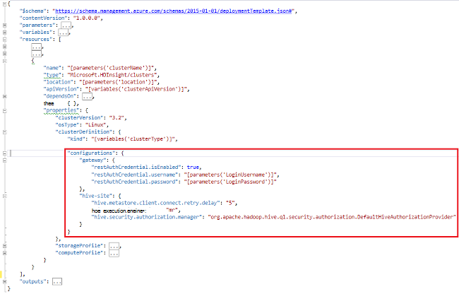

<properties
    pageTitle="HDInsight Clusters met bootstrap aanpassen | Microsoft Azure"
    description="Informatie over het aanpassen van HDInsight clusters met behulp van de bootstrap."
    services="hdinsight"
    documentationCenter=""
    authors="mumian"
    manager="jhubbard"
    editor="cgronlun"
    tags="azure-portal"/>

<tags
    ms.service="hdinsight"
    ms.workload="big-data"
    ms.tgt_pltfrm="na"
    ms.devlang="na"
    ms.topic="article"
    ms.date="09/02/2016"
    ms.author="jgao"/>

# HDInsight clusters met Bootstrap aanpassen

Soms wilt u de configuratiebestanden waaronder configureren:

- clusterIdentity.xml
- Core-site.xml
- gateway.XML
- hbase env.xml
- hbase site.xml
- hdfs site.xml
- component env.xml
- component site.xml
- mapred-site
- oozie site.xml
- oozie env.xml
- storm-site.xml
- tez site.xml
- webhcat site.xml
- garens van site.xml

De clusters kunnen niet de wijzigingen als gevolg van opnieuw imaging behouden. Zie [Rol exemplaar opnieuw is opgestart vanwege Upgrades voor het besturingssysteem](http://blogs.msdn.com/b/kwill/archive/2012/09/19/role-instance-restarts-due-to-os-upgrades.aspx)voor meer informatie over imaging opnieuw. Om te zorgen dat de wijzigingen via de clusters levensduur, kunt u HDInsight cluster aanpassen tijdens het maken. Dit is de aanbevolen manier persistent is voor deze gebeurtenissen Azure reimage opnieuw opgestart en configuraties van een cluster wijzigen. Deze wijzigingen in de configuratie worden toegepast voor het begin van de service, zodat needn't services opnieuw worden gestart. 

Er zijn 3 methoden bootstrap gebruiken:

- Azure PowerShell gebruiken

    [AZURE.INCLUDE [upgrade-powershell](../../includes/hdinsight-use-latest-powershell.md)]
    
- De SDK voor .NET gebruiken
- Azure Resource Manager-sjabloon gebruiken

Zie voor informatie over het installeren van aanvullende onderdelen op de cluster HDInsight tijdens het maken van:

- [HDInsight clusters met actie Script (Linux) aanpassen](hdinsight-hadoop-customize-cluster-linux.md)
- [Aanpassen HDInsight clusters met actie Script (Windows)](hdinsight-hadoop-customize-cluster.md)

## Azure PowerShell gebruiken

De volgende PowerShell code past de configuratie van een component:

    # hive-site.xml configuration
    $hiveConfigValues = @{ "hive.metastore.client.socket.timeout"="90" }
    
    $config = New-AzureRmHDInsightClusterConfig `
        | Set-AzureRmHDInsightDefaultStorage `
            -StorageAccountName "$defaultStorageAccountName.blob.core.windows.net" `
            -StorageAccountKey $defaultStorageAccountKey `
        | Add-AzureRmHDInsightConfigValues `
            -HiveSite $hiveConfigValues 
    
    New-AzureRmHDInsightCluster `
        -ResourceGroupName $existingResourceGroupName `
        -ClusterName $clusterName `
        -Location $location `
        -ClusterSizeInNodes $clusterSizeInNodes `
        -ClusterType Hadoop `
        -OSType Windows `
        -Version "3.2" `
        -HttpCredential $httpCredential `
        -Config $config 

Een volledig werkende PowerShell-script kunt u vinden in [Bijlage A](#hdinsight-hadoop-customize-cluster-bootstrap.md/appx-a:-powershell-sample).

**Om te controleren of de wijziging:**

1. Aanmelden op de [portal Azure](https://portal.azure.com).
2. Klik op **Bladeren**in het linkerdeelvenster en klik op **HDInsight-Clusters**.
3. Klik op het cluster dat u hebt gemaakt met behulp van het PowerShell-script.
4. Klik op **Dashboard** vanaf de bovenkant van het blad de UI Ambari openen.
5. Klik in het linkermenu op **component** .
6. Klik op de **HiveServer2** van de **Samenvatting**.
7. Klik op het tabblad **configuraties** .
8. Klik in het linkermenu op **component** .
9. Klik op het tabblad **Geavanceerd** .
10. Schuif naar beneden en vouw vervolgens **Geavanceerde component-site**.
11. Zoek naar **hive.metastore.client.socket.timeout** in de sectie.

Meer voorbeelden over het aanpassen van andere configuratiebestanden:

    # hdfs-site.xml configuration
    $HdfsConfigValues = @{ "dfs.blocksize"="64m" } #default is 128MB in HDI 3.0 and 256MB in HDI 2.1

    # core-site.xml configuration
    $CoreConfigValues = @{ "ipc.client.connect.max.retries"="60" } #default 50

    # mapred-site.xml configuration
    $MapRedConfigValues = @{ "mapreduce.task.timeout"="1200000" } #default 600000

    # oozie-site.xml configuration
    $OozieConfigValues = @{ "oozie.service.coord.normal.default.timeout"="150" }  # default 120

Zie Azim Uddin de blog met de titel [aanpassen HDInsight Cluster maken](http://blogs.msdn.com/b/bigdatasupport/archive/2014/04/15/customizing-hdinsight-cluster-provisioning-via-powershell-and-net-sdk.aspx)voor meer informatie.

## De SDK voor .NET gebruiken

Zie [maken van Linux gebaseerde clusters in HDInsight met de SDK voor .NET](hdinsight-hadoop-create-linux-clusters-dotnet-sdk.md#use-bootstrap).

## Sjabloon voor bronbeheer gebruiken

U kunt de bootstrap in Bronbeheer sjabloon:

    "configurations": {
        …
        "hive-site": {
            "hive.metastore.client.connect.retry.delay": "5",
            "hive.execution.engine": "mr",
            "hive.security.authorization.manager": "org.apache.hadoop.hive.ql.security.authorization.DefaultHiveAuthorizationProvider"
        }
    }

## Zie ook

- [Hadoop clusters maken in HDInsight] [ hdinsight-provision-cluster] vindt u instructies voor het maken van een HDInsight-cluster met behulp van andere aangepaste opties.
- [De actie Script scripts ontwikkelen voor HDInsight][hdinsight-write-script]
- [Installeren en gebruiken van motoren op HDInsight clusters][hdinsight-install-spark]
- [Installeren en gebruiken van R op clusters HDInsight][hdinsight-install-r]
- [Installeren en gebruiken Solr op HDInsight-clusters](hdinsight-hadoop-solr-install.md).
- [Installatie en gebruik Giraph op HDInsight-clusters](hdinsight-hadoop-giraph-install.md).

[hdinsight-install-spark]: hdinsight-hadoop-spark-install.md
[hdinsight-install-r]: hdinsight-hadoop-r-scripts.md
[hdinsight-write-script]: hdinsight-hadoop-script-actions.md
[hdinsight-provision-cluster]: hdinsight-provision-clusters.md
[powershell-install-configure]: powershell-install-configure.md

[img-hdi-cluster-states]: ./media/hdinsight-hadoop-customize-cluster/HDI-Cluster-state.png "De fasen tijdens het maken van het cluster"

## PowerShell toepassingX A: monster

Deze PowerShell-script maakt een cluster van HDInsight en de instelling van een component aanpassen:

    ####################################
    # Set these variables
    ####################################
    #region - used for creating Azure service names
    $nameToken = "<ENTER AN ALIAS>" 
    #endregion

    #region - cluster user accounts
    $httpUserName = "admin"  #HDInsight cluster username
    $httpPassword = "<ENTER A PASSWORD>" #"<Enter a Password>"

    $sshUserName = "sshuser" #HDInsight ssh user name
    $sshPassword = "<ENTER A PASSWORD>" #"<Enter a Password>"
    #endregion

    ####################################
    # Service names and varialbes
    ####################################
    #region - service names
    $namePrefix = $nameToken.ToLower() + (Get-Date -Format "MMdd")

    $resourceGroupName = $namePrefix + "rg"
    $hdinsightClusterName = $namePrefix + "hdi"
    $defaultStorageAccountName = $namePrefix + "store"
    $defaultBlobContainerName = $hdinsightClusterName

    $location = "East US 2"
    #endregion

    # Treat all errors as terminating
    $ErrorActionPreference = "Stop"

    ####################################
    # Connect to Azure
    ####################################
    #region - Connect to Azure subscription
    Write-Host "`nConnecting to your Azure subscription ..." -ForegroundColor Green
    try{Get-AzureRmContext}
    catch{Login-AzureRmAccount}
    #endregion

    #region - Create an HDInsight cluster
    ####################################
    # Create dependent components
    ####################################
    Write-Host "Creating a resource group ..." -ForegroundColor Green
    New-AzureRmResourceGroup `
        -Name  $resourceGroupName `
        -Location $location

    Write-Host "Creating the default storage account and default blob container ..."  -ForegroundColor Green
    New-AzureRmStorageAccount `
        -ResourceGroupName $resourceGroupName `
        -Name $defaultStorageAccountName `
        -Location $location `
        -Type Standard_GRS

    $defaultStorageAccountKey = (Get-AzureRmStorageAccountKey `
                                    -ResourceGroupName $resourceGroupName `
                                    -Name $defaultStorageAccountName)[0].Value
    $defaultStorageContext = New-AzureStorageContext `
                                    -StorageAccountName $defaultStorageAccountName `
                                    -StorageAccountKey $defaultStorageAccountKey
    New-AzureStorageContainer `
        -Name $defaultBlobContainerName `
        -Context $defaultStorageContext #use the cluster name as the container name

    ####################################
    # Create a configuration object
    ####################################
    $hiveConfigValues = @{ "hive.metastore.client.socket.timeout"="90" }
        
    $config = New-AzureRmHDInsightClusterConfig `
        | Set-AzureRmHDInsightDefaultStorage `
            -StorageAccountName "$defaultStorageAccountName.blob.core.windows.net" `
            -StorageAccountKey $defaultStorageAccountKey `
        | Add-AzureRmHDInsightConfigValues `
            -HiveSite $hiveConfigValues 

    ####################################
    # Create an HDInsight cluster
    ####################################
    $httpPW = ConvertTo-SecureString -String $httpPassword -AsPlainText -Force
    $httpCredential = New-Object System.Management.Automation.PSCredential($httpUserName,$httpPW)

    $sshPW = ConvertTo-SecureString -String $sshPassword -AsPlainText -Force
    $sshCredential = New-Object System.Management.Automation.PSCredential($sshUserName,$sshPW)

    New-AzureRmHDInsightCluster `
        -ResourceGroupName $resourceGroupName `
        -ClusterName $hdinsightClusterName `
        -Location $location `
        -ClusterSizeInNodes 1 `
        -ClusterType Hadoop `
        -OSType Linux `
        -Version "3.2" `
        -HttpCredential $httpCredential `
        -SshCredential $sshCredential `
        -Config $config

    ####################################
    # Verify the cluster
    ####################################
    Get-AzureRmHDInsightCluster -ClusterName $hdinsightClusterName

    #endregion
