<properties
    pageTitle="HDInsight clusters met scriptacties aanpassen | Microsoft Azure"
    description="Informatie over het toevoegen van aangepaste onderdelen met HDInsight Linux-gebaseerde clusters met scriptacties. Scriptacties zijn Bash scripts die op de knooppunten van het cluster en kan worden gebruikt voor het aanpassen van de configuratie van het cluster of het toevoegen van extra services en hulpprogramma's zoals tint, Solr of R."
    services="hdinsight"
    documentationCenter=""
    authors="Blackmist"
    manager="jhubbard"
    editor="cgronlun"
    tags="azure-portal"/>

<tags
    ms.service="hdinsight"
    ms.workload="big-data"
    ms.tgt_pltfrm="na"
    ms.devlang="na"
    ms.topic="article"
    ms.date="09/06/2016"
    ms.author="larryfr"/>

# HDInsight op basis van Linux-clusters met actie Script aanpassen

HDInsight biedt een configuratieoptie **Actie Script** aanroept, aangepaste scripts voor het aanpassen van het cluster genoemd. Deze scripts kunnen worden gebruikt tijdens het maken van het cluster of op een cluster al wordt uitgevoerd en worden gebruikt voor het installeren van aanvullende onderdelen of configuratie-instellingen wijzigen.

> [AZURE.NOTE] De mogelijkheid om het scriptacties gebruiken op een cluster al actief is alleen beschikbaar voor HDInsight op basis van Linux-clusters. Voor meer informatie over het gebruik van scriptacties met Windows-gebaseerde clusters Zie [clusters van HDInsight aanpassen met behulp van de actie Script (Windows)](hdinsight-hadoop-customize-cluster.md).

Scriptacties kunnen ook worden gepubliceerd op de markt Azure als een toepassing HDInsight. Sommige van de voorbeelden in dit document weergeven hoe u een actie-scriptopdrachten van PowerShell en de SDK voor .NET met HDInsight-toepassing kunt installeren. Zie voor meer informatie over toepassingen voor HDInsight [toepassingen op de markt Azure HDInsight publiceren](hdinsight-apps-publish-applications.md). 

## Wat zijn scriptacties

Een Script is gewoon een Bash script dat u een URL en parameters voor, en deze is op de clusterknooppunten HDInsight uitgevoerd. De volgende zijn kenmerken en functies van het scriptacties.

* Moeten worden opgeslagen op een URI die toegankelijk is via het cluster HDInsight. Mogelijke locaties zijn:

    * Een blob storage-account die is de opslag van primaire of extra rekening gehouden met het cluster HDInsight. Aangezien HDInsight toegang tot beide soorten accounts opslag tijdens het maken van het cluster krijgt, bieden deze een manier om een niet-openbare scriptactie gebruiken.
    
    * Een openbaar leesbaar URI zoals een Azure Blob, GitHub, OneDrive, Dropbox, enz.
    
    Zie de sectie [voorbeeld script actie scripts](#example-script-action-scripts) voor voorbeelden van de URI voor scripts die zijn opgeslagen in de blob-container (iedereen kan deze lezen).

* __Alleen bepaalde knooppunttypen worden uitgevoerd__, bijvoorbeeld hoofd knooppunten of werknemer knooppunten kan worden beperkt.

    > [AZURE.NOTE] Bij gebruik in combinatie met HDInsight Premium, kunt u dat het script moet worden gebruikt op het randknooppunt.

* __Permanente__ of __ad hoc__kan zijn.

    __Persisted__ scripts zijn scripts die worden toegepast op de knooppunten van de werknemer en wordt automatisch op nieuwe knooppunten gemaakt tijdens het schalen van een cluster worden uitgevoerd.

    Een permanente script kan ook wijzigingen toepassen op een ander knooppunttype, zoals een kop knooppunt, maar vanuit het perspectief van een functionaliteit is de enige reden om een script dus van toepassing op nieuwe werknemer knooppunten gemaakt wanneer u een cluster schaalvergroting is toegepast.

    > [AZURE.IMPORTANT] Permanente scriptacties moeten een unieke naam hebben.

    __Ad hoc__ -scripts worden niet doorgevoerd; echter kunt u vervolgens een ad-hoc-script een script vastgelegde bevorderen of degraderen van een permanente script aan een ad-hoc-script.

    > [AZURE.IMPORTANT] Scriptacties gebruikt tijdens het maken van het cluster worden automatisch doorgevoerd.
    >
    > Scripts die fouten niet behouden, zelfs als u specifiek aangeven dat ze moeten worden.

* __Parameters__ die tijdens uitvoering worden gebruikt door het script geaccepteerd.

* Zijn uitgevoerd met __de hoofd-bevoegdheden__ op de clusterknooppunten.

* Via de __portal Azure__, __Azure PowerShell__, __Azure CLI__of __HDInsight.NET SDK__ kan worden gebruikt

    [AZURE.INCLUDE [upgrade-powershell](../../includes/hdinsight-use-latest-powershell-cli-and-dotnet-sdk.md)]

Om te helpen begrijpen welke scripts zijn toegepast op een cluster en bij het bepalen van dat de ID van de scripts voor promotie of degradatie, het cluster wordt bijgehouden van alle scripts die zijn uitgevoerd.

> [AZURE.IMPORTANT] Er is geen automatische manier om de wijzigingen die zijn aangebracht door een scriptactie ongedaan te maken. Als u de effecten van een script, moet u begrijpen welke wijzigingen zijn aangebracht en handmatig van deze onderdelen omkeren (of de scriptactie ze keert bieden).

### De scriptactie in het ontwikkelingsproces van een cluster

Scriptacties gebruikt tijdens het maken van het cluster zijn iets anders dan acties hebt uitgevoerd op een bestaand cluster script:

* Het script wordt __automatisch doorgevoerd__.

* Een __fout__ in het script kan leiden tot het ontwikkelingsproces van een cluster worden uitgevoerd.

In het volgende diagram ziet u wanneer de scriptactie wordt uitgevoerd tijdens het maken van:

![HDInsight cluster aanpassen en de fasen tijdens het maken van het cluster][img-hdi-cluster-states]

Het script wordt uitgevoerd terwijl de HDInsight wordt geconfigureerd. In dit stadium het script parallel op opgegeven knooppunten in het cluster wordt uitgevoerd en op de knooppunten wordt uitgevoerd met root privileges.

> [AZURE.NOTE] Omdat het script wordt uitgevoerd met root-niveau bevoegdheid op de clusterknooppunten, kunt u uitvoeren van bewerkingen, zoals diensten, met inbegrip van Hadoop-gerelateerde services starten en stoppen. Als u services stopt, moet u ervoor zorgen dat de service Ambari en andere diensten in verband met Hadoop zijn uitgevoerd en voordat het script wordt beëindigd. Deze services zijn vereist om te bepalen is de gezondheid en de status van het cluster terwijl deze wordt gemaakt.

Tijdens het maken van het cluster, kunt u meerdere scriptacties die worden aangeroepen in de volgorde waarin ze zijn opgegeven.

> [AZURE.IMPORTANT] Scriptacties binnen 60 minuten moeten uitvoeren of ze een time-out wordt. Tijdens het cluster inrichten, wordt het script uitgevoerd als andere processen van de installatie en configuratie. Concurrentie voor bronnen, zoals CPU-tijd of netwerk bandbreedte mogelijk het script duurt langer dan in uw ontwikkelomgeving te voltooien.
>
> Vermijden om te minimaliseren van de tijd die nodig is voor het uitvoeren van het script, taken, zoals het downloaden en compileren van toepassingen uit de bron. In plaats daarvan vooraf de toepassing te compileren en opslaan van het binaire bestand in Azure Blob-opslag, zodat het snel kan worden gedownload naar het cluster.

###De scriptactie op een cluster uitgevoerd

In tegenstelling tot acties die worden gebruikt tijdens het maken van het cluster een storing in een script wordt uitgevoerd op een cluster al actief script leidt niet automatisch tot het cluster wijzigen in een mislukte staat. Wanneer een script is voltooid, weer het cluster in een staat 'uitvoeren'.

> [AZURE.IMPORTANT] Dit betekent niet dat het cluster actief is immuun voor scripts die slechte dingen doen. Een script kan bijvoorbeeld verwijderen die nodig zijn voor het cluster, de configuratie wijzigen zodat de services niet, enz.
>
> Scripts acties uitgevoerd met root rechten, dus moet u ervoor zorgen dat u wat een script doet begrijpt voordat u het toepast in uw cluster.

Bij het toepassen van een script aan een cluster, de clusterstatus wijzigen voor __actief__ in __geaccepteerde__, vervolgens __de configuratie van de HDInsight__, en ten slotte terug naar het __uitgevoerd__ voor succesvolle scripts. De scriptstatus wordt geregistreerd in de geschiedenis van de actie script en u kunt dit gebruiken om te bepalen als het script is geslaagd of mislukt. Bijvoorbeeld, de `Get-AzureRmHDInsightScriptActionHistory` PowerShell-cmdlet kan worden gebruikt om de status van een script weer te geven. De eigenschap retourneert informatie met de volgende strekking:

    ScriptExecutionId : 635918532516474303
    StartTime         : 2/23/2016 7:40:55 PM
    EndTime           : 2/23/2016 7:41:05 PM
    Status            : Succeeded

> [AZURE.NOTE] Als u kunt het wachtwoord van de cluster-gebruikersaccount (admin) hebt gewijzigd nadat u het cluster is gemaakt, hierdoor script acties uitgevoerd tegen dit cluster worden uitgevoerd. Als er geen vastgelegde scriptacties die werknemer doelknooppunten, mislukken deze wanneer u knooppunten aan het cluster via het formaat van de bewerkingen toevoegen.

## Voorbeeld van de actie Script scripts

Script actie scripts kunnen worden gebruikt vanaf de Azure portal, Azure PowerShell en Azure CLI HDInsight .NET SDK. HDInsight bevat scripts op clusters van HDInsight om de volgende onderdelen:

Naam | Script
----- | -----
**Een opslag Azure-account toevoegen** | https://hdiconfigactions.BLOB.Core.Windows.NET/linuxaddstorageaccountv01/Add-Storage-account-v01.sh. Zie [een cluster waarop een scriptactie toepassen](#apply-a-script-action-to-a-running-cluster).
**Kleurtoon installeren** | https://hdiconfigactions.BLOB.Core.Windows.NET/linuxhueconfigactionv02/Install-HUE-uber-v02.sh. Zie [installeren en gebruiken tint op HDInsight](hdinsight-hadoop-hue-linux.md).
**R installeren** | https://hdiconfigactions.BLOB.Core.Windows.NET/linuxrconfigactionv01/r-Installer-v01.sh. Zie [installeren en gebruiken R op HDInsight-clusters](hdinsight-hadoop-r-scripts-linux.md).
**Solr installeren** | https://hdiconfigactions.BLOB.Core.Windows.NET/linuxsolrconfigactionv01/solr-Installer-v01.sh. Zie [installeren en gebruiken Solr op HDInsight](hdinsight-hadoop-solr-install-linux.md).
**Giraph installeren** | https://hdiconfigactions.BLOB.Core.Windows.NET/linuxgiraphconfigactionv01/giraph-Installer-v01.sh. Zie [installeren en gebruiken Giraph op HDInsight](hdinsight-hadoop-giraph-install-linux.md).
| **Component bibliotheken vooraf laden** | https://hdiconfigactions.BLOB.Core.Windows.NET/linuxsetupcustomhivelibsv01/Setup-customhivelibs-v01.sh. Zie [bibliotheken op clusters HDInsight component toevoegen](hdinsight-hadoop-add-hive-libraries.md) |

## Een scriptactie gebruiken tijdens het maken van het cluster

Deze sectie bevat voorbeelden van de verschillende manieren waarop die u scriptacties kunt bij het maken van een cluster van HDInsight - uit de Azure portal met behulp van een sjabloon bronnenbeheerder Azure, PowerShell-CMDlets en de SDK voor .NET.

### Een scriptactie gebruiken tijdens het maken van een cluster vanaf de portal Azure

1. Start u een cluster maakt, zoals beschreven bij het [maken van Hadoop clusters in het HDInsight](hdinsight-provision-clusters.md#portal).

2. Onder __Optionele configuratie__voor de bladeserver **Scriptacties** klikt u op **scriptactie toevoegen** voor meer informatie over de scriptactie zoals hieronder wordt weergegeven:

    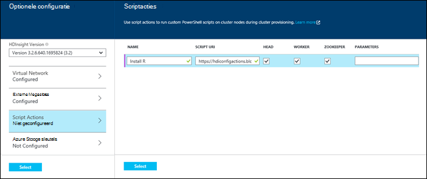

  	| Eigenschap | Waarde |
  	| -------- | ----- |
  	| Naam | Geef een naam voor de scriptactie. |
  	| URI-script | Geef de URI voor het script dat wordt aangeroepen voor het aanpassen van het cluster. |
  	| Hoofd/werknemer | Geef de knooppunten (**hoofd**, **werknemer**of **ZooKeeper**) op het aangepaste script wordt uitgevoerd. |
  	| Parameters | Geef de parameters, indien nodig door het script. |

    Druk op ENTER om meer dan één scriptactie om meerdere onderdelen op het cluster toevoegen.

3. Klik op **selecteren** om de configuratie opslaan en doorgaan met het maken van het cluster.

### Een actie Script van Azure Resource Manager-sjablonen gebruiken

In deze sectie, we Azure Resource Manager-sjablonen gebruiken voor een HDInsight-cluster maken en ook een scriptactie aangepast om onderdelen te installeren (in dit voorbeeld R) in het cluster. Deze sectie bevat een voorbeeldsjabloon om een cluster met behulp van de scriptactie te maken.

> [AZURE.NOTE] De stappen in dit gedeelte tonen maken van een cluster met behulp van een scriptactie. Zie voor een voorbeeld van een cluster maken van een sjabloon met een toepassing voor HDInsight, [aangepaste toepassingen voor HDInsight](hdinsight-apps-install-custom-applications.md).

#### Voordat u begint

* Zie voor meer informatie over het configureren van een werkstation om uit te voeren HDInsight Powershell-cmdlets [installeren en configureren van Azure PowerShell](../powershell-install-configure.md).
* Zie voor instructies voor het maken van sjablonen, [sjablonen ontwerpen Azure Resource Manager](../resource-group-authoring-templates.md).
* Als u niet eerder Azure PowerShell met Resource Manager gebruikt nog, Zie [Azure PowerShell Azure Resource Manager gebruiken](../powershell-azure-resource-manager.md).

#### Clusters met actie Script maken

1. De volgende sjabloon kopiëren naar een locatie op uw computer. Deze sjabloon wordt de Giraph geïnstalleerd op de headnodes en werknemer knooppunten in het cluster. U kunt ook controleren of de JSON-sjabloon geldig is. Plak de inhoud van de sjabloon in [JSONLint](http://jsonlint.com/), een online tool voor JSON-validatie.

            {
            "$schema": "http://schema.management.azure.com/schemas/2015-01-01/deploymentTemplate.json#",
            "contentVersion": "1.0.0.0",
            "parameters": {
                "clusterLocation": {
                    "type": "string",
                    "defaultValue": "West US",
                    "allowedValues": [ "West US" ]
                },
                "clusterName": {
                    "type": "string"
                },
                "clusterUserName": {
                    "type": "string",
                    "defaultValue": "admin"
                },
                "clusterUserPassword": {
                    "type": "securestring"
                },
                "sshUserName": {
                    "type": "string",
                    "defaultValue": "username"
                },
                "sshPassword": {
                    "type": "securestring"
                },
                "clusterStorageAccountName": {
                    "type": "string"
                },
                "clusterStorageAccountResourceGroup": {
                    "type": "string"
                },
                "clusterStorageType": {
                    "type": "string",
                    "defaultValue": "Standard_LRS",
                    "allowedValues": [
                        "Standard_LRS",
                        "Standard_GRS",
                        "Standard_ZRS"
                    ]
                },
                "clusterStorageAccountContainer": {
                    "type": "string"
                },
                "clusterHeadNodeCount": {
                    "type": "int",
                    "defaultValue": 1
                },
                "clusterWorkerNodeCount": {
                    "type": "int",
                    "defaultValue": 2
                }
            },
            "variables": {
            },
            "resources": [
                {
                    "name": "[parameters('clusterStorageAccountName')]",
                    "type": "Microsoft.Storage/storageAccounts",
                    "location": "[parameters('clusterLocation')]",
                    "apiVersion": "2015-05-01-preview",
                    "dependsOn": [ ],
                    "tags": { },
                    "properties": {
                        "accountType": "[parameters('clusterStorageType')]"
                    }
                },
                {
                    "name": "[parameters('clusterName')]",
                    "type": "Microsoft.HDInsight/clusters",
                    "location": "[parameters('clusterLocation')]",
                    "apiVersion": "2015-03-01-preview",
                    "dependsOn": [
                        "[concat('Microsoft.Storage/storageAccounts/', parameters('clusterStorageAccountName'))]"
                    ],
                    "tags": { },
                    "properties": {
                        "clusterVersion": "3.2",
                        "osType": "Linux",
                        "clusterDefinition": {
                            "kind": "hadoop",
                            "configurations": {
                                "gateway": {
                                    "restAuthCredential.isEnabled": true,
                                    "restAuthCredential.username": "[parameters('clusterUserName')]",
                                    "restAuthCredential.password": "[parameters('clusterUserPassword')]"
                                }
                            }
                        },
                        "storageProfile": {
                            "storageaccounts": [
                                {
                                    "name": "[concat(parameters('clusterStorageAccountName'),'.blob.core.windows.net')]",
                                    "isDefault": true,
                                    "container": "[parameters('clusterStorageAccountContainer')]",
                                    "key": "[listKeys(resourceId('Microsoft.Storage/storageAccounts', parameters('clusterStorageAccountName')), '2015-05-01-preview').key1]"
                                }
                            ]
                        },
                        "computeProfile": {
                            "roles": [
                                {
                                    "name": "headnode",
                                    "targetInstanceCount": "[parameters('clusterHeadNodeCount')]",
                                    "hardwareProfile": {
                                        "vmSize": "Large"
                                    },
                                    "osProfile": {
                                        "linuxOperatingSystemProfile": {
                                            "username": "[parameters('sshUserName')]",
                                            "password": "[parameters('sshPassword')]"
                                        }
                                    },
                                    "scriptActions": [
                                        {
                                            "name": "installGiraph",
                                            "uri": "https://hdiconfigactions.blob.core.windows.net/linuxgiraphconfigactionv01/giraph-installer-v01.sh",
                                            "parameters": ""
                                        }
                                    ]
                                },
                                {
                                    "name": "workernode",
                                    "targetInstanceCount": "[parameters('clusterWorkerNodeCount')]",
                                    "hardwareProfile": {
                                        "vmSize": "Large"
                                    },
                                    "osProfile": {
                                        "linuxOperatingSystemProfile": {
                                            "username": "[parameters('sshUserName')]",
                                            "password": "[parameters('sshPassword')]"
                                        }
                                    },
                                    "scriptActions": [
                                        {
                                            "name": "installR",
                                            "uri": "https://hdiconfigactions.blob.core.windows.net/linuxrconfigactionv01/r-installer-v01.sh",
                                            "parameters": ""
                                        }
                                    ]
                                }
                            ]
                        }
                    }
                }
            ],
            "outputs": {
                "cluster":{
                    "type" : "object",
                    "value" : "[reference(resourceId('Microsoft.HDInsight/clusters',parameters('clusterName')))]"
                }
            }
        }

2. Start Azure PowerShell en Log in op uw account Azure. Na het opgeven van uw referenties, retourneert de opdracht informatie over uw account.

        Add-AzureRmAccount

        Id                             Type       ...
        --                             ----
        someone@example.com            User       ...

3. Als er meerdere abonnementen, bieden de abonnement-id die u wilt gebruiken voor de implementatie.

        Select-AzureRmSubscription -SubscriptionID <YourSubscriptionId>

    > [AZURE.NOTE] U kunt `Get-AzureRmSubscription` voor een lijst van alle abonnementen die zijn gekoppeld aan uw account, inclusief de abonnements-Id voor elk item.

5. Als u een bestaande resourcegroep niet hebt, maakt u een nieuwe bronnengroep. Geef de naam van de resourcegroep en de locatie die u nodig hebt voor uw oplossing. Een overzicht van de nieuwe resourcegroep wordt geretourneerd.

        New-AzureRmResourceGroup -Name myresourcegroup -Location "West US"

        ResourceGroupName : myresourcegroup
        Location          : westus
        ProvisioningState : Succeeded
        Tags              :
        Permissions       :
                            Actions  NotActions
                            =======  ==========
                            *
        ResourceId        : /subscriptions/######/resourceGroups/ExampleResourceGroup

6. Als u wilt een nieuwe implementatie voor de resourcegroep hebt gemaakt, voert u de opdracht **Nieuw AzureRmResourceGroupDeployment** en de benodigde parameters bieden. De parameters wordt een naam bevatten voor de implementatie, de naam van de resourcegroep en het pad of de URL naar de sjabloon die u hebt gemaakt. Als uw sjabloon parameters zijn vereist, moet u ook die parameters doorgeven. In dit geval is de scriptactie installeren R op het cluster geen parameters vereist.

        New-AzureRmResourceGroupDeployment -Name mydeployment -ResourceGroupName myresourcegroup -TemplateFile <PathOrLinkToTemplate>

    U wordt gevraagd waarden op te geven voor de parameters die zijn gedefinieerd in de sjabloon.

7. Wanneer de resourcegroep is geïmplementeerd, ziet u een overzicht van de implementatie.

          DeploymentName    : mydeployment
          ResourceGroupName : myresourcegroup
          ProvisioningState : Succeeded
          Timestamp         : 8/17/2015 7:00:27 PM
          Mode              : Incremental
          ...

8. Als de installatie mislukt, kunt u de volgende cmdlets kunt u informatie over de fouten.

        Get-AzureRmResourceGroupDeployment -ResourceGroupName myresourcegroup -ProvisioningState Failed

### Een scriptactie gebruiken tijdens het maken van een cluster van Azure PowerShell

In deze sectie gebruiken we de cmdlet [Add-AzureRmHDInsightScriptAction](https://msdn.microsoft.com/library/mt603527.aspx) scripts aangeroepen met behulp van de actie Script voor het aanpassen van een cluster. Zorg ervoor dat u hebt geïnstalleerd en geconfigureerd Azure PowerShell voordat u verdergaat. Zie voor meer informatie over het configureren van een werkstation om uit te voeren HDInsight PowerShell-cmdlets [installeren en configureren van Azure PowerShell](../powershell-install-configure.md).

Voer de volgende stappen uit:

1. Open de console Azure PowerShell en gebruik de volgende aanmelding bij uw abonnement Azure sommige PowerShell variabelen declareren:

        # LOGIN TO ZURE
        Login-AzureRmAccount

        # PROVIDE VALUES FOR THESE VARIABLES
        $subscriptionId = "<SubscriptionId>"        # ID of the Azure subscription
        $clusterName = "<HDInsightClusterName>"         # HDInsight cluster name
        $storageAccountName = "<StorageAccountName>"    # Azure storage account that hosts the default container
        $storageAccountKey = "<StorageAccountKey>"      # Key for the storage account
        $containerName = $clusterName
        $location = "<MicrosoftDataCenter>"             # Location of the HDInsight cluster. It must be in the same data center as the storage account.
        $clusterNodes = <ClusterSizeInNumbers>          # The number of nodes in the HDInsight cluster.
        $resourceGroupName = "<ResourceGroupName>"      # The resource group that the HDInsight cluster will be created in

2. Geef de waarden van de systeemconfiguratie (bijvoorbeeld de knooppunten in het cluster) en de standaard opslag worden gebruikt.

        # SPECIFY THE CONFIGURATION OPTIONS
        Select-AzureRmSubscription -SubscriptionId $subscriptionId
        $config = New-AzureRmHDInsightClusterConfig
        $config.DefaultStorageAccountName="$storageAccountName.blob.core.windows.net"
        $config.DefaultStorageAccountKey=$storageAccountKey

3. Gebruik de cmdlet **Add-AzureRmHDInsightScriptAction** aan te roepen van het script. In het volgende voorbeeld wordt een script dat Giraph op het cluster installeert:

        # INVOKE THE SCRIPT USING THE SCRIPT ACTION FOR HEADNODE AND WORKERNODE
        $config = Add-AzureRmHDInsightScriptAction -Config $config -Name "Install Giraph"  -NodeType HeadNode -Uri https://hdiconfigactions.blob.core.windows.net/linuxgiraphconfigactionv01/giraph-installer-v01.sh
        $config = Add-AzureRmHDInsightScriptAction -Config $config -Name "Install Giraph"  -NodeType WorkerNode -Uri https://hdiconfigactions.blob.core.windows.net/linuxgiraphconfigactionv01/giraph-installer-v01.sh

    De cmdlet **Add-AzureRmHDInsightScriptAction** heeft de volgende parameters:

  	| Parameter | Definitie |
  	| --------- | ---------- |
  	| Config | Het configuratieobject welk script actie-informatie wordt toegevoegd. |
  	| Naam | De naam van de scriptactie. |
  	| NodeType | Hiermee geeft u het knooppunt waarop de aanpassing-script wordt uitgevoerd. Geldige waarden zijn **HeadNode** (om te installeren op het knooppunt hoofd), **WorkerNode** (om te installeren op alle gegevensknooppunten) of **ZookeeperNode** (om te installeren op het knooppunt zookeeper). |
  	| Parameters | Parameters die nodig zijn door het script. |
  	| URI | Hiermee wordt de URI voor het script dat wordt uitgevoerd. |

4. Stelt de gebruiker admin/HTTPS voor het cluster:

        $httpCreds = get-credential

    Wanneer dat wordt gevraagd, 'admin' opgeven als de naam en een wachtwoord opgeven.

5. SSH referenties instellen:

        $sshCreds = get-credential

    Voer desgevraagd de SSH-gebruikersnaam en wachtwoord. Als u wilt dat om de SSH-account met een certificaat in plaats van een wachtwoord te beveiligen, met een blanco wachtwoord en stelt `$sshPublicKey` aan de inhoud van de openbare sleutel van het certificaat u wilt gebruiken. Bijvoorbeeld:

        $sshPublicKey = Get-Content .\path\to\public.key -Raw

4. Tot slot maakt u het cluster:

        New-AzureRmHDInsightCluster -config $config -clustername $clusterName -DefaultStorageContainer $containerName -Location $location -ResourceGroupName $resourceGroupName -ClusterSizeInNodes $clusterNodes -HttpCredential $httpCreds -SshCredential $sshCreds -OSType Linux

    Als u een openbare sleutel voor het beveiligen van uw SSH-account gebruikt, moet u ook opgeven `-SshPublicKey $sshPublicKey` als een parameter.

Het kan enkele minuten duren voordat het cluster wordt gemaakt.

### Een scriptactie gebruiken tijdens het maken van het cluster uit de HDInsight .NET SDK

De HDInsight .NET SDK biedt clientbibliotheken die u gemakkelijker kunt werken met HDInsight van een .NET-toepassing. Zie voor een codevoorbeeld [maakt Linux gebaseerde clusters in HDInsight met de SDK voor .NET](hdinsight-hadoop-create-linux-clusters-dotnet-sdk.md#use-script-action).

## De actie Script toepassen op een cluster uitgevoerd

Deze sectie bevat voorbeelden van de verschillende manieren waarop die u scriptacties op een cluster met actieve HDInsight toepassen kunt; Gebruik vanuit de portal Azure PowerShell CMDlets, met behulp van de CLI platforms Azure en het gebruik van de SDK voor .NET. De actie permanente script gebruikt in deze sectie wordt een bestaande Azure opslag-account aan een cluster uitgevoerd. U kunt ook andere scriptacties, Zie [voorbeeld scriptactie scripts](#example-script-action-scripts).

### Scriptactie toepassen op een cluster uitgevoerd vanaf de portal Azure

1. Selecteer het cluster HDInsight de [Azure portal](https://portal.azure.com).

2. Selecteer de tegel __Scriptacties__ in het blad van de cluster HDInsight.

    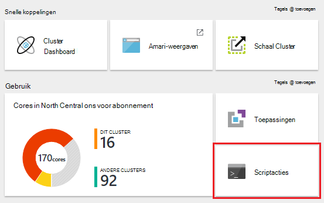

    > [AZURE.NOTE] U kunt ook __alle instellingen__ selecteren en selecteer vervolgens __Scriptacties__ van de instellingen voor blade.

4. Selecteer __indienen van nieuwe__vanaf de bovenkant van het blad scriptacties.

    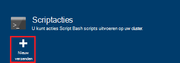

5. Voer de volgende gegevens van de bladeserver scriptactie toevoegen.

    * __Naam__: de gebruiksvriendelijke naam voor deze actie Script. In dit voorbeeld wordt `Add Storage account`.
    * __SCRIPT-URI__: de URI voor het script. In dit voorbeeld`https://hdiconfigactions.blob.core.windows.net/linuxaddstorageaccountv01/add-storage-account-v01.sh`
    * __Hoofd__, __werknemer__en __Zookeeper__: de knooppunten die dit script moet worden toegepast om te controleren. In dit voorbeeld, worden hoofd, werknemer en Zookeeper gecontroleerd.
    * __PARAMETERS__: als het script parameters accepteert, voert u deze hier. In dit voorbeeld voert u de naam van de opslag en de sleutel opslag account:

        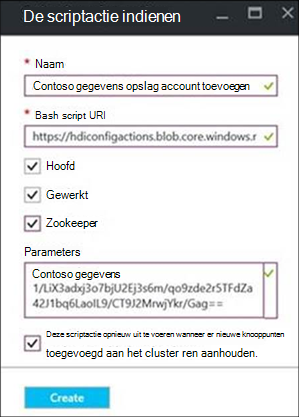

        Op het screenshot, `contosodata` een bestaande account is Azure opslag, de tweede regel is de sleutel opslag account.
    * __PERSISTED__: Controleer deze post als u wilt dat het script aanhouden, zodat deze wordt toegepast op nieuwe werknemer knooppunten wanneer u de schaal van het cluster.

6. Tot slot de knop __maken__ gebruiken om het script van toepassing op het cluster.

### Scriptactie toepassen op een cluster uitgevoerd vanuit Azure PowerShell

Zorg ervoor dat u hebt geïnstalleerd en geconfigureerd Azure PowerShell voordat u verdergaat. Zie voor meer informatie over het configureren van een werkstation om uit te voeren HDInsight PowerShell-cmdlets [installeren en configureren van Azure PowerShell](../powershell-install-configure.md).

1. Open de console Azure PowerShell en gebruik de volgende aanmelding bij uw abonnement Azure sommige PowerShell variabelen declareren:

        # LOGIN TO ZURE
        Login-AzureRmAccount

        # PROVIDE VALUES FOR THESE VARIABLES
        $clusterName = "<HDInsightClusterName>"         # HDInsight cluster name
        $saName = "<ScriptActionName>"                  # Name of the script action
        $saURI = "<URI to the script>"                  # The URI where the script is located
        $nodeTypes = "headnode", "workernode"
        
    > [AZURE.NOTE] Als een cluster HDInsight Premium, gebruikt u een nodetype van `"edgenode"` het script wilt uitvoeren op het randknooppunt.

2. Gebruik de volgende opdracht om het script van toepassing op het cluster:

        Submit-AzureRmHDInsightScriptAction -ClusterName $clusterName -Name $saName -Uri $saURI -NodeTypes $nodeTypes -PersistOnSuccess

    Nadat de taak is voltooid, wordt de volgende informatie weergegeven:

        OperationState  : Succeeded
        ErrorMessage    :
        Name            : Giraph
        Uri             : https://hdiconfigactions.blob.core.windows.net/linuxgiraphconfigactionv01/giraph-installer-v01.sh
        Parameters      :
        NodeTypes       : {HeadNode, WorkerNode}

### Scriptactie toepassen op een cluster uitgevoerd vanuit de Azure-CLI

Voordat u verdergaat, moet u hebt geïnstalleerd en geconfigureerd, de CLI Azure. Zie [de Azure CLI installeren](../xplat-cli-install.md)voor meer informatie.

    [AZURE.INCLUDE [use-latest-version](../../includes/hdinsight-use-latest-cli.md)] 

1. Open een shell-sessie, terminal, vanaf de opdrachtprompt of andere vanaf de opdrachtregel voor uw systeem en gebruik de volgende opdracht om te schakelen naar de modus Azure Resource Manager.

        azure config mode arm

2. Gebruik het volgende om uw abonnement op Azure te verifiëren.

        azure login

3. Gebruik de volgende opdracht om de scriptactie toepassen op een cluster uitgevoerd

        azure hdinsight script-action create <clustername> -g <resourcegroupname> -n <scriptname> -u <scriptURI> -t <nodetypes>

    Als u de parameters voor deze opdracht niet opgeeft, wordt u gevraagd voor hen. Als het script dat u opgeeft bij `-u` accepteert de parameters, kunt u deze opgeven met behulp van de `-p` parameter.

    Geldige __nodetypes__ zijn __headnode__, __workernode__en __zookeeper__. Als het script moet worden toegepast op meerdere knooppunttypen, geeft u de typen gescheiden door een ';'. Bijvoorbeeld `-n headnode;workernode`.

    Toevoegen als u wilt behouden in het script, de `--persistOnSuccess`. U kunt ook met behulp van het script op een later tijdstip persistent `azure hdinsight script-action persisted set`.
    
    Nadat de taak is voltooid, ontvangt u de volgende uitvoer.
    
        info:    Executing command hdinsight script-action create
        + Executing Script Action on HDInsight cluster
        data:    Operation Info
        data:    ---------------
        data:    Operation status:
        data:    Operation ID:  b707b10e-e633-45c0-baa9-8aed3d348c13
        info:    hdinsight script-action create command OK

### De actie Script toepassen op een actief cluster met REST API

Zie [Scriptacties uitvoeren op een cluster uitgevoerd](https://msdn.microsoft.com/library/azure/mt668441.aspx).
### Scriptactie toepassen op een cluster uitgevoerd vanuit de HDInsight .NET SDK

Zie [https://github.com/Azure-Samples/hdinsight-dotnet-script-action](https://github.com/Azure-Samples/hdinsight-dotnet-script-action)voor een voorbeeld van het gebruik van de .NET SDK scripts toepassen op een cluster.

## Geschiedenis weergeven, promoveren en degraderen scriptacties

### Met behulp van de portal Azure

1. Selecteer het cluster HDInsight de [Azure portal](https://portal.azure.com).

2. Selecteer __Instellingen__uit het blad van de cluster HDInsight.

    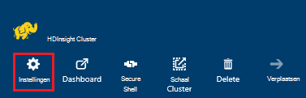

3. Selecteer in de blade instellingen __Scriptacties__.

    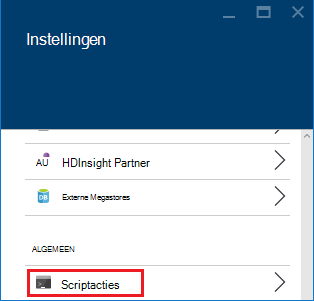

4. Een lijst met de permanente scripts, alsmede een overzicht van de scripts die zijn toegepast op het cluster, wordt weergegeven op het blad scriptacties. In het screenshot hieronder kunt u zien dat het script is Solr in het cluster worden uitgevoerd, maar geen scriptacties behouden.

    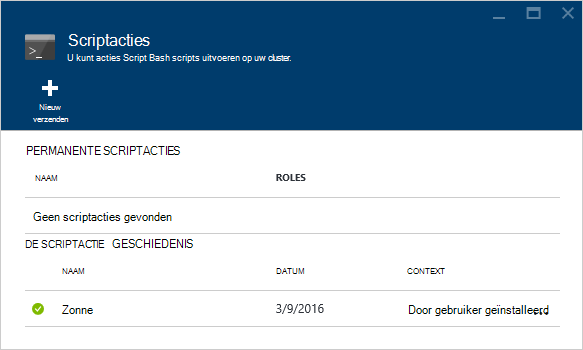

5. Een script selecteren in de geschiedenis van weergegeven het blad van de eigenschappen voor dit script. U kunt het script opnieuw uitvoeren of bevorderen het vanaf de bovenkant van het blad.

    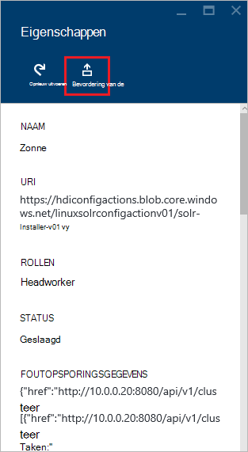

6. U kunt ook de __...__ rechts van posten op de bladeserver scriptacties acties uit te voeren zoals opnieuw behouden of verwijderen (voor permanente acties).

    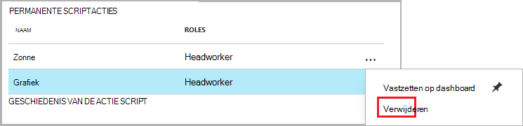

### Azure PowerShell gebruiken

| Gebruik de volgende... | Aan... |
| ----- | ----- |
| Get-AzureRmHDInsightPersistedScriptAction | Informatie over permanente scriptacties ophalen |
| Get-AzureRmHDInsightScriptActionHistory | Een geschiedenis van scriptacties toegepast op het cluster of voor een specifiek script ophalen |
| Set AzureRmHDInsightPersistedScriptAction | Bevordert een ad-hoc-een vastgelegde scriptactie scriptactie |
| Verwijderen AzureRmHDInsightPersistedScriptAction | Verlagen van een permanente scriptactie op een ad hoc-actie |

> [AZURE.IMPORTANT] Met behulp van `Remove-AzureRmHDInsightPersistedScriptAction` wordt niet ongedaan maken door een script worden de acties uitgevoerd, alleen wordt verwijderd de vlag voor permanente zodat het script zal niet worden uitgevoerd op nieuwe werknemer knooppunten aan het cluster toegevoegd.

Het volgende voorbeeldscript ziet u de cmdlets gebruiken om te promoveren en degraderen van een script.

    # Get a history of scripts
    Get-AzureRmHDInsightScriptActionHistory -ClusterName mycluster

    # From the list, we want to get information on a specific script
    Get-AzureRmHDInsightScriptActionHistory -ClusterName mycluster -ScriptExecutionId 635920937765978529

    # Promote this to a persisted script
    # Note: the script must have a unique name to be promoted
    # if the name is not unique, you will receive an error
    Set-AzureRmHDInsightPersistedScriptAction -ClusterName mycluster -ScriptExecutionId 635920937765978529

    # Demote the script back to ad hoc
    # Note that demotion uses the unique script name instead of
    # execution ID.
    Remove-AzureRmHDInsightPersistedScriptAction -ClusterName mycluster -Name "Install Giraph"

### Met behulp van de CLI Azure

| Gebruik de volgende... | Aan... |
| ----- | ----- |
| `azure hdinsight script-action persisted list <clustername>` | Een lijst met scriptacties permanente ophalen |
| `azure hdinsight script-action persisted show <clustername> <scriptname>` | Informatie over de scriptactie van een specifieke permanente ophalen |
| `azure hdinsight script-action history list <clustername>` | Een geschiedenis van scriptacties toegepast op het cluster ophalen |
| `azure hdinsight script-action history show <clustername> <scriptname>` | Ophalen van informatie over een specifiek script-actie |
| `azure hdinsight script action persisted set <clustername> <scriptexecutionid>` | Bevordert een ad-hoc-een vastgelegde scriptactie scriptactie |
| `azure hdinsight script-action persisted delete <clustername> <scriptname>` | Verlagen van een permanente scriptactie op een ad hoc-actie |

> [AZURE.IMPORTANT] Met behulp van `azure hdinsight script-action persisted delete` wordt niet ongedaan maken door een script worden de acties uitgevoerd, alleen wordt verwijderd de vlag voor permanente zodat het script zal niet worden uitgevoerd op nieuwe werknemer knooppunten aan het cluster toegevoegd.

### Met behulp van de HDInsight .NET SDK

Voor een voorbeeld van het gebruik van de .NET SDK script geschiedenis ophalen uit een cluster, promoveren of degraderen scripts, Zie [https://github.com/Azure-Samples/hdinsight-dotnet-script-action](https://github.com/Azure-Samples/hdinsight-dotnet-script-action).

> [AZURE.NOTE] In dit voorbeeld wordt tevens gedemonstreerd hoe een HDInsight toepassing met behulp van de .NET SDK te installeren.

## Het oplossen van problemen

Ambari on line gebruikersinterface kunt u weergeven door het scriptacties vastgelegd. Als het script is gebruikt tijdens het maken van het cluster en maken van het cluster is een fout opgetreden in het script de logboeken zijn ook beschikbaar in de standaard opslag-account die is gekoppeld aan het cluster. Deze sectie bevat informatie over het ophalen van de logboeken van deze beide opties.

### Via het Web Ambari UI

1. Ga naar https://CLUSTERNAME.azurehdinsight.net in uw browser. CLUSTERNAAM vervangen door de naam van het cluster HDInsight.

    Voer desgevraagd de naam van de account beheerder (admin) en het wachtwoord voor de cluster. U moet de admin-referenties in een webformulier opnieuw invoeren.

2. Selecteer de post __ops__ in de balk boven aan de pagina. Hier ziet een lijst van huidige en vorige bewerkingen die worden uitgevoerd op het cluster via Ambari.

    

3. De posten die zijn gevonden __uitvoeren\_customscriptaction__ in de kolom __bewerkingen__ . Deze worden gemaakt wanneer de acties van het Script worden uitgevoerd.

    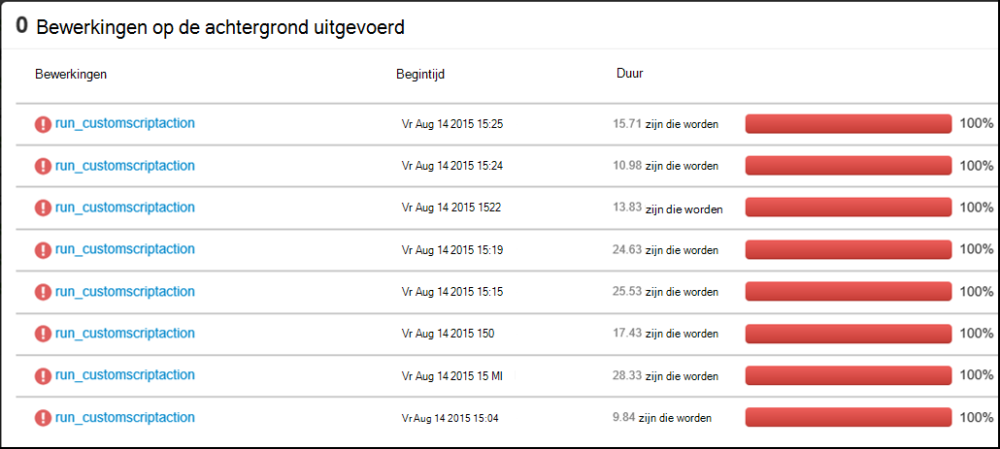

    Selecteer de post en inzoomen via de koppelingen naar de weergave van de STDOUT en STDERR uitvoer gegenereerd wanneer het script is uitgevoerd op het cluster.

### Logboeken van de standaardaccount voor opslag

Als het maken van het cluster een fout opgetreden in het scriptactie is, de logboeken van de actie script nog steeds toegankelijk rechtstreeks vanuit de standaard opslag-account die is gekoppeld aan het cluster.

* De logboeken van de opslag zijn beschikbaar op `\STORAGE_ACOCUNT_NAME\DEFAULT_CONTAINER_NAME\custom-scriptaction-logs\CLUSTER_NAME\DATE`.

    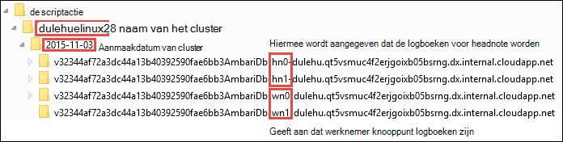

    De logboeken zijn onder deze afzonderlijk georganiseerd voor headnode, workernode en zookeeper knooppunten. Enkele voorbeelden zijn:
    * **Headnode** - `<uniqueidentifier>AmbariDb-hn0-<generated_value>.cloudapp.net`
    * **Werknemer-knooppunt** - `<uniqueidentifier>AmbariDb-wn0-<generated_value>.cloudapp.net`
    * **Knooppunt zookeeper** - `<uniqueidentifier>AmbariDb-zk0-<generated_value>.cloudapp.net`

* Alle stdout en stderr van de bijbehorende host is geüpload naar de rekening voor opslag. Er is een **uitvoer -\*.txt** en **fouten -\*.txt** voor elke scriptactie. De uitvoer *.txt bestand bevat informatie over de URI van het script dat is uitgevoerd op de host. Bijvoorbeeld

        'Start downloading script locally: ', u'https://hdiconfigactions.blob.core.windows.net/linuxrconfigactionv01/r-installer-v01.sh'

* Het is mogelijk een cluster van de actie script herhaaldelijk te maken met dezelfde naam. In dat geval kunt u de relevante logboeken op basis van de naam van de datum te onderscheiden. Bijvoorbeeld, is de mappenstructuur voor een cluster (mijncluster) op verschillende datums gemaakt:
    * `\STORAGE_ACOCUNT_NAME\DEFAULT_CONTAINER_NAME\custom-scriptaction-logs\mycluster\2015-10-04`
    * `\STORAGE_ACOCUNT_NAME\DEFAULT_CONTAINER_NAME\custom-scriptaction-logs\mycluster\2015-10-05`

* Als u een script actie cluster met dezelfde naam op dezelfde dag maakt, kunt u het voorvoegsel uniek te identificeren van de relevante logboekbestanden.

* Als u een cluster aan het einde van de dag maakt, is het mogelijk dat de logboekbestanden over twee dagen beslaan. In dat geval ziet u twee verschillende mappen voor hetzelfde cluster.

* Bestanden uploaden naar de standaardcontainer kunt tot 5 minuten, met name voor grote clusters nemen. Dus als u toegang wilt tot de logboeken, moet u niet onmiddellijk verwijderen het cluster als een scriptactie mislukt.

## Ondersteuning voor open source software gebruikt op de clusters HDInsight

De service Microsoft Azure HDInsight is een flexibel platform waarmee u toepassingen te bouwen grote gegevens in de cloud met behulp van een ecosysteem van open source-technologieën rond Hadoop gevormd. Microsoft Azure biedt een algemeen niveau van ondersteuning voor open source-technologieën, zoals besproken in de sectie **Bereik ondersteuning** van de [website Azure ondersteunen Veelgestelde vragen](https://azure.microsoft.com/support/faq/). De HDInsight-service biedt extra ondersteuning voor een aantal van de componenten, zoals hieronder beschreven.

Er zijn twee typen van open source-componenten die beschikbaar in de HDInsight-service zijn:

- **Ingebouwde onderdelen** - deze onderdelen zijn vooraf geïnstalleerd op HDInsight clusters en bieden basisfunctionaliteit van het cluster. Bijvoorbeeld, behoren GAREN ResourceManager de querytaal component (HiveQL) en de bibliotheek Mahout tot deze categorie. Een volledige lijst met clusteronderdelen is beschikbaar in [nieuwe functies in de versies van Hadoop cluster geleverd door HDInsight?](hdinsight-component-versioning.md).

- **Aangepaste onderdelen** - u, als gebruiker van het cluster, kunt installeren of gebruiken in uw werkbelasting onderdelen beschikbaar zijn in de Gemeenschap of door u gemaakt.

> [AZURE.WARNING] Onderdelen van het cluster HDInsight worden volledig ondersteund en Microsoft Support helpt bij het opsporen en oplossen van problemen met betrekking tot deze componenten.
>
> Aangepaste onderdelen ontvangen commercieel redelijke ondersteuning waarmee u het probleem verder oplossen. Dit kan leiden tot het oplossen van het probleem of vraag aan een van de beschikbare kanalen voor de open-source technologieën waarbij diepe expertise voor de technologie die wordt gevonden. Er zijn bijvoorbeeld veel sites van de community die kunnen worden gebruikt, zoals: [MSDN forum voor HDInsight](https://social.msdn.microsoft.com/Forums/azure/en-US/home?forum=hdinsight), [http://stackoverflow.com](http://stackoverflow.com). Apache-projecten hebben ook projectsites op [http://apache.org](http://apache.org), bijvoorbeeld: [Hadoop](http://hadoop.apache.org/).

De HDInsight-service biedt verschillende manieren gebruik van aangepaste onderdelen. Ongeacht hoe een onderdeel wordt gebruikt of op het cluster is geïnstalleerd, geldt hetzelfde niveau van ondersteuning. Hieronder ziet u een lijst met de meest gangbare manieren dat aangepaste onderdelen op HDInsight-clusters kunnen worden gebruikt:

1. Project indienen - Hadoop of andere typen taken uitvoeren of aangepaste onderdelen kan worden ingediend bij het cluster.

2. Aanpassing van de cluster - tijdens het maken van het cluster, kunt u extra instellingen en aangepaste onderdelen die worden geïnstalleerd op de clusterknooppunten.

3. Voorbeelden van hoe deze onderdelen kunnen worden gebruikt op de clusters HDInsight bepalen monsters - voor populaire aangepaste onderdelen, Microsoft en anderen. Deze monsters worden geleverd zonder ondersteuning.

##Het oplossen van problemen

###Geschiedenis van niet wordt scripts die worden gebruikt tijdens het maken van het cluster weergegeven

Als het cluster is gemaakt vóór 15 maart 2016, kan er geen een vermelding in de geschiedenis van de actie Script voor alle scripts gebruikt tijdens het maken van het cluster. Echter, als u het formaat van het cluster na 15 maart 2016 tijdens het maken van het cluster met behulp van scripts weergegeven in de geschiedenis zoals die worden toegepast op nieuwe knooppunten in het cluster als onderdeel van het formaat van.

Er zijn twee uitzonderingen:

* Als het cluster is gemaakt vóór 1 September 2015. Dit is wanneer het scriptacties werden geïntroduceerd, zodat een cluster gemaakt vóór deze datum kan niet hebben gebruikt acties Script voor het maken van het cluster.

* Als u meerdere acties van het Script tijdens het maken van het cluster gebruikt en voor meerdere scripts dezelfde naam of dezelfde naam, dezelfde URI, maar verschillende parameters voor meerdere scripts gebruikt. In deze gevallen wordt het volgende foutbericht worden weergegeven.

    Geen nieuwe scriptacties kunnen op dit cluster vanwege conflicterende scriptnamen van in bestaande scripts worden uitgevoerd. Scriptnamen van in het cluster moet maken allemaal uniek zijn. Bij wijzigen formaat worden nog bestaande scripts uitgevoerd.

## Volgende stappen

Zie de volgende onderwerpen voor informatie en voorbeelden over het maken en aanpassen van een cluster met behulp van scripts:

- [De actie Script scripts ontwikkelen voor HDInsight](hdinsight-hadoop-script-actions-linux.md)
- [Installeren en gebruiken van Solr op HDInsight clusters](hdinsight-hadoop-solr-install-linux.md)
- [Installeer en gebruik de Giraph op HDInsight-clusters](hdinsight-hadoop-giraph-install-linux.md)

[img-hdi-cluster-states]: ./media/hdinsight-hadoop-customize-cluster-linux/HDI-Cluster-state.png "De fasen tijdens het maken van het cluster"
