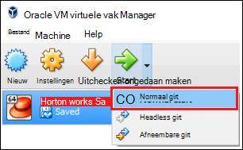

<properties
    pageTitle="Een sandbox Hadoop gebruiken voor meer informatie over Hadoop | Microsoft Azure"
    description="Als u wilt weten over het gebruik van het Hadoop-ecosysteem, kunt u instellen een sandbox Hadoop van Hortonworks op een Azure virtuele machine. "
    keywords="hadoop-emulator, hadoop sandbox"
    editor="cgronlun"
    manager="jhubbard"
    services="hdinsight"
    authors="nitinme"
    documentationCenter=""
    tags="azure-portal"/>

<tags
    ms.service="hdinsight"
    ms.workload="big-data"
    ms.tgt_pltfrm="na"
    ms.devlang="na"
    ms.topic="article"
    ms.date="08/24/2016"
    ms.author="nitinme"/>

# Aan de slag in het Hadoop-ecosysteem met een sandbox Hadoop op een virtuele machine

Informatie over de sandbox Hadoop uit Hortonworks installeren op een virtuele machine voor meer informatie over het Hadoop-ecosysteem. De sandbox biedt een plaatselijke ontwikkelingsomgeving voor meer informatie over Hadoop, Hadoop Distributed bestand System (HDFS) en indiening van de taak.

## Vereisten

* [Oracle VirtualBox](https://www.virtualbox.org/)

Als u bekend met Hadoop bent, kunt u starten met behulp van Hadoop op Azure door het maken van een cluster van HDInsight. Zie [aan de slag met Hadoop op HDInsight](hdinsight-hadoop-linux-tutorial-get-started.md)voor meer informatie over hoe aan de slag.

## Download en installeer de virtuele machine

1. Selecteer de __VIRTUALBOX downloaden__ van [http://hortonworks.com/downloads/#sandbox](http://hortonworks.com/downloads/#sandbox), voor HDP 2.4 op Hortonworks Sandbox. U wordt gevraagd om te registreren bij Hortonworks voordat het downloaden begint.

    

2. Selecteer de __Gids voor VirtualBox installeren__ voor HDP 2.4 op Hortonworks sandbox-dezelfde webpagina. Hiermee wordt een PDF met installatie-instructies voor de virtuele machine downloaden.

    

## Start de virtuele machine

1. VirtualBox start, selecteert u de Hortonworks Sandbox, selecteer __Start__en vervolgens op __Normaal Start__.

    

2. Nadat u de virtuele machine klaar is met het opstartproces, wordt instructies voor aanmelding weergegeven. Open een webbrowser en Ga naar de URL weergegeven (meestal http://127.0.0.1:8888).

## Wachtwoorden instellen

1. Selecteer de stap __aan de slag__ van de pagina Hortonworks sandbox- __Geavanceerde opties weergeven__. Gebruik de informatie op deze pagina om aan te melden aan de sandbox via SSH. De naam en wachtwoord gebruiken.

    > [AZURE.NOTE] Als er niet een SSH-client is geïnstalleerd, kunt u het web gebaseerde SSH aangeboden door de virtuele machine op __http://localhost:4200 /__.

    De eerste keer dat u verbinding kunt maken met behulp van SSH, wordt u gevraagd het wachtwoord voor de root-account te wijzigen. Voer een nieuw wachtwoord waarmee u zich aanmeldt via SSH in de toekomst.

2. Als u eenmaal bent aangemeld, voert u de volgende opdracht:

        ambari-admin-password-reset
    
    Geef desgevraagd een wachtwoord voor de account Ambari. Dit wordt gebruikt wanneer u de gebruikersinterface van de website Ambari.

## Gebruik de opdracht component

1. Gebruik de volgende opdracht start de shell component van een SSH-verbinding aan de sandbox:

        hive

2. Zodra de shell is gestart, gebruikt u de volgende de tabellen weergeven die worden geleverd bij de sandbox:

        show tables;

3. Gebruik het volgende op te halen, 10 rijen van de `sample_07` tabel:

        select * from sample_07 limit 10;

## Volgende stappen

* [Informatie over het gebruik van Visual Studio met de Hortonworks Sandbox](hdinsight-hadoop-emulator-visual-studio.md)
* [Leren werken met de kabels van de Hortonworks Sandbox](http://hortonworks.com/hadoop-tutorial/learning-the-ropes-of-the-hortonworks-sandbox/)
* [Zelfstudie voor Hadoop - aan de slag met HDP](http://hortonworks.com/hadoop-tutorial/hello-world-an-introduction-to-hadoop-hcatalog-hive-and-pig/)