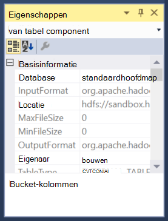
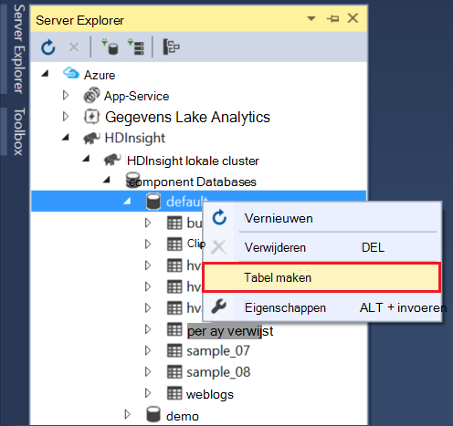

<properties
pageTitle="Gebruik de hulpprogramma's van Microsoft Azure gegevens Lake voor Visual Studio met de Sandbox Hortonworks | Microsoft Azure"
description="Informatie over het gebruik van de hulpmiddelen Lake Azure voor VIsual Studio met de Hortonworks sandbox (uitgevoerd in een lokale VM). U kunt met deze hulpprogramma's, maken en component en varken taken uitvoeren op de uitvoer voor weergave en de sandbox-project en de geschiedenis."
services="hdinsight"
documentationCenter=""
authors="Blackmist"
manager="paulettm"
editor="cgronlun"/>

<tags
ms.service="hdinsight"
ms.devlang="na"
ms.topic="article"
ms.tgt_pltfrm="na"
ms.workload="big-data"
ms.date="08/26/2016"
ms.author="larryfr"/>

# Gebruik de hulpmiddelen Azure Lake voor Visual Studio met de Sandbox Hortonworks

De Azure gegevens Lake's voor Visual Studio bevatten tools voor het werken met algemene Hadoop clusters, naast de hulpmiddelen voor het werken met Azure gegevens Lake en HDInsight. Dit document bevat de stappen die nodig zijn voor de Azure gegevens Lake's gebruiken met de Hortonworks Sandbox uitgevoerd op een lokale virtuele machine.

De Hortonworks Sandbox kunt u werken met Hadoop lokaal op uw ontwikkelomgeving. Zodra u een oplossing hebben ontwikkeld en te implementeren op schaal, kunt u vervolgens verplaatst naar een cluster HDInsight.

## Vereisten

* De Hortonworks Sandbox wordt uitgevoerd op een virtuele machine op uw ontwikkelomgeving. Dit document is geschreven en getest met de sandbox met Oracle VirtualBox, die is geconfigureerd met behulp van de informatie in het document [aan de slag in het Hadoop-ecosysteem](hdinsight-hadoop-emulator-get-started.md) .

* Visual Studio 2013 of elke editie 2015.

* De [SDK voor .NET Azure](https://azure.microsoft.com/downloads/) 2.7.1 of hoger

* [Azure Lake hulpmiddelen voor Visual Studio](https://www.microsoft.com/download/details.aspx?id=49504)

## Wachtwoorden voor de sandbox configureren

Zorg ervoor dat de Hortonworks Sandbox wordt uitgevoerd en vervolgens de stappen in de [slag in het Hadoop-ecosysteem](hdinsight-hadoop-emulator-get-started.md#set-passwords) voor het configureren van het wachtwoord voor de SSH `root` account en de Ambari `admin` account. Deze wachtwoorden wordt gebruikt wanneer u verbinding maakt met de sandbox van Visual Studio.

## Verbinding maken met de hulpprogramma's voor de sandbox

1. Visual Studio openen en selecteert u __weergave__en vervolgens de __Server Explorer__.

2. Klik met de rechtermuisknop de vermelding __HDInsight__ in __Server Explorer__en selecteert u __verbinding maken met de HDInsight-Emulator__.

    

3. Voer het wachtwoord die u hebt geconfigureerd voor de Ambari van het dialoogvenster __verbinding maken met de HDInsight-Emulator__ .

    

    Selecteer __volgende__ om door te gaan.

4. Gebruik het veld __wachtwoord__ voert u het wachtwoord dat u hebt geconfigureerd voor de `root` account. Laat de andere velden op de standaardwaarde.

    

    Selecteer __volgende__ om door te gaan.

5. Wachten op validatie van de diensten te voltooien. In sommige gevallen validatie mislukt en gevraagd of u de configuratie bij te werken. Als dit gebeurt, klik op de knop __bijwerken__ en wachten op de configuratie en controle van de service te voltooien.

    

    > [AZURE.NOTE] Het updateproces wordt Ambari gebruikt voor het wijzigen van de configuratie van Hortonworks Sandbox wordt verwacht door de Azure gegevens Lake tools voor Visual Studio.

    Nadat de validatie is voltooid, selecteert u __Voltooien__ configuratie wilt voltooien.

    

    > [AZURE.NOTE] Afhankelijk van de snelheid van uw ontwikkelomgeving en de hoeveelheid geheugen toegewezen aan de virtuele machine, dit kan enige tijd duren te configureren en de services te valideren.

Nadat u deze stappen uitvoert, hebt u nu een vermelding 'HDInsight lokale cluster' in Server Explorer onder de sectie HDInsight.

## Een component-query

Component bevat een SQL-achtige querytaal (HiveQL), voor het werken met gestructureerde gegevens. Gebruik de volgende stappen uit om een ad-hoc query's uitvoeren op het lokale cluster te leren.

1. In __Server Explorer__met de rechtermuisknop op de vermelding voor het lokale cluster die u eerder hebt toegevoegd en selecteer vervolgens __een query component__.

    

    Hiermee opent u een nieuwe query-venster waarmee u snel maken en verzenden van een query naar het lokale cluster.

2. Voer de volgende gegevens in het queryvenster nieuwe:

        select count(*) from sample_08;
    
    Zorg ervoor dat de configuratie voor het lokale cluster is ingeschakeld en selecteer __verzenden__vanaf de bovenkant van het queryvenster. De andere waarden (__Batch__ - en naam) op de standaardwaarden laten staan.

    

    Opmerking u kunt ook de vervolgkeuzelijst naast __verzenden__ gebruiken om te selecteren op __Geavanceerd__. Hiermee opent u een dialoogvenster waarin u aanvullende opties bieden bij het indienen van de taak.

    

3. Zodra u de query verzendt, wordt de status van de taak weergegeven. Dit bevat informatie over de taak terwijl deze wordt verwerkt door Hadoop. De __Taakstatus__ post bevat de huidige status van de taak. De staat wordt regelmatig bijgewerkt, of kunt u het pictogram handmatig vernieuwen van de staat.

    

    Zodra de __Taakstatus__ gewijzigd in __Gereedgemeld__, wordt een gericht acyclische grafiek (DAG) weergegeven. Dit beschrijft het uitvoeringspad die is vastgesteld door Tez (standaard execution engine voor component op het lokale cluster.) 
    
    > [AZURE.NOTE] Tez is ook de standaardinstelling bij het gebruik van HDInsight op basis van Linux-clusters. Het is niet de standaard op Windows gebaseerde HDInsight; om het te gebruiken, moet u toevoegen de regel `set hive.execution.engine = tez;` naar het begin van de query voor de component. 

    De koppeling van de __Uitvoer van de taak__ gebruiken om de uitvoer weer te geven. In dit geval is het __823__; het aantal rijen in de tabel sample_08. U kunt diagnostische informatie over de taak weergeven met behulp van de koppelingen __Job logbestand__ en __Garens logboek downloaden__ .

4. U kunt ook taken voor component interactief worden uitgevoerd door het wijzigen van het veld voor __Batch__ in __interactief__en selecteer vervolgens __uitvoeren__. 

    

    Hiermee streamt de output logboek dat wordt gegenereerd tijdens de verwerking van het venster __Uitvoer van HiveServer2__ .
    
    > [AZURE.NOTE] Dit is dezelfde informatie die beschikbaar is in de koppeling __Job logbestand__ nadat een taak is voltooid.

    

## Maak een project component

U kunt ook een project met meerdere component scripts maken. Dit is handig wanneer u gerelateerde scripts die u nodig hebt bij elkaar houden of beheren met behulp van een versie controlesystemen.

1. Selecteer __bestand__ __Nieuw__en then__Project__ in Visual Studio.

2. In de lijst met projecten, __sjablonen__, __Azure gegevens Lake__ en selecteer vervolgens de __component (HDInsight)__. Selecteer __Monster component__uit de lijst met sjablonen. Voer een naam en locatie en klik op __OK__.

    

De __Component__ voorbeeldproject bevat twee scripts, __WebLogAnalysis.hql__ en __SensorDataAnalysis.hql__. U kunt deze met dezelfde knop __indienen__ aan de bovenkant van het venster verzenden.

## Een varken project maken

Component bevat een SQL-achtige taal voor het werken met gestructureerde gegevens, geeft varken een taal (varken Latijn), die het mogelijk maakt voor de ontwikkeling van een pijplijn van transformaties die worden toegepast op uw gegevens. Gebruik de volgende stappen gebruiken varkens met het lokale cluster.

1. Visual Studio openen en selecteer het __bestand__, klik op __Nieuw__en vervolgens op __Project__. In de lijst met projecten, __sjablonen__, __Azure gegevens Lake__, en selecteer vervolgens __varken (HDInsight)__. Selecteer in de lijst met sjablonen __Varken-toepassing__. Voer een naam en locatie en klik vervolgens op __OK__.

    

2. Typ het volgende als de inhoud van het bestand __script.pig__ dat met dit project is gemaakt.

        a = LOAD '/demo/data/Website/Website-Logs' AS (
            log_id:int, 
            ip_address:chararray, 
            date:chararray, 
            time:chararray, 
            landing_page:chararray, 
            source:chararray);
        b = FILTER a BY (log_id > 100);
        c = GROUP b BY ip_address;
        DUMP c;

    Varkens maakt gebruik van een andere taal dan de component, is hoe u de taken uitvoeren consistente tussen beide talen via de knop __verzenden__ . De vervolgkeuzelijst selecteren omlaag naast __indienen__ wordt een dialoogvenster Geavanceerde indienen voor varkens weergegeven.

    
    
3. De taakstatus en uitvoer is ook hetzelfde als een component query weergegeven.

    

## Taken weergeven

Azure Lake hulpmiddelen kunt u gemakkelijk informatie bekijken over taken die zijn uitgevoerd op Hadoop. Gebruik de volgende stappen uit voor een overzicht van de taken die zijn uitgevoerd op het lokale cluster.

1. In __Server Explorer__met de rechtermuisknop op het lokale cluster en selecteer vervolgens __Taken weergeven__. Hiermee wordt een lijst met taken die zijn ingediend met het cluster weergegeven.

    

2. Uit de lijst met taken, selecteert u een om de taakdetails weer te geven.

    

    De weergegeven informatie is vergelijkbaar met wat er na het uitvoeren van een component of varken query, compleet met koppelingen naar de uitvoer weergeven en gegevens vastleggen.

3. U kunt ook wijzigen en opnieuw indienen van het project hier.

## Component-databases bekijken

1. Vouw het item __lokale cluster HDInsight__ in __Server Explorer__en vouw __Component Databases__. Dit wordt de __standaard__ - en __xademo__ databases op het lokale cluster bekendmaken. Een database uit te breiden blijkt dat de tabellen in de database.

    

2. De kolommen voor een tabel uit een tabel worden weergegeven. U kunt met de rechtermuisknop op een tabel en selecteert u de __Weergave boven 100 rijen__ voor het snel bekijken.

    

### Database en tabel eigenschappen

U hebt mogelijk gezien dat u selecteren kunt om __Eigenschappen__ te bekijken op een database of tabel. Hier ziet de details van het geselecteerde item in het eigenschappenvenster.

### Een tabel maken

Om een nieuwe tabel maken met de rechtermuisknop op een database en selecteer vervolgens __Tabel maken__.

Vervolgens kunt u de tabel met behulp van een formulier. Hier ziet u de onbewerkte HiveQL die wordt gebruikt voor het maken van de tabel onder aan deze pagina.

## Volgende stappen

* [Leren werken met de kabels van de Hortonworks Sandbox](http://hortonworks.com/hadoop-tutorial/learning-the-ropes-of-the-hortonworks-sandbox/)
* [Zelfstudie voor Hadoop - aan de slag met HDP](http://hortonworks.com/hadoop-tutorial/hello-world-an-introduction-to-hadoop-hcatalog-hive-and-pig/)