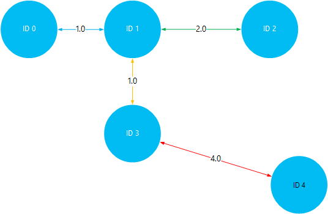

<properties
    pageTitle="Installeer en gebruik Giraph op Hadoop clusters in HDInsight | Microsoft Azure"
    description="Informatie over het aanpassen van de cluster HDInsight met Giraph en het gebruik van Giraph."
    services="hdinsight"
    documentationCenter=""
    authors="nitinme"
    manager="jhubbard"
    editor="cgronlun"
    tags="azure-portal"/>

<tags
    ms.service="hdinsight"
    ms.workload="big-data"
    ms.tgt_pltfrm="na"
    ms.devlang="na"
    ms.topic="article"
    ms.date="02/05/2016"
    ms.author="nitinme"/>

# Installeren en gebruiken van Giraph in HDInsight

Informatie over het aanpassen van Windows-gebaseerde HDInsight cluster met Giraph met actie Script en het gebruik van Giraph voor het verwerken van grootschalige grafieken. Zie voor meer informatie over het gebruik van Giraph met een Linux-gebaseerde clusters [Installeren Giraph op HDInsight Hadoop-clusters (Linux)](hdinsight-hadoop-giraph-install-linux.md).
 
U kunt Giraph op elk type cluster (Hadoop, Storm, HBase, Spark) installeren op Azure HDInsight met behulp van *De actie Script*. Een voorbeeld van een script Giraph installeren op een cluster HDInsight is beschikbaar in een blob Azure opslag voor alleen-lezen op [https://hdiconfigactions.blob.core.windows.net/giraphconfigactionv01/giraph-installer-v01.ps1](https://hdiconfigactions.blob.core.windows.net/giraphconfigactionv01/giraph-installer-v01.ps1). Het script werkt alleen met HDInsight cluster versie 3.1. Zie voor meer informatie over de versies van HDInsight cluster, [cluster versies van HDInsight](hdinsight-component-versioning.md).

**Verwante artikelen**

- [Installeer Giraph op HDInsight Hadoop-clusters (Linux)](hdinsight-hadoop-giraph-install-linux.md)
- [Clusters maken Hadoop in HDInsight](hdinsight-provision-clusters.md): algemene informatie over het maken van clusters van HDInsight.
- [Aanpassen HDInsight cluster met behulp van de actie Script][hdinsight-cluster-customize]: algemene informatie over het aanpassen van HDInsight clusters met actie Script.
- [Ontwikkelen scriptactie scripts voor HDInsight](hdinsight-hadoop-script-actions.md).

## Wat is Giraph?

<a href="http://giraph.apache.org/" target="_blank">Apache-Giraph</a> kunt u uitvoeren grafiek verwerkt met behulp van Hadoop en kunnen worden gebruikt met Azure HDInsight. Grafieken model relaties tussen objecten, zoals de verbindingen tussen routers op een groot netwerk zoals het Internet, of de relaties tussen mensen op sociale netwerken (ook wel aangeduid als een sociale grafiek). Verwerking van de grafiek kunt u de reden over de relaties tussen objecten in een grafiek, zoals:

- Identificeren van potentiële vrienden op basis van uw huidige relaties.
- De kortste route tussen twee computers in een netwerk identificeren.
- Berekening van de pagina rang van webpagina's.

## Installeren met behulp van portal Giraph

1. Beginnen met het maken van een cluster met de optie **Aangepast maken** zoals beschreven bij het [maken van Hadoop clusters in het HDInsight](hdinsight-provision-clusters.md#portal).
2. Op de pagina **Scriptacties** van de wizard, klikt u op **scriptactie toevoegen** voor meer informatie over de scriptactie zoals hieronder wordt weergegeven:

    ![Gebruik scriptactie voor het aanpassen van een cluster] (./media/hdinsight-hadoop-giraph-install/hdi-script-action-giraph.png "Gebruik scriptactie voor het aanpassen van een cluster")

    <table border='1'>
        <tr><th>Eigenschap</th><th>Waarde</th></tr>
        <tr><td>Naam</td>
            <td>Geef een naam voor de scriptactie. Bijvoorbeeld <b>Giraph installeren</b>.</td></tr>
        <tr><td>URI-script</td>
            <td>Geef de URI Uniform Resource Identifier () aan het script dat wordt aangeroepen voor het aanpassen van het cluster. Bijvoorbeeld: <i>https://hdiconfigactions.blob.core.windows.net/giraphconfigactionv01/giraph-installer-v01.ps1</i></td></tr>
        <tr><td>Knooppunttype</td>
            <td>Geef de knooppunten waarop het aangepaste script wordt uitgevoerd. U kunt <b>alle knooppunten</b>, <b>alleen knooppunten Head</b>of <b>alleen knooppunten werknemer</b>.
        <tr><td>Parameters</td>
            <td>Geef de parameters, indien nodig door het script. Het script Giraph installeren vereist geen parameters, zodat u kunt deze leeg laten.</td></tr>
    </table>

    U kunt meer dan één scriptactie om meerdere onderdelen op het cluster toevoegen. Nadat u de scripts hebt toegevoegd, klikt u op het vinkje om te beginnen met het maken van het cluster.

## Giraph gebruiken

We gebruiken het voorbeeld SimpleShortestPathsComputation om aan te tonen van de elementaire <a href = "http://people.apache.org/~edwardyoon/documents/pregel.pdf">Pregel</a> uitvoering voor het zoeken naar de kortste route tussen objecten in een grafiek. Gebruik de volgende stappen om de voorbeeldgegevens en het monster oppervlak uploaden, een taak uitvoeren met behulp van het voorbeeld SimpleShortestPathsComputation en vervolgens de resultaten bekijken.

1. Een voorbeeld van gegevensbestand uploaden naar Azure Blob-opslag. Maak een nieuw bestand met de naam **tiny_graph.txt**op uw lokale werkstation. Zij moet de volgende regels te bevatten:

        [0,0,[[1,1],[3,3]]]
        [1,0,[[0,1],[2,2],[3,1]]]
        [2,0,[[1,2],[4,4]]]
        [3,0,[[0,3],[1,1],[4,4]]]
        [4,0,[[3,4],[2,4]]]

    Upload het bestand tiny_graph.txt naar de primaire opslag voor uw cluster HDInsight. Zie [gegevens voor taken in HDInsight Hadoop uploaden](hdinsight-upload-data.md)voor instructies over het uploaden van gegevens.

    Deze gegevens beschrijft de relatie tussen objecten in een gestuurde grafiek, in de indeling [bron\_-id, de bron\_waarde [[dest\_id], [rand\_waarde],...]]. Elke regel staat voor een relatie tussen een **bron\_id** object en een of meer **dest\_id** objecten. Het **rand\_waarde** (of gewicht) kan worden beschouwd als de sterkte of de afstand van de verbinding tussen **source_id** en **doel\_id**.

    Getekend, en de waarde (of gewicht) gebruikt als de afstand tussen objecten, de bovenstaande gegevens als volgt uitzien:

    

4. Voorbeeld van de SimpleShortestPathsComputation worden uitgevoerd. De volgende Azure PowerShell-cmdlets gebruiken om uit te voeren in het voorbeeld met behulp van het bestand tiny_graph.txt als invoer. 

    [AZURE.INCLUDE [upgrade-powershell](../../includes/hdinsight-use-latest-powershell.md)]

        $clusterName = "clustername"
        # Giraph examples jar
        $jarFile = "wasbs:///example/jars/giraph-examples.jar"
        # Arguments for this job
        $jobArguments = "org.apache.giraph.examples.SimpleShortestPathsComputation",
                        "-ca", "mapred.job.tracker=headnodehost:9010",
                        "-vif", "org.apache.giraph.io.formats.JsonLongDoubleFloatDoubleVertexInputFormat",
                        "-vip", "wasbs:///example/data/tiny_graph.txt",
                        "-vof", "org.apache.giraph.io.formats.IdWithValueTextOutputFormat",
                        "-op",  "wasbs:///example/output/shortestpaths",
                        "-w", "2"
        # Create the definition
        $jobDefinition = New-AzureHDInsightMapReduceJobDefinition
          -JarFile $jarFile
          -ClassName "org.apache.giraph.GiraphRunner"
          -Arguments $jobArguments

        # Run the job, write output to the Azure PowerShell window
        $job = Start-AzureHDInsightJob -Cluster $clusterName -JobDefinition $jobDefinition
        Write-Host "Wait for the job to complete ..." -ForegroundColor Green
        Wait-AzureHDInsightJob -Job $job
        Write-Host "STDERR"
        Get-AzureHDInsightJobOutput -Cluster $clusterName -JobId $job.JobId -StandardError
        Write-Host "Display the standard output ..." -ForegroundColor Green
        Get-AzureHDInsightJobOutput -Cluster $clusterName -JobId $job.JobId -StandardOutput

    Vervang in het bovenstaande voorbeeld **clusternaam** met de naam van het cluster HDInsight met Giraph geïnstalleerd.

5. De resultaten bekijken. Nadat de afdruktaak is voltooid, de resultaten worden opgeslagen in twee uitvoerbestanden in het __wasbs: / / / voorbeeld/out/shotestpaths__ map. De bestanden worden __deel-m-00001__ en __deel-m-00002__genoemd. Voer de volgende stappen uit om te downloaden en te bekijken van de uitvoer:

        $subscriptionName = "<SubscriptionName>"       # Azure subscription name
        $storageAccountName = "<StorageAccountName>"   # Azure Storage account name
        $containerName = "<ContainerName>"             # Blob storage container name

        # Select the current subscription
        Select-AzureSubscription $subscriptionName

        # Create the Storage account context object
        $storageAccountKey = Get-AzureStorageKey $storageAccountName | %{ $_.Primary }
        $storageContext = New-AzureStorageContext -StorageAccountName $storageAccountName -StorageAccountKey $storageAccountKey

        # Download the job output to the workstation
        Get-AzureStorageBlobContent -Container $containerName -Blob example/output/shortestpaths/part-m-00001 -Context $storageContext -Force
        Get-AzureStorageBlobContent -Container $containerName -Blob example/output/shortestpaths/part-m-00002 -Context $storageContext -Force

    Dit wordt de structuur van de __uitvoer-voorbeeld/shortestpaths__ map maken in de huidige map op uw werkstation en de twee uitvoerbestanden naar die locatie te downloaden.

    De __kat__ -cmdlet gebruikt om de inhoud van de bestanden weer te geven:

        Cat example/output/shortestpaths/part*

    De uitvoer ziet er ongeveer als volgt:

        0   1.0
        4   5.0
        2   2.0
        1   0.0
        3   1.0

    Het SimpleShortestPathComputation voorbeeld vaststaat dat beginnen met object-ID 1 en de kortste route op andere objecten. Zodat de uitvoer moet worden gelezen als `destination_id distance`, waarbij afstand is de waarde (of gewicht) van de randen gereisd tussen object-ID 1 en de doel-ID.

    Dit visualiseren, kunt u de resultaten controleren door de kortste paden reist tussen-ID 1 en alle andere objecten. Houd er rekening mee dat het kortste pad tussen-ID 1 en 4-ID 5 is. Dit is de totale afstand tussen ID 1 en 3, en vervolgens ID 3 en 4.

    

## Giraph met Aure PowerShell installeren

Zie [clusters van HDInsight aanpassen met behulp van de actie Script](hdinsight-hadoop-customize-cluster.md#call_scripts_using_powershell).  Het voorbeeld laat zien hoe Spark met Azure PowerShell te installeren. U moet het script voor het gebruik van [https://hdiconfigactions.blob.core.windows.net/giraphconfigactionv01/giraph-installer-v01.ps1](https://hdiconfigactions.blob.core.windows.net/giraphconfigactionv01/giraph-installer-v01.ps1)aanpassen.

## Giraph met .NET SDK installeren

Zie [clusters van HDInsight aanpassen met behulp van de actie Script](hdinsight-hadoop-customize-cluster.md#call_scripts_using_azure_powershell). Het voorbeeld laat zien hoe Spark met de .NET SDK installeren. U moet het script voor het gebruik van [https://hdiconfigactions.blob.core.windows.net/giraphconfigactionv01/giraph-installer-v01.ps1](https://hdiconfigactions.blob.core.windows.net/giraphconfigactionv01/giraph-installer-v01.ps1)aanpassen.

## Zie ook

- [Installeer Giraph op HDInsight Hadoop-clusters (Linux)](hdinsight-hadoop-giraph-install-linux.md)
- [Clusters maken Hadoop in HDInsight](hdinsight-provision-clusters.md): algemene informatie over het maken van clusters van HDInsight.
- [Aanpassen HDInsight cluster met behulp van de actie Script][hdinsight-cluster-customize]: algemene informatie over het aanpassen van HDInsight clusters met actie Script.
- [Ontwikkelen scriptactie scripts voor HDInsight](hdinsight-hadoop-script-actions.md).
- [Installeren en gebruiken van Spark op clusters HDInsight][hdinsight-install-spark]: actie Script voorbeeld over het installeren van Spark.
- [R installeren op clusters HDInsight][hdinsight-install-r]: de actie Script voorbeeld over het installeren van R.
- [Solr installeren op HDInsight clusters](hdinsight-hadoop-solr-install.md): actie Script voorbeeld over het installeren van Solr.

[tools]: https://github.com/Blackmist/hdinsight-tools
[aps]: http://azure.microsoft.com/documentation/articles/install-configure-powershell/

[powershell-install]: ../powershell-install-configure.md
[hdinsight-provision]: hdinsight-provision-clusters.md
[hdinsight-install-r]: hdinsight-hadoop-r-scripts.md
[hdinsight-install-spark]: hdinsight-hadoop-spark-install.md
[hdinsight-cluster-customize]: hdinsight-hadoop-customize-cluster.md
