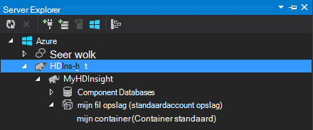

<properties
    pageTitle="Gebruik C# met component en varkens op Hadoop in HDInsight | Microsoft Azure"
    description="Leren werken met C# door de gebruiker gedefinieerde functies (UDF) met component en streaming in Azure HDInsight varkens."
    services="hdinsight"
    documentationCenter=""
    authors="Blackmist"
    manager="jhubbard"
    editor="cgronlun"
    tags="azure-portal"/>

<tags
    ms.service="hdinsight"
    ms.workload="big-data"
    ms.tgt_pltfrm="na"
    ms.devlang="dotnet"
    ms.topic="article"
    ms.date="10/28/2016"
    ms.author="larryfr"/>

#C# door de gebruiker gedefinieerde functies gebruiken met de component en varken streaming op Hadoop in HDInsight

Component en varkens zijn ideaal voor het werken met gegevens in Azure, HDInsight, maar soms moet u een meer algemene taal. Zowel de component en varkens kunt u externe code door de gebruiker gedefinieerde functies (UDF's) of streaming aanroepen.

In dit document, informatie over het gebruik van C# met component en varken.

##Vereisten

* Windows 7 of nieuwer.

* Visual Studio met de volgende versies:

    * Visual Studio 2012 Professional/Premium/Ultimate met [Update 4](http://www.microsoft.com/download/details.aspx?id=39305)

    * Visual Studio 2013 Gemeenschap/Professional/Premium/Ultimate met [Update 4](https://www.microsoft.com/download/details.aspx?id=44921)

    * Visual Studio 2015

* Hadoop op de cluster HDInsight - Zie [bepaling een cluster van HDInsight](hdinsight-provision-clusters.md) voor stappen voor het maken van een cluster

* Hadoop-hulpprogramma's voor Visual Studio. Zie [aan de slag met HDInsight Hadoop Tools for Visual Studio](hdinsight-hadoop-visual-studio-tools-get-started.md) voor stapsgewijze instructies voor het installeren en configureren van de hulpprogramma's.

##.NET op HDInsight

De .NET common language runtime (CLR) en -kaders worden standaard geïnstalleerd op Windows gebaseerde HDInsight clusters. Hiermee kunt u een C#-toepassingen gebruiken met de component en streaming varken (gegevens worden doorgegeven tussen component/varken en de C#-toepassing via stdout/stdin).

> [AZURE.NOTE] Er is momenteel geen ondersteuning voor UDF's van .NET Framework op HDInsight op basis van Linux-clusters worden uitgevoerd. 

##.NET en streaming

Streaming omvat het component en varkens gegevens naar een externe toepassing worden doorgegeven via stdout en ontvangen van de resultaten via stdin. Voor C#-toepassingen, u kunt dit eenvoudig doen `Console.ReadLine()` en `Console.WriteLine()`.

Aangezien component en varken de toepassing in runtime niet starten moet, moet de **Console** toepassingssjabloon voor C# projecten worden gebruikt.

##Component en C & #35;

###De C#-project maken

1. Visual Studio openen en maken van een nieuwe oplossing. **Consoletoepassing**selecteren voor het projecttype en de naam van het nieuwe project **HiveCSharp**.

2. De inhoud van de **Program.cs** vervangen door het volgende:

        using System;
        using System.Security.Cryptography;
        using System.Text;
        using System.Threading.Tasks;

        namespace HiveCSharp
        {
            class Program
            {
                static void Main(string[] args)
                {
                    string line;
                    // Read stdin in a loop
                    while ((line = Console.ReadLine()) != null)
                    {
                        // Parse the string, trimming line feeds
                        // and splitting fields at tabs
                        line = line.TrimEnd('\n');
                        string[] field = line.Split('\t');
                        string phoneLabel = field[1] + ' ' + field[2];
                        // Emit new data to stdout, delimited by tabs
                        Console.WriteLine("{0}\t{1}\t{2}", field[0], phoneLabel, GetMD5Hash(phoneLabel));
                    }
                }
                /// 

                /// Returns an MD5 hash for the given string
                /// 

                /// <param name="input">string value</param>
                /// <returns>an MD5 hash</returns>
                static string GetMD5Hash(string input)
                {
                    // Step 1, calculate MD5 hash from input
                    MD5 md5 = System.Security.Cryptography.MD5.Create();
                    byte[] inputBytes = System.Text.Encoding.ASCII.GetBytes(input);
                    byte[] hash = md5.ComputeHash(inputBytes);

                    // Step 2, convert byte array to hex string
                    StringBuilder sb = new StringBuilder();
                    for (int i = 0; i < hash.Length; i++)
                    {
                        sb.Append(hash[i].ToString("x2"));
                    }
                    return sb.ToString();
                }
            }
        }

3. Compileer het project.

###Uploaden naar opslag

1. Open in Visual Studio **Server Explorer**.

3. Vouw **Azure**en vouw vervolgens de **HDInsight**.

4. Als u wordt gevraagd, voert u uw referenties Azure abonnement en klik op **Aanmelden**.

5. Vouw het HDInsight-cluster dat u wilt deze toepassing te implementeren, en vouw vervolgens de **Standaardaccount voor opslag**.

    

6. Dubbelklik op **Standaard Container** voor het cluster. Hiermee opent u een nieuw venster met de inhoud van de standaardcontainer weergegeven.

7. Klik op het pictogram uploaden en blader naar de map **bin\debug** voor het project **HiveCSharp** . Ten slotte selecteert u het bestand **HiveCSharp.exe** en klik op **Ok**.

    

8. Nadat het uploaden is voltooid, kunt u zijn kunnen de toepassing van een component query gebruiken.

###Component van de query

1. Open in Visual Studio **Server Explorer**.

2. Vouw **Azure**en vouw vervolgens de **HDInsight**.

5. Klik met de rechtermuisknop op het cluster dat u de toepassing **HiveCSharp** geïmplementeerd en selecteer vervolgens **een query component**.

6. Gebruik de component-query de volgende:

        add file wasbs:///HiveCSharp.exe;

        SELECT TRANSFORM (clientid, devicemake, devicemodel)
        USING 'HiveCSharp.exe' AS
        (clientid string, phoneLabel string, phoneHash string)
        FROM hivesampletable
        ORDER BY clientid LIMIT 50;

    Hiermee wordt de `clientid`, `devicemake`, en `devicemodel` -velden van `hivesampletable`, en geeft u de velden aan de toepassing van de HiveCSharp.exe. De query verwacht dat de toepassing op de drie velden die zijn opgeslagen als resultaat `clientid`, `phoneLabel`, en `phoneHash`. De query verwacht ook zoeken naar HiveCSharp.exe in de hoofdmap van de standaard opslag container (`add file wasbs:///HiveCSharp.exe`).

5. Klik op **verzenden** om de taak aan het cluster HDInsight indienen. Het venster **Taakoverzicht component** wordt geopend.

6. Klik op **vernieuwen** om de samenvatting te vernieuwen totdat de **Taakstatus** gewijzigd in **voltooid**. De uitvoer van de taak, klikt u op **Taak uitvoer**.

##Varkens en C & #35;

###De C#-project maken

1. Visual Studio openen en maken van een nieuwe oplossing. **Consoletoepassing**selecteren voor het projecttype en de naam van het nieuwe project **PigUDF**.

2. De inhoud van het bestand **Program.cs** wordt vervangen door het volgende:

        using System;

        namespace PigUDF
        {
            class Program
            {
                static void Main(string[] args)
                {
                    string line;
                    // Read stdin in a loop
                    while ((line = Console.ReadLine()) != null)
                    {
                        // Fix formatting on lines that begin with an exception
                        if(line.StartsWith("java.lang.Exception"))
                        {
                            // Trim the error info off the beginning and add a note to the end of the line
                            line = line.Remove(0, 21) + " - java.lang.Exception";
                        }
                        // Split the fields apart at tab characters
                        string[] field = line.Split('\t');
                        // Put fields back together for writing
                        Console.WriteLine(String.Join("\t",field));
                    }
                }
            }
        }

    Deze toepassing wordt geparseerd regels afkomstig van varkens en herformatteren regels die beginnen met `java.lang.Exception`.

3. **Program.cs**opslaan en vervolgens het project samenstellen.

###De toepassing uploaden

1. Streaming varken verwacht dat de toepassing op het lokale cluster bestandssysteem. Extern bureaublad inschakelen voor het cluster HDInsight en vervolgens verbinding maken met het door de instructies op [verbinding maken met clusters van HDInsight met RDP](hdinsight-administer-use-management-portal.md#rdp).

2. Wanneer een verbinding, **PigUDF.exe** van de map **bin/debug** voor het PigUDF-project op uw lokale computer kopiëren en plakken in de map **% PIG_HOME %** in het cluster.

###Gebruik de toepassing van het varken Latijn

1. Start de Hadoop-opdrachtregel met behulp van de **opdrachtregel Hadoop** -pictogram op het bureaublad van de extern bureaublad-sessie.

2. Het varken vanaf de opdrachtregel start, gebruikt u het volgende:

        cd %PIG_HOME%
        bin\pig

    U krijgt een `grunt>` vragen.

3. Typ het volgende om een eenvoudige varken taak uitvoeren met behulp van de .NET Framework-toepassing:

        DEFINE streamer `pigudf.exe` SHIP('pigudf.exe');
        LOGS = LOAD 'wasbs:///example/data/sample.log' as (LINE:chararray);
        LOG = FILTER LOGS by LINE is not null;
        DETAILS = STREAM LOG through streamer as (col1, col2, col3, col4, col5);
        DUMP DETAILS;

    De `DEFINE` instructie maakt u een alias van `streamer` voor de toepassingen van pigudf.exe en `SHIP` het verdeeld over de knooppunten in het cluster. Later `streamer` wordt gebruikt met de `STREAM` -operator en de gegevens verwerken van de regels in het logboek opgenomen als een reeks kolommen.

> [AZURE.NOTE] De naam van de toepassing die wordt gebruikt voor streaming moet worden omgeven door de \` (backtick) teken als alias, en ' (enkel aanhalingsteken) gebruikt in combinatie met `SHIP`.

3. Na het invoeren van de laatste regel, moet de taak beginnen. Uiteindelijk wordt geretourneerd uitvoer de volgende strekking:

        (2012-02-03 20:11:56 SampleClass5 [WARN] problem finding id 1358451042 - java.lang.Exception)
        (2012-02-03 20:11:56 SampleClass5 [DEBUG] detail for id 1976092771)
        (2012-02-03 20:11:56 SampleClass5 [TRACE] verbose detail for id 1317358561)
        (2012-02-03 20:11:56 SampleClass5 [TRACE] verbose detail for id 1737534798)
        (2012-02-03 20:11:56 SampleClass7 [DEBUG] detail for id 1475865947)

##Samenvatting

In dit document, kunt u het gebruik van een .NET Framework-toepassing van de component en varkens op HDInsight hebt geleerd. Als u wilt leren hoe Python gebruiken met de component en varken Zie [Python gebruiken met de component en varken in HDInsight](hdinsight-python.md).

Voor andere manieren van varkens en de component te gebruiken en te leren over het gebruik van MapReduce, raadpleegt u het volgende:

* [Gebruik component met HDInsight](hdinsight-use-hive.md)

* [Varken met HDInsight gebruiken](hdinsight-use-pig.md)

* [MapReduce gebruiken met HDInsight](hdinsight-use-mapreduce.md)
