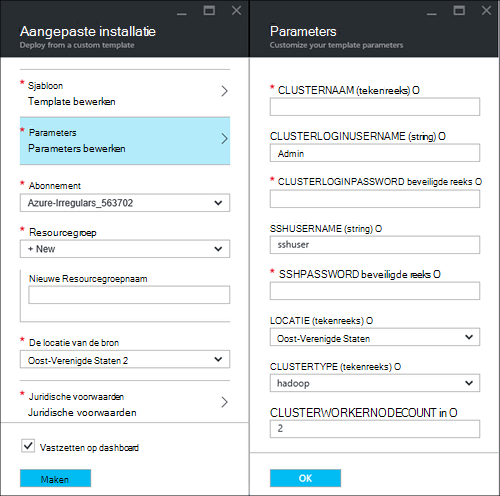
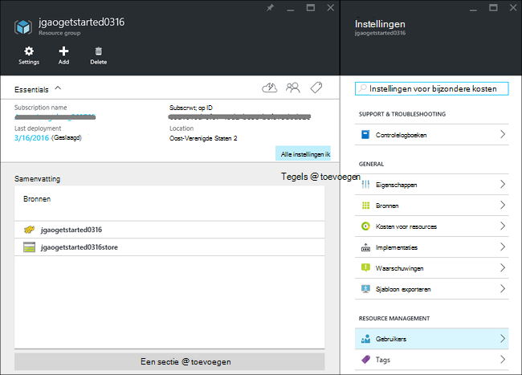
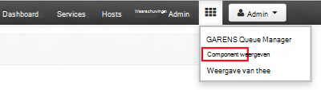
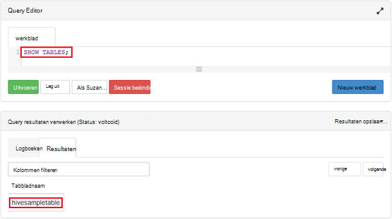

<properties
    pageTitle="Linux-zelfstudie: aan de slag met Hadoop en component | Microsoft Azure"
    description="Volg deze Linux-zelfstudie aan de slag met Hadoop in HDInsight. Informatie over het inrichten van Linux-clusters en opvragen van gegevens met de component."
    services="hdinsight"
    documentationCenter=""
    authors="mumian"
    manager="jhubbard"
    editor="cgronlun"
    tags="azure-portal"/>

<tags
    ms.service="hdinsight"
    ms.devlang="na"
    ms.topic="hero-article"
    ms.tgt_pltfrm="na"
    ms.workload="big-data"
    ms.date="09/14/2016"
    ms.author="jgao"/>

# Hadoop zelfstudie: aan de slag met Linux-gebaseerde Hadoop in HDInsight

> [AZURE.SELECTOR]
- [Op basis van Linux](hdinsight-hadoop-linux-tutorial-get-started.md)
- [Op basis van Windows](hdinsight-hadoop-tutorial-get-started-windows.md)

Informatie over het maken van Linux-gebaseerde [Hadoop](http://hadoop.apache.org/) clusters in HDInsight en component taken uitvoeren in HDInsight. [Apache-component](https://hive.apache.org/) is het populairste onderdeel in het Hadoop-ecosysteem. Momenteel HDInsight wordt geleverd met 4 verschillende clustertypen: [Hadoop](hdinsight-hadoop-introduction.md), [Spark](hdinsight-apache-spark-overview.md), [HBase](hdinsight-hbase-overview.md) en [Storm](hdinsight-storm-overview.md).  Elk clustertype ondersteunt verschillende onderdelen. Alle ondersteund 4 cluster component. Zie voor een lijst met ondersteunde onderdelen in HDInsight, [Wat is er nieuw in de versies van Hadoop cluster geleverd door HDInsight?](hdinsight-component-versioning.md)  

[AZURE.INCLUDE [delete-cluster-warning](../../includes/hdinsight-delete-cluster-warning.md)]

## Vereisten

Voordat u deze zelfstudie begint, moet u hebben:

- **Azure abonnement**: een gratis proefperiode één maand account maken, gaat u naar [azure.microsoft.com/free](https://azure.microsoft.com/free).

### Access controle-eisen

[AZURE.INCLUDE [access-control](../../includes/hdinsight-access-control-requirements.md)]

## Cluster maken

De meeste taken Hadoop zijn batchverwerkingen. U maakt een cluster sommige taken uitvoeren en vervolgens het cluster te verwijderen. In dit gedeelte maakt u een Linux-gebaseerde Hadoop cluster in HDInsight met behulp van [Bronbeheer Azure sjabloon](../resource-group-template-deploy.md). Sjabloon voor bronbeheer is volledig aanpasbaar; het is eenvoudig om te maken van Azure bronnen zoals HDInsight. Resource Manager sjabloon ervaring is niet vereist voor deze zelfstudie te volgen. Zie voor andere methoden voor het cluster maken en wat zijn de eigenschappen die worden gebruikt in deze zelfstudie, [clusters HDInsight maken](hdinsight-hadoop-provision-linux-clusters.md). De bronnenbeheerder sjabloon gebruikt in deze zelfstudie bevindt zich in een openbare blob container [https://hditutorialdata.blob.core.windows.net/armtemplates/create-linux-based-hadoop-cluster-in-hdinsight.json](https://hditutorialdata.blob.core.windows.net/armtemplates/create-linux-based-hadoop-cluster-in-hdinsight.json). 

1. Klik op de onderstaande afbeelding om te melden bij Azure en open de sjabloon Resource Manager in de Portal Azure. 

    

2. Voer de volgende gegevens van de bladeserver **Parameters** :

    .

    - **Clusternaam**: Voer een naam voor het Hadoop-cluster dat u wilt maken.
    - **Cluster-aanmeldingsnaam en wachtwoord**: de standaard login-naam **admin**is.
    - **SSH-gebruikersnaam en wachtwoord**: de standaardgebruikersnaam is **sshuser**.  U kunt deze wijzigen. 
    
    Andere parameters zijn optioneel voor deze zelfstudie te volgen. U kunt ze laten zoals ze zijn. 
    
    Elk cluster heeft een afhankelijkheid van Azure Blob storage-account. Meestal wordt aangeduid als de standaardaccount voor opslag. HDInsight cluster en de standaardaccount voor opslag moeten worden kan zich bevinden in hetzelfde gebied, Azure. Clusters worden niet verwijdert, de opslag-account. In de sjabloon, de naam van de standaard opslag gedefinieerd als de naam van het cluster met 'store' toegevoegd. 
    
3. Klik op **OK** om op te slaan van de parameters.
4. Invoeren van de blade **-implementatie aangepaste** **naam nieuwe resourcegroep** als u wilt een nieuwe resourcegroep te maken.  De resourcegroep is een container waarin de account afhankelijk opslag en andere s van het cluster worden gegroepeerd. De locatie van de resource kan afwijken van de locatie van het cluster.
5. Klik op de **juridische voorwaarden**en klik vervolgens op **maken**.
6. Controleer of het selectievakje **pincode op het dashboard** is geselecteerd en klik vervolgens op **maken**. Ziet u een nieuwe tegel met de titel **sjabloon distribueren implementatie**. Duurt ongeveer 20 minuten over het maken van een cluster. 
7.  Als het cluster is gemaakt, wordt het bijschrift van de tegel gewijzigd in de opgegeven naam van de resourcegroep. En de portal twee bladen automatisch met het cluster en de clusterinstellingen wordt geopend. 

    .

    Er zijn twee bronnen die worden vermeld, de standaardaccount voor de opslag en het cluster.

##Component-query's uitvoeren

[Apache-component](hdinsight-use-hive.md) is de meest populaire onderdeel dat wordt gebruikt in HDInsight. Er zijn veel manieren om component projecten uitgevoerd in HDInsight. In deze zelfstudie gebruikt u de component Ambari weergave van de portal voor het uitvoeren van sommige taken component. Zie voor andere methoden voor het verzenden van taken voor component, [Gebruik de component in HDInsight](hdinsight-use-hive.md).

1. Ga naar **https://&lt;Clusternaam >. azurehdinsight.net**, waarbij &lt;Clusternaam > het cluster wordt u hebt gemaakt in de vorige sectie te openen Ambari.
2. Voer het Hadoop-gebruikersnaam en wachtwoord die u hebt opgegeven in de vorige sectie. De standaardgebruikersnaam is **admin**.
3. Open **Component weergeven** zoals in de volgende schermafdruk:

    .
4. Plak de volgende instructies voor HiveQL in het werkblad in de __Query Editor__ -sectie van de pagina:

        SHOW TABLES;

    >[AZURE.NOTE] Puntkomma is vereist voor de component.       
        
5. Klik op __uitvoeren__. Een gedeelte van de __Resultaten van de Query__ moet worden weergegeven onder Query Editor en informatie over de taak weergeven. 

    Nadat de query is voltooid, wordt het gedeelte van de __Resultaten van de Query__ de resultaten van de bewerking weergegeven. Er wordt een tabel met de naam **hivesampletable**. Deze component voorbeeldtabel wordt geleverd met alle HDInsight-clusters.

    .

6. Herhaal stap 4 en 5 tot en met de volgende query:

        SELECT * FROM hivesampletable;

    > [AZURE.TIP] Opmerking de vervolgkeuzelijst __resultaten opslaan__ in de linkerbovenhoek van de sectie __Queryresultaten proces__ ; u kunt dit gebruiken om de resultaten downloaden of opslaan in HDInsight opslag als een CSV-bestand.

7. Klik op **Overzicht** voor een overzicht van de taken.

Nadat u een component taak hebt voltooid, kunt u [de resultaten in Azure SQL-database of SQL Server-database te exporteren](hdinsight-use-sqoop-mac-linux.md), kunt u ook [visualiseren van de resultaten in Excel](hdinsight-connect-excel-power-query.md). Zie voor meer informatie over het gebruik van de component in HDInsight [Gebruik component en HiveQL met Hadoop in HDInsight een voorbeeldbestand van Apache log4j analyseren](hdinsight-use-hive.md).

##Opschonen van de zelfstudie

Nadat u de zelfstudie hebt voltooid, kunt u het cluster te verwijderen. Uw gegevens worden opgeslagen in Azure-opslag met HDInsight, zodat u een cluster veilig verwijderen kunt wanneer het niet in gebruik. Er zijn ook in rekening gebracht voor een cluster HDInsight, zelfs wanneer deze niet in gebruik. Aangezien de kosten voor het cluster vele malen meer dan de kosten voor opslag zijn, is het zinvol economische clusters verwijderen wanneer ze niet in gebruik zijn. 

>[AZURE.NOTE] [Azure Data Factory](hdinsight-hadoop-create-linux-clusters-adf.md)gebruikt, kunt u HDInsight clusters maken op aanvraag en een TimeToLive instellen voor het automatisch verwijderen van de clusters. 

**Het cluster en/of de standaard opslag-account verwijderen**

1. Log in om de [Azure portal](https://portal.azure.com).
2. Klik op het vakje met de naam van de resource die u gebruikt bij het maken van het cluster uit de portal dashboard.
3. Klik op **verwijderen** in het blad resource te verwijderen van de resourcegroep met het cluster en de standaardaccount voor opslag; of klik op de naam van het cluster op de tegel **Resources** en klik vervolgens op **verwijderen** in het cluster blade. Let op: de bronnengroep wordt Verwijder de account van de opslag. Als u de opslag rekening houden, kiest u alleen het cluster te verwijderen.

## Volgende stappen

In deze zelfstudie kunt u het maken van een HDInsight op basis van Linux-cluster met behulp van de sjabloon voor een Resource Manager en het uitvoeren van eenvoudige query's voor component hebt geleerd.

Voor meer informatie over het analyseren van gegevens met HDInsight, Zie de volgende onderwerpen:

- Voor meer informatie over het gebruik van de component met HDInsight, met inbegrip van het uitvoeren van query's component van Visual Studio Zie [Gebruik component met HDInsight][hdinsight-use-hive].

- Een taal die wordt gebruikt voor het omzetten van gegevens, Zie [Gebruik varken met HDInsight]informatie over varkens,[hdinsight-use-pig].

- Meer informatie over MapReduce, kunt u programma's schrijven die gegevens betreffende Hadoop, [Gebruik MapReduce met HDInsight]Zie[hdinsight-use-mapreduce].

- Zie informatie over het analyseren van gegevens op HDInsight met de HDInsight's voor Visual Studio [aan de slag met Hadoop met Visual Studio tools for HDInsight](hdinsight-hadoop-visual-studio-tools-get-started.md).

Als u meteen aan de slag met uw eigen gegevens en wilt meer weten over hoe gegevens worden opgeslagen in HDInsight of het ophalen van gegevens in de HDInsight, Zie de volgende:

- Zie voor informatie over hoe HDInsight Azure blob-opslag gebruikt, [Gebruik Azure Blob-opslag met HDInsight](hdinsight-hadoop-use-blob-storage.md).

- Zie voor informatie over het uploaden van gegevens naar HDInsight, [uploaden van gegevens naar HDInsight][hdinsight-upload-data].

Als u meer informatie over het maken of beheren van een cluster HDInsight wilt, vindt u hier:

- Zie meer informatie over het beheren van uw HDInsight op basis van Linux-cluster, [clusters van HDInsight beheren met behulp van Ambari](hdinsight-hadoop-manage-ambari.md).

- Zie voor meer informatie over de opties die u selecteren kunt bij het maken van een cluster van HDInsight, [HDInsight op Linux met aangepaste opties maken](hdinsight-hadoop-provision-linux-clusters.md).

- Als u bekend met Linux en Hadoop bent, maar u wilt weten specifieke details van Hadoop op de HDInsight, raadpleegt u [werken met HDInsight op Linux](hdinsight-hadoop-linux-information.md). Deze bevat informatie zoals:

    * URL's voor services van het cluster, zoals Ambari en WebHCat
    * De locatie van de bestanden van Hadoop en voorbeelden over het lokale bestandssysteem.
    * Het gebruik van Azure opslag (WASB) in plaats van HDFS als de gegevens die standaard worden opgeslagen

[1]: ../HDInsight/hdinsight-hadoop-visual-studio-tools-get-started.md

[hdinsight-provision]: hdinsight-provision-clusters.md
[hdinsight-admin-powershell]: hdinsight-administer-use-powershell.md
[hdinsight-upload-data]: hdinsight-upload-data.md
[hdinsight-use-mapreduce]: hdinsight-use-mapreduce.md
[hdinsight-use-hive]: hdinsight-use-hive.md
[hdinsight-use-pig]: hdinsight-use-pig.md

[powershell-download]: http://go.microsoft.com/fwlink/p/?linkid=320376&clcid=0x409
[powershell-install-configure]: powershell-install-configure.md
[powershell-open]: powershell-install-configure.md#Install

[img-hdi-dashboard]: ./media/hdinsight-hadoop-tutorial-get-started-windows/HDI.dashboard.png
[img-hdi-dashboard-query-select]: ./media/hdinsight-hadoop-tutorial-get-started-windows/HDI.dashboard.query.select.png
[img-hdi-dashboard-query-select-result]: ./media/hdinsight-hadoop-tutorial-get-started-windows/HDI.dashboard.query.select.result.png
[img-hdi-dashboard-query-select-result-output]: ./media/hdinsight-hadoop-tutorial-get-started-windows/HDI.dashboard.query.select.result.output.png
[img-hdi-dashboard-query-browse-output]: ./media/hdinsight-hadoop-tutorial-get-started-windows/HDI.dashboard.query.browse.output.png
[image-hdi-clusterstatus]: ./media/hdinsight-hadoop-tutorial-get-started-windows/HDI.ClusterStatus.png
[image-hdi-gettingstarted-powerquery-importdata]: ./media/hdinsight-hadoop-tutorial-get-started-windows/HDI.GettingStarted.PowerQuery.ImportData.png
[image-hdi-gettingstarted-powerquery-importdata2]: ./media/hdinsight-hadoop-tutorial-get-started-windows/HDI.GettingStarted.PowerQuery.ImportData2.png
