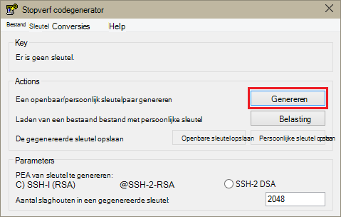
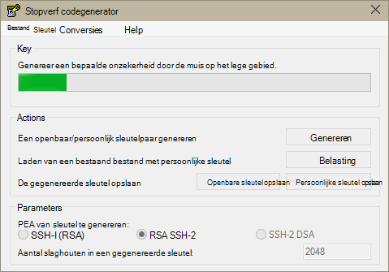
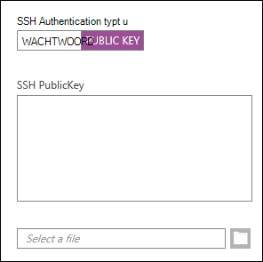
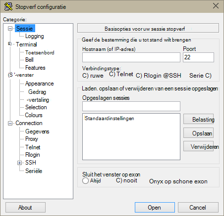
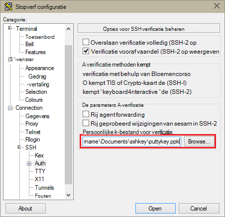
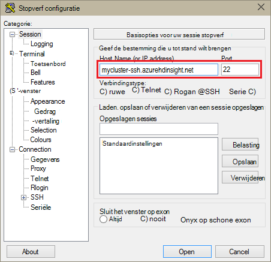
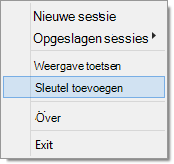
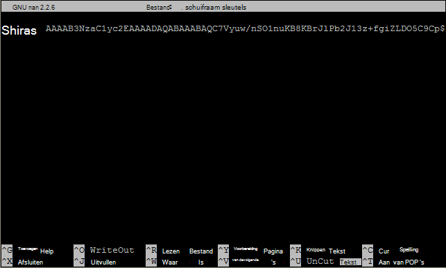

<properties
   pageTitle="SSH-sleutels gebruiken met Hadoop op Linux gebaseerde clusters van Windows | Microsoft Azure"
   description="Informatie over het maken en gebruiken van SSH sleutels voor de verificatie van de HDInsight op basis van Linux-clusters. Clusters vanaf Windows-clients verbinding met de PuTTY SSH-client."
   services="hdinsight"
   documentationCenter=""
   authors="Blackmist"
   manager="jhubbard"
   editor="cgronlun"
    tags="azure-portal"/>

<tags
   ms.service="hdinsight"
   ms.devlang="na"
   ms.topic="get-started-article"
   ms.tgt_pltfrm="na"
   ms.workload="big-data"
   ms.date="08/30/2016"
   ms.author="larryfr"/>

#SSH met Linux-gebaseerde Hadoop op HDInsight van Windows gebruiken

> [AZURE.SELECTOR]
- [Windows](hdinsight-hadoop-linux-use-ssh-windows.md)
- [Linux, Unix, OS X](hdinsight-hadoop-linux-use-ssh-unix.md)

[Secure Shell (SSH)](https://en.wikipedia.org/wiki/Secure_Shell) kunt u op afstand uitvoeren van bewerkingen op HDInsight Linux gebaseerde clusters met een opdrachtregel-interface. Dit document bevat informatie over verbinding maken met de HDInsight van Windows-clients met behulp van de PuTTY SSH-client.

> [AZURE.NOTE] De stappen in dit artikel wordt ervan uitgegaan dat u een Windows-client. Als u een client voor Linux, Unix of OS X, Zie [Gebruik SSH met Linux-gebaseerde Hadoop op HDInsight van Linux, Unix, of OS X](hdinsight-hadoop-linux-use-ssh-unix.md).
>
> Als u Windows 10 hebt en [Bash op Ubuntu in Windows](https://msdn.microsoft.com/commandline/wsl/about)gebruikt, kunt u de stappen in het [Gebruik van SSH met Linux-gebaseerde Hadoop op HDInsight van Linux, Unix, of OS X](hdinsight-hadoop-linux-use-ssh-unix.md) -document gebruiken.

##Vereisten

* **Stopverf** en **PuTTYGen** voor Windows-clients. Deze hulpprogramma's zijn beschikbaar op [http://www.chiark.greenend.org.uk/~sgtatham/putty/download.html](http://www.chiark.greenend.org.uk/~sgtatham/putty/download.html).

* Een moderne webbrowser die HTML5 ondersteunt.

OR

* [Azure CLI](../xplat-cli-install.md).

    [AZURE.INCLUDE [use-latest-version](../../includes/hdinsight-use-latest-cli.md)] 

##Wat is SSH?

SSH is een hulpprogramma voor het aanmelden bij en op afstand, opdrachten uitvoeren op een externe server. Met de Linux-gebaseerde HDInsight SSH maakt een versleutelde verbinding met het hoofdkantoor clusterknooppunt en biedt een opdrachtregel waarmee u opdrachten invoeren. Opdrachten worden vervolgens rechtstreeks op de server uitgevoerd.

###SSH-gebruikersnaam

Een SSH-gebruikersnaam is de naam die u gebruikt voor de verificatie van de cluster HDInsight. Wanneer u een SSH-gebruikersnaam tijdens het maken van het cluster opgeven, wordt deze gebruiker gemaakt op alle knooppunten in het cluster. Als het cluster is gemaakt, kunt u deze gebruikersnaam verbinding maken met de head clusterknooppunten van HDInsight. Uit het hoofd knooppunten kunt u vervolgens aansluiten op de knooppunten van de individuele werknemer.

###SSH wachtwoord of openbare sleutel

Een SSH-gebruiker kan een wachtwoord of een openbare sleutel gebruiken voor verificatie. Een wachtwoord is een string van de tekst die u aanbrengt, terwijl een openbare sleutel deel van een cryptografisch sleutelpaar dat wordt gegenereerd uitmaakt om u een unieke identificatie.

Een sleutel is veiliger dan een wachtwoord, maar er moet extra stappen uitvoeren om de sleutel te genereren en u moet de bestanden met de sleutel op een veilige locatie onderhouden. Als iedereen toegang tot de belangrijkste bestanden krijgt, krijgen zij toegang tot uw account. Of als u de belangrijkste bestanden kwijtraakt, wordt u niet aanmelden bij uw account.

Een paar sleutels bestaat uit een openbare sleutel (die wordt verzonden naar de server HDInsight) en een persoonlijke sleutel (die is opgeslagen op uw clientcomputer.) Wanneer u verbinding met de HDInsight-server via SSH maakt, de SSH client gebruikt de persoonlijke sleutel op uw computer om te verifiëren met de server.

##Maak een SSH-sleutel

Gebruik de volgende informatie als u van plan bent over het gebruik van SSH-sleutels in het cluster. Als u van plan bent over het gebruik van een wachtwoord, kunt u deze sectie overslaan.

1. Open PuTTYGen.

2. Voor het **Type sleutel voor het genereren van** **RSA SSH-2**selecteren en klik op **genereren**.

    

3. De muis in het gebied onder de voortgangsbalk, totdat de balk. De muis genereert willekeurige gegevens die wordt gebruikt om de sleutel te genereren.

    

    Nadat de sleutel is gegenereerd, kunt u de openbare sleutel wordt weergegeven.

4. Voor extra beveiliging kunt u een wachtwoordzin opgeven in het veld **wachtwoordzin sleutel** en typ dezelfde waarde in het veld **Bevestig wachtwoordzin** .

    

    > [AZURE.NOTE] Wij raden u ook een wachtwoordzin beveiligen voor de sleutel. Als u de wachtwoordzin vergeet, is er echter geen manier om te herstellen.

5. Klik op de **persoonlijke sleutel opslaan** om de sleutel opslaan in een bestand **.ppk** . Deze sleutel wordt gebruikt voor het verifiëren van uw HDInsight op basis van Linux-cluster.

    > [AZURE.NOTE] Als deze kan worden gebruikt voor toegang tot uw Linux-gebaseerde HDInsight-cluster, moet u deze sleutel op een veilige locatie opslaan.

6. Klik op de **openbare sleutel opslaan** om de sleutel opslaan als een **txt** -bestand. Hiermee kunt u de openbare sleutel in de toekomst opnieuw gebruiken bij het maken van extra HDInsight Linux gebaseerde clusters.

    > [AZURE.NOTE] De openbare sleutel wordt ook weergegeven boven PuTTYGen. U kunt met de rechtermuisknop op dit veld de waarde kopiëren en plak deze in een formulier bij het maken van een cluster met behulp van de Portal Azure.

##Een HDInsight op basis van Linux-cluster maken

Bij het maken van een HDInsight op basis van Linux-cluster, moet u de openbare sleutel die eerder is gemaakt opgeven. Er zijn twee manieren voor het maken van een HDInsight op basis van Linux-cluster van Windows-clients:

* Een portal op het web **Portal Azure** - gebruikt voor het maken van het cluster.

* Opdrachtregelopdrachten **CLI voor Mac, Linux en Windows azure** - gebruikt voor het maken van het cluster.

Elk van deze methoden moet de openbare sleutel. Zie voor volledige informatie over het maken van een HDInsight op basis van Linux-cluster [HDInsight bepaling Linux gebaseerde clusters](hdinsight-hadoop-provision-linux-clusters.md).

###Azure Portal

Wanneer u de [Azure Portal] [ preview-portal] een Linux-gebaseerde HDInsight als cluster wilt maken, moet u een **SSH gebruikersnaam**invoeren en selecteer **Openbare SSH-sleutel**of **wachtwoord** op te geven.

Als u **Openbare SSH-sleutel**selecteert, kunt u ofwel de openbare sleutel plakken (weergegeven in de __openbare sleutel voor plakken in OpenSSH toegelaten\_sleutels bestand__ in PuttyGen, veld) in het veld __SSH PublicKey__ of selecteer __een bestand selecteren__ om te bladeren en selecteer het bestand met de openbare sleutel.

Dit maakt een aanmelding voor de opgegeven gebruiker en kan wachtwoordverificatie of verificatie SSH-sleutel.

###Opdrachtregel-Interface voor Mac, Linux en Windows Azure

U kunt de [CLI voor Mac, Linux en Windows Azure](../xplat-cli-install.md) een nieuw cluster maken met behulp van de `azure hdinsight cluster create` opdracht.

Zie voor meer informatie over het gebruik van deze opdracht [bepaling Hadoop Linux-clusters in HDInsight met aangepaste opties](hdinsight-hadoop-provision-linux-clusters.md).

##Verbinding maken met een cluster van Linux-gebaseerde HDInsight

1. Open PuTTY.

    

2. Als u een SSH-sleutel hebt opgegeven toen u uw gebruikersaccount hebt gemaakt, moet u de volgende stap schakelt u de persoonlijke sleutel moet worden gebruikt bij het verifiëren van het cluster uitvoeren:

    In de **categorie**, vouw van **verbinding**, **SSH**uit en selecteer **verificatie**. Ten slotte klikt u op **Bladeren** en selecteer het bestand .ppk met uw persoonlijke sleutel.

    

3. Selecteer in de **categorie** **sessie**. Voer de SSH-adres van de server HDInsight in het veld **hostnaam (of het IP-adres)** van het scherm **basisopties voor uw sessie stopverf** . Er zijn twee mogelijke SSH adressen die u gebruiken kunt wanneer u verbinding maakt met een cluster:

    * __Hoofd knooppuntadres__: gebruiken voor verbinding met het hoofdkantoor knooppunt van het cluster, de clusternaam vervolgens **-ssh.azurehdinsight.net**. Bijvoorbeeld **mijncluster ssh.azurehdinsight.net**.
    
    * __Rand knooppuntadres__: als u verbinding met een R-Server op HDInsight cluster maakt, kunt u de Server R randknooppunt via het adres __RServer.CLUSTERNAME.ssh.azurehdinsight.net__, waarbij de CLUSTERNAAM de naam van het cluster is. Bijvoorbeeld __RServer.mycluster.ssh.azurehdinsight.net__.

    

4. Om de verbindingsgegevens op voor toekomstig gebruik opslaan, typ een naam voor deze verbinding onder **Opgeslagen sessies**en klik vervolgens op **Opslaan**. De verbinding wordt toegevoegd aan de lijst met opgeslagen sessies.

5. Klik op **Open** verbinding maken met het cluster.

    > [AZURE.NOTE] Als dit de eerste keer dat u verbinding hebt met het cluster, ontvangt u een beveiligingswaarschuwing. Dit is normaal. Selecteer **Ja** om de cache van de server RSA2 toets om door te gaan.

6. Wanneer dat wordt gevraagd, voert u de gebruiker die u hebt opgegeven bij het maken van het cluster. Als u een wachtwoord voor de gebruiker hebt opgegeven, wordt u gevraagd deze ook invoeren.

> [AZURE.NOTE] De bovenstaande stappen wordt ervan uitgegaan dat u poort 22, maakt verbinding met de primaire headnode op de cluster HDInsight. Als u poort 23 gebruikt, maakt u verbinding met de secundaire. Zie voor meer informatie over de hoofd-knooppunten, [beschikbaarheid en betrouwbaarheid van Hadoop clusters in het HDInsight](hdinsight-high-availability-linux.md).

###Verbinding maken met de knooppunten van de werknemer

De werknemer knooppunten zijn niet rechtstreeks toegankelijk van buiten het datacenter Azure maar toegankelijk zijn vanaf het hoofd clusterknooppunt via SSH.

Als u een SSH-sleutel hebt opgegeven toen u uw gebruikersaccount hebt gemaakt, moet u de volgende stappen uit om de persoonlijke sleutel wordt gebruikt bij het verifiëren van het cluster als u verbinding met de werknemer knooppunten wilt uitvoeren.

1. Bloemencorso van [http://www.chiark.greenend.org.uk/~sgtatham/putty/download.html](http://www.chiark.greenend.org.uk/~sgtatham/putty/download.html)installeren. Dit hulpprogramma wordt gebruikt om de SSH-sleutels in de cache voor stopverf.

2. Bloemencorso worden uitgevoerd. Het wordt verkleind tot een pictogram in de lade van de status. Klik met de rechtermuisknop op het pictogram en selecteer de **Sleutel toevoegen**.

    

3. Wanneer het bladerdialoogvenster wordt weergegeven, selecteert u het bestand .ppk met de sleutel en klik vervolgens op **openen**. Hiermee voegt u de sleutel toe aan Bloemencorso die bieden aan stopverf, zal verbinding met het cluster.

    > [AZURE.IMPORTANT] Als u een SSH-sleutel gebruikt om uw account te beveiligen, moet u de vorige stappen voltooien voordat u kunt verbinding maken met de knooppunten van de werknemer.

4. Open PuTTY.

5. Als u een SSH-sleutel gebruikt om te verifiëren in de sectie **categorie** Vouw **verbinding**en uit **SSH**, en selecteer vervolgens **Auth**.

    Schakel in de sectie **parameters voor verificatie** **toestaan agent forwarding**. Hierdoor stopverf de certificaatverificatie via de verbinding automatisch doorgeven aan het hoofd clusterknooppunt verbinden met knooppunten van de werknemer.

    

6. Verbinding maken met het cluster zoals eerder beschreven. Als u een SSH-sleutel voor verificatie gebruiken, hoeft u niet de sleutel - de SSH-sleutel toegevoegd aan het Bloemencorso wordt gebruikt om het cluster te verifiëren.

7. Nadat de verbinding tot stand is gebracht, gebruikt u de volgende voor een lijst van de knooppunten in het cluster. *ADMINPASSWORD* vervangen door het wachtwoord voor de beheerdersaccount van uw cluster. *CLUSTERNAAM* vervangen door de naam van het cluster.

        curl --user admin:ADMINPASSWORD https://CLUSTERNAME.azurehdinsight.net/api/v1/hosts

    Het resultaat is informatie in JSON-indeling voor de knooppunten in het cluster, met inbegrip van `host_name`, waarin de FQDN-naam (Fully Qualified Domain Name) voor elk knooppunt. Het volgende is een voorbeeld van een `host_name` post die wordt geretourneerd door de **curl-** opdracht:

        "host_name" : "workernode0.workernode-0-e2f35e63355b4f15a31c460b6d4e1230.j1.internal.cloudapp.net"

8. Zodra u een lijst van de werknemer-knooppunten dat u verbinding wilt maken hebt, gebruik de volgende opdracht bij de stopverf sessie te openen een verbinding met een knooppunt van de werknemer:

        ssh USERNAME@FQDN

    Vervang *gebruikersnaam* met uw gebruikersnaam SSH en *FQDN-naam* met de FQDN-naam voor het knooppunt van de werknemer. Bijvoorbeeld `workernode0.workernode-0-e2f35e63355b4f15a31c460b6d4e1230.j1.internal.cloudapp.net`.

    > [AZURE.NOTE] Als u een wachtwoord voor verificatie met de SSH-sessie, wordt u gevraagd het wachtwoord opnieuw invoeren. Als u een SSH-sleutel gebruikt, moet de verbinding voltooien zonder enige waarschuwing.

9. Zodra de sessie tot stand is gebracht, het vragen voor uw sessie stopverf wordt gewijzigd van `username@hn#-clustername` op `username@wn#-clustername` om aan te geven dat u met het knooppunt voor de werknemer verbonden bent. Alle opdrachten die u op dit moment uitvoert wordt uitgevoerd op het knooppunt van de werknemer.

10. Zodra u klaar bent met het uitvoeren van acties op het knooppunt van de werknemer, de `exit` opdracht de sessie aan het knooppunt van de werknemer te sluiten. Hiermee herstelt u de `username@hn#-clustername` vragen.

##Meer accounts toevoegen

Als u meer accounts toevoegen aan het cluster, voert u de volgende stappen uit:

1. Genereer een nieuwe openbare en persoonlijke sleutel voor de nieuwe gebruikersaccount zoals eerder is beschreven.

2. Bij een SSH-sessie aan het cluster, de nieuwe gebruiker toevoegen met de volgende opdracht:

        sudo adduser --disabled-password <username>

    Dit zal een nieuwe gebruikersaccount maken, maar wordt wachtwoordverificatie uitgeschakeld.

3. Maak de map en de bestanden voor het opslaan van de sleutel met behulp van de volgende opdrachten:

        sudo mkdir -p /home/<username>/.ssh
        sudo touch /home/<username>/.ssh/authorized_keys
        sudo nano /home/<username>/.ssh/authorized_keys

4. Als de nano editor wordt geopend, kopieer en plak de inhoud van de openbare sleutel voor de nieuwe gebruikersaccount. Gebruik **Ctrl-X** ten slotte, sla het bestand op en sluit de editor af.

    

5. Gebruik de volgende opdracht als u eigenaar van de .ssh map en de inhoud aan de nieuwe gebruikersaccount wijzigen:

        sudo chown -hR <username>:<username> /home/<username>/.ssh

6. Nu moet u toegang hebben tot de server met de nieuwe gebruikersaccount en de persoonlijke sleutel.

##SSH tunneling

SSH kan worden gebruikt voor lokale aanvragen, zoals webverzoeken aan het cluster HDInsight tunnel. De aanvraag wordt daarna naar de aangevraagde bron als het op het hoofd clusterknooppunt van HDInsight afkomstig zijn.

> [AZURE.IMPORTANT] Een SSH-tunnel is vereist voor toegang tot de on line gebruikersinterface voor bepaalde services Hadoop. Bijvoorbeeld, de gebruikersinterface van project geschiedenis of de resourcemanager UI is alleen toegankelijk via een SSH-tunnel.

Zie [Gebruik SSH Tunneling voor toegang tot Ambari web UI, ResourceManager, JobHistory, NameNode, Oozie, en andere web UI van](hdinsight-linux-ambari-ssh-tunnel.md)voor meer informatie over het maken en gebruiken van een SSH-tunnel.

##Volgende stappen

Nu u weet hoe om te verifiëren met behulp van een SSH-sleutel, leren gebruiken MapReduce met Hadoop op HDInsight.

* [Gebruik component met HDInsight](hdinsight-use-hive.md)

* [Varken met HDInsight gebruiken](hdinsight-use-pig.md)

* [MapReduce taken gebruiken met HDInsight](hdinsight-use-mapreduce.md)

[preview-portal]: https://portal.azure.com/
