<properties
   pageTitle="Bewaken en beheren van clusters van HDInsight met behulp van de Apache Ambari Web UI | Microsoft Azure"
   description="Informatie over het controleren en beheren van HDInsight Linux gebaseerde clusters met Ambari. In dit document leert u hoe u met de Ambari Web UI opgenomen met clusters van HDInsight."
   services="hdinsight"
   documentationCenter=""
   authors="Blackmist"
   manager="jhubbard"
   editor="cgronlun"
    tags="azure-portal"/>

<tags
   ms.service="hdinsight"
   ms.devlang="na"
   ms.topic="article"
   ms.tgt_pltfrm="na"
   ms.workload="big-data"
   ms.date="09/27/2016"
   ms.author="larryfr"/>

#HDInsight clusters beheren met behulp van de gebruikersinterface van de Web Ambari

[AZURE.INCLUDE [ambari-selector](../../includes/hdinsight-ambari-selector.md)]

Apache Ambari vereenvoudigt het beheer en de controle van een cluster Hadoop door middel van een eenvoudig te gebruiken web UI en REST API. Ambari op HDInsight op basis van Linux-clusters is opgenomen en wordt gebruikt voor het cluster controleren en configuratiewijzigingen aanbrengen.

In dit document leert u de Ambari Web interface gebruiken met een cluster HDInsight.

##Wat is Ambari?

<a href="http://ambari.apache.org" target="_blank">Ambari van Apache</a> is Hadoop beheer eenvoudiger door middel van een eenvoudig te gebruiken web UI die kan worden gebruikt voor het inrichten, beheren en controleren van clusters van Hadoop. Ontwikkelaars van kunnen deze mogelijkheden integreren in hun toepassingen met behulp van de <a href="https://github.com/apache/ambari/blob/trunk/ambari-server/docs/api/v1/index.md" target="_blank">Ambari REST API's</a>.

De Ambari Web interface krijgt u standaard met HDInsight Linux gebaseerde clusters. 

##Connectiviteit

De Ambari Web interface is beschikbaar in het cluster HDInsight bij HTTPS://CLUSTERNAME.azurehdidnsight.net, waar de __CLUSTERNAAM__ de naam van het cluster is. 

> [AZURE.IMPORTANT] Verbinding maken met de Ambari op HDInsight vereist HTTPS. U moet ook worden geverifieerd bij Ambari met de admin-accountnaam (standaard is __admin__) en wachtwoord die u hebt opgegeven bij het maken van het cluster.

##SSH-proxy

> [AZURE.NOTE] Ambari voor uw cluster toegankelijk is rechtstreeks via het Internet, sommige koppelingen via de Ambari Web interface (bijvoorbeeld de JobTracker,) niet beschikbaar zijn op het internet. Zo ontvangt u fouten 'server niet gevonden' wanneer u probeert toegang te krijgen tot deze functies tenzij u een tunnel Secure Shell (SSH) naar proxy webverkeer naar het hoofd clusterknooppunt.

Zie [Gebruik SSH Tunneling voor toegang tot Ambari web UI, ResourceManager, JobHistory, NameNode, Oozie, en andere web UI van](hdinsight-linux-ambari-ssh-tunnel.md)voor meer informatie over het maken van een SSH-tunnel om te werken met Ambari.

##Ambari Web UI

Wanneer u verbinding maakt met de Ambari Web UI, wordt u gevraagd om de pagina te verifiëren. Gebruik de cluster admin-gebruiker (standaard Admin) en wachtwoord die u gebruikt tijdens het maken van het cluster.

Wanneer de pagina wordt geopend, ziet u de balk aan de bovenkant. Dit document bevat de volgende informatie en de volgende besturingselementen:

* **Ambari logo** - Hiermee opent u het dashboard, die kan worden gebruikt voor het controleren van het cluster.

* **Cluster name # ops** - geeft het nummer van de dagelijkse bedrijfsvoering van de Ambari. De clusternaam of **# ops** selecteren wordt een lijst weergegeven van de bewerkingen op de achtergrond.

* **# alerts** - waarschuwingen of kritieke waarschuwingen, indien van toepassing, voor het cluster. Hierdoor wordt een lijst weergegeven van waarschuwingen.

* **Dashboard** - geeft het dashboard.

* **Services** - informatie en configuratie-instellingen voor de services in het cluster.

* **Hosts** - informatie en configuratie-instellingen voor de knooppunten in het cluster.

* **Waarschuwingen** - een logboek van informatie, waarschuwingen en kritieke waarschuwingen.

* **Admin** - Software stack/services die zijn geïnstalleerd op de cluster-serviceaccount, en Kerberos-beveiliging.

* De **knop Admin** - Ambari beheer van gebruikersinstellingen en meld u af.

##Monitoring

###Waarschuwingen

Ambari biedt veel waarschuwingen, waarvoor een van de volgende als de status:

* **OK**

* **Waarschuwing**

* **KRITIEK**

* **ONBEKEND**

Meldingen dan **OK** , zal de post **# waarschuwingen** aan de bovenkant van de pagina om het aantal waarschuwingen weer te geven. Deze vermelding te selecteren, worden de waarschuwingen en hun status weergegeven.

Waarschuwingen zijn onderverdeeld in verschillende standaardgroepen die kunnen worden weergegeven op de pagina **waarschuwingen** .

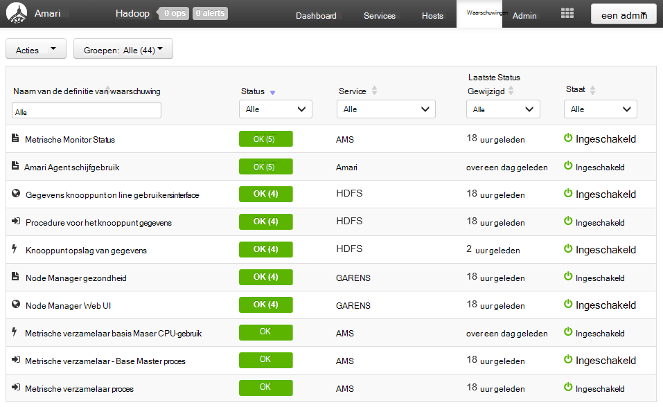

U kunt de groepen beheren met behulp van het menu **Acties** en selecteert u **Alert groepen beheren**. Hiermee kunt u de bestaande groepen aanpassen of nieuwe groepen maken.

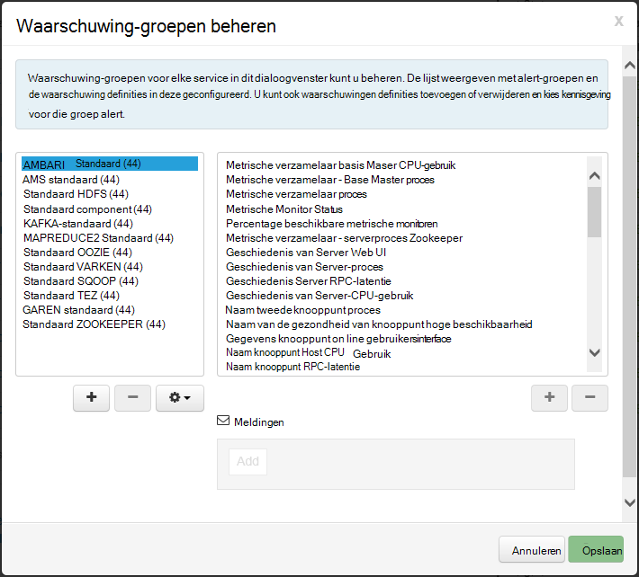

U kunt ook waarschuwingen maken in het menu **Acties** . Hiermee kunt u voor het maken van triggers die meldingen per **E-mail** of **SNMP** verzenden wanneer er specifieke waarschuwing/ernst combinaties optreden. U kunt bijvoorbeeld verzenden een waarschuwing wanneer een van de waarschuwingen in de groep **GAREN standaard** is ingesteld op **kritiek**.

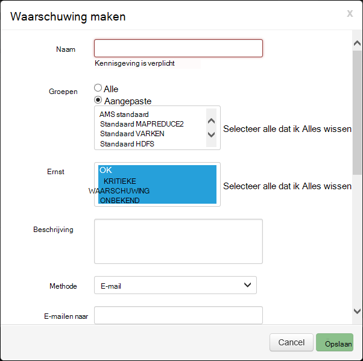

###Cluster

Het tabblad **parameters** van het dashboard bevat een aantal widgets waarmee u eenvoudig de status van het cluster in één oogopslag controleren. Verschillende widgets, zoals **CPU-gebruik**, bieden aanvullende informatie wanneer erop wordt geklikt.

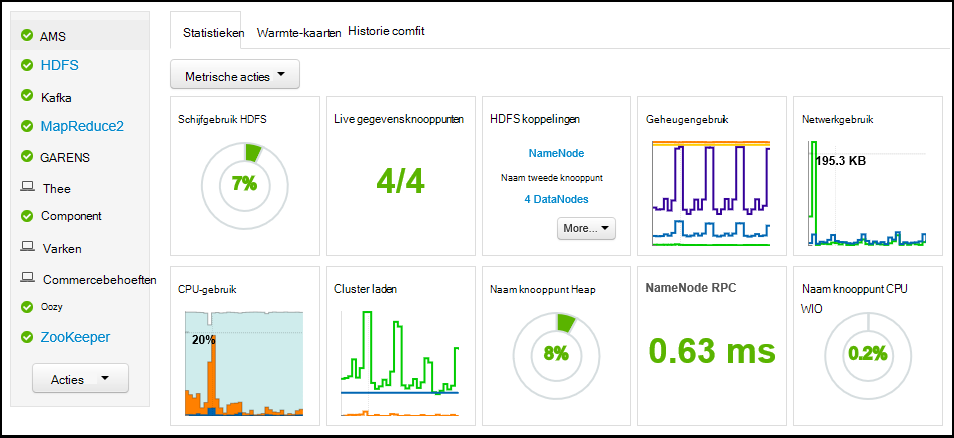

Het tabblad **Heatmaps** geeft statistieken als gekleurde heatmaps, die van groen naar rood.

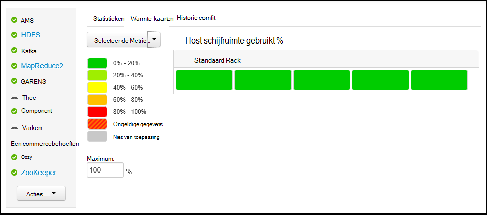

Voor meer gedetailleerde informatie op de knooppunten in het cluster **Hosts**te selecteren en selecteer vervolgens de specifieke knooppunt waarin u geïnteresseerd bent.

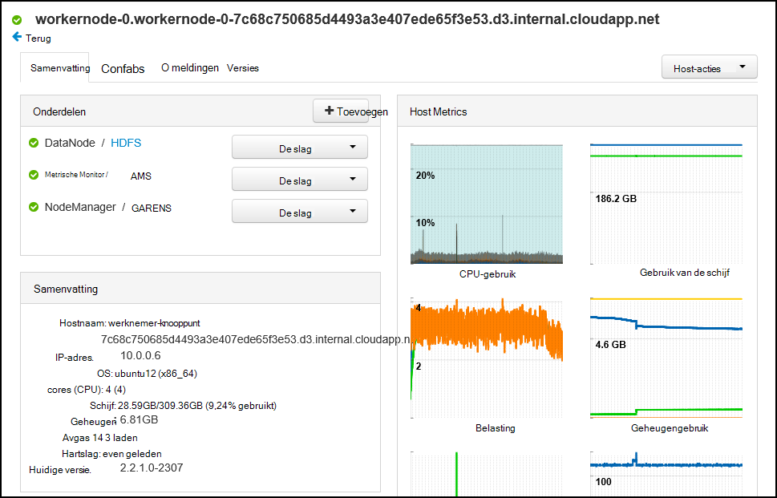

###Services

De zijbalk van **Services** op het dashboard biedt snel inzicht in de status van de services die op het cluster worden uitgevoerd. Verschillende pictogrammen worden gebruikt om aan te geven de status of de acties die moeten worden genomen, zoals een gele recycle symbool als een service moet worden herhaald.

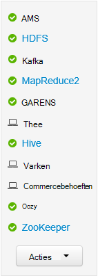

Een service moet selecteren, wordt meer gedetailleerde informatie op de service weergegeven.

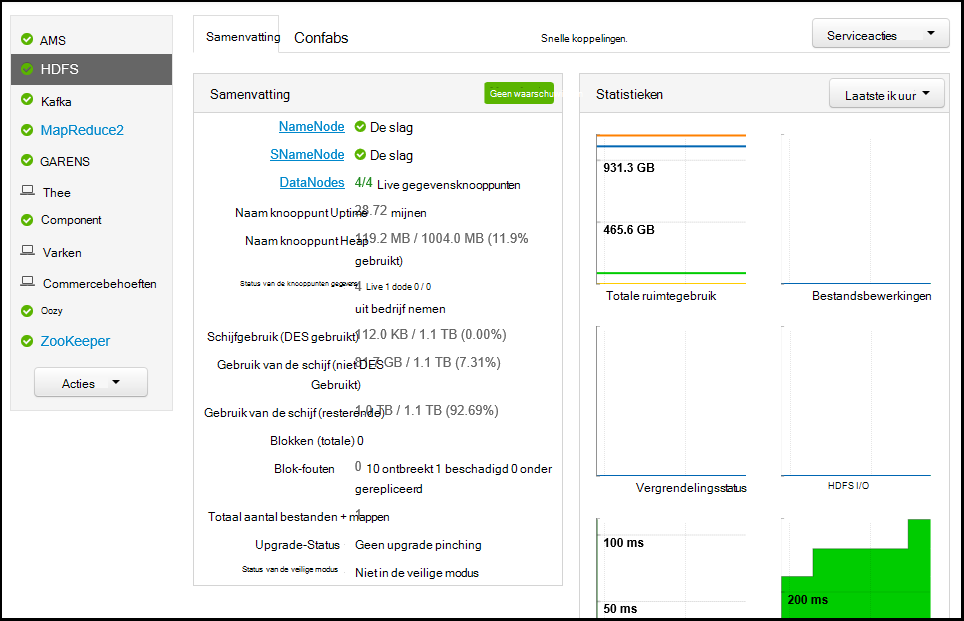

####Snelle koppelingen

Sommige services weergeven een **Snelkoppelingen** -koppeling boven aan de pagina. Dit kan worden gebruikt, zoals service-specifieke web UI's, toegang tot:

* **Geschiedenis** - geschiedenis van MapReduce.

* **Resource Manager** - GAREN ResourceManager UI.

* **NameNode** - Hadoop Distributed bestand System (HDFS) NameNode UI.

* **Oozie Web UI** - Oozie UI.

Deze koppelingen selecteren om een nieuw tabblad in uw browser wordt weergegeven van de geselecteerde pagina te openen.

> [AZURE.NOTE] Een **Snelkoppelingen** klikken voor elke service leidt tot een "server niet gevonden" fout tenzij u van een Secure Sockets Layer (SSL)-tunnel naar proxy webverkeer naar het cluster gebruikmaakt. Dit komt omdat de webtoepassingen gebruikt voor het weergeven van deze gegevens niet beschikbaar zijn op het internet.
>
> Zie voor meer informatie over het gebruik van een SSL-tunnel met HDInsight [Gebruik SSH Tunneling Ambari web UI, ResourceManager, JobHistory, NameNode, Oozie, en andere web UI van toegang tot](hdinsight-linux-ambari-ssh-tunnel.md)

##Management

###Ambari-gebruikers, groepen en machtigingen

Beheer van gebruikers, groepen en machtigingen moet niet worden gebruikt met HDInsight clusters.

###Hosts

De pagina **Hosts** worden alle hosts in het cluster. Volg deze stappen voor het beheren van hosts.

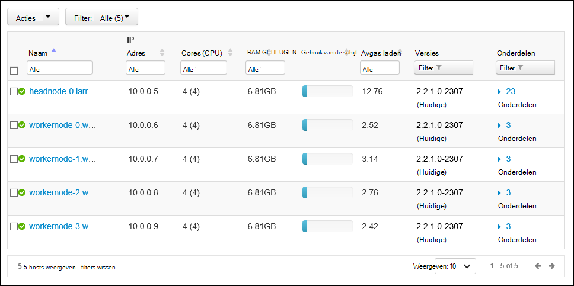

> [AZURE.NOTE] Toevoegen, ontmanteling of recommissioning een host moet niet worden gebruikt met HDInsight clusters.

1. Selecteer de host (s) die u wilt beheren.

2. Gebruik het menu **Acties** op de actie die u wilt uitvoeren:

    * **Start alle onderdelen** - alle onderdelen op de host starten.

    * **Stop alle onderdelen** - alle onderdelen op de host gestopt.

    * **Alle onderdelen opnieuw** - Stop en start alle onderdelen op de host.

    * **Onderhoudsmodus inschakelen** - waarschuwingen onderdrukt voor de host. Dit moet worden ingeschakeld als u waarschuwingen genereert, zoals het opnieuw starten van een service die met services die afhankelijk van zijn acties uitvoert.

    * **De onderhoudsmodus uitschakelen** - geeft als resultaat de host de normale waarschuwen.

    * **Stop** - DataNode stopt of NodeManagers op de host.

    * **Start** - start DataNode of NodeManagers op de host.

    * **Opnieuw opstarten** - stopt en start DataNode of NodeManagers op de host.

    * **Uit bedrijf nemen** - verwijderd een host uit het cluster.

        > [AZURE.NOTE] Gebruik deze actie niet op HDInsight-clusters.

    * **Recommission** - een eerder buiten gebruik gestelde host aan het cluster toegevoegd.

        > [AZURE.NOTE] Gebruik deze actie niet op HDInsight-clusters.

###Services

Gebruik de knop **Acties** onder aan de lijst met services stoppen en start alle services vanaf de pagina **Dashboard** of **Services** .

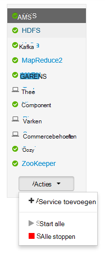

> [AZURE.WARNING] __Service toevoegen__ in dit menu wordt weergegeven, moet maar niet worden gebruikt services toevoegen aan het cluster HDInsight. Nieuwe services moeten worden toegevoegd met behulp van een scriptactie tijdens het inrichten van de cluster. Zie voor meer informatie over het gebruik van scriptacties [aanpassen HDInsight clusters met scriptacties](hdinsight-hadoop-customize-cluster-linux.md).

Terwijl de knop **Acties** alle services opnieuw te starten kunt, wilt vaak u starten, stoppen of opnieuw starten van een bepaalde service. Gebruik de volgende stappen uit te voeren acties op een afzonderlijke service:

1. Selecteer een service op de pagina **Dashboard** of **Services** .

2. Met de **Serviceacties** en selecteert u de actie moet worden uitgevoerd vanaf de bovenkant van het tabblad **Samenvatting** . Hiermee wordt de service op alle knooppunten opnieuw opgestart.

    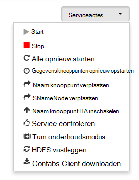

    > [AZURE.NOTE] Sommige services opnieuw te starten terwijl het cluster wordt uitgevoerd, kan waarschuwingen genereren. Om dit te voorkomen, kunt u de knop **Acties Service** **Onderhoudsmodus** voor de service inschakelen voordat u het opnieuw opstarten.

3. Nadat u een actie hebt geselecteerd, wordt de post **# op** boven aan de pagina verhogen om aan te tonen dat de achtergrond wordt uitgevoerd. Als zodanig wordt geconfigureerd, wordt de lijst van bewerkingen op de achtergrond weergegeven.

    > [AZURE.NOTE] Als u de **Onderhoudsmodus** voor de service hebt ingeschakeld, moet u deze uitschakelen met behulp van de knop **Acties Service** nadat de bewerking is voltooid.

Gebruik de volgende stappen uit om een service:

1. Selecteer een service op de pagina **Dashboard** of **Services** .

2. Selecteer het tabblad **configuraties** . De huidige configuratie weergegeven. Een lijst met vorige configuraties wordt ook weergegeven.

    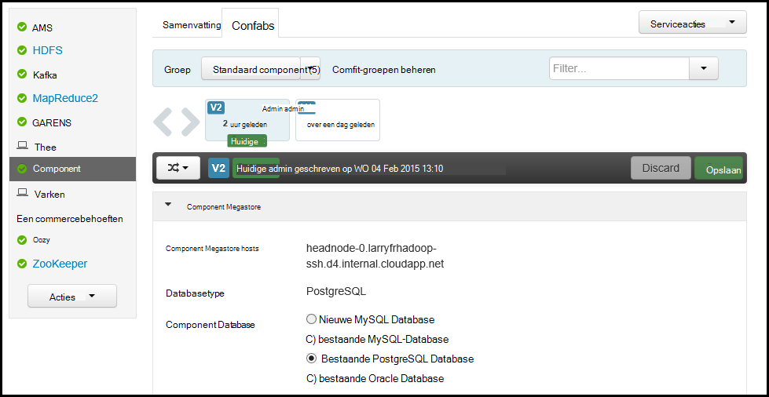

3. Gebruik de velden weergegeven om de configuratie wijzigen en selecteer vervolgens **Opslaan**. Een vorige configuratie selecteren en selecteer vervolgens **instellen als huidige** terugkeren naar de vorige instellingen.

##Weergaven van Ambari

Ambari weergaven kunnen ontwikkelaars aansluiten op de Ambari Web Interface gebruikersinterface-elementen met behulp van de [Ambari weergaven Framework](https://cwiki.apache.org/confluence/display/AMBARI/Views). HDInsight biedt de volgende weergaven met Hadoop clustertypen:

* Garens Queue Manager: queue manager biedt een eenvoudige gebruikersinterface voor het weergeven en wijzigen van GAREN wachtrijen.
* Weergave van de component: De component-weergave kunt u uitvoeren component query's rechtstreeks vanuit uw webbrowser. U kunt query's opslaan, resultaten, resultaten opslaan in de clusteropslag of resultaten downloaden naar uw lokale. Zie voor meer informatie over het gebruik van weergaven component [Gebruik component weergaven met HDInsight](hdinsight-hadoop-use-hive-ambari-view.md).
* Tez bekijken: De Tez weergave kunt u beter te begrijpen en taken geoptimaliseerd door informatie op hoe Tez taken worden uitgevoerd en welke bronnen worden gebruikt door de taak weer te geven.
