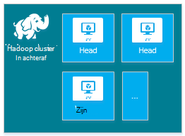
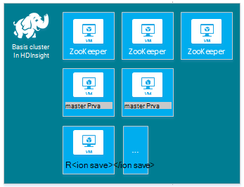
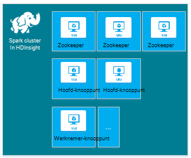
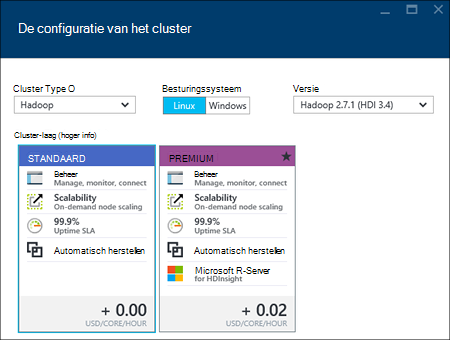
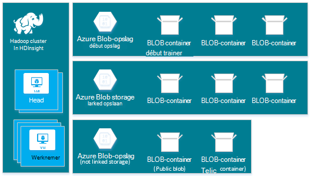
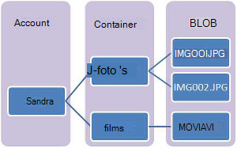
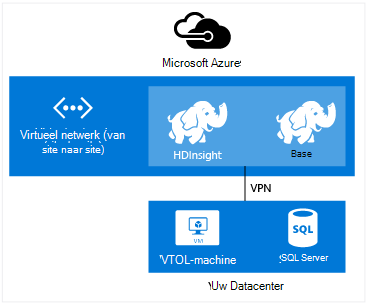
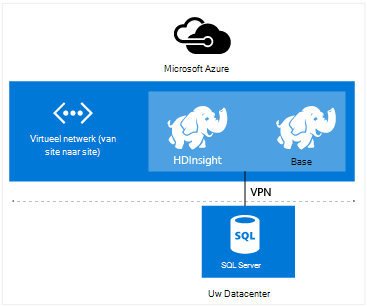

<properties
    pageTitle="Hadoop, HBase, Storm of Spark clusters maken op Linux in HDInsight | Microsoft Azure"
    description="Informatie over het maken van Hadoop, HBase, Storm of clusters op Linux Wek voor HDInsight met een browser, de CLI Azure, Azure PowerShell, REST, of via een SDK."
    services="hdinsight"
    documentationCenter=""
    authors="mumian"
    manager="jhubbard"
    editor="cgronlun"
    tags="azure-portal"/>

<tags
    ms.service="hdinsight"
    ms.devlang="na"
    ms.topic="article"
    ms.tgt_pltfrm="na"
    ms.workload="big-data"
    ms.date="10/18/2016"
    ms.author="jgao"/>

# Hadoop Linux gebaseerde clusters maken in HDInsight

[AZURE.INCLUDE [selector](../../includes/hdinsight-selector-create-clusters.md)]

Een cluster van Hadoop bestaat uit meerdere virtuele machines (knooppunten) die worden gebruikt voor gedistribueerde verwerking van taken op het cluster. Azure abstracts details over de implementatie van de installatie en configuratie van de afzonderlijke knooppunten, zodat u alleen algemene configuratie-informatie te verstrekken. In dit artikel leert u deze configuratie-instellingen.

## Access controle-eisen

[AZURE.INCLUDE [access-control](../../includes/hdinsight-access-control-requirements.md)]

## Clustertypen

Azure HDInsight biedt op dit moment vijf verschillende typen van clusters, elk met een set componenten waarmee bepaalde functionaliteiten.

| Clustertype | Functionaliteit |
| ------------ | ----------------------------- |
| Hadoop       | Query's en gegevensanalyses (taken)     |
| HBase        | NoSQL gegevensopslag            |
| Storm        | Verwerking van real-time, gebeurtenis |
| Spark        | De verwerking in het geheugen, interactieve query, stream micro batch-verwerking |
| [Interactieve component (voorbeeld)](hdinsight-hadoop-use-interactive-hive.md) | In het geheugen opslaan in cache voor query's sneller en interactieve component|
| R-Server op Spark (voorbeeld) | Een aantal grote gegevens statistieken, voorspellende modellen en mogelijkheden leren machine |

Elk clustertype heeft zijn eigen aantal knooppunten in het cluster, terminologie voor knooppunten binnen het cluster en de standaardgrootte VM voor elk knooppunttype. In de volgende tabel wordt het aantal knooppunten voor elk knooppunttype tussen haakjes.

| Type| Knooppunten | Diagram|
|-----|------|--------|
|Hadoop| Hoofd-knooppunt (2), gegevens-knooppunt (1 +)||
|HBase|Hoofd-server (2), regio-server (1 +), Master/Zookeeper-knooppunt (3)||
|Storm|Nimbus-knooppunt (2), Supervisor server (1 +), Zookeeper-knooppunt (3)||
|Spark|Hoofd-knooppunt (2), werknemer-knooppunt (1 +) Zookeeper knooppunt (3) (gratis voor A1 zoohouder VM-grootte)||

De volgende tabel geeft een overzicht van de standaardgrootte van VM voor HDInsight:

- Alle ondersteunde regio's, met uitzondering van Brazilië, Zuid en West Japan:

  	|Clustertype                     | Hadoop               | HBase                | Storm                | Spark                                                                 | R-Server |
  	|---------------------------------|----------------------|----------------------|----------------------|-----------------------------------------------------------------------|-----------------------------------------------------------------------|
  	|Standaard HEAD – VM-grootte           | D3 v2                | D3 v2                | A3                   | D12 v2                                                                | D12 v2                                                                |
  	|Hoofd – aanbevolen formaten voor VM      | V2 D3, D4 v2, D12 v2 | V2 D3, D4 v2, D12 v2 | A3, A4, A5           | D12 v2, D13 v2, D14 v2                                                | D12 v2, D13 v2, D14 v2                                                |
  	|Werknemer – standaard VM-grootte         | D3 v2                | D3 v2                | D3 v2                | Windows: D12 v2; Linux: D4 v2                                         | Windows: D12 v2; Linux: D4 v2                                         |
  	|Werknemer – aanbevolen formaten voor VM    | V2 D3, D4 v2, D12 v2 | V2 D3, D4 v2, D12 v2 | V2 D3, D4 v2, D12 v2 | Windows: D12 v2, D13 v2, D14 v2; Linux: D4 v2, D12 v2, D13 v2, D14 v2 | Windows: D12 v2, D13 v2, D14 v2; Linux: D4 v2, D12 v2, D13 v2, D14 v2 |
  	|Zookeeper – standaard VM-grootte      |                      | A3                   | A2                   |                                                                       |
  	|Zookeeper – aanbevolen formaten voor VM |                      | A3, A4, A5           | A2, A3, A4           |                                                                       |
  	|Rand - standaard VM-grootte           |                      |                      |                      |                                                                       | Windows: D12 v2; Linux: D4 v2                                         |
  	|Rand - aanbevolen grootte VM       |                      |                      |                      |                                                                       | Windows: D12 v2, D13 v2, D14 v2; Linux: D4 v2, D12 v2, D13 v2, D14 v2 |

- Zuid-Brazilië en Japan West alleen (geen v2 grootte hier):

  	|Clustertype                     | Hadoop      | HBase       | Storm      | Spark                                          |R-Server|
  	|---------------------------------|-------------|-------------|------------|------------------------------------------------|--------|
  	|Standaard HEAD – VM-grootte           | D3          | D3          | A3         | D12                                            | D12|
  	|Hoofd – aanbevolen formaten voor VM      | D3, D4, D12 | D3, D4, D12 | A3, A4, A5 | D12 D13 D14                                  | D12 D13 D14|
  	|Werknemer – standaard VM-grootte         | D3          | D3          | D3         | Windows: D12; Linux: D4                        | Windows: D12; Linux: D4|
  	|Werknemer – aanbevolen formaten voor VM    | D3, D4, D12 | D3, D4, D12 | D3, D4, D12| Windows: D13 D12 D14; Linux: D4, D12, D13 D14| Windows: D13 D12 D14; Linux: D4, D12, D13 D14|
  	|Zookeeper – standaard VM-grootte      |             | A2          | A2         |                                                | |
  	|Zookeeper – aanbevolen formaten voor VM |             | A2, A3, A4  | A2, A3, A4 |                                                | |
  	|De rand – standaard formaten VM          |             |             |            |                                                | Windows: D12; Linux: D4 |
  	|Rand: aanbevolen formaten voor VM      |             |             |            |                                                | Windows: D13 D12 D14; Linux: D4, D12, D13 D14 |

Houd er rekening mee dat hoofd voor het cluster Storm type staat bekend als *Nimbus* . Werknemer is bekend als *de regio* voor het type HBase cluster en als *toezichthouder* voor de Storm clustertype.

> [AZURE.IMPORTANT] Als u van plan meer dan 32 knooppunten van de werknemer, die bij het maken van het cluster of bent door het cluster na het maken van schalen, selecteert u de grootte van een hoofd knooppunt met minimaal 8 cores en 14 GB RAM-geheugen.

U kunt andere onderdelen zoals tint of R toevoegen aan deze eenvoudige typen met behulp van [Scriptacties](#customize-clusters-using-script-action).

> [AZURE.IMPORTANT] HDInsight clusters komen in verschillende typen die met de technologie die het cluster is afgestemd corresponderen voor werkbelasting. Er is geen ondersteunde methode voor het maken van een cluster dat een combinatie van meerdere typen, zoals Storm en HBase op één cluster. 

Als uw oplossing technologieën die verspreid zijn over meerdere HDInsight clustertypen vereist, moet u een virtueel netwerk Azure maken en de vereiste clustertypen binnen het virtuele netwerk maken. Hierdoor kunt clusters en alle code die u implementeert om ze rechtstreeks met elkaar communiceren.

Zie voor meer informatie over het gebruik van een virtueel netwerk Azure met HDInsight [HDInsight uitbreiden met Azure virtuele netwerken](hdinsight-extend-hadoop-virtual-network.md).

Zie voor een voorbeeld van het gebruik van twee clustertypen in een virtueel netwerk Azure, [sensor-gegevens analyseren met Storm en HBase](hdinsight-storm-sensor-data-analysis.md).

## Cluster-lagen

Azure HDInsight biedt de big data wolk aanbiedingen in twee categorieën: Standard en [Premium](hdinsight-component-versioning.md#hdinsight-standard-and-hdinsight-premium). HDInsight Premium bevat R en andere aanvullende onderdelen. HDInsight Premium wordt alleen ondersteund op HDInsight versie 3.4.

De volgende tabel worden de HDInsight clustertype en HDInsight Premium-ondersteuningsmatrix.

| Clustertype | Standaard | Premium  |
|--------------|---------------|--------------|
| Hadoop       | Ja           | Ja          |
| Spark        | Ja           | Ja          |
| HBase        | Ja           | Nee           |
| Storm        | Ja           | Nee           |
| R-Server op Spark | Nee | Ja |

Deze tabel wordt bijgewerkt als meer clustertypen zijn opgenomen in de HDInsight premie. Het volgende screenshot toont de Azure portal-gegevens voor het clustertypen kiezen.

## Basisopties voor configuratie

Hieronder vindt u de opties voor basisconfiguratie gebruikt voor het maken van een cluster van HDInsight.

### De naam van cluster ###

Naam van het cluster wordt gebruikt voor het identificeren van een cluster. Clusternaam moet uniek zijn en zij moet voldoen aan de volgende richtlijnen voor de naamgeving:

- Het veld moet een tekenreeks die tussen 3 en 63 tekens bevat.
- Het veld kan alleen letters, cijfers en streepjes bevatten.

### Clustertype###

Zie [Cluster-soorten](#cluster-types) en [niveaus van de Cluster](#cluster-tiers).

### Besturingssysteem ###

U kunt HDInsight clusters maken op een van de volgende twee besturingssystemen:

- HDInsight op Linux.  HDInsight biedt de mogelijkheid om Linux-clusters configureren op Azure. Een Linux cluster configureren als u bekend bent met Linux of Unix en het migreren van een bestaande Hadoop Linux-gebaseerde oplossing, of wilt u eenvoudige integratie met Hadoop-ecosysteem onderdelen gebouwd voor Linux. Zie [aan de slag met Hadoop op Linux in HDInsight](hdinsight-hadoop-linux-tutorial-get-started.md)voor meer informatie.
- HDInsight in Windows (Windows Server 2012 R2 Datacenter).

### HDInsight versie###

Dit wordt gebruikt om te bepalen welke versie van de HDInsight die nodig zijn voor dit cluster. Zie [cluster-versies Hadoop en componenten in HDInsight](https://go.microsoft.com/fwLink/?LinkID=320896&clcid=0x409)voor meer informatie.

### De naam van abonnement###

Elk cluster HDInsight is gebonden aan één Azure-abonnement.

### Resourcegroepnaam ###

[Azure Resource Manager](../azure-resource-manager/resource-group-overview.md) helpt u werken met de resources in uw toepassing als een groep, hierna aangeduid als een bronnengroep Azure. U kunt implementeren, bijwerken, controleren of alle bronnen voor uw toepassing in één bewerking gecoördineerde verwijderen.

### Referenties###

HDInsight clusters, kunt u twee gebruikersaccounts configureren tijdens het maken van het cluster:

- HTTP-gebruiker. De standaardgebruikersnaam is *admin* met de basisconfiguratie op Azure portal. Soms wordt genoemd "Cluster gebruiker."
- SSH gebruiker (Linux-clusters). Dit wordt gebruikt om verbinding te maken met het cluster via SSH. Nadat het cluster is gemaakt door de stappen in [Gebruik SSH met Linux-gebaseerde Hadoop op HDInsight van Linux, Unix, of OS X](hdinsight-hadoop-linux-use-ssh-unix.md) of [Gebruik SSH met Linux-gebaseerde Hadoop op HDInsight van Windows](hdinsight-hadoop-linux-use-ssh-unix.md), kunt u extra SSH gebruikersaccounts maken.

    >[AZURE.NOTE] Voor Windows-gebaseerde clusters, kunt u een RDP-gebruiker verbinding maken met het cluster via RDP.

### Gegevensbron###

Het oorspronkelijke Hadoop distributed file system (HDFS) maakt gebruik van veel lokale schijven op het cluster. Azure Blob-opslag HDInsight gebruikt voor gegevensopslag. Azure Blob-opslag is een robuuste, algemene opslagoplossing die naadloos geïntegreerd met HDInsight. De volledige set van componenten in HDInsight kan via een interface HDFS werken rechtstreeks op gestructureerde of ongestructureerde gegevens in een Blob-opslag. Gegevens opslaan in een Blob-opslag kunt u veilig verwijderen van de clusters HDInsight die worden gebruikt voor berekeningen zonder verlies van gegevens van de gebruiker.

Tijdens het configureren van moet u een account Azure opslag en een Azure Blob opslag container voor de opslag van Azure account opgeven. Sommige processen maken moeten de Azure opslag en de Blob storage container tevoren worden gemaakt. De Blob storage container wordt gebruikt als de standaardlocatie voor opslag door het cluster. Desgewenst kunt u extra opslag Azure accounts (gekoppelde opslag) die toegankelijk voor het cluster zijn opgeven. Het cluster ook toegang tot alle Blob storage containers die zijn geconfigureerd met een volledige openbare leestoegang of openbare leestoegang voor BLOB's alleen.  Zie [Toegang tot Azure opslagbronnen beheren](../storage/storage-manage-access-to-resources.md)voor meer informatie.

>[AZURE.NOTE] Een Blob storage container biedt een groepering van een aantal BLOB's zoals in de volgende afbeelding.

Met behulp van de standaard Blob storage container voor het opslaan van gegevens wordt niet aanbevolen. Het verwijderen van de standaardcontainer Blob-opslag na elk gebruik om kosten voor opslag te beperken een goede gewoonte is. Opmerking dat de standaardcontainer toepassings- en bevat Logboeken. Zorg ervoor dat de logboeken op te halen voordat het verwijderen van de container.

>[AZURE.WARNING] Delen van een Blob storage container voor meerdere clusters wordt niet ondersteund.

Zie voor meer informatie over het gebruik van secundaire Blob-opslag [Met behulp van Azure blobopslag met HDInsight](hdinsight-hadoop-use-blob-storage.md).

Naast Azure Blob-opslag kun je [Azure Lake gegevensarchief](../data-lake-store/data-lake-store-overview.md) als een standaard opslag-account voor de cluster HBase in HDInsight en als gekoppelde opslag voor alle vier HDInsight clustertypen. Zie [een cluster van HDInsight met Lake gegevensarchief maken met behulp van Azure portal](../data-lake-store/data-lake-store-hdinsight-hadoop-use-portal.md)voor meer informatie.

### Locatie (regio) ###

De standaardaccount voor de opslag en het HDInsight-cluster moeten zich op dezelfde locatie Azure.

Klik op de lijst met **regio** op [HDInsight prijzen](https://go.microsoft.com/fwLink/?LinkID=282635&clcid=0x409)voor een lijst van ondersteunde regio's.

### Knooppunt lagen prijzen###

Klanten worden gefactureerd voor het gebruik van deze knooppunten voor de duur van het leven van het cluster. Facturering wordt gestart wanneer een cluster wordt gemaakt en wordt beëindigd als het cluster is verwijderd. Clusters kunnen niet worden opgeheven toegewezen of in de wachtstand geplaatst.

Met verschillende clustertypen hebben verschillende knooppunttypen, nummers van de knooppunten en de grootte van het knooppunt. Een type Hadoop cluster heeft bijvoorbeeld twee _knooppunten head_ en standaard vier _gegevensknooppunten_, terwijl een cluster Storm type heeft twee _knooppunten nimbus_, drie _knooppunten zookeeper_en een standaard met vier _knooppunten supervisor_. De kosten van HDInsight clusters wordt bepaald door het aantal knooppunten en de grootte van de virtuele machines voor de knooppunten. Als u weet dat u de bewerkingen die veel geheugen nodig zal uitvoeren, wilt u mogelijk een compute-bron met meer geheugen te selecteren. Voor leren doeleinden, verdient het gebruik van één gegevensknooppunt. Zie voor meer informatie over prijzen HDInsight, [HDInsight prijzen](https://go.microsoft.com/fwLink/?LinkID=282635&clcid=0x409).

>[AZURE.NOTE] De limiet voor de cluster varieert per Azure abonnementen. Contactpersoon voor facturering de limiet te verhogen.

>De knooppunten die door het cluster wordt gebruikt, worden niet meegerekend wanneer virtuele machines omdat de virtuele machine-afbeeldingen die worden gebruikt voor de knooppunten de details van een implementatie van de service HDInsight zijn. De compute cores die wordt gebruikt door de knooppunten worden meegerekend bij het totale aantal compute cores beschikbaar zijn voor uw abonnement. Hier ziet u het aantal cores beschikbaar en de cores die door het cluster in de sectie Samenvatting van de bladeserver knooppunt prijzen lagen wordt gebruikt bij het maken van een cluster van HDInsight.

Wanneer u de Azure portal gebruikt voor het configureren van het cluster, is de grootte van het knooppunt beschikbaar via het __Knooppunt prijzen laag__ blad. U ziet ook de kosten in verband met de grootte van het andere knooppunt. Het volgende screenshot toont de opties voor een cluster Linux base Hadoop.

De volgende tabellen tonen de formaten ondersteund door clusters van HDInsight en de capaciteiten die ze bieden.

#### Standaard laag: A-serie####

In het klassieke implementatiemodel verschillen sommige formaten VM enigszins in PowerShell en de CLI.
* Standard_A3 is groot
* Standard_A4 is ExtraLarge

|Grootte |CPU-kernen|Geheugen|NIC's (Max.)|Max. grootte van de schijf|Max. gegevensschijven (1023 GB elke)|Max. IOP's (500 per schijf)|
|---|---|---|---|---|---|---|
|Standard_A3\Large|4|7 GB|2|Tijdelijke = 285 GB |8|8 x 500|
|Standard_A4\ExtraLarge|8|14 GB|4|Tijdelijke = 605 GB |16|16 x 500|
|Standard_A6|4|28 GB|2|Tijdelijke = 285 GB |8|8 x 500|
|Standard_A7|8|56 GB|4|Tijdelijke = 605 GB |16|16 x 500|

#### Standaard laag: D-serie####

|Grootte |CPU-kernen|Geheugen|NIC's (Max.)|Max. grootte van de schijf|Max. gegevensschijven (1023 GB elke)|Max. IOP's (500 per schijf)|
|---|---|---|---|---|---|---|
|Standard_D3 |4|14 GB|4|Tijdelijk (SSD) = 200 GB |8|8 x 500|
|Standard_D4 |8|28 GB|8|Tijdelijk (SSD) = 400 GB |16|16 x 500|
|Standard_D12 |4|28 GB|4|Tijdelijk (SSD) = 200 GB |8|8 x 500|
|Standard_D13 |8|56 GB|8|Tijdelijk (SSD) = 400 GB |16|16 x 500|
|Standard_D14 |16|112 GB|8|Tijdelijk (SSD) = 800 GB |32|32 x 500|

#### Standaard laag: Dv2-serie####

|Grootte |CPU-kernen|Geheugen|NIC's (Max.)|Max. grootte van de schijf|Max. gegevensschijven (1023 GB elke)|Max. IOP's (500 per schijf)|
|---|---|---|---|---|---|---|
|Standard_D3_v2 |4|14 GB|4|Tijdelijk (SSD) = 200 GB |8|8 x 500|
|Standard_D4_v2 |8|28 GB|8|Tijdelijk (SSD) = 400 GB |16|16 x 500|
|Standard_D12_v2 |4|28 GB|4|Tijdelijk (SSD) = 200 GB |8|8 x 500|
|Standard_D13_v2 |8|56 GB|8|Tijdelijk (SSD) = 400 GB |16|16 x 500|
|Standard_D14_v2 |16|112 GB|8|Tijdelijk (SSD) = 800 GB |32|32 x 500|    

Zie voor overwegingen voor de implementatie houden wanneer u van plan bent deze bronnen, [formaten voor virtuele machines](../virtual-machines/virtual-machines-windows-sizes.md). Zie voor informatie over prijzen van de verschillende formaten [HDInsight prijzen](https://azure.microsoft.com/pricing/details/hdinsight).   

> [AZURE.IMPORTANT] Als u van plan meer dan 32 knooppunten van de werknemer, die bij het maken van het cluster of bent door het cluster na het maken van schalen, selecteert u de grootte van een hoofd knooppunt met minimaal 8 cores en 14 GB RAM-geheugen.

Facturering wordt gestart wanneer een cluster wordt gemaakt en wordt beëindigd als het cluster is verwijderd. Zie voor meer informatie over prijzen, [prijzen details HDInsight](https://azure.microsoft.com/pricing/details/hdinsight/).

## Gebruik extra opslagruimte

In sommige gevallen wilt u mogelijk extra opslagruimte toevoegen aan het cluster. Bijvoorbeeld, u wellicht meerdere accounts voor Azure opslag voor verschillende geografische regio's of andere services, maar u wilt analyseren ze allemaal met HDInsight.

U kunt opslag-accounts toevoegen wanneer u een HDInsight-cluster maakt of nadat een cluster is gemaakt.  Zie [HDInsight aanpassen Linux gebaseerde clusters met actie Script](hdinsight-hadoop-customize-cluster-linux.md).

Zie voor meer informatie over secundaire Blob-opslag [met behulp van Azure Blob-opslag met HDInsight](hdinsight-hadoop-use-blob-storage.md). Zie voor meer informatie over de opslag van secundaire gegevens Lake [clusters met Lake gegevensarchief met Azure portal HDInsight maken](../data-lake-store/data-lake-store-hdinsight-hadoop-use-portal.md).

## Gebruik de component Oozie/metastore

Wij raden u een aangepaste metastore gebruiken als u uw component tabellen behouden wilt nadat u het cluster HDInsight verwijderen. Kun je die metastore koppelen aan een ander HDInsight cluster.

> [AZURE.IMPORTANT] HDInsight metastore gemaakt voor een HDInsight cluster-versie kan niet worden gedeeld tussen verschillende versies van de HDInsight cluster. Zie voor een lijst met versies van HDInsight, [HDInsight ondersteunde versies](hdinsight-component-versioning.md#supported-hdinsight-versions).

De metastore bevat component en Oozie metagegevens, zoals component tabellen, partities, schema's en kolommen. De metastore helpt u uw component en Oozie-metagegevens behouden zodat u niet hoeft component tabellen of Oozie taken opnieuw maken wanneer u een nieuw cluster maken. Component standaard ingesloten Azure SQL-database voor het opslaan van deze gegevens. De ingesloten database behouden niet de metagegevens wanneer het cluster wordt verwijderd. Wanneer u met een component metastore geconfigureerd component-tabel in een HDInsight-cluster maakt, wordt deze tabellen behouden wanneer u het cluster met behulp van de dezelfde component metastore opnieuw maken.

Metastore configuratie is niet beschikbaar voor HBase clustertypen.

> [AZURE.IMPORTANT] Gebruik niet de naam van een database met streepjes of afbreekstreepjes tijdens het maken van een aangepaste metastore. Dit kan leiden tot het ontwikkelingsproces van een cluster worden uitgevoerd.

## Azure virtuele netwerken gebruiken

Met een [virtueel netwerk Azure](https://azure.microsoft.com/documentation/services/virtual-network/), kunt u een veilige, permanente netwerk met de resources die u nodig hebt voor uw oplossing. Met een virtueel netwerk kunt u:

* Verbinding maken met bronnen samen in een particulier netwerk (alleen cloud) wolk.

    

* Verbinding maken met uw cloud resources aan uw lokale datacenter-netwerk (site naar site of punt-naar-site) via een virtueel particulier netwerk (VPN).

| Configuratie van site naar site | Punt-tot-site-configuratie |
| -------------------------- | --------------------------- |
| Met configuratie van site naar site, kunt u meerdere resources in uw datacenter met de Azure virtueel netwerk via een VPN-hardware of de Routing and Remote Access-Service.  | Met een punt-naar-site-configuratie kunt u een specifieke bron met de Azure virtueel netwerk via een VPN-software.  |

Windows-gebaseerde clusters vereisen een v1 (klassiek) virtueel netwerk, terwijl Linux gebaseerde clusters een virtueel netwerk van v2 (Azure resourcemanager vereisen). Als u niet het juiste type netwerk hebt, meer deze niet bruikbaar bij het maken van het cluster.

Zie voor meer informatie over het gebruik van HDInsight met een virtueel netwerk, met inbegrip van specifieke configuratievereisten voor het virtuele netwerk [mogelijkheden HDInsight uitbreiden met behulp van een virtueel netwerk van Azure](hdinsight-extend-hadoop-virtual-network.md).

## Clusters met HDInsight cluster aanpassing (bootstrap) aanpassen

Soms wilt u de volgende configuratiebestanden te configureren:

- clusterIdentity.xml
- Core-site.xml
- gateway.XML
- hbase env.xml
- hbase site.xml
- hdfs site.xml
- component env.xml
- component site.xml
- mapred-site
- oozie site.xml
- oozie env.xml
- storm-site.xml
- tez site.xml
- webhcat site.xml
- garens van site.xml

Als u wilt dat de wijzigingen worden aangebracht in de levensduur van een cluster, kunt u HDInsight cluster aanpassen tijdens het maken of kunt u Ambari in Linux gebaseerde clusters. Zie voor meer informatie, [clusters van HDInsight aanpassen met behulp van de Bootstrap](hdinsight-hadoop-customize-cluster-bootstrap.md).

>[AZURE.NOTE] De Windows-gebaseerde clusters kunnen niet de veranderingen door het image opnieuw te behouden. Zie [Rol exemplaar opnieuw is opgestart vanwege Upgrades voor het besturingssysteem](http://blogs.msdn.com/b/kwill/archive/2012/09/19/role-instance-restarts-due-to-os-upgrades.aspx)voor meer informatie.  Om de wijzigingen door middel van clusters levensduur behouden, moet u HDInsight cluster aanpassen tijdens het maken.

## Clusters met actie Script aanpassen

U kunt extra onderdelen installeren of clusterconfiguratie aanpassen met behulp van scripts tijdens het maken. Dergelijke scripts worden aangeroepen via een **Scriptactie**, dit is een optie die kan worden gebruikt vanaf de portal Azure, HDInsight Windows PowerShell-cmdlets of HDInsight .NET SDK. Voor meer informatie Zie [cluster van HDInsight aanpassen met behulp van de actie Script](hdinsight-hadoop-customize-cluster-linux.md).

Sommige native Java-onderdelen, zoals Mahout en trapsgewijs, kunnen worden uitgevoerd op het cluster als Java Archive (JAR) bestanden. Deze JAR-bestanden kunnen worden gedistribueerd naar Azure Blob-opslag en ingediend bij HDInsight clusters via mechanismen van Hadoop project indienen. Voor meer informatie Zie [verzenden Hadoop projecten via programmacode](hdinsight-submit-hadoop-jobs-programmatically.md).

>[AZURE.NOTE] Hebt u problemen met JAR-bestanden met clusters HDInsight implementeren of JAR-bestanden op HDInsight clusters aan te roepen, neem dan contact op met [Microsoft Support](https://azure.microsoft.com/support/options/).

> Trapsgewijs wordt niet ondersteund door HDInsight en komt niet in aanmerking voor Microsoft Support. Zie voor een lijst met ondersteunde onderdelen, [Wat is er nieuw in de cluster-versies die door HDInsight?](hdinsight-component-versioning.md)

## Randknooppunt gebruiken

 Een randknooppunt leeg is een virtuele Linux machine met de dezelfde hulpprogramma's geïnstalleerd en geconfigureerd als in de headnodes. U kunt de randknooppunt voor toegang tot het cluster, uw client-toepassingen testen en uw client-toepassingen die als host fungeert. Voor meer informatie, Zie [Gebruik lege rand knooppunten in HDInsight](hdinsight-apps-use-edge-node.md).
 
## Methoden voor het cluster maken

In dit artikel kunt u algemene informatie over het maken van een HDInsight op basis van Linux-cluster hebt geleerd. Gebruik de volgende tabel voor specifieke informatie over het maken van een cluster met behulp van een methode die het beste aansluit bij uw behoeften.

| Gemaakt met clusters | Webbrowser | Vanaf de opdrachtregel | REST-API | SDK | Linux, Mac OS X en Unix | Windows |
| ------------------------------- |:----------------------:|:--------------------:|:------------------:|:------------:|:-----------------------------:|:------------:|
| [De Azure portal](hdinsight-hadoop-create-linux-clusters-portal.md) | ✔     | &nbsp; | &nbsp; | &nbsp; | ✔      | ✔ |
| [Azure Data Factory](hdinsight-hadoop-create-linux-clusters-adf.md) | ✔     | ✔  | ✔  |✔  | ✔      | ✔ |
| [Azure CLI](hdinsight-hadoop-create-linux-clusters-azure-cli.md)         | &nbsp; | ✔     | &nbsp; | &nbsp; | ✔      | ✔ |
| [Azure PowerShell](hdinsight-hadoop-create-linux-clusters-azure-powershell.md) | &nbsp; | ✔     | &nbsp; | &nbsp; | ✔ | ✔ |
| [Krul](hdinsight-hadoop-create-linux-clusters-curl-rest.md) | &nbsp; | ✔     | ✔ | &nbsp; | ✔      | ✔ |
| [.NET SDK](hdinsight-hadoop-create-linux-clusters-dotnet-sdk.md) | &nbsp; | &nbsp; | &nbsp; | ✔ | ✔      | ✔ |
| [Azure Resource Manager-sjablonen](hdinsight-hadoop-create-linux-clusters-arm-templates.md) | &nbsp; | ✔     | &nbsp; | &nbsp; | ✔      | ✔ |
