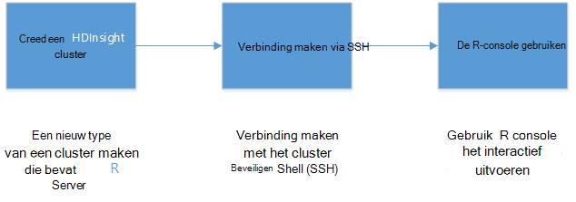
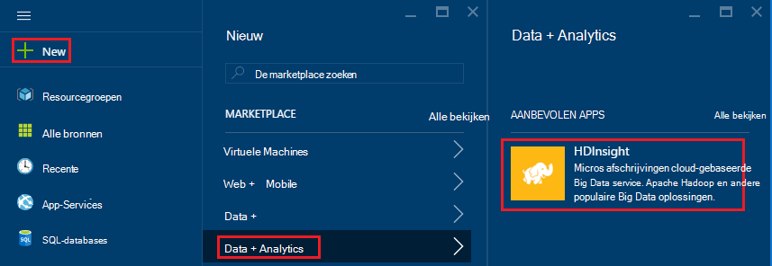
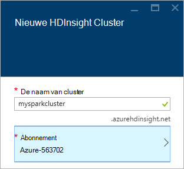
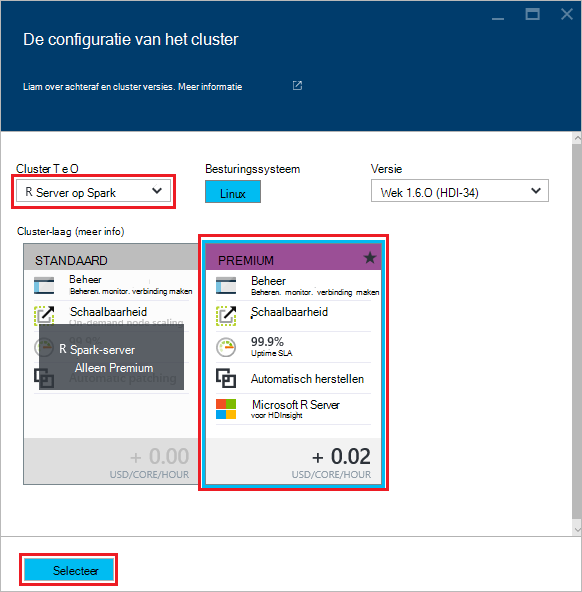
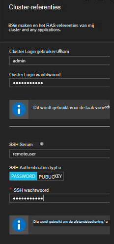
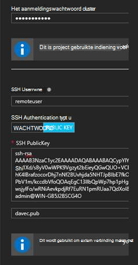
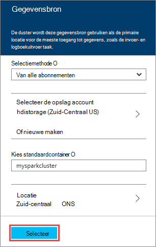
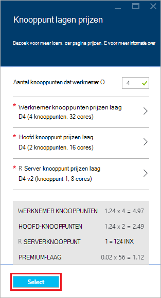
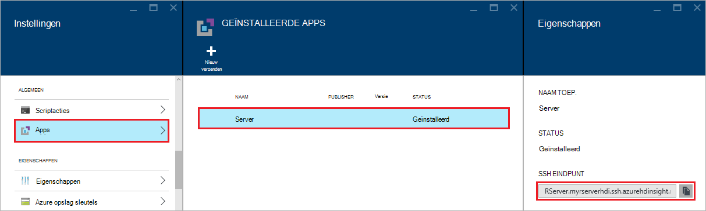
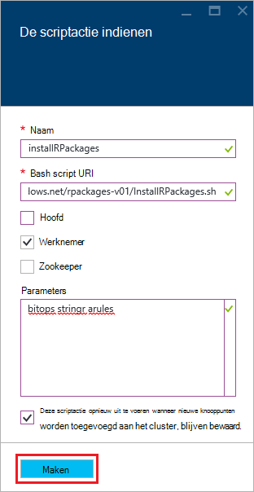

<properties
   pageTitle="Aan de slag met R-Server op HDInsight (voorbeeld) | Azure"
   description="Informatie over het maken van een Apache Spark op HDInsight (Hadoop)-cluster met R-Server (voorbeeld) en vervolgens een script R op het cluster in te dienen."
   services="HDInsight"
   documentationCenter=""
   authors="jeffstokes72"
   manager="jhubbard"
   editor="cgronlun"
/>

<tags
   ms.service="HDInsight"
   ms.devlang="R"
   ms.topic="article"
   ms.tgt_pltfrm="na"
   ms.workload="data-services"
   ms.date="08/19/2016"
   ms.author="jeffstok"
/>

# Aan de slag met R-Server op HDInsight (voorbeeld)

De premium-laag voor HDInsight omvat R-Server als onderdeel van het cluster HDInsight (voorbeeld). Dit kunt u via scripts R MapReduce en Spark gebruiken om gedistribueerde berekeningen uitvoeren. In dit document leert u hoe u een nieuwe R-Server op HDInsight maken en vervolgens een R-script dat wordt aangegeven met vonkontsteking voor gedistribueerde R berekeningen uitvoert.

## Vereisten

* __Abonnement op een Azure__: voordat u deze zelfstudie hebt u een abonnement op Azure. [Gratis proefversie ophalen Azure](https://azure.microsoft.com/documentation/videos/get-azure-free-trial-for-testing-hadoop-in-hdinsight/) Zie voor meer informatie.

* __A Secure Shell (SSH) client__: een SSH-client op afstand verbinding maken met het cluster HDInsight en opdrachten uitvoeren op het cluster wordt gebruikt. Linux, Unix en OS X-systemen bieden een SSH-client via de `ssh` opdracht. Voor Windows-systemen, wordt aangeraden [stopverf](http://www.chiark.greenend.org.uk/~sgtatham/putty/download.html).

    * __SSH-sleutels (optioneel)__: U kunt de SSH-account gebruikt om verbinding met het cluster met behulp van een wachtwoord of een openbare sleutel te beveiligen. Met een wachtwoord is eenvoudiger en kunt u aan de slag zonder te hoeven maken van een openbaar/persoonlijk sleutelpaar; met behulp van een sleutel is echter veiliger.
    
        De stappen in dit document wordt ervan uitgegaan dat u een wachtwoord gebruikt. Zie voor informatie over het maken en gebruiken van SSH-sleutels met HDInsight, de volgende documenten:
        
        * [SSH met HDInsight van Linux, Unix of OS X-clients gebruiken](hdinsight-hadoop-linux-use-ssh-unix.md)
        
        * [SSH gebruiken met HDInsight van Windows-clients](hdinsight-hadoop-linux-use-ssh-windows.md)

### Access controle-eisen

[AZURE.INCLUDE [access-control](../../includes/hdinsight-access-control-requirements.md)]

## Het cluster maken

> [AZURE.NOTE] De stappen in dit document maken een R-Server op HDInsight met behulp van eenvoudige configuratie-informatie. Zie [HDInsight maken Linux gebaseerde clusters](hdinsight-hadoop-provision-linux-clusters.md)voor andere cluster configuratie-instellingen (zoals accounts extra opslagruimte toe te voegen, met behulp van een virtueel netwerk Azure of een metastore maken voor component).

1. Log in om de [Azure portal](https://portal.azure.com).

2. Selecteer __Nieuw__ __gegevens + Analytics__en vervolgens __HDInsight__.

    

3. Voer een naam voor het cluster in het veld __Naam van het Cluster__ . Als er meerdere Azure abonnementen, gebruik de vermelding __abonnement__ te selecteren die u wilt gebruiken.

    

4. Selecteer __clustertype selecteren__. Selecteer de volgende opties op het blad __Type Cluster__ :

    * __Clustertype__: R-Server op Spark
    
    * __Cluster-Tier__: Premium

    De andere opties op de standaardwaarden laten staan en vervolgens gebruikt u de knop __selecteren__ om op te slaan van het clustertype.
    
    
    
    > [AZURE.NOTE] U kunt R-Server ook toevoegen aan andere typen HDInsight cluster (bijvoorbeeld Hadoop of HBase,) door te selecteren van het clustertype, __Premium__.

5. Een overzicht van de bestaande resourcegroepen en selecteer vervolgens een voor het maken van het cluster in- **Resourcegroep** selecteren. Of u kunt **Nieuw** te selecteren en vervolgens de naam van de nieuwe resourcegroep. Een groen vinkje weergegeven om aan te geven dat de naam van de nieuwe groep beschikbaar is.

    > [AZURE.NOTE] Deze vermelding wordt standaard een van de bestaande resourcegroepen, als deze beschikbaar zijn.
    
    Gebruik de knop __selecteren__ om de resourcegroep.

6. Selecteer **referenties**en geef een **Cluster Login gebruikersnaam** en **Wachtwoord voor aanmelding van Cluster**.

    Geef een __gebruikersnaam SSH__.  SSH wordt gebruikt om op afstand verbinding maken met het cluster via een __Secure Shell (SSH)__ client. U kunt de SSH gebruiker opgeven in dit dialoogvenster of nadat u het cluster hebt gemaakt (tabblad configuratie voor het cluster). R-Server is geconfigureerd voor een __SSH-gebruikersnaam__ van "remoteuser" verwacht.  Als u een andere gebruikersnaam gebruikt, moet u een extra stap uitvoeren nadat u het cluster hebt gemaakt.
    
    

    __SSH Authentication Type__: __wachtwoord__ als het verificatietype selecteren, tenzij u liever gebruik van een openbare sleutel.  Een openbaar/persoonlijk sleutelpaar hebt u nodig als u toegang tot R-Server in het cluster via een RAS-client bijvoorbeeld RTVS, RStudio of een ander bureaublad IDE.   

    Maken en gebruiken van een openbare en persoonlijke sleutel paar 'PUBLIC KEY' te selecteren en gaat u als volgt.  Deze instructies wordt ervan uitgegaan dat er Cygwin met ssh-keygen of gelijkwaardig geïnstalleerd.

    -    Een openbaar/persoonlijk sleutelpaar genereren vanuit de MS-DOS-prompt op uw laptop:
      
            SSH-keygen - t rsa -b 2048 – f < persoonlijke sleutel bestandsnaam >
      
    -    Hiermee maakt u een bestand met persoonlijke sleutel en een openbare sleutel bestand onder de naam < persoonlijke sleutel bestandsnaam > pub, bv.  davec en davec.pub.  Geef het bestand met openbare sleutel (* .pub) bij het toewijzen van HDI cluster referenties:
      
          
      
    -    Machtigingen wijzigen op het persoonlijke-sleutelbestand op uw laptop
      
            type chmod 600 < persoonlijke sleutel bestandsnaam >
      
    -    Gebruik het bestand met de persoonlijke sleutel met SSH voor externe aanmelding bv.
      
            SSH – i < persoonlijke sleutel bestandsnaam >remoteuser@<hostname public ip>
      
      of als onderdeel van de definitie van de compute Hadoop Spark context voor R-Server op de client (Zie Microsoft R-Server gebruiken als een Hadoop Client in het [maken van een Context berekenen voor een](https://msdn.microsoft.com/microsoft-r/scaler-spark-getting-started#creating-a-compute-context-for-spark) gedeelte van de on line [handleiding RevoScaleR Hadoop vonk aan de slag](https://msdn.microsoft.com/microsoft-r/scaler-spark-getting-started)).

7. Selecteer **Gegevensbron** selecteren een gegevensbron voor het cluster. Selecteer een bestaande account voor opslag selecteert u __opslag account selecteren__ en vervolgens de account te selecteren of maak een nieuwe account op de koppeling __Nieuw__ in de sectie __opslag account selecteren__ .

    Als u een __Nieuw__selecteert, moet u een naam voor de nieuwe account voor opslag. Een groen vinkje wordt weergegeven als de naam is geaccepteerd.

    De __Standaardcontainer__ wordt standaard de naam van het cluster. Laat dit als de waarde.
    
    Selecteer de __locatie__ voor het maken van de account van de opslag in de regio selecteren.
    
    > [AZURE.IMPORTANT] De locatie voor de standaard-gegevensbron te selecteren, wordt de locatie van het cluster HDInsight ook ingesteld. De cluster- en gegevensbron moet zich bevinden in hetzelfde gebied.

    Gebruik de knop **selecteren** om op te slaan van de configuratie van de gegevensbron.
    
    

8. Selecteer **Knooppunt prijzen lagen** weer te geven informatie over de knooppunten die voor dit cluster wordt gemaakt. Tenzij u zeker weet dat u een grotere cluster nodig hebt, laat het aantal knooppunten van de werknemer op de standaardinstelling van de `4`. De geschatte kosten van het cluster wordt weergegeven in het blad.

    > [AZURE.NOTE] Indien nodig, kunt u opnieuw uw cluster later via de Portal groot (Cluster -> Instellingen -> schaal Cluster) verhogen of verlagen van het aantal knooppunten van de werknemer.  Dit is handig voor het stationair draaien onder het cluster wanneer niet in gebruik of voor de capaciteit om te voldoen aan de behoeften van grote taken toe te voegen.

    Sommige factoren rekening moet houden wanneer u het formaat van het cluster en de gegevensknooppunten de randknooppunt omvatten:  
   
    - De prestaties van gedistribueerde R Server analyses op Spark is evenredig aan het aantal knooppunten van de werknemer wanneer de gegevens een groot.  
    - De prestaties van de Server R analyses is lineair in de grootte van de gegevens worden geanalyseerd. Bijvoorbeeld:  
        - Voor kleine tot matige gegevens worden aanbevolen wanneer geanalyseerd in de context van een lokale compute op het randknooppunt.  Zie voor meer informatie over de scenario's waarin de lokale en Spark compute contexten geschikt Compute context opties voor R Server op HDInsight. 
        - Als u zich aanmelden bij het randknooppunt en uitvoeren en vervolgens alle uw script R er maar de ScaleR rx-functies <strong>lokaal</strong> wordt uitgevoerd op het randknooppunt zodat het geheugen en het aantal kernen van het randknooppunt moeten worden verkleind dienovereenkomstig. Hetzelfde geldt als u R Server op HDI als een externe compute context van uw laptop.
    
    

    Gebruik de knop **selecteert** het knooppunt prijzen configuratie opslaan.
    
9. Zorg ervoor dat de **Startboard Pin** is geselecteerd op het **Nieuwe Cluster van HDInsight** -blade en selecteer **maken**. Dit maakt het cluster en een tegel voor het toevoegen aan de Startboard van uw Portal Azure. Het pictogram geeft aan dat het cluster wordt gemaakt en het pictogram HDInsight verandert als maken is voltooid.

  	| Tijdens het maken van | Maken is voltooid |
  	| ------------------ | --------------------- |
  	|  |  |

    > [AZURE.NOTE] Het duurt enige tijd voor het cluster moet worden gemaakt, meestal ongeveer 15 minuten. De tegel op de Startboard of de vermelding van de **kennisgevingen** aan de linkerkant van de pagina gebruiken om te controleren op het maakproces.

## Verbinding maken met de Server R randknooppunt

Verbinding maken met Server R randknooppunt van het HDInsight-cluster met behulp van SSH:

    ssh USERNAME@r-server.CLUSTERNAME-ssh.azurehdinsight.net
    
> [AZURE.NOTE] Ook vindt u de `R-Server.CLUSTERNAME-ssh.azurehdinsight.net` adres in Azure portal door uw cluster, en vervolgens __Alle instellingen__, __Apps__en __RServer__te selecteren. Hierdoor worden de SSH eindpunt gegevens voor het randknooppunt weergegeven.
>
> 
    
Als u een wachtwoord voor het beveiligen van uw gebruikersaccount SSH gebruikt, wordt u gevraagd in te voeren. Als u een openbare sleutel gebruikt, kan er gebruik van de `-i` parameter geeft de overeenkomende persoonlijke sleutel. Bijvoorbeeld `ssh -i ~/.ssh/id_rsa USERNAME@R-Server.CLUSTERNAME-ssh.azurehdinsight.net`.
    
Raadpleeg de volgende artikelen voor meer informatie over het gebruik van SSH in Linux-gebaseerde HDInsight:

* [SSH gebruiken met Linux-gebaseerde Hadoop op HDInsight van Linux, Unix of OS X](hdinsight-hadoop-linux-use-ssh-unix.md)

* [SSH met Linux-gebaseerde Hadoop op HDInsight van Windows gebruiken](hdinsight-hadoop-linux-use-ssh-windows.md)

Wanneer een verbinding, komt u bij de opdrachtprompt de volgende strekking.

    username@ed00-myrser:~$

## De R-console gebruiken

1. Gebruik de volgende opdracht de R-console starten vanuit de SSH-sessie.

        R
    
    Uitvoer van de volgende strekking wordt weergegeven.
    
        R version 3.2.2 (2015-08-14) -- "Fire Safety"
        Copyright (C) 2015 The R Foundation for Statistical Computing
        Platform: x86_64-pc-linux-gnu (64-bit)

        R is free software and comes with ABSOLUTELY NO WARRANTY.
        You are welcome to redistribute it under certain conditions.
        Type 'license()' or 'licence()' for distribution details.

        Natural language support but running in an English locale

        R is a collaborative project with many contributors.
        Type 'contributors()' for more information and
        'citation()' on how to cite R or R packages in publications.

        Type 'demo()' for some demos, 'help()' for on-line help, or
        'help.start()' for an HTML browser interface to help.
        Type 'q()' to quit R.

        Microsoft R Server version 8.0: an enhanced distribution of R
        Microsoft packages Copyright (C) 2016 Microsoft Corporation

        Type 'readme()' for release notes.

        >

2. Van de `>` vragen kunt u R-code invoeren. R-server bevat pakketten waarmee u gemakkelijk communiceren met Hadoop en gedistribueerde berekeningen uitvoeren. Gebruik bijvoorbeeld de volgende opdracht om de hoofdmap van het standaardbestandssysteem voor het cluster HDInsight weer te geven.

        rxHadoopListFiles("/")
    
    U kunt ook de WASB stijl adressering gebruiken.
    
        rxHadoopListFiles("wasbs:///")

## R-Server gebruiken op HDI uit een extern exemplaar van Microsoft R Server of Client voor Microsoft-R

Per sectie hierboven met betrekking tot het gebruik van openbare en persoonlijke sleutelparen voor toegang tot het cluster, is het mogelijk om setup toegang tot de compute HDI Hadoop Spark context van een extern exemplaar van Microsoft R Server of Microsoft R Client die wordt uitgevoerd op een desktop of laptop (Zie Microsoft R-Server gebruikt als een Hadoop Client in het [maken van een Context berekenen voor een](https://msdn.microsoft.com/microsoft-r/scaler-spark-getting-started#creating-a-compute-context-for-spark) gedeelte van de on line [handleiding RevoScaleR Hadoop vonk aan de slag](https://msdn.microsoft.com/microsoft-r/scaler-spark-getting-started)).  Om dit te doen moet u opgeven met de volgende opties bij het definiëren van de RxSpark berekenen context op uw laptop: hdfsShareDir, shareDir, sshUsername, sshHostname, sshSwitches, en sshProfileScript. Bijvoorbeeld:

    
    myNameNode <- "default"
    myPort <- 0 
 
    mySshHostname  <- 'rkrrehdi1-ssh.azurehdinsight.net'  # HDI secure shell hostname
    mySshUsername  <- 'remoteuser'# HDI SSH username
    mySshSwitches  <- '-i /cygdrive/c/Data/R/davec'   # HDI SSH private key
 
    myhdfsShareDir <- paste("/user/RevoShare", mySshUsername, sep="/")
    myShareDir <- paste("/var/RevoShare" , mySshUsername, sep="/")
 
    mySparkCluster <- RxSpark(
      hdfsShareDir = myhdfsShareDir,
      shareDir     = myShareDir,
      sshUsername  = mySshUsername,
      sshHostname  = mySshHostname,
      sshSwitches  = mySshSwitches,
      sshProfileScript = '/etc/profile',
      nameNode     = myNameNode,
      port         = myPort,
      consoleOutput= TRUE
    )

    
 
## Gebruik een compute-context

Een compute-context kunt u bepalen of berekening wordt lokaal worden uitgevoerd op het randknooppunt of of deze worden verdeeld over de knooppunten in het cluster HDInsight.
        
1. Gebruik de volgende om voorbeeldgegevens te laden in de standaard opslag voor HDInsight van de R-console.

        # Set the HDFS (WASB) location of example data
        bigDataDirRoot <- "/example/data"
        # create a local folder for storaging data temporarily
        source <- "/tmp/AirOnTimeCSV2012"
        dir.create(source)
        # Download data to the tmp folder
        remoteDir <- "http://packages.revolutionanalytics.com/datasets/AirOnTimeCSV2012"
        download.file(file.path(remoteDir, "airOT201201.csv"), file.path(source, "airOT201201.csv"))
        download.file(file.path(remoteDir, "airOT201202.csv"), file.path(source, "airOT201202.csv"))
        download.file(file.path(remoteDir, "airOT201203.csv"), file.path(source, "airOT201203.csv"))
        download.file(file.path(remoteDir, "airOT201204.csv"), file.path(source, "airOT201204.csv"))
        download.file(file.path(remoteDir, "airOT201205.csv"), file.path(source, "airOT201205.csv"))
        download.file(file.path(remoteDir, "airOT201206.csv"), file.path(source, "airOT201206.csv"))
        download.file(file.path(remoteDir, "airOT201207.csv"), file.path(source, "airOT201207.csv"))
        download.file(file.path(remoteDir, "airOT201208.csv"), file.path(source, "airOT201208.csv"))
        download.file(file.path(remoteDir, "airOT201209.csv"), file.path(source, "airOT201209.csv"))
        download.file(file.path(remoteDir, "airOT201210.csv"), file.path(source, "airOT201210.csv"))
        download.file(file.path(remoteDir, "airOT201211.csv"), file.path(source, "airOT201211.csv"))
        download.file(file.path(remoteDir, "airOT201212.csv"), file.path(source, "airOT201212.csv"))
        # Set directory in bigDataDirRoot to load the data into
        inputDir <- file.path(bigDataDirRoot,"AirOnTimeCSV2012") 
        # Make the directory
        rxHadoopMakeDir(inputDir)
        # Copy the data from source to input
        rxHadoopCopyFromLocal(source, bigDataDirRoot)

2. Vervolgens gaan we bepaalde gegevens info maken en twee gegevensbronnen definiëren, zodat we met de gegevens werken kunnen.

        # Define the HDFS (WASB) file system
        hdfsFS <- RxHdfsFileSystem()
        # Create info list for the airline data
        airlineColInfo <- list(
            DAY_OF_WEEK = list(type = "factor"),
            ORIGIN = list(type = "factor"),
            DEST = list(type = "factor"),
            DEP_TIME = list(type = "integer"),
            ARR_DEL15 = list(type = "logical"))

        # get all the column names
        varNames <- names(airlineColInfo)

        # Define the text data source in hdfs
        airOnTimeData <- RxTextData(inputDir, colInfo = airlineColInfo, varsToKeep = varNames, fileSystem = hdfsFS)
        # Define the text data source in local system
        airOnTimeDataLocal <- RxTextData(source, colInfo = airlineColInfo, varsToKeep = varNames)

        # formula to use
        formula = "ARR_DEL15 ~ ORIGIN + DAY_OF_WEEK + DEP_TIME + DEST"

3. We voeren een logistische regressie de gegevens met behulp van de lokale context berekenen.

        # Set a local compute context
        rxSetComputeContext("local")
        # Run a logistic regression
        system.time(
            modelLocal <- rxLogit(formula, data = airOnTimeDataLocal)
        )
        # Display a summary 
        summary(modelLocal)

    Hier ziet u uitvoer die met de volgende regels eindigt.

        Data: airOnTimeDataLocal (RxTextData Data Source)
        File name: /tmp/AirOnTimeCSV2012
        Dependent variable(s): ARR_DEL15
        Total independent variables: 634 (Including number dropped: 3)
        Number of valid observations: 6005381
        Number of missing observations: 91381
        -2*LogLikelihood: 5143814.1504 (Residual deviance on 6004750 degrees of freedom)

        Coefficients:
                        Estimate Std. Error z value Pr(>|z|)
        (Intercept)   -3.370e+00  1.051e+00  -3.208  0.00134 **
        ORIGIN=JFK     4.549e-01  7.915e-01   0.575  0.56548
        ORIGIN=LAX     5.265e-01  7.915e-01   0.665  0.50590
        ......
        DEST=SHD       5.975e-01  9.371e-01   0.638  0.52377
        DEST=TTN       4.563e-01  9.520e-01   0.479  0.63172
        DEST=LAR      -1.270e+00  7.575e-01  -1.676  0.09364 .
        DEST=BPT         Dropped    Dropped Dropped  Dropped
        ---
        Signif. codes:  0 ‘***’ 0.001 ‘**’ 0.01 ‘*’ 0.05 ‘.’ 0.1 ‘ ’ 1

        Condition number of final variance-covariance matrix: 11904202
        Number of iterations: 7

4. Next, we het dezelfde logistische regressie met behulp van de vonk context uitvoeren. De Spark context wordt de verwerking distribueren over alle knooppunten in het cluster HDInsight werknemer.

        # Define the Spark compute context 
        mySparkCluster <- RxSpark()
        # Set the compute context 
        rxSetComputeContext(mySparkCluster)
        # Run a logistic regression 
        system.time(  
            modelSpark <- rxLogit(formula, data = airOnTimeData)
        )
        # Display a summary
        summary(modelSpark)

    > [AZURE.NOTE] U kunt ook MapReduce berekening over de knooppunten van het cluster te verdelen. Zie voor meer informatie op de compute-context, [context opties voor R Server op HDInsight premie berekenen](hdinsight-hadoop-r-server-compute-contexts.md).

## R-code met meerdere knooppunten verdelen

Met R-Server kunt u eenvoudig bestaande R-code uitvoeren en uitvoeren op meerdere knooppunten in het cluster met behulp van `rxExec`. Dit is handig bij het uitvoeren van een parameter sweep of simulaties. Het volgende is een voorbeeld van het gebruik van `rxExec`.

    rxExec( function() {Sys.info()["nodename"]}, timesToRun = 4 )
    
Als u nog steeds met de context van de vonk of MapReduce, Hiermee herstelt u de knooppuntnaam waarde voor de knooppunten van de werknemer die de code (`Sys.info()["nodename"]`) op wordt uitgevoerd. Bijvoorbeeld op een cluster met vier knooppunten wordt de volgende uitvoer.

    $rxElem1
        nodename
    "wn3-myrser"

    $rxElem2
        nodename
    "wn0-myrser"

    $rxElem3
        nodename
    "wn3-myrser"

    $rxElem4
        nodename
    "wn3-myrser"

## R-pakketten installeren

Als u aanvullende R-pakketten te installeren op het randknooppunt wilt, kunt u `install.packages()` rechtstreeks uit binnen de R console wanneer verbonden met het randknooppunt via SSH. Als u R-pakketten te installeren op de werknemer knooppunten van het cluster, moet u een scriptactie gebruiken.

Scriptacties zijn Bash scripts die worden gebruikt om wijzigingen in de configuratie aan het cluster HDInsight of extra software te installeren. In dit geval extra R installeren pakketten. Gebruik de volgende stappen uit om de installatie van aanvullende pakketten met behulp van een Script-actie.

> [AZURE.IMPORTANT] Extra R-pakketten te installeren met behulp van scriptacties kan alleen worden gebruikt nadat u het cluster hebt gemaakt. Niet mag worden gebruikt tijdens het maken van het cluster als het script is gebaseerd op de Server R wordt volledig geïnstalleerd en geconfigureerd.

1. Selecteer uw R-Server op de cluster HDInsight vanaf de [portal Azure](https://portal.azure.com).

2. Selecteer __Alle instellingen__en __Scriptacties__in de blade cluster. Selecteer de blade __Scriptacties__ __Nieuwe indienen__ voor een nieuw scriptactie indienen.

    

3. Geef de volgende gegevens van het blad __de actie script indienen__ .

  - __Naam__: een beschrijvende naam voor dit script
  - __Bash script URI__:`http://mrsactionscripts.blob.core.windows.net/rpackages-v01/InstallRPackages.sh`
  - __Hoofd__: dit moet worden __uitgeschakeld__
  - __Werknemer__: dit moet worden __gecontroleerd__
  - __Zookeeper__: dit moet worden __uitgeschakeld__
  - __Parameters__: de R-pakketten worden geïnstalleerd. Bijvoorbeeld:`bitops stringr arules`
  - __Persist script...__: dit moet __ingeschakeld__ zijn  

    > [AZURE.NOTE] 1. worden alle R-pakketten standaard uit een momentopname van de Microsoft-MRAN opslagplaats die consistent zijn met de versie van R-Server die is geïnstalleerd.  Als u dat wilt nieuwere versies van pakketten te installeren en vervolgens zijn er de risico's van onverenigbaarheid, maar dit is mogelijk door te geven `useCRAN` als het eerste element van het pakket, bv.  `useCRAN bitops, stringr, arules`.  
    > 2. Sommige pakketten R moet aanvullende bibliotheken voor Linux-systeem. Voor het gemak hebben we de afhankelijkheden die nodig zijn voor de top 100 meest populaire R-pakketten vooraf geïnstalleerd. Echter als de R-pakket(ten) installeren bibliotheken buiten deze vereisen, moet vervolgens u de basis-script gebruikt hier downloaden en toevoegen stappen voor het installeren van de systeembibliotheken. Vervolgens moet u het gewijzigde script uploaden naar een openbare blob-container in Azure opslag en het gewijzigde script gebruiken om de pakketten te installeren.
    > Zie voor meer informatie over het ontwikkelen van acties Script [scriptactie ontwikkelen](hdinsight-hadoop-script-actions-linux.md).  

    

4. Selecteer __maken__ het script uit te voeren. Zodra het script is voltooid, zijn de R-pakketten beschikbaar zijn op alle knooppunten van de werknemer.
    
## Volgende stappen

Nu dat u begrijpt dat het maken van een nieuw cluster HDInsight met R-Server en de grondbeginselen van het gebruik van de console R met een SSH-sessie, gebruikt u de volgende om te ontdekken van andere manieren van het werken met R-Server op HDInsight.

- [RStudio-Server toevoegen aan de HDInsight premie](hdinsight-hadoop-r-server-install-r-studio.md)

- [Context opties voor R Server op HDInsight premie berekenen](hdinsight-hadoop-r-server-compute-contexts.md)

- [Azure opslagopties R Server op HDInsight premium](hdinsight-hadoop-r-server-storage.md)

### Azure Resource Manager-sjablonen

Als u geïnteresseerd bent in het maken van R-Server op HDInsight met behulp van bronbeheer Azure-sjablonen automatiseren, Zie het volgende voorbeeld sjablonen.

* [Een R-Server op een openbare SSH-sleutel HDInsight-cluster maken](http://go.microsoft.com/fwlink/p/?LinkID=780809)
* [Een R-Server op HDInsight-cluster met behulp van een SSH wachtwoord maken](http://go.microsoft.com/fwlink/p/?LinkID=780810)

Beide sjablonen maken voor een cluster met nieuwe HDInsight en bijbehorende opslag account en kunnen worden gebruikt vanuit de CLI Azure, Azure PowerShell of de Azure-Portal.

Zie voor algemene informatie over het gebruik van sjablonen Azure Resource Manager [in HDInsight met behulp van bronbeheer Azure sjablonen maken Linux-gebaseerde Hadoop](hdinsight-hadoop-create-linux-clusters-arm-templates.md).
