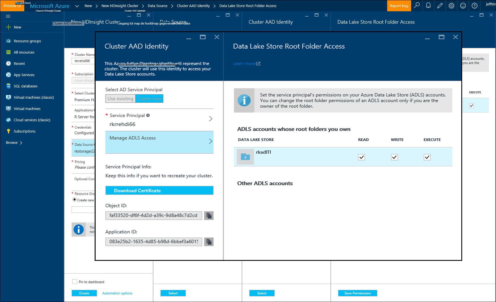

<properties
   pageTitle="Azure opslagopties R Server op HDInsight (voorbeeld) | Microsoft Azure"
   description="Meer informatie over de verschillende opties voor opslag beschikbaar voor gebruikers met R-Server op HDInsight (voorbeeld)"
   services="HDInsight"
   documentationCenter=""
   authors="jeffstokes72"
   manager="jhubbard"
   editor="cgronlun"
/>

<tags
   ms.service="HDInsight"
   ms.devlang="R"
   ms.topic="article"
   ms.tgt_pltfrm="na"
   ms.workload="data-services"
   ms.date="09/01/2016"
   ms.author="jeffstok"
/>

# <a name="azure-storage-options-for-r-server-on-hdinsight-preview"></a>Azure opslagopties R Server op HDInsight (voorbeeld)

Microsoft R Server op HDInsight (voorbeeld) toegang heeft tot zowel Azure Blob en [Azure Lake gegevensopslag](https://azure.microsoft.com/services/data-lake-store/)als middel voor het vastleggen van gegevens, code, leiden tot objecten van analyse, enzovoort.

Wanneer u een cluster Hadoop in HDInsight maakt, kunt u een account Azure opslag opgeven. Een specifieke Blob storage container van de account bevat het bestandssysteem voor het cluster dat u (bijvoorbeeld Hadoop Distributed File System maakt). Voor prestaties, wordt het cluster HDInsight gemaakt in het datacenter hetzelfde als de primaire opslag-account die u opgeeft. Voor meer informatie, Zie [Gebruik Azure Blob-opslag met HDInsight](hdinsight-hadoop-use-blob-storage.md "Gebruik Azure Blob-opslag met HDInsight").   


## <a name="use-multiple-azure-blob-storage-accounts"></a>Gebruik verschillende accounts voor Azure Blob-opslag

Indien nodig, kunt u meerdere accounts Azure opslag of containers openen met het cluster HDI. Hiertoe moet u de extra opslagruimte rekeningen opgeven in de gebruikersinterface wanneer u het cluster maakt en vervolgens als volgt te werk als u wilt deze gebruiken in R.  

1.  Maak een cluster HDInsight met de naam van een opslag van **storage1** en een standaard zogenaamd **container1**.
2. Geef een extra opslagruimte account **storage2**genoemd.  
3. Kopieer het bestand mycsv.csv naar de directory/share en analyses uitvoeren op dat bestand.  

    ````
    hadoop fs –mkdir /share
    hadoop fs –copyFromLocal myscsv.scv /share  
    ````

3.  In R-code, het knooppunt met de naam ingesteld op **standaard,** en de mappen en bestanden te verwerken.  

    ````
    myNameNode <- "default"
    myPort <- 0
    ````

  De locatie van de gegevens:  

    bigDataDirRoot <-"/ delen"  

  Spark compute context definiëren:

    mySparkCluster <-RxSpark(consoleOutput=TRUE)

  Compute-context instellen:

    rxSetComputeContext(mySparkCluster)

  Definieer het bestandssysteem Hadoop Distributed bestand System (HDFS):

    hdfsFS <-RxHdfsFileSystem (hostName = myNameNode, poort = myPort)

  Geef het invoerbestand in HDFS analyseren:

    Invoerbestand <-file.path(bigDataDirRoot,"mycsv.csv")

Alle referenties naar map- en wijs de opslag-account wasbs://container1@storage1.blob.core.windows.net. Dit is de **standaard opslag-account** die is gekoppeld aan het cluster HDInsight.

Stel u wilt een bestand met de naam mySpecial.csv dat in de /private bevindt zich verwerken van **container2** in de **storage2**map.

Wijs het knooppunt de verwijzing naar de account **storage2** opslag in uw code R.

    myNameNode <- "wasbs://container2@storage2.blob.core.windows.net"
    myPort <- 0

  De locatie van de gegevens:

    bigDataDirRoot <- "/private"

  Spark compute context definiëren:

    mySparkCluster <- RxSpark(consoleOutput=TRUE, nameNode=myNameNode, port=myPort)

  Compute-context instellen:

    rxSetComputeContext(mySparkCluster)

  Bestandssysteem HDFS definiëren:

    hdfsFS <- RxHdfsFileSystem(hostName=myNameNode, port=myPort)

  Geef het invoerbestand in HDFS analyseren:

    inputFile <-file.path(bigDataDirRoot,"mySpecial.csv")

Alle referenties naar map- en wijst nu naar de rekening voor opslag wasbs://container2@storage2.blob.core.windows.net. Dit is het **Knooppunt met de naam** die u hebt opgegeven.

Opmerking dat u hebt voor het configureren van de map/User/RevoShare/<SSH username> op **storage2** als volgt:

    hadoop fs -mkdir wasbs://container2@storage2.blob.core.windows.net/user
    hadoop fs -mkdir wasbs://container2@storage2.blob.core.windows.net/user/RevoShare
    hadoop fs -mkdir wasbs://container2@storage2.blob.core.windows.net/user/RevoShare/<RDP username>

## <a name="use-an-azure-data-lake-store"></a>Gebruik een winkel Azure gegevens Lake

Om meer gegevens worden gebruikt met uw HDInsight-account, moet u het cluster toegang geven tot elke Azure gegevens Lake winkel die u wilt gebruiken. U gebruikt de winkel in uw script R veel als u een account voor secundaire opslag gebruiken (zoals beschreven in de vorige procedure).

## <a name="add-cluster-access-to-your-azure-data-lake-stores"></a>Cluster toegang aan uw winkels Azure gegevens meer toevoegen

U toegang tot een winkel meer gegevens met behulp van een Azure Active Directory (AD Azure) Service Principal, die is gekoppeld aan het cluster HDInsight.

### <a name="to-add-a-service-principal"></a>Een Service Principal toevoegen
1. Als u het cluster HDInsight maakt, selecteert u **Cluster AAD identiteit** in het tabblad **Data Source** .
2. Selecteer **Nieuw**in **Cluster AAD identiteit** in het dialoogvenster **Selecteer AD Service Principal**.

Nadat u de Service Principal een naam en een wachtwoord voor het maken, wordt een nieuw tabblad geopend waarin u de Service Principal kunt koppelen aan uw gegevens meer winkels.

Opmerking dat u ook toegang aan een winkel Lake gegevens later toevoegen kunt door de gegevens Lake winkel openen in de portal Azure en **Data Explorer**naar > **toegang**.  Hier volgt een voorbeeld van een dialoogvenster waarin wordt uitgelegd hoe u een Service Principal maken en koppelen aan de 'rkadl11' gegevens Lake winkel.




## <a name="use-the-data-lake-store-with-r-server"></a>Meer gegevens met R-Server gebruiken
Zodra u toegang hebt verleend aan een winkel gegevens Lake, kunt u het archief in R Server op HDInsight de manier als een secundaire opslag van Azure-account. Het enige verschil is dat het voorvoegsel **wasb: / /** gewijzigd in **adl: / /** als volgt:

````
# Point to the ADL store (e.g. ADLtest)
myNameNode <- "adl://rkadl1.azuredatalakestore.net"
myPort <- 0

# Location of the data (assumes a /share directory on the ADL account)
bigDataDirRoot <- "/share"  

# Define Spark compute context
mySparkCluster <- RxSpark(consoleOutput=TRUE, nameNode=myNameNode, port=myPort)

# Set compute context
rxSetComputeContext(mySparkCluster)

# Define HDFS file system
hdfsFS <- RxHdfsFileSystem(hostName=myNameNode, port=myPort)

# Specify the input file in HDFS to analyze
inputFile <-file.path(bigDataDirRoot,"AirlineDemoSmall.csv")

# Create factors for days of the week
colInfo <- list(DayOfWeek = list(type = "factor",
               levels = c("Monday", "Tuesday", "Wednesday", "Thursday",
                          "Friday", "Saturday", "Sunday")))

# Define the data source
airDS <- RxTextData(file = inputFile, missingValueString = "M",
                    colInfo  = colInfo, fileSystem = hdfsFS)

# Run a linear regression
model <- rxLinMod(ArrDelay~CRSDepTime+DayOfWeek, data = airDS)
````

Hieronder staan de opdrachten die worden gebruikt voor de gegevens meer opslagruimte account configureren in de map RevoShare en het CSV-voorbeeldbestand toevoegen uit het vorige voorbeeld:

````
hadoop fs -mkdir adl://rkadl1.azuredatalakestore.net/user
hadoop fs -mkdir adl://rkadl1.azuredatalakestore.net/user/RevoShare
hadoop fs -mkdir adl://rkadl1.azuredatalakestore.net/user/RevoShare/<user>

hadoop fs -mkdir adl://rkadl1.azuredatalakestore.net/share

hadoop fs -copyFromLocal /usr/lib64/R Server-7.4.1/library/RevoScaleR/SampleData/AirlineDemoSmall.csv adl://rkadl1.azuredatalakestore.net/share

hadoop fs –ls adl://rkadl1.azuredatalakestore.net/share
````

## <a name="use-azure-files-on-the-edge-node"></a>Azure-bestanden op het randknooppunt gebruiken

Er is ook een optie gemakkelijk gegevens opslag voor gebruik op de randknooppunt [Azure bestanden](../storage/storage-how-to-use-files-linux.md "Azure bestanden")genoemd. U kunt een bestandsshare Azure opslag op het besturingssysteem Linux koppelen. Dit is handig voor het opslaan van bestanden, scripts R en resultaatobjecten die mogelijk later nodig wanneer is het zinvol de eigen bestandssysteem gebruiken op het randknooppunt in plaats van HDFS.

Een belangrijk voordeel van Azure-bestanden is dat de gedeelde bestanden kunnen worden gemonteerd en gebruikt door elk systeem met een ondersteund besturingssysteem zoals Windows of Linux. Het kan bijvoorbeeld worden gebruikt door een andere HDInsight cluster die u of een teamlid heeft, door een Azure VM of zelfs door een systeem van gebouwen.


## <a name="next-steps"></a>Volgende stappen

Nu dat u de basisbeginselen van het gebruik van de console R met een SSH-sessie en het maken van een nieuwe HDInsight cluster met R-Server via de volgende koppelingen om te ontdekken van andere manieren van het werken met R-Server op HDInsight.

- [Overzicht van de Server op HDInsight R](hdinsight-hadoop-r-server-overview.md)
- [Aan de slag met R-server op Hadoop](hdinsight-hadoop-r-server-get-started.md)
- [RStudio-Server toevoegen aan de HDInsight premie](hdinsight-hadoop-r-server-install-r-studio.md)
- [Context opties voor R Server op HDInsight berekenen](hdinsight-hadoop-r-server-compute-contexts.md)
