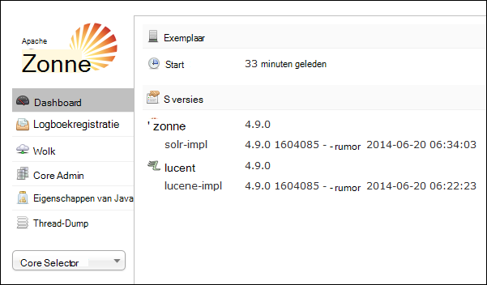
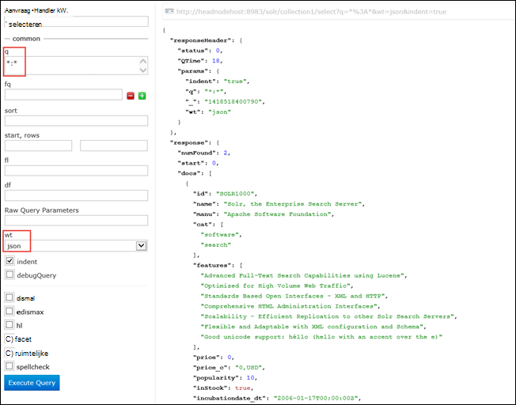

<properties
    pageTitle="Gebruik de actie Script Solr installeren op Linux-gebaseerde HDInsight | Microsoft Azure"
    description="Informatie over het installeren van Solr op HDInsight Hadoop Linux gebaseerde clusters met scriptacties."
    services="hdinsight"
    documentationCenter=""
    authors="Blackmist"
    manager="jhubbard"
    editor="cgronlun"
    tags="azure-portal"/>

<tags
    ms.service="hdinsight"
    ms.workload="big-data"
    ms.tgt_pltfrm="na"
    ms.devlang="na"
    ms.topic="article"
    ms.date="10/03/2016"
    ms.author="larryfr"/>

# Installeren en gebruiken van Solr op HDInsight Hadoop-clusters

In dit onderwerp leert u Solr op Azure HDInsight installeren met behulp van de actie Script. Solr is een krachtige zoekfunctie platform en biedt op ondernemingsniveau zoekmogelijkheden op gegevens die worden beheerd door Hadoop. Wanneer u Solr op HDInsight cluster hebt geïnstalleerd, leert u ook hoe u gegevens zoeken met behulp van Solr.

> [AZURE.NOTE] De stappen in dit document moet een HDInsight op basis van Linux-cluster. Zie voor informatie over het gebruik van Solr met een Windows-gebaseerde clusters [installeren en gebruiken van Solr op HDinsight Hadoop-clusters (Windows)](hdinsight-hadoop-solr-install.md)

Het voorbeeldscript gebruikt in dit onderwerp wordt een cluster Solr gemaakt met een specifieke configuratie. Als u wilt dat de Solr-cluster configureren met verschillende collecties, shards, schema's, replica's, enz., moet u het script en de binaire bestanden van Solr dienovereenkomstig wijzigen.

## Wat is Solr?

[Apache Solr](http://lucene.apache.org/solr/features.html) is een enterprise search-platform waarmee u krachtige zoeken in volledige tekst van de gegevens. Hadoop kunt opslaan en beheren van grote hoeveelheden gegevens, geeft Apache Solr de zoekmogelijkheden die snel de gegevens te herstellen. In dit onderwerp vindt instructies voor het aanpassen van een cluster HDInsight Solr installeren.

> [AZURE.WARNING] Onderdelen van het cluster HDInsight worden volledig ondersteund en Microsoft Support helpt bij het opsporen en oplossen van problemen met betrekking tot deze componenten.
>
> Aangepaste onderdelen, zoals Solr, recht op commercieel redelijke ondersteuning waarmee u het probleem verder oplossen. Dit kan leiden tot het oplossen van het probleem of vraag aan een van de beschikbare kanalen voor de open-source technologieën waarbij diepe expertise voor de technologie die wordt gevonden. Er zijn bijvoorbeeld veel sites van de community die kunnen worden gebruikt, zoals: [MSDN forum voor HDInsight](https://social.msdn.microsoft.com/Forums/azure/en-US/home?forum=hdinsight), [http://stackoverflow.com](http://stackoverflow.com). Apache-projecten hebben ook projectsites op [http://apache.org](http://apache.org), bijvoorbeeld: [Hadoop](http://hadoop.apache.org/).

## Wat het script doet

Dit script worden de volgende wijzigingen aangebracht aan het cluster HDInsight:

* Solr in installaties`/usr/hdp/current/solr`
* Hiermee maakt u een nieuwe gebruiker, __solrusr__, die wordt gebruikt voor het uitvoeren van de service voor Solr
* __Solruser__ ingesteld als de eigenaar van`/usr/hdp/current/solr`
* Voegt een configuratie [Upstart](http://upstart.ubuntu.com/) Solr wordt gestart als een clusterknooppunt opnieuw wordt opgestart. Solr wordt ook automatisch op de clusterknooppunten gestart na de installatie

## Solr met acties Script installeren

Een voorbeeldscript Solr installeren op een cluster HDInsight is beschikbaar op de volgende locatie.

    https://hdiconfigactions.blob.core.windows.net/linuxsolrconfigactionv01/solr-installer-v01.sh

Deze sectie bevat instructies voor het gebruik van het script wanneer u een nieuw cluster maakt met de Azure portal. 

> [AZURE.NOTE] Azure PowerShell, de CLI Azure, het HDInsight .NET SDK of Azure Resource Manager-sjablonen kunnen ook worden gebruikt script acties worden uitgevoerd. U kunt ook scriptacties toepassen op clusters is gebeurd. Zie [clusters met scriptacties HDInsight aanpassen](hdinsight-hadoop-customize-cluster-linux.md)voor meer informatie.

1. Beginnen met het inrichten van een cluster met behulp van de stappen in de [HDInsight bepaling Linux gebaseerde clusters](hdinsight-hadoop-create-linux-clusters-portal.md), maar Voer inrichten.

2. Op het blad **Optionele configuratie** **Scriptacties**selecteren en vul de onderstaande gegevens:

    * __Naam__: Geef een beschrijvende naam voor de scriptactie.
    * __SCRIPT-URI__: https://hdiconfigactions.blob.core.windows.net/linuxsolrconfigactionv01/solr-installer-v01.sh
    * __Kop__: Schakel dit selectievakje in
    * __Werknemer__: Schakel deze optie in
    * __ZOOKEEPER__: Schakel dit selectievakje in om te installeren op het knooppunt Zookeeper
    * __PARAMETERS__: laat dit veld leeg

3. Gebruik de knop **Selecteer** de configuratie opslaan onderaan het **Scriptacties**. Tot slot de knop **selecteren** onderaan het blad **Optionele configuratie** gebruiken de optionele configuratie-informatie opslaan.

4. Het cluster wordt ingericht als beschreven in [HDInsight bepaling Linux gebaseerde clusters](hdinsight-hadoop-create-linux-clusters-portal.md)worden voortgezet.

## Hoe gebruik ik Solr in HDInsight

### Indexeren van gegevens

U moet beginnen met Solr met de gegevensbestanden indexeren. U kunt vervolgens Solr zoekopdrachten uitvoeren op de geïndexeerde gegevens. Ga als volgt een van de voorbeeldgegevens toevoegen aan Solr en vervolgens deze query:

1. Verbinding maken met het HDInsight-cluster met behulp van SSH:

        ssh USERNAME@CLUSTERNAME-ssh.azurehdinsight.net

    Zie de volgende onderwerpen voor meer informatie over het gebruik van SSH in HDInsight:

    * [SSH gebruiken met Linux-gebaseerde Hadoop op HDInsight van Linux, Unix of OS X](hdinsight-hadoop-linux-use-ssh-unix.md)

    * [SSH met Linux-gebaseerde Hadoop op HDInsight van Windows gebruiken](hdinsight-hadoop-linux-use-ssh-windows.md)

    > [AZURE.IMPORTANT] Stappen gebruik verderop in dit document maken van een SSL-tunnel verbinding maken met de webgebruikersinterface Solr. Om deze stappen te gebruiken, moet u een SSL-tunnel tot stand brengen en configureert u de browser wilt gebruiken.
    >
    > Voor meer informatie, Zie [Gebruik SSH Tunneling Ambari web UI, ResourceManager, JobHistory, NameNode, Oozie, en andere web UI van toegang tot](hdinsight-linux-ambari-ssh-tunnel.md)

2. Gebruik de volgende opdrachten zijn voorbeeldgegevens Solr-index:

        cd /usr/hdp/current/solr/example/exampledocs
        java -jar post.jar solr.xml monitor.xml

    Ziet u de volgende uitvoer op de console:

        POSTing file solr.xml
        POSTing file monitor.xml
        2 files indexed.
        COMMITting Solr index changes to http://localhost:8983/solr/update..
        Time spent: 0:00:01.624

    Het hulpprogramma post.jar indexeert Solr met twee voorbeelddocumenten, **solr.xml** en **monitor.xml**. Deze worden opgeslagen in __collection1__ in Solr.

3. Gebruik de volgende query uitvoeren op de REST-API die door Solr:

        curl "http://localhost:8983/solr/collection1/select?q=*%3A*&wt=json&indent=true"

    Deze problemen met een query op __collection1__ voor alle documenten die overeenkomen met __ \*:\* __ (gecodeerd als \*% 3A\* in de queryreeks) en dat het antwoord moet worden geretourneerd als JSON. Het antwoord moet worden met de volgende strekking weergegeven:

            "response": {
                "numFound": 2,
                "start": 0,
                "maxScore": 1,
                "docs": [
                  {
                    "id": "SOLR1000",
                    "name": "Solr, the Enterprise Search Server",
                    "manu": "Apache Software Foundation",
                    "cat": [
                      "software",
                      "search"
                    ],
                    "features": [
                      "Advanced Full-Text Search Capabilities using Lucene",
                      "Optimized for High Volume Web Traffic",
                      "Standards Based Open Interfaces - XML and HTTP",
                      "Comprehensive HTML Administration Interfaces",
                      "Scalability - Efficient Replication to other Solr Search Servers",
                      "Flexible and Adaptable with XML configuration and Schema",
                      "Good unicode support: héllo (hello with an accent over the e)"
                    ],
                    "price": 0,
                    "price_c": "0,USD",
                    "popularity": 10,
                    "inStock": true,
                    "incubationdate_dt": "2006-01-17T00:00:00Z",
                    "_version_": 1486960636996878300
                  },
                  {
                    "id": "3007WFP",
                    "name": "Dell Widescreen UltraSharp 3007WFP",
                    "manu": "Dell, Inc.",
                    "manu_id_s": "dell",
                    "cat": [
                      "electronics and computer1"
                    ],
                    "features": [
                      "30\" TFT active matrix LCD, 2560 x 1600, .25mm dot pitch, 700:1 contrast"
                    ],
                    "includes": "USB cable",
                    "weight": 401.6,
                    "price": 2199,
                    "price_c": "2199,USD",
                    "popularity": 6,
                    "inStock": true,
                    "store": "43.17614,-90.57341",
                    "_version_": 1486960637584081000
                  }
                ]
              }

### Met behulp van het dashboard Solr

Het dashboard Solr is een web-UI waarmee u kunt werken met Solr via uw webbrowser. Het dashboard Solr rechtstreeks op het Internet vanaf uw cluster HDInsight niet wordt weergegeven, maar zijn toegankelijk via een SSH-tunnel. Zie voor meer informatie over het gebruik van een SSH-tunnel [Gebruiken SSH Tunneling Ambari web UI, ResourceManager, JobHistory, NameNode, Oozie, en andere web UI van toegang tot](hdinsight-linux-ambari-ssh-tunnel.md)

Als u een SSH-tunnel tot stand hebt gebracht, gebruik de volgende stappen uit om het dashboard Solr:

1. De hostnaam voor de primaire headnode bepalen:

    1. Met SSH verbinding maken met het cluster op poort 22. Bijvoorbeeld `ssh USERNAME@CLUSTERNAME-ssh.azurehdinsight.net` waarbij __gebruikersnaam__ uw gebruikersnaam SSH en __CLUSTERNAAM__ de naam van het cluster is.

        Zie de volgende documenten voor meer informatie over het gebruik van SSH:

        * [SSH gebruiken met Linux-gebaseerde HDInsight van een client voor Linux, Unix, of Mac OS X](hdinsight-hadoop-linux-use-ssh-unix.md)

        * [SSH met Linux-gebaseerde HDInsight van een Windows-client gebruiken](hdinsight-hadoop-linux-use-ssh-windows.md)
    
    3. Gebruik de volgende opdracht om de volledig gekwalificeerde hostnaam:

            hostname -f

        Het resultaat is een naam met de volgende strekking:

            hn0-myhdi-nfebtpfdv1nubcidphpap2eq2b.ex.internal.cloudapp.net
    
        Dit is de hostnaam die moet worden gebruikt in de volgende stappen.
    
1. In de browser verbinding met __solr-http://HOSTNAME:8983 / #/__, waarbij de __hostnaam__ is de naam die u hebt bepaald in de vorige stappen. 

    De aanvraag moet worden gerouteerd via de tunnel SSH aan het hoofd knooppunt voor uw cluster HDInsight. Een pagina met de volgende strekking worden weergegeven:

    

2. Gebruik de **Core Selector** -omlaag om **collection1**in het linkerdeelvenster. Diverse posten moeten ze onder __collection1__weergegeven.

3. Selecteer de vermeldingen onder __collection1__ __Query__. De volgende waarden gebruiken voor het vullen van de zoekpagina:

    * Voer in het tekstvak **q** ** \*:**\*. Hiermee herstelt u de documenten die zijn geïndexeerd in Solr. Als u zoeken naar een bepaalde tekenreeks in de documenten wilt, kunt u een tekenreeks voor deze hier invoeren.

    * Selecteer in het tekstvak **wt** de uitvoerindeling. De standaardwaarde is **json**.

    Ten slotte, klik op de knop **Query uitvoeren** onder aan de pate zoeken.

    

    De uitvoer geeft als resultaat de twee documenten die we hebben gebruikt voor het indexeren van Solr. De uitvoer er ongeveer als volgt:

            "response": {
                "numFound": 2,
                "start": 0,
                "maxScore": 1,
                "docs": [
                  {
                    "id": "SOLR1000",
                    "name": "Solr, the Enterprise Search Server",
                    "manu": "Apache Software Foundation",
                    "cat": [
                      "software",
                      "search"
                    ],
                    "features": [
                      "Advanced Full-Text Search Capabilities using Lucene",
                      "Optimized for High Volume Web Traffic",
                      "Standards Based Open Interfaces - XML and HTTP",
                      "Comprehensive HTML Administration Interfaces",
                      "Scalability - Efficient Replication to other Solr Search Servers",
                      "Flexible and Adaptable with XML configuration and Schema",
                      "Good unicode support: héllo (hello with an accent over the e)"
                    ],
                    "price": 0,
                    "price_c": "0,USD",
                    "popularity": 10,
                    "inStock": true,
                    "incubationdate_dt": "2006-01-17T00:00:00Z",
                    "_version_": 1486960636996878300
                  },
                  {
                    "id": "3007WFP",
                    "name": "Dell Widescreen UltraSharp 3007WFP",
                    "manu": "Dell, Inc.",
                    "manu_id_s": "dell",
                    "cat": [
                      "electronics and computer1"
                    ],
                    "features": [
                      "30\" TFT active matrix LCD, 2560 x 1600, .25mm dot pitch, 700:1 contrast"
                    ],
                    "includes": "USB cable",
                    "weight": 401.6,
                    "price": 2199,
                    "price_c": "2199,USD",
                    "popularity": 6,
                    "inStock": true,
                    "store": "43.17614,-90.57341",
                    "_version_": 1486960637584081000
                  }
                ]
              }

### Starten en stoppen van Solr

Als u moet handmatig stoppen of starten van Solar, gebruikt u de volgende opdrachten:

    sudo stop solr

    sudo start solr

## Geïndexeerde gegevens back-up

Als een goede gewoonte back u-up de geïndexeerde gegevens van de clusterknooppunten Solr naar Azure Blob-opslag. Doe het volgende doen:

1. Verbinding maken met het cluster via SSH en vervolgens de volgende opdracht gebruiken om de host-naam voor het knooppunt head:

        hostname -f
        
2. Het volgende gebruik te maken van een momentopname van de gegevens geïndexeerd. Vervang __hostnaam__ door de naam geretourneerd van de vorige opdracht:

        curl http://HOSTNAME:8983/solr/replication?command=backup

    Hier ziet u een antwoord als volgt:

        <?xml version="1.0" encoding="UTF-8"?>
        <response>
          <lst name="responseHeader">
            <int name="status">0</int>
            <int name="QTime">9</int>
          </lst>
          <str name="status">OK</str>
        </response>

2. Wijzig vervolgens de mappen op __/usr/hdp/current/solr/example/solr__. Er is een submap voor elke collectie. Elke collectie directory bevat een directory __gegevens__ is waarbij de momentopname voor die collectie zich bevindt.

    Bijvoorbeeld als u de stappen eerder naar de index van de documenten van het monster, de map __/usr/hdp/current/solr/example/solr/collection1/data__ moet bevatten nu een map met de naam __momentopname. ###__ waar de (#) worden de datum en tijd van de opname.

3. Maak een gecomprimeerd archief van de van momentopnamemap met een opdracht van de volgende strekking:

        tar -zcf snapshot.20150806185338855.tgz snapshot.20150806185338855

    Hiermee maakt u een nieuw archief met de naam __snapshot.20150806185338855.tgz__, waarbij de inhoud van de map __snapshot.20150806185338855__ .

3. Vervolgens kunt u het archief van het cluster primaire opslag met de volgende opdracht opslaan:

    hadoop fs - copyFromLocal snapshot.20150806185338855.tgz voorbeeld/gegevens

    > [AZURE.NOTE] U kunt een speciale map voor het opslaan van Solr momentopnamen te maken. Bijvoorbeeld `hadoop fs -mkdir /solrbackup`.

Zie voor meer informatie over het werken met Solr back-up en terugzetten, [maken en terugzetten van back-ups van SolrCores](https://cwiki.apache.org/confluence/display/solr/Making+and+Restoring+Backups+of+SolrCores).

## Zie ook

- [Installeren en gebruiken de tint van HDInsight clusters](hdinsight-hadoop-hue-linux.md). Tint is een web-UI waarmee u gemakkelijk te maken, uitvoeren en opslaan van varkens- en component-taken en bladeren de standaard opslag voor uw HDInsight cluster.

- [R installeren op clusters HDInsight][hdinsight-install-r]. R op HDInsight Hadoop-clusters installeren via cluster aanpassen. R is een open source-taal en omgeving voor statistische berekeningen. Biedt honderden ingebouwde statistische functies en een eigen programmeertaal die aspecten van functionele en object-georiënteerd programmeren combineert. Het biedt ook uitgebreide grafische mogelijkheden.

- [Giraph op HDInsight-clusters installeren](hdinsight-hadoop-giraph-install-linux.md). Giraph op HDInsight Hadoop-clusters installeren via cluster aanpassen. Giraph kunt u uitvoeren grafiek verwerkt met behulp van Hadoop en kunnen worden gebruikt met Azure HDInsight.

- [Kleurtoon op HDInsight clusters installeren](hdinsight-hadoop-hue-linux.md). Installeert met een cluster aanpassing Kleurtoon op HDInsight Hadoop-clusters. Tint is een verzameling van webtoepassingen die worden gebruikt voor interactie met een cluster Hadoop.

[hdinsight-install-r]: hdinsight-hadoop-r-scripts-linux.md
[hdinsight-cluster-customize]: hdinsight-hadoop-customize-cluster-linux.md
