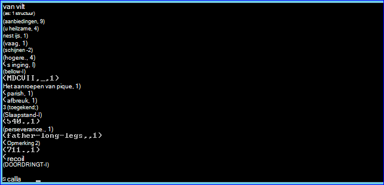
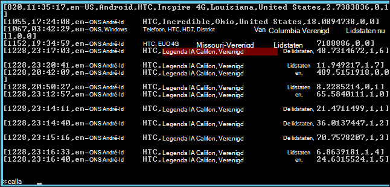

<properties
    pageTitle="Scriptactie gebruiken voor het installeren van motoren op Hadoop cluster | Microsoft Azure"
    description="Informatie over het aanpassen van een cluster HDInsight met motoren met actie Script."
    services="hdinsight"
    documentationCenter=""
    authors="nitinme"
    manager="jhubbard"
    editor="cgronlun"/>

<tags
    ms.service="hdinsight"
    ms.workload="big-data"
    ms.tgt_pltfrm="na"
    ms.devlang="na"
    ms.topic="article"
    ms.date="02/05/2016"
    ms.author="nitinme"/>

# Installeren en gebruiken van motoren op HDInsight Hadoop clusters met actie Script

> [AZURE.IMPORTANT] Dit artikel is nu verouderd. HDInsight biedt nu Spark als een eersteklas cluster voor Windows-gebaseerde clusters, wat betekent dat u nu rechtstreeks een vonk cluster maken kunt zonder een Hadoop-cluster met behulp van de actie Script wijzigen. Het type Spark cluster krijgt u een HDInsight versie 3.2 cluster met vonkontsteking versie 1.3.1.  Om de verschillende versies van een vonk hebt geïnstalleerd, kunt u de actie Script. HDInsight biedt een voorbeeldscript van de scriptactie.

Informatie over Spark installeren op Windows gebaseerde HDInsight met actie Script en het uitvoeren van query's Spark op HDInsight clusters.

**Verwante artikelen**

- [Clusters maken Hadoop in HDInsight](hdinsight-provision-clusters.md): algemene informatie over het maken van clusters van HDInsight.

- [Aan de slag met Apache Spark op HDInsight](hdinsight-apache-spark-jupyter-spark-sql.md): een HDInsight Spark-cluster maken.

- [Aanpassen HDInsight cluster met behulp van de actie Script][hdinsight-cluster-customize]: algemene informatie over het aanpassen van HDInsight clusters met actie Script.

- [Ontwikkelen scriptactie scripts voor HDInsight](hdinsight-hadoop-script-actions.md).

## Wat is de Spark?

<a href="http://spark.apache.org/docs/latest/index.html" target="_blank">Apache Spark</a> is een open source parallelle verwerking die ondersteuning biedt voor verwerking om zo de prestaties van analytische toepassingen van big data in het geheugen. Spark van berekening van de in het geheugen mogelijkheden maken het een goede keuze voor iteratieve algoritmen in de machine learning en grafiek berekeningen.

Spark kan ook worden gebruikt voor het uitvoeren van conventionele gegevensverwerking op de schijf. De traditionele MapReduce framework verbetert Spark door te schrijven naar de schijf in de tussenproducten vermijden. Spark is ook compatibel met de Hadoop Distributed bestand System (HDFS) en Azure Blob-opslag zodat de bestaande gegevens via vonk kan gemakkelijk worden verwerkt.

In dit onderwerp vindt instructies voor het aanpassen van een cluster HDInsight Spark installeren.

## Installeren met behulp van de Portal Azure Spark

Een voorbeeldscript Spark installeren op een cluster HDInsight is beschikbaar in een blob Azure opslag voor alleen-lezen op [https://hdiconfigactions.blob.core.windows.net/sparkconfigactionv03/spark-installer-v03.ps1](https://hdiconfigactions.blob.core.windows.net/sparkconfigactionv03/spark-installer-v03.ps1). Met dit script kunt installeren 1.2.0 Spark Spark 1.0.2 afhankelijk van de versie van het HDInsight-cluster dat u maakt.

- Als u het script gebruikt bij het maken van een cluster **HDInsight 3.2** , installeert deze **vonk 1.2.0**.
- Als u het script gebruikt bij het maken van een cluster **HDInsight 3.1** , installeert deze **vonk 1.0.2**.

U kunt dit script wijzigen of uw eigen script maken om te installeren van andere versies van Spark.

> [AZURE.NOTE] Het script werkt alleen met HDInsight 3.1 en 3.2 clusters. Zie voor meer informatie over de versies van HDInsight cluster, [cluster versies van HDInsight](hdinsight-component-versioning.md).

1. Beginnen met het maken van een cluster met de optie **Aangepast maken** zoals beschreven bij het [maken van Hadoop clusters in het HDInsight](hdinsight-provision-clusters.md#portal). Kies de versie van het cluster afhankelijk van het volgende:

    - Als u wilt installeren **Spark 1.2.0**, maakt u een cluster HDInsight 3.2.
    - Als u installeren **Spark 1.0.2 wilt**, maakt u een cluster 3.1 HDInsight.

2. Op de pagina **Scriptacties** van de wizard, klikt u op **scriptactie toevoegen** voor meer informatie over de scriptactie zoals hieronder wordt weergegeven:

    ![Gebruik scriptactie voor het aanpassen van een cluster] (./media/hdinsight-hadoop-spark-install/HDI.CustomProvision.Page6.png "Gebruik scriptactie voor het aanpassen van een cluster")

    <table border='1'>
        <tr><th>Eigenschap</th><th>Waarde</th></tr>
        <tr><td>Naam</td>
            <td>Geef een naam voor de scriptactie. Bijvoorbeeld <b>Spark installeren</b>.</td></tr>
        <tr><td>URI-script</td>
            <td>Geef de URI Uniform Resource Identifier () aan het script dat wordt aangeroepen voor het aanpassen van het cluster. Bijvoorbeeld: <i>https://hdiconfigactions.blob.core.windows.net/sparkconfigactionv03/spark-installer-v03.ps1</i></td></tr>
        <tr><td>Knooppunttype</td>
            <td>Geef de knooppunten waarop het aangepaste script wordt uitgevoerd. U kunt <b>alle knooppunten</b>, <b>alleen knooppunten Head</b>of <b>alleen knooppunten werknemer</b>.
        <tr><td>Parameters</td>
            <td>Geef de parameters, indien nodig door het script. Spark installeren met het script heeft geen parameters nodig zodat u kunt deze leeg laten.</td></tr>
    </table>

    U kunt meer dan één scriptactie om meerdere onderdelen op het cluster toevoegen. Nadat u de scripts hebt toegevoegd, klikt u op het vinkje om te beginnen met het maken van het cluster.

U kunt het script ook motoren op HDInsight met Azure PowerShell of de HDInsight .NET SDK installeren. Verderop in dit onderwerp vindt u instructies voor deze procedures.

## Motoren voor gebruik in HDInsight
Spark biedt API's in Scala, Python en Java. U kunt ook de interactieve shell van Spark Spark query's worden uitgevoerd. Deze sectie bevat instructies voor het gebruik van de verschillende benaderingen om te werken met vonkontsteking:

- [Gebruik de shell Spark interactieve query's uitvoeren](#sparkshell)
- [Gebruik de shell Spark Spark SQL-query's uitvoeren](#sparksql)
- [Gebruik een Scala zelfstandig programma](#standalone)

###Gebruik de shell Spark interactieve query's uitvoeren
De volgende stappen uitvoeren van query's Spark van een interactieve Spark shell uitvoeren. In deze sectie, wij een vonk-query uitvoeren op een voorbeeld van gegevensbestand (/ example/data/gutenberg/davinci.txt) die beschikbaar is op HDInsight clusters standaard.

1. Vanaf de portal Azure, moet u extern bureaublad inschakelen voor het cluster dat u hebt gemaakt met vonkontsteking geïnstalleerd en vervolgens extern in het cluster. Zie [verbinding maken met clusters van HDInsight met RDP](hdinsight-administer-use-management-portal.md#rdp)voor instructies.

2. Open de opdrachtregel Hadoop (van een snelkoppeling op het bureaublad) in het Remote Desktop Protocol (RDP)-sessie op het bureaublad en Ga naar de locatie waar de Spark is geïnstalleerd; bijvoorbeeld **C:\apps\dist\spark-1.2.0**.

3. Voer de volgende opdracht om de Spark shell te starten:

         .\bin\spark-shell --master yarn

    Nadat de opdracht is voltooid, moet u een Scala prompt:

         scala>

5. Voer de onderstaande Spark-query op de prompt Scala. Deze query telt het exemplaar van elk woord in het bestand davinci.txt dat beschikbaar is op het voorbeeld/gutenberg/locatie op de Azure Blob-opslag die is gekoppeld aan het cluster.

        val file = sc.textFile("/example/data/gutenberg/davinci.txt")
        val counts = file.flatMap(line => line.split(" ")).map(word => (word, 1)).reduceByKey(_ + _)
        counts.toArray().foreach(println)

6. De uitvoer moet uitzien:

    

7. Voer: q om af te sluiten van de Scala-prompt.

        :q

###Gebruik de shell Spark Spark SQL-query's uitvoeren

Spark SQL kunt u relationele query's, uitgedrukt in Structured Query Language (SQL), HiveQL of Scala uitvoeren met vonkontsteking. In dit gedeelte bekijken we Spark via een component-query uitvoeren op een voorbeeldtabel component. De component-tabel die wordt gebruikt in deze sectie (ook wel **hivesampletable**genoemd) is standaard beschikbaar wanneer u een cluster maakt.

>[AZURE.NOTE] Het onderstaande voorbeeld is gemaakt tegen **1.2.0 Wek**, die wordt geïnstalleerd als u de scriptactie tijdens het HDInsight 3.2 cluster maken uitvoert.

1. Vanaf de portal Azure, moet u extern bureaublad inschakelen voor het cluster dat u hebt gemaakt met vonkontsteking geïnstalleerd en vervolgens extern in het cluster. Zie [verbinding maken met clusters van HDInsight met RDP](hdinsight-administer-use-management-portal.md#rdp)voor instructies.

2. Open de opdrachtregel Hadoop (van een snelkoppeling op het bureaublad) in het RDP-sessie op het bureaublad en Ga naar de locatie waar de Spark is geïnstalleerd; bijvoorbeeld **C:\apps\dist\spark-1.2.0**.

3. Voer de volgende opdracht om de Spark shell te starten:

         .\bin\spark-shell --master yarn

    Nadat de opdracht is voltooid, moet u een Scala prompt:

         scala>

4. Stel de context van de component op de prompt Scala. Dit is nodig om te werken met component query's met behulp van Spark.

        val hiveContext = new org.apache.spark.sql.hive.HiveContext(sc)

    Opmerking dat **sc** is standaard Spark context die is ingesteld bij het starten van de shell vonk.

5. Een component uitvoeren met behulp van de context van de component en de uitvoer op de console afdrukken. De query haalt gegevens op apparaten van een bepaald merk en beperkt het aantal records opgehaald op 20.

        hiveContext.sql("""SELECT * FROM hivesampletable WHERE devicemake LIKE "HTC%" LIMIT 20""").collect().foreach(println)

6. Hier ziet u de volgende uitvoer:

    

7. Voer: q om af te sluiten van de Scala-prompt.

        :q

### Gebruik een Scala zelfstandig programma

In deze sectie, we een Scala toepassing schrijven die telt het aantal regels dat de letters "a" en "b" in het voorbeeld van een gegevensbestand (/ example/data/gutenberg/davinci.txt) die beschikbaar is op HDInsight clusters standaard. Om te schrijven en een Scala zelfstandig programma gebruiken met een cluster met vonkontsteking installatie aangepast, moet u de volgende stappen uitvoeren:

- Schrijf een programma Scala
- Bouw Scala wordt het JAR-bestand ophalen
- De taak op het cluster uitvoeren

#### Schrijf een programma Scala
In dit gedeelte vindt u een Scala programma schrijven dat telt het aantal regels met "a" en "b" in het bestand met voorbeeldgegevens.

1. Open een teksteditor en plak de volgende code:

        /* SimpleApp.scala */
        import org.apache.spark.SparkContext
        import org.apache.spark.SparkContext._
        import org.apache.spark.SparkConf

        object SimpleApp {
          def main(args: Array[String]) {
            val logFile = "/example/data/gutenberg/davinci.txt"         //Location of the sample data file on Azure Blob storage
            val conf = new SparkConf().setAppName("SimpleApplication")
            val sc = new SparkContext(conf)
            val logData = sc.textFile(logFile, 2).cache()
            val numAs = logData.filter(line => line.contains("a")).count()
            val numBs = logData.filter(line => line.contains("b")).count()
            println("Lines with a: %s, Lines with b: %s".format(numAs, numBs))
          }
        }

2. Sla het bestand met de naam **SimpleApp.scala**.

#### Het programma Scala bouwen
In dit gedeelte kunt u <a href="http://www.scala-sbt.org/0.13/docs/index.html" target="_blank">Eenvoudig hulpprogramma bouwen</a> (of de sbt) het Scala programma samenstellen. SBT Java 1.6 of hoger vereist, dus zorg ervoor dat u beschikt over de juiste versie van Java geïnstalleerd voordat u verdergaat met deze sectie.

1. Sbt installeren vanaf http://www.scala-sbt.org/0.13/tutorial/Installing-sbt-on-Windows.html.
2. Maak een map met de naam **SimpleScalaApp**en maak een bestand genaamd **simple.sbt**in deze map. Dit is een configuratiebestand dat informatie over de versie van de Scala, bibliotheek afhankelijkheden, enz bevat. Plak de volgende tekst in het bestand simple.sbt en sla het op:

        name := "SimpleApp"

        version := "1.0"

        scalaVersion := "2.10.4"

        libraryDependencies += "org.apache.spark" %% "spark-core" % "1.2.0"

    >[AZURE.NOTE] Zorg ervoor dat u de lege regels in het bestand behouden.

3. Onder de map **SimpleScalaApp** , maken een directory structuur **\src\main\scala** en plak het Scala programma (**SimpleApp.scala**) die u eerder hebt gemaakt onder de map \src\main\scala.
4. Open een opdrachtprompt, Ga naar de map SimpleScalaApp en voer de volgende opdracht:

        sbt package

    Nadat de toepassing is gecompileerd, ziet u een **simpleapp_2.10-1.0.jar** -bestand gemaakt onder de map **\target\scala-2.10** in de hoofdmap van het SimpleScalaApp.

#### De taak op het cluster uitvoeren
In deze sectie kunt u externe in het cluster met vonkontsteking geïnstalleerd en kopieert u de doelmap van het project SimpleScalaApp. U gebruik vervolgens de opdracht **spark dienen** in te dienen van de taak in het cluster.

1. Afstand tot het cluster met vonkontsteking geïnstalleerd. Vanaf de computer waar u hebt geschreven en SimpleApp.scala wordt gebouwd, de **SimpleScalaApp\target** -map kopiëren en plakken naar een locatie op het cluster.
2. Open de opdrachtregel Hadoop in de RDP-sessie op het bureaublad en Ga naar de locatie waar u **de doelmap** hebt geplakt.
3. Voer de volgende opdracht om het programma SimpleApp.scala uitvoeren:

        C:\apps\dist\spark-1.2.0\bin\spark-submit --class "SimpleApp" --master local target/scala-2.10/simpleapp_2.10-1.0.jar

4. Als het programma is voltooid, wordt de uitvoer op de console weergegeven.

        Lines with a: 21374, Lines with b: 11430

## Motoren met Azure PowerShell installeren

In deze sectie gebruiken we de cmdlet **<a href = "http://msdn.microsoft.com/library/dn858088.aspx" target="_blank">Add-AzureHDInsightScriptAction</a>** scripts aangeroepen met behulp van de actie Script voor het aanpassen van een cluster. Zorg ervoor dat u hebt geïnstalleerd en geconfigureerd Azure PowerShell voordat u verdergaat. Zie voor meer informatie over het configureren van een werkstation om uit te voeren Azure PowerShell-cmdlets voor HDInsight [installeren en configureren van Azure PowerShell](../powershell-install-configure.md).

Voer de volgende stappen uit:

1. Open een venster Azure PowerShell en declareert de volgende variabelen:

        # Provide values for these variables
        $subscriptionName = "<SubscriptionName>"        # Name of the Azure subscription
        $clusterName = "<HDInsightClusterName>"         # HDInsight cluster name
        $storageAccountName = "<StorageAccountName>"    # Azure Storage account that hosts the default container
        $storageAccountKey = "<StorageAccountKey>"      # Key for the Storage account
        $containerName = $clusterName
        $location = "<MicrosoftDataCenter>"             # Location of the HDInsight cluster. It must be in the same data center as the Storage account.
        $clusterNodes = <ClusterSizeInNumbers>          # Number of nodes in the HDInsight cluster
        $version = "<HDInsightClusterVersion>"          # For example, "3.2"

2. Geef de waarden van de systeemconfiguratie zoals knooppunten in het cluster en de opslag van de standaard moet worden gebruikt.

        # Specify the configuration options
        Select-AzureSubscription $subscriptionName
        $config = New-AzureHDInsightClusterConfig -ClusterSizeInNodes $clusterNodes
        $config.DefaultStorageAccount.StorageAccountName="$storageAccountName.blob.core.windows.net"
        $config.DefaultStorageAccount.StorageAccountKey=$storageAccountKey
        $config.DefaultStorageAccount.StorageContainerName=$containerName

3. Met de cmdlet **Add-AzureHDInsightScriptAction** kunt u de scriptactie toevoegen aan de configuratie van het cluster. Later, wanneer het cluster wordt gemaakt, wordt de scriptactie uitgevoerd.

        # Add a script action to the cluster configuration
        $config = Add-AzureHDInsightScriptAction -Config $config -Name "Install Spark" -ClusterRoleCollection HeadNode -Uri https://hdiconfigactions.blob.core.windows.net/sparkconfigactionv03/spark-installer-v03.ps1

    De cmdlet **Add-AzureHDInsightScriptAction** heeft de volgende parameters:

    <table style="border-color: #c6c6c6; border-width: 2px; border-style: solid; border-collapse: collapse;">
    <tr>
    <th style="border-color: #c6c6c6; border-width: 2px; border-style: solid; border-collapse: collapse; width:90px; padding-left:5px; padding-right:5px;">Parameter</th>
    <th style="border-color: #c6c6c6; border-width: 2px; border-style: solid; border-collapse: collapse; width:550px; padding-left:5px; padding-right:5px;">Definitie</th></tr>
    <tr>
    <td style="border-color: #c6c6c6; border-width: 2px; border-style: solid; border-collapse: collapse; padding-left:5px;">Config</td>
    <td style="border-color: #c6c6c6; border-width: 2px; border-style: solid; border-collapse: collapse; padding-left:5px; padding-right:5px;">Het configuratieobject welk script actie-informatie wordt toegevoegd.</td></tr>
    <tr>
    <td style="border-color: #c6c6c6; border-width: 2px; border-style: solid; border-collapse: collapse; padding-left:5px;">Naam</td>
    <td style="border-color: #c6c6c6; border-width: 2px; border-style: solid; border-collapse: collapse; padding-left:5px;">De naam van de scriptactie.</td></tr>
    <tr>
    <td style="border-color: #c6c6c6; border-width: 2px; border-style: solid; border-collapse: collapse; padding-left:5px;">ClusterRoleCollection</td>
    <td style="border-color: #c6c6c6; border-width: 2px; border-style: solid; border-collapse: collapse; padding-left:5px;">Hiermee geeft u de knooppunten waarop het aangepaste script wordt uitgevoerd. Geldige waarden zijn HeadNode (om te installeren op het knooppunt head) of DataNode (om te installeren op alle gegevensknooppunten). U kunt een of beide waarden.</td></tr>
    <tr>
    <td style="border-color: #c6c6c6; border-width: 2px; border-style: solid; border-collapse: collapse; padding-left:5px;">URI</td>
    <td style="border-color: #c6c6c6; border-width: 2px; border-style: solid; border-collapse: collapse; padding-left:5px;">Hiermee wordt de URI voor het script dat wordt uitgevoerd.</td></tr>
    <tr>
    <td style="border-color: #c6c6c6; border-width: 2px; border-style: solid; border-collapse: collapse; padding-left:5px;">Parameters</td>
    <td style="border-color: #c6c6c6; border-width: 2px; border-style: solid; border-collapse: collapse; padding-left:5px;">Parameters die nodig zijn door het script. Het voorbeeldscript in dit onderwerp wordt gebruikt, heeft geen parameters nodig en deze parameter in het fragment hierboven dus niet weergegeven.
    </td></tr>
    </table>

4. Ten slotte, beginnen met het maken van een aangepaste cluster met vonkontsteking geïnstalleerd.  

        # Start creating a cluster with Spark installed
        New-AzureHDInsightCluster -Config $config -Name $clusterName -Location $location -Version $version

Voer desgevraagd de referenties voor het cluster. Het kan enkele minuten duren voordat het cluster wordt gemaakt.

## Motoren met PowerShell installeren

Zie [clusters van HDInsight aanpassen met behulp van de actie Script](hdinsight-hadoop-customize-cluster.md#call_scripts_using_powershell).

## Motoren met .NET SDK installeren

Zie [clusters van HDInsight aanpassen met behulp van de actie Script](hdinsight-hadoop-customize-cluster.md#call_scripts_using_azure_powershell).

## Zie ook

- [Clusters maken Hadoop in HDInsight](hdinsight-provision-clusters.md): HDInsight-clusters maken.
- [Aan de slag met Apache Spark op HDInsight](hdinsight-apache-spark-jupyter-spark-sql.md): aan de slag met motoren op HDInsight.
- [Aanpassen HDInsight cluster met behulp van de actie Script][hdinsight-cluster-customize]: HDInsight-clusters met actie Script aanpassen.
- [Ontwikkelen scriptactie scripts voor HDInsight](hdinsight-hadoop-script-actions.md): scriptactie scripts ontwikkelen.
- [R installeren op clusters HDInsight] [ hdinsight-install-r] biedt instructies voor het installeren en gebruiken van R op HDInsight Hadoop clusters met aanpassing van de cluster. R is een open source-taal en omgeving voor statistische berekeningen. Biedt honderden ingebouwde statistische functies en een eigen programmeertaal die aspecten van functionele en object-georiënteerd programmeren combineert. Het biedt ook uitgebreide grafische mogelijkheden.
- [Giraph op HDInsight-clusters installeren](hdinsight-hadoop-giraph-install.md). Giraph op HDInsight Hadoop-clusters installeren via cluster aanpassen. Giraph kunt u uitvoeren grafiek verwerkt met behulp van Hadoop en kunnen worden gebruikt met Azure HDInsight.
- [Solr op HDInsight clusters installeren](hdinsight-hadoop-solr-install.md). Solr op HDInsight Hadoop-clusters installeren via cluster aanpassen. Solr kunt u krachtige zoekfunctie bewerkingen uitvoeren op gegevens die zijn opgeslagen.

[hdinsight-provision]: hdinsight-provision-clusters.md
[hdinsight-install-r]: hdinsight-hadoop-r-scripts.md
[hdinsight-cluster-customize]: hdinsight-hadoop-customize-cluster.md
[powershell-install-configure]: powershell-install-configure.md
