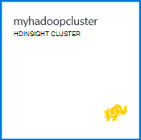

<properties
   pageTitle="Hadoop zelfstudie: aan de slag met Hadoop op Windows | Microsoft Azure"
   description="Aan de slag met Hadoop in HDInsight. Informatie over het Hadoop-clusters maken in Windows, een component-query uitvoeren op gegevens en analyseren van de output in Excel."
   keywords="zelfstudie hadoop, hadoop op windows, cluster, hadoop, hadoop, component query meer"
   services="hdinsight"
   documentationCenter=""
   authors="nitinme"
   manager="jhubbard"
   editor="cgronlun"
   tags="azure-portal"/>

<tags
   ms.service="hdinsight"
   ms.devlang="na"
   ms.topic="article"
   ms.tgt_pltfrm="na"
   ms.workload="big-data"
   ms.date="03/07/2016"
   ms.author="nitinme"/>

# Hadoop zelfstudie: aan de slag met Hadoop in HDInsight op Windows

> [AZURE.SELECTOR]
- [Op basis van Linux](../hdinsight-hadoop-linux-tutorial-get-started.md)
- [Op basis van Windows](../hdinsight-hadoop-tutorial-get-started-windows.md)

Als u informatie over Hadoop op Windows en start met behulp van HDInsight, in deze zelfstudie wordt beschreven hoe u een component-query uitvoeren op niet-gestructureerde gegevens in een cluster van Hadoop en vervolgens analyseren van de resultaten in Microsoft Excel.

>[AZURE.NOTE] De informatie in dit document is specifiek voor de HDInsight op basis van Windows-clusters. Zie voor meer informatie op Linux gebaseerde clusters [Hadoop zelfstudie: aan de slag met Linux-gebaseerde Hadoop in HDInsight](hdinsight-hadoop-linux-tutorial-get-started.md).

Stel u hebt een grote gegevensset ongestructureerde u wilt een component-query uitvoeren op deze zinvolle informatie ophalen. Dat is precies wat u wilt doen in deze zelfstudie. Hier ziet u hoe u deze bereikt:

   !["Hadoop zelfstudie: Maak een account; Maak een cluster Hadoop; verzenden van een query component; gegevens analyseren in Excel.][image-hdi-getstarted-flow]

Bekijk een demo video van deze zelfstudie voor meer informatie over Hadoop op HDInsight:

![Video van een eerste Hadoop zelfstudie: verzenden van een query component op een cluster van Hadoop en analyseren van resultaten in Excel.][img-hdi-getstarted-video]

**[Bekijk de Hadoop-zelfstudie voor HDInsight op YouTube](https://www.youtube.com/watch?v=Y4aNjnoeaHA&list=PLDrz-Fkcb9WWdY-Yp6D4fTC1ll_3lU-QS)**

Microsoft biedt in combinatie met de algemene beschikbaarheid van Azure HDInsight, ook HDInsight Emulator voor Azure, voorheen bekend als *Microsoft HDInsight Developer Preview*. De Emulator is bedoeld voor scenario's voor ontwikkelaars en ondersteunt alleen implementaties met één knooppunt. Zie voor meer informatie over het gebruik van HDInsight-Emulator [Aan de slag met de HDInsight Emulator][hdinsight-emulator].

[AZURE.INCLUDE [delete-cluster-warning](../../includes/hdinsight-delete-cluster-warning.md)]

## Vereisten

Voordat u deze zelfstudie voor Hadoop in Windows, hebt u het volgende:

- **Azure een abonnement**. Zie [Azure krijg gratis proefperiode](https://azure.microsoft.com/documentation/videos/get-azure-free-trial-for-testing-hadoop-in-hdinsight/).
- **Een workstation-computer** met Office 2013 Professional Plus, Office 365 Pro Plus, Excel 2013 zelfstandig of Office 2010 Professional Plus.

### Access controle-eisen

[AZURE.INCLUDE [access-control](../../includes/hdinsight-access-control-requirements.md)]

##Hadoop clusters maken

Wanneer u een cluster maakt, kunt u bronnen Azure compute met Hadoop en verwante toepassingen maken. In dit gedeelte maakt u een cluster HDInsight versie 3.2. U kunt ook Hadoop clusters voor andere versies maken. Zie voor instructies [maken HDInsight clusters met aangepaste opties][hdinsight-provision]. Zie voor meer informatie over de versies HDInsight en hun SLA's [HDInsight component versiebeheer](hdinsight-component-versioning.md).

**Een Hadoop-cluster maken**

1. Aanmelden bij de [Azure Portal](https://portal.azure.com/).
2. Klik op **Nieuw**, klik op **Analytics gegevens**en klik op **HDInsight**. De portal wordt een **Nieuw HDInsight Cluster** blade geopend.

    ![Een nieuw cluster in Azure Portal maken] (./media/hdinsight-hadoop-tutorial-get-started-windows/HDI.CreateCluster.1.png "Een nieuw cluster in Azure Portal maken")

3. Typ of Selecteer het volgende:

    ![Typ de clusternaam en typ] (./media/hdinsight-hadoop-tutorial-get-started-windows/HDI.CreateCluster.2.png "Typ de clusternaam en typ")
    
  	|Veldnaam| Waarde|
  	|----------|------|
  	|De naam van cluster| Een unieke naam voor het cluster identificeren|
  	|Clustertype| **Hadoop** selecteren voor deze zelfstudie. |
  	|Cluster-besturingssysteem| Selecteer **Windows Server 2012 R2 Datacenter** voor deze zelfstudie.|
  	|HDInsight versie| Selecteer de meest recente versie van deze zelfstudie.|
  	|Abonnement| Selecteer de Azure abonnement die wordt gebruikt voor het cluster.|
  	|Resourcegroep | Een bestaande Azure resourcegroep selecteren of een nieuwe resourcegroep te maken. Een eenvoudige HDInsight cluster bevat een cluster en de standaardaccount voor opslag.  U kunt de twee in een resourcegroep voor eenvoudig beheer groeperen.|
  	|Referenties| Cluster login gebruikersnaam en wachtwoord invoeren. Op basis van Windows-cluster kan 2 gebruikersaccounts hebben.  De cluster gebruiker (of HTTP-gebruiker) wordt gebruikt voor het beheren van het cluster en taken.  U kunt desgewenst maken met een extern bureaublad (RDP) gebruikersaccount naar extern verbinding maken met het cluster. Als u extern bureaublad inschakelen, maakt u de RDP-gebruikersaccount.|
  	|Gegevensbron| Klik op Nieuw om een nieuwe standaard Azure opslag account maken. Naam van het cluster gebruikt als de standaardnaam van de container. Elk cluster HDinsight heeft een Blob standaardcontainer op een Azure opslag-accounts.  De locatie van de standaardaccount Azure opslag bepaalt de locatie van het cluster HDInsight.|
  	|Knooppunt lagen prijzen| 1 of 2 werknemer knooppunten met de standaard werknemer knooppunt en hoofd notitie prijzen laag voor deze zelfstudie gebruiken.|
  	|Optionele configuratie| Dit onderdeel overslaat.|

9. Op het **Nieuwe Cluster van HDInsight** -blade zorgen **vastmaken aan de Startboard** is geselecteerd en klik vervolgens op **maken**. Dit maakt het cluster en een tegel voor het toevoegen aan de Startboard van uw Portal Azure. Het pictogram geeft aan dat het cluster wordt gemaakt en het pictogram HDInsight verandert als maken is voltooid.

  	| Tijdens het maken van | Maken is voltooid |
  	| ------------------ | --------------------- |
  	|  |  |

    > [AZURE.NOTE] Het duurt enige tijd voor het cluster moet worden gemaakt, meestal ongeveer 15 minuten. De tegel op de Startboard of de vermelding van de **kennisgevingen** aan de linkerkant van de pagina gebruiken om te controleren op het maakproces.

10. Zodra het maken is voltooid, klikt u op de tegel voor het cluster uit de Startboard voor het starten van de cluster-blade.

## Een component uitvoeren vanaf de portal
Nu u een HDInsight-cluster hebt gemaakt, de volgende stap is een component taak om een monster component-tabel uit te voeren. We gebruiken *hivesampletable*, dat wordt meegeleverd met clusters van HDInsight. De tabel bevat gegevens over de fabrikanten van mobiele apparaten, platforms en modellen. Component in de tabel query haalt gegevens voor mobiele apparaten die door een bepaalde fabrikant.

> [AZURE.NOTE] Extra HDInsight voor Visual Studio wordt geleverd met de Azure SDK voor .NET versie 2.5 of hoger. Met behulp van de hulpprogramma's in Visual Studio, kunt u verbinding maken met een cluster van HDInsight, component tabellen maken en component-query's uitvoeren. Zie voor meer informatie, [aan de slag met HDInsight Hadoop Tools for Visual Studio][1].

**Voor het uitvoeren van de taak van een component van het cluster dashboard**

1. Aanmelden bij de [Azure Portal](https://portal.azure.com/).
2. Klik op **Alles zoeken** en klik vervolgens op **Clusters van HDInsight** voor een overzicht van clusters, met inbegrip van het cluster dat u zojuist hebt gemaakt in de vorige sectie.
3. Klik op de naam van het cluster dat u gebruiken wilt voor het uitvoeren van de taak van de component en klik vervolgens op het **Dashboard** aan de bovenkant van het blad.
4. Een webpagina wordt geopend in een andere browser tab. Het Hadoop-gebruikersaccount en wachtwoord invoeren. De standaardgebruikersnaam is **admin**; het wachtwoord is opgegeven tijdens het maken van het cluster.
5. Het dashboard, klik op het tabblad **Editor component** . De volgende pagina wordt geopend.

    ![Het tabblad Editor in het dashboard van de cluster HDInsight component.][img-hdi-dashboard]

    Er zijn meerdere tabbladen boven aan de pagina. De standaardtabblad **Editor component**en de andere tabbladen zijn **Geschiedenis** en de **Bestandsbrowser**. Via het dashboard kunt u component query's indienen, Hadoop taak logboeken controleren en bladeren in de bestanden in de opslag.

    > [AZURE.NOTE] Opmerking: de URL van de webpagina is * &lt;clusternaam&gt;. azurehdinsight.net*. Dus in plaats van het dashboard openen vanaf de portal, kunt u openen het dashboard vanuit een webbrowser via de URL.

6. Voer op het tabblad **Editor component** voor de **Query de naam** **HTC20**.  Naam van de query is de titel van de taak. Klik in het Querydeelvenster voert u de query component zoals in de afbeelding:

    ![Query die is ingevoerd in het Querydeelvenster van de Editor component component.][img-hdi-dashboard-query-select]

4. Klik op **indienen**. Het duurt een paar seconden om de resultaten weer. Het scherm wordt elke 30 seconden vernieuwd. U kunt ook klikken op **vernieuwen** om het scherm te vernieuwen.

    ![Resultaten van een query component in weergegeven onder aan het dashboard van het cluster.][img-hdi-dashboard-query-select-result]

5. Nadat de status geeft aan dat de taak is voltooid, klikt u op de naam van de query op het scherm om de uitvoer weergegeven. Maak een notitie van de **Taak Start Time (UTC)**. U zal het later nodig hebt.

    ![Taak starten tijd weergegeven op het tabblad Geschiedenis van het dashboard van de cluster HDInsight.][img-hdi-dashboard-query-select-result-output]

    De pagina bevat ook de **Uitvoer van de taak** en het **Logboek van de taak**. U hebt ook de mogelijkheid voor het downloaden van het uitvoerbestand (\_stdout) en het logboekbestand \(_stderr).

**Bladeren naar het uitvoerbestand**

1. Klik op het dashboard cluster **File Browser**.
2. Klik op de naam van uw opslag, klikt u op de containernaam van uw (dit is hetzelfde als de naam van het cluster) en klik vervolgens op **gebruiker**.
3. Klik op **beheer** en klik vervolgens op de GUID die het laatst gewijzigd (een beetje nadat de taak begintijd die u eerder hebt opgeschreven) heeft. Deze GUID kopiëren. Deze moet u in het volgende gedeelte.

    ![De query component uitvoerbestand die GUID op het tabblad bestandsbrowser weergegeven.][img-hdi-dashboard-query-browse-output]

##Verbinding maken met Microsoft business intelligence tools voor Excel

De Power Query-invoegtoepassing voor Microsoft Excel kunt u de uitvoer van de taak van HDInsight importeren in Excel, waar Microsoft business intelligence-hulpprogramma's kunnen worden gebruikt om de resultaten verder te analyseren.

U hebt Excel 2013 of 2010 geïnstalleerd voor dit deel van de zelfstudie te voltooien.

**Microsoft Power Query voor Excel downloaden**

- Microsoft Power Query voor Microsoft Excel van het [Microsoft Downloadcentrum](http://www.microsoft.com/download/details.aspx?id=39379) downloaden en installeren.

**HDInsight-gegevens importeren**

1. Open Excel en maak een nieuwe werkmap.
3. Klik in het menu **Query energie** en **Van andere bronnen**op, **HDInsight van Azure**.

    ![PowerQuery importeren van Excel-menu openen voor Azure HDInsight.][image-hdi-gettingstarted-powerquery-importdata]

3. Voer de **Naam** van de account Azure Blob-opslag die is gekoppeld aan het cluster en klik vervolgens op **OK**. (Dit is de opslag-account die u eerder in de zelfstudie gemaakt.)
4. Geef de **Sleutel van de Account** voor de Azure Blob-opslag-account en klik vervolgens op **Opslaan**.
5. Dubbelklik in het rechterdeelvenster op de naam van de blob. De naam van de blob is standaard hetzelfde als de naam van het cluster.

6. Zoek naar **stdout** in de kolom **naam** . Controleer of de GUID in de kolom **Pad naar de map** komt overeen met de GUID die u eerder hebt gekopieerd. Een overeenkomst wordt voorgesteld de uitvoergegevens overeenkomt met de taak die u hebt ingediend. Klik op **binaire** in de kolom links van **stdout**.

    ![Het vinden van de gegevensuitvoer door de GUID in de lijst van de inhoud.][image-hdi-gettingstarted-powerquery-importdata2]

9. Klik op **sluiten en laden** in de linkerbovenhoek de component taak uitvoeren in Excel importeren.

##Voorbeelden uitvoeren

HDInsight cluster bevat een query-console met een galerie aan de slag om monsters worden uitgevoerd direct vanaf de portal. De monsters kunt u leren werken met HDInsight door enkele eenvoudige scenario's doorlopen. Deze monsters worden geleverd met alle benodigde onderdelen, zoals de gegevens te analyseren en de query's uit te voeren op de gegevens. Zie [Informatie over Hadoop in de galerie met HDInsight aan de slag met HDInsight](hdinsight-learn-hadoop-use-sample-gallery.md)voor meer informatie over de monsters in de galerie aan de slag kunt.

**Voor het uitvoeren van de steekproef**

1. Klik op het vakje voor het cluster dat u zojuist hebt gemaakt van de startboard Portal Azure.
 
2. Klik op het nieuwe cluster-blade **Dashboard**. Voer desgevraagd de gebruikersnaam admin en het wachtwoord voor het cluster.

    ![Starten van de cluster-dashboard] (./media/hdinsight-hadoop-tutorial-get-started-windows/HDI.Cluster.Dashboard.png "Starten van de cluster-dashboard")
 
3. Van de webpagina die wordt geopend, klikt u op het tabblad **Getting Started galerie** en klik vervolgens op het monster dat u wilt uitvoeren onder de categorie **oplossingen met voorbeeldgegevens** . Volg de instructies op de pagina voltooien van de steekproef. In de volgende tabel geeft een overzicht van een paar voorbeelden en meer informatie over wat elk monster wordt.

Monster | Wat doet het?
------ | ---------------
[Analyse van de sensor gegevens][hdinsight-sensor-data-sample] | Informatie over het gebruik van HDInsight voor het verwerken van historische gegevens die wordt geproduceerd door verwarmings-, ventilatie en airconditioning (HVAC)-systemen om te bepalen welke systemen niet kunnen op betrouwbare wijze een set om temperatuur te houden.
[Website logboekanalyse][hdinsight-weblogs-sample] | Informatie over het gebruik van HDInsight voor het analyseren van logbestanden website om inzicht te krijgen in de frequentie van de bezoeken aan de website in een dag van externe websites en een overzicht van de website fouten die de gebruikers ondervinden.
[Trendanalyse Twitter](hdinsight-analyze-twitter-data.md) | Informatie over het gebruik van HDInsight voor het analyseren van trends in Twitter.

##Het cluster te verwijderen

[AZURE.INCLUDE [delete-cluster-warning](../../includes/hdinsight-delete-cluster-warning.md)]

##Volgende stappen
In deze zelfstudie Hadoop hebt u geleerd hoe een cluster van Hadoop op vensters in HDInsight, een component-query uitvoeren op gegevens en het importeren van de resultaten in Excel, waar ze verder kunnen worden verwerkt en grafisch worden weergegeven met hulpprogramma's voor bedrijfsinformatie maken. Voor meer informatie, Zie de volgende cursussen:

- [Aan de slag met HDInsight Hadoop-hulpprogramma's voor Visual Studio][1]
- [Aan de slag met de HDInsight-Emulator][hdinsight-emulator]
- [Azure Blob-opslag gebruiken met HDInsight][hdinsight-storage]
- [HDInsight met PowerShell beheren][hdinsight-admin-powershell]
- [Gegevens uploaden naar HDInsight][hdinsight-upload-data]
- [MapReduce gebruiken met HDInsight][hdinsight-use-mapreduce]
- [Gebruik component met HDInsight][hdinsight-use-hive]
- [Varken met HDInsight gebruiken][hdinsight-use-pig]
- [Gebruik Oozie met HDInsight][hdinsight-use-oozie]
- [MapReduce Java-programma's ontwikkelen voor HDInsight][hdinsight-develop-mapreduce]

[1]: ../HDInsight/hdinsight-hadoop-visual-studio-tools-get-started.md

[hdinsight-versions]: hdinsight-component-versioning.md

[hdinsight-provision]: hdinsight-provision-clusters.md
[hdinsight-admin-powershell]: hdinsight-administer-use-powershell.md
[hdinsight-upload-data]: hdinsight-upload-data.md
[hdinsight-use-mapreduce]: hdinsight-use-mapreduce.md
[hdinsight-use-hive]: hdinsight-use-hive.md
[hdinsight-use-pig]: hdinsight-use-pig.md
[hdinsight-use-oozie]: hdinsight-use-oozie.md
[hdinsight-storage]: hdinsight-hadoop-use-blob-storage.md
[hdinsight-emulator]: hdinsight-hadoop-emulator-get-started.md
[hdinsight-develop-mapreduce]: hdinsight-develop-deploy-java-mapreduce-linux.md
[hadoop-hdinsight-intro]: hdinsight-hadoop-introduction.md
[hdinsight-weblogs-sample]: hdinsight-hive-analyze-website-log.md
[hdinsight-sensor-data-sample]: hdinsight-hive-analyze-sensor-data.md

[azure-purchase-options]: http://azure.microsoft.com/pricing/purchase-options/
[azure-member-offers]: http://azure.microsoft.com/pricing/member-offers/
[azure-free-trial]: http://azure.microsoft.com/pricing/free-trial/
[azure-management-portal]: https://portal.azure.com/
[azure-create-storageaccount]: ../storage-create-storage-account.md

[apache-hadoop]: http://go.microsoft.com/fwlink/?LinkId=510084
[apache-hive]: http://go.microsoft.com/fwlink/?LinkId=510085
[apache-mapreduce]: http://go.microsoft.com/fwlink/?LinkId=510086
[apache-hdfs]: http://go.microsoft.com/fwlink/?LinkId=510087
[hdinsight-hbase-custom-provision]: hdinsight-hbase-tutorial-get-started.md

[powershell-download]: http://go.microsoft.com/fwlink/p/?linkid=320376&clcid=0x409
[powershell-install-configure]: powershell-install-configure.md
[powershell-open]: powershell-install-configure.md#step-1-install

[img-hdi-dashboard]: ./media/hdinsight-hadoop-tutorial-get-started-windows/HDI.dashboard.png
[img-hdi-dashboard-query-select]: ./media/hdinsight-hadoop-tutorial-get-started-windows/HDI.dashboard.query.select.png
[img-hdi-dashboard-query-select-result]: ./media/hdinsight-hadoop-tutorial-get-started-windows/HDI.dashboard.query.select.result.png
[img-hdi-dashboard-query-select-result-output]: ./media/hdinsight-hadoop-tutorial-get-started-windows/HDI.dashboard.query.select.result.output.png
[img-hdi-dashboard-query-browse-output]: ./media/hdinsight-hadoop-tutorial-get-started-windows/HDI.dashboard.query.browse.output.png

[img-hdi-getstarted-video]: ./media/hdinsight-hadoop-tutorial-get-started-windows/hdi-get-started-video.png

[image-hdi-storageaccount-quickcreate]: ./media/hdinsight-hadoop-tutorial-get-started-windows/HDI.StorageAccount.QuickCreate.png
[image-hdi-clusterstatus]: ./media/hdinsight-hadoop-tutorial-get-started-windows/HDI.ClusterStatus.png
[image-hdi-quickcreatecluster]: ./media/hdinsight-hadoop-tutorial-get-started-windows/HDI.QuickCreateCluster.png
[image-hdi-getstarted-flow]: ./media/hdinsight-hadoop-tutorial-get-started-windows/HDI.GetStartedFlow.png

[image-hdi-gettingstarted-powerquery-importdata]: ./media/hdinsight-hadoop-tutorial-get-started-windows/HDI.GettingStarted.PowerQuery.ImportData.png
[image-hdi-gettingstarted-powerquery-importdata2]: ./media/hdinsight-hadoop-tutorial-get-started-windows/HDI.GettingStarted.PowerQuery.ImportData2.png
 
