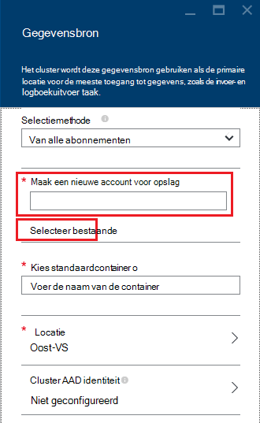

<properties
    pageTitle="Querygegevens uit HDFS-compatibele Blob-opslag | Microsoft Azure"
    description="HDInsight gebruik Azure Blob-opslag als de grote gegevensopslag voor HDFS. Informatie over het opvragen van gegevens uit de Blob-opslag en opslaan van de analyseresultaten."
    keywords="BLOB-opslag, hdfs, gestructureerde gegevens, ongestructureerde gegevens"
    services="hdinsight,storage"
    documentationCenter=""
    tags="azure-portal"
    authors="mumian"
    manager="jhubbard"
    editor="cgronlun"/>

<tags
    ms.service="hdinsight"
    ms.workload="big-data"
    ms.tgt_pltfrm="na"
    ms.devlang="na"
    ms.topic="get-started-article"
    ms.date="09/06/2016"
    ms.author="jgao"/>

# HDFS-compatibele Azure Blob-opslag met Hadoop in HDInsight gebruiken

Informatie over het gebruik van goedkope Azure Blob-opslag met HDInsight, Azure opslag account en Blob storage container maken en adresseer de gegevens in.

Azure Blob-opslag is een robuuste, algemene opslagoplossing die naadloos geïntegreerd met HDInsight. Via een interface Hadoop gedistribueerd bestandssysteem (HDFS)-systeem, kan de volledige set van componenten in HDInsight werken rechtstreeks op gestructureerde of ongestructureerde gegevens in een Blob-opslag.

Gegevens opslaan in een Blob-opslag kunt u veilig verwijderen van de clusters HDInsight die worden gebruikt voor berekeningen zonder verlies van gegevens van de gebruiker.

> [AZURE.IMPORTANT] HDInsight ondersteunt alleen BLOB's blokkeren. Het ondersteunt pagina of BLOB's toevoegen.

Zie voor meer informatie over het maken van een cluster van HDInsight [Aan de slag met HDInsight] [ hdinsight-get-started] of [clusters maken HDInsight][hdinsight-creation].

## HDInsight opslagarchitectuur
In het volgende diagram bevat een abstracte weergave van de opslag-architectuur HDInsight:

![Clusters van Hadoop de HDFS-API gebruiken voor toegang tot en opslaan van gestructureerde en ongestructureerde gegevens in Blob-opslag.] (./media/hdinsight-hadoop-use-blob-storage/HDI.WASB.Arch.png "HDInsight opslag architectuur")

HDInsight biedt toegang tot het gedistribueerde bestandssysteem dat lokaal is gekoppeld aan de compute nodes. Dit bestandssysteem kunt openen met behulp van de volledig gekwalificeerde URI, bijvoorbeeld:

    hdfs://<namenodehost>/<path>

HDInsight biedt bovendien de mogelijkheid om toegang tot gegevens die zijn opgeslagen in Azure Blob-opslag. De syntaxis is:

    wasb[s]://<containername>@<accountname>.blob.core.windows.net/<path>

> [AZURE.NOTE] In eerdere versies van HDInsight dan 3.0, `asv://` is gebruikt in plaats van `wasb://`. `asv://`mag niet worden gebruikt met HDInsight clusters 3.0 of hoger, omdat dit tot een fout leidt.

Hadoop ondersteunt een begrip van het standaardbestandssysteem. Het standaardbestandssysteem impliceert een standaardschema en autoriteit. Het kan ook worden gebruikt voor het oplossen van relatieve paden. Tijdens het proces voor het maken van HDInsight, een account Azure opslag en een specifieke Azure Blob-opslag is container van de account aangewezen als het standaardbestandssysteem.

Naast deze account opslag kunt u extra opslagruimte rekeningen van dezelfde Azure abonnement of andere Azure abonnementen toevoegen tijdens het maken of nadat een cluster is gemaakt. Zie voor instructies over het toevoegen van extra opslagruimte accounts, [clusters maken HDInsight][hdinsight-creation].

- **Containers in de opslag-accounts die zijn verbonden met een cluster:** Omdat de naam en de sleutel gekoppeld aan het cluster tijdens het maken zijn, hebt u volledige toegang tot de BLOB's in deze containers.

- **Openbare containers of openbare BLOB's in opslag accounts die niet zijn verbonden met een cluster:** U hebt alleen-lezen machtigingen voor de BLOB's in de containers.

    > [AZURE.NOTE]
        > Openbare containers kunnen u een lijst van alle BLOB's die beschikbaar zijn in die container en de container metagegevens ophalen. Openbare BLOB's kunnen u toegang krijgen tot de BLOB's alleen als u de exacte URL. Zie voor meer informatie <a href="http://msdn.microsoft.com/library/windowsazure/dd179354.aspx">beperken de toegang tot de containers en BLOB's</a>.

- **Persoonlijke containers in opslag accounts die niet zijn verbonden met een cluster:** U kunt het aantal BLOB's in de containers geen toegang tot tenzij u de account voor de opslag definiëren wanneer u de taken WebHCat indient. Dit wordt verderop in dit artikel uitgelegd.

De opslag-accounts die zijn gedefinieerd in het proces voor het maken en de sleutels worden opgeslagen in %HADOOP_HOME%/conf/core-site.xml op de clusterknooppunten. Het standaardgedrag van de HDInsight is de opslag rekeningen gedefinieerd in het bestand core-site.xml gebruiken. Het is niet aanbevolen het bestand te bewerken core site.xml omdat het cluster hoofd node(master) reimaged of kan op elk gewenst moment worden gemigreerd, en eventuele wijzigingen in deze bestanden verloren.

Meerdere WebHCat taken, met inbegrip van de component, MapReduce, Hadoop streaming en varkens, kunnen een beschrijving van de opslag rekeningen en metagegevens met hen voeren. (Dit momenteel werkt voor varkens met opslag accounts, maar niet voor metagegevens.) In de [Access-BLOB's met Azure PowerShell](#powershell) sectie van dit artikel is er een voorbeeld van deze functie. Zie [Een Cluster van HDInsight met alternatieve Accounts van de opslag- en Metastores](http://social.technet.microsoft.com/wiki/contents/articles/23256.using-an-hdinsight-cluster-with-alternate-storage-accounts-and-metastores.aspx)voor meer informatie.

BLOB-opslag kan worden gebruikt voor gestructureerde en ongestructureerde gegevens. Opslaan van gegevens als de sleutel/waarde-paren BLOB storage containers en er is geen directory-hiërarchie. Echter het slash-teken (/) worden gebruikt in de naam van de sleutel te laten lijken als een bestand wordt opgeslagen in een mapstructuur. De sleutel van een blob kan bijvoorbeeld *input/log1.txt*zijn. Er is geen werkelijke *invoer* directory bestaat, maar vanwege de aanwezigheid van de slash-teken in de naam van de sleutel, heeft het uiterlijk van een pad.

###Voordelen van Blob-opslag
De impliciete prestaties kosten niet gezamenlijk gezocht compute clusters en opslagbronnen is beperkt door de manier waarop de computerclusters dichtbij de opslagbronnen account binnen het gebied van de Azure, waar het hogesnelheidsnet kunt u heel efficiënt zijn voor de compute nodes toegang te krijgen tot de gegevens in Azure Blob-opslag worden gemaakt.

Er zijn verschillende voordelen die zijn gekoppeld aan de gegevens op te slaan in Azure Blob-opslag in plaats van HDFS:

* **Gegevens opnieuw gebruiken en delen:** De gegevens in de HDFS bevindt zich in de compute cluster. Alleen de toepassingen die toegang tot de compute cluster hebben kunnen u de gegevens door HDFS API's gebruiken. De gegevens in Azure Blob-opslag zijn toegankelijk via de API's van HDFS of via de [Blob Storage REST API's][blob-storage-restAPI]. Dus kan een grotere set hulpprogramma's en toepassingen (met inbegrip van andere clusters HDInsight) worden gebruikt om te slaan en te verwerken van de gegevens.
* **Gegevens archiveren:** Gegevens opslaan in Azure Blob-opslag kunt de HDInsight clusters gebruikt voor de berekening worden verwijderd zonder verlies van gegevens van de gebruiker.
* **Data opslag kosten:** Gegevens op te slaan in DFS voor de lange termijn is duurder dan het opslaan van de gegevens in Azure Blob-opslag omdat de kosten van een compute cluster hoger dan de kosten van een container Azure Blob-opslag is. Bovendien, omdat de gegevens niet kan worden geladen voor elke compute cluster genereren, slaat ook u kosten laden van gegevens.
* **Elastische schalen:** Maar HDFS u met een bestandssysteem schaalvergroting biedt, wordt de schaal wordt bepaald door het aantal knooppunten dat u voor uw cluster maakt. Wijzigen van de schaal kan resulteren in een ingewikkelder proces dan vertrouwen op de elastische schalen mogelijkheden u automatisch in Azure Blob-opslag krijgt.
* **Geo-replicatie:** Uw Azure Blob storage containers kunnen worden gerepliceerd van geo. Hoewel dit u geografische herstel en gegevensredundantie biedt, een failover naar de locatie geo gerepliceerd ernstige problemen heeft gevolgen voor de prestaties en er mogelijk extra kosten. Onze aanbeveling is het verstandig de geo-replicatie kiezen en alleen als de waarde van de gegevens is de moeite waard de extra kosten.

Bepaalde taken MapReduce en pakketten tussenliggende resultaten die u echt niet wilt opslaan in Azure Blob-opslag kunnen maken. In dat geval kunt u ervoor kiezen de gegevens opslaan in de lokale HDFS. HDInsight wordt in feite DFS voor verschillende van deze tussentijdse resultaten in de taken van de component en andere processen.

> [AZURE.NOTE] De meeste opdrachten HDFS (bijvoorbeeld <b>ls</b>, <b>copyFromLocal</b> en <b>mkdir</b>) nog steeds werken correct. Alleen de opdrachten die specifiek voor de eigen HDFS uitvoering zijn (waarnaar wordt verwezen als DFS), zoals <b>fschk</b> en <b>dfsadmin</b>, ziet de ander gedrag in Azure Blob-opslag.

## Blob containers maken

BLOB's gebruikt, maakt u eerst een [account Azure opslag][azure-storage-create]. Als onderdeel van dit, kunt u een Azure regio waarin de objecten die u maakt met behulp van deze account opgeven. De rekening voor de opslag en het cluster moeten worden gehost in hetzelfde gebied. De component metastore SQL Server-database en Oozie metastore SQL Server-database moeten ook in hetzelfde gebied bevinden.

Overal waar zij woont, behoort elk blob u maakt een container in uw account Azure opslag. Deze container mogelijk een bestaande blob die buiten de HDInsight is gemaakt of wordt een container die wordt gemaakt voor een cluster HDInsight.

De standaardcontainer Blob slaat cluster specifieke informatie zoals Logboeken en geschiedenis. Niet een Blob-standaardcontainer niet delen met meerdere clusters van HDInsight. Dit kan beschadiging van geschiedenis en het cluster zal zijn vastgelopen. Het wordt aanbevolen voor elk cluster een andere container en gedeelde gegevens op een gekoppelde opslag-account die is opgegeven in de implementatie van alle relevante clusters in plaats van de standaardaccount voor opslag plaatsen. Zie voor meer informatie over het configureren van gekoppelde opslag rekeningen [clusters maken HDInsight][hdinsight-creation]. Nadat het oorspronkelijke cluster van HDInsight is verwijderd, kunt u echter een standaard opslag container hergebruiken. HBase clusters, kunt u daadwerkelijk het tabelschema HBase bewaren en gegevens door maken een nieuw HBase cluster met behulp van de standaard blob storage container die wordt gebruikt door een cluster HBase die is verwijderd.

### Met behulp van de Portal Azure

Bij het maken van een HDInsight-cluster via de Portal, hebt u de opties voor het gebruik van een bestaande account voor opslag of maak een nieuwe account voor opslag:

###Met behulp van Azure CLI

[AZURE.INCLUDE [use-latest-version](../../includes/hdinsight-use-latest-cli.md)]

Als u [geïnstalleerd en de CLI Azure is geconfigureerd hebt](../xplat-cli-install.md), kan met de volgende opdracht om een account voor opslag en verpakking worden gebruikt.

    azure storage account create <storageaccountname> --type LRS

> [AZURE.NOTE] De `--type` parameter geeft aan hoe u de account voor de opslag wordt gerepliceerd. Zie [Azure Storage replicatie](../storage/storage-redundancy.md)voor meer informatie. Gebruik geen ZRS als ZRS blob pagina, bestand, tabel of wachtrij wordt niet ondersteund.

U wordt gevraagd om de geografische regio die de account opslag bevindt zich in. U moet de opslag-account maken in hetzelfde gebied, die u van plan bent over het maken van het cluster HDInsight.

Als de opslag-account is gemaakt, gebruik de volgende opdracht voor het ophalen van de sleutels opslag account:

    azure storage account keys list <storageaccountname>

Als u wilt maken in een container, gebruik de volgende opdracht:

    azure storage container create <containername> --account-name <storageaccountname> --account-key <storageaccountkey>

### Azure PowerShell gebruiken

Als u [geïnstalleerd en geconfigureerd Azure PowerShell][powershell-install], kunt u de volgende handelingen uit op de Azure PowerShell-prompt voor het maken van een opslag- en container:

[AZURE.INCLUDE [upgrade-powershell](../../includes/hdinsight-use-latest-powershell.md)]

    $SubscriptionID = "<Your Azure Subscription ID>"
    $ResourceGroupName = "<New Azure Resource Group Name>"
    $Location = "EAST US 2"
    
    $StorageAccountName = "<New Azure Storage Account Name>"
    $containerName = "<New Azure Blob Container Name>"
    
    Add-AzureRmAccount
    Select-AzureRmSubscription -SubscriptionId $SubscriptionID
    
    # Create resource group
    New-AzureRmResourceGroup -name $ResourceGroupName -Location $Location
    
    # Create default storage account
    New-AzureRmStorageAccount -ResourceGroupName $ResourceGroupName -Name $StorageAccountName -Location $Location -Type Standard_LRS 
    
    # Create default blob containers
    $storageAccountKey = (Get-AzureRmStorageAccountKey -ResourceGroupName $resourceGroupName -StorageAccountName $StorageAccountName)[0].Value
    $destContext = New-AzureStorageContext -StorageAccountName $storageAccountName -StorageAccountKey $storageAccountKey  
    New-AzureStorageContainer -Name $containerName -Context $destContext

## Bestanden in de Blob-opslag

De URI-schema voor de toegang tot bestanden in de Blob-opslag van HDInsight is:

    wasb[s]://<BlobStorageContainerName>@<StorageAccountName>.blob.core.windows.net/<path>

De URI-schema biedt niet-gecodeerde toegang (met de *wasb:* prefix) en SSL gecodeerde toegang (met *wasbs*). Wij raden u aan met behulp van *wasbs* waar mogelijk, zelfs wanneer de toegang tot gegevens die zich in hetzelfde gebied in Azure.

De &lt;BlobStorageContainerName&gt; geeft de naam van de container in Azure Blob-opslag.
De &lt;StorageAccountName&gt; geeft de naam van de opslag van Azure. Een volledig gekwalificeerde domeinnaam (FQDN) is vereist.

Als geen van beide &lt;BlobStorageContainerName&gt; en &lt;StorageAccountName&gt; is opgegeven, wordt het standaardbestandssysteem gebruikt. U kunt een relatief pad of een absoluut pad gebruiken voor de bestanden in het standaardbestandssysteem. Bijvoorbeeld kan het *hadoop-mapreduce-examples.jar* -bestand dat wordt geleverd met HDInsight clusters waarnaar worden verwezen door een van de volgende opties:

    wasbs://mycontainer@myaccount.blob.core.windows.net/example/jars/hadoop-mapreduce-examples.jar
    wasbs:///example/jars/hadoop-mapreduce-examples.jar
    /example/jars/hadoop-mapreduce-examples.jar

> [AZURE.NOTE] De bestandsnaam is <i>hadoop-examples.jar</i> in HDInsight versie 2.1 en 1.6 clusters.

De &lt;pad&gt; is het bestand of de map HDFS padnaam. Omdat de containers in Azure Blob-opslag zijn gewoon sleutel / waarde-winkels, is er geen true hiërarchisch bestandssysteem. Een slash-teken (/) in een blob-sleutel wordt geïnterpreteerd als een directory scheidingsteken. De naam van de blob voor *hadoop-mapreduce-examples.jar* is bijvoorbeeld:

    example/jars/hadoop-mapreduce-examples.jar

> [AZURE.NOTE] Als u werkt met blobs buiten HDInsight, de meeste hulpprogramma's niet herkend door de indeling van de WASB en in plaats daarvan een eenvoudige padindeling, zoals verwacht `example/jars/hadoop-mapreduce-examples.jar`.

## Access BLOB's met Azure CLI

Gebruik de volgende opdracht om de blob-opdrachten:

    azure storage blob

**Voorbeeld van een bestand te uploaden met behulp van Azure CLI**

    azure storage blob upload <sourcefilename> <containername> <blobname> --account-name <storageaccountname> --account-key <storageaccountkey>

**Voorbeeld van een bestand te downloaden met behulp van Azure CLI**

    azure storage blob download <containername> <blobname> <destinationfilename> --account-name <storageaccountname> --account-key <storageaccountkey>

**Voorbeeld van een bestand te verwijderen met behulp van Azure CLI**

    azure storage blob delete <containername> <blobname> --account-name <storageaccountname> --account-key <storageaccountkey>

**Voorbeeld van het gebruik van Azure CLI weergeven van bestanden**

    azure storage blob list <containername> <blobname|prefix> --account-name <storageaccountname> --account-key <storageaccountkey>

## Access BLOB's met Azure PowerShell

> [AZURE.NOTE] De opdrachten in deze sectie bieden een eenvoudig voorbeeld van het gebruik van PowerShell toegang heeft tot gegevens die zijn opgeslagen in de BLOB's. Zie de [Hulpprogramma's HDInsight](https://github.com/Blackmist/hdinsight-tools)bijvoorbeeld een uitgebreidere die is aangepast voor het werken met HDInsight.

Gebruik de volgende opdracht om de cmdlets blob gerelateerd:

    Get-Command *blob*

![Lijst van blob-gerelateerde PowerShell-cmdlets.][img-hdi-powershell-blobcommands]

###Bestanden uploaden

Zie het [uploaden van gegevens naar HDInsight][hdinsight-upload-data].

###Bestanden downloaden

De volgende scriptbestanden downloadt een blob blok aan de huidige map. Voordat het script wordt uitgevoerd, de map te wijzigen in een map waarvoor u schrijftoegang hebt.

    $resourceGroupName = "<AzureResourceGroupName>"
    $storageAccountName = "<AzureStorageAccountName>"   # The storage account used for the default file system specified at creation.
    $containerName = "<BlobStorageContainerName>"  # The default file system container has the same name as the cluster.
    $blob = "example/data/sample.log" # The name of the blob to be downloaded.
    
    # Use Add-AzureAccount if you haven't connected to your Azure subscription
    Login-AzureRmAccount 
    Select-AzureRmSubscription -SubscriptionID "<Your Azure Subscription ID>"
    
    Write-Host "Create a context object ... " -ForegroundColor Green
    $storageAccountKey = (Get-AzureRmStorageAccountKey -ResourceGroupName $resourceGroupName -Name $storageAccountName)[0].Value
    $storageContext = New-AzureStorageContext -StorageAccountName $storageAccountName -StorageAccountKey $storageAccountKey  
    
    Write-Host "Download the blob ..." -ForegroundColor Green
    Get-AzureStorageBlobContent -Container $ContainerName -Blob $blob -Context $storageContext -Force
    
    Write-Host "List the downloaded file ..." -ForegroundColor Green
    cat "./$blob"

Met de naam van de resource en de naam van het cluster, kunt u de volgende code:

    $resourceGroupName = "<AzureResourceGroupName>"
    $clusterName = "<HDInsightClusterName>"
    $blob = "example/data/sample.log" # The name of the blob to be downloaded.
    
    $cluster = Get-AzureRmHDInsightCluster -ResourceGroupName $resourceGroupName -ClusterName $clusterName
    $defaultStorageAccount = $cluster.DefaultStorageAccount -replace '.blob.core.windows.net'
    $defaultStorageAccountKey = (Get-AzureRmStorageAccountKey -ResourceGroupName $resourceGroupName -Name $defaultStorageAccount)[0].Value
    $defaultStorageContainer = $cluster.DefaultStorageContainer
    $storageContext = New-AzureStorageContext -StorageAccountName $defaultStorageAccount -StorageAccountKey $defaultStorageAccountKey 
    
    Write-Host "Download the blob ..." -ForegroundColor Green
    Get-AzureStorageBlobContent -Container $defaultStorageContainer -Blob $blob -Context $storageContext -Force

###Bestanden verwijderen

    Remove-AzureStorageBlob -Container $containerName -Context $storageContext -blob $blob

###Bestanden weergeven

    Get-AzureStorageBlob -Container $containerName -Context $storageContext -prefix "example/data/"

###Component-query's met een niet-gedefinieerde opslag-account uitvoeren

In dit voorbeeld ziet hoe u een map uit de opslag-account die is gedefinieerd tijdens het proces.
$clusterName = "<HDInsightClusterName>"

    $undefinedStorageAccount = "<UnboundedStorageAccountUnderTheSameSubscription>"
    $undefinedContainer = "<UnboundedBlobContainerAssociatedWithTheStorageAccount>"

    $undefinedStorageKey = Get-AzureStorageKey $undefinedStorageAccount | %{ $_.Primary }

    Use-AzureRmHDInsightCluster $clusterName

    $defines = @{}
    $defines.Add("fs.azure.account.key.$undefinedStorageAccount.blob.core.windows.net", $undefinedStorageKey)

    Invoke-AzureRmHDInsightHiveJob -Defines $defines -Query "dfs -ls wasbs://$undefinedContainer@$undefinedStorageAccount.blob.core.windows.net/;"

## Volgende stappen

In dit artikel hebt u geleerd hoe u HDFS-compatibele Azure Blob-opslag met HDInsight te gebruiken en hebt u geleerd dat Azure Blob-opslag een fundamenteel onderdeel van de HDInsight is. Hiermee kunt u schaalbare, op lange termijn, archivering data acquisition oplossingen bouwen met Azure Blob-opslag en HDInsight gebruiken om de informatie in de opgeslagen gestructureerde en ongestructureerde gegevens ontgrendelen.

Zie voor meer informatie:

* [Aan de slag met Azure HDInsight][hdinsight-get-started]
* [Gegevens uploaden naar HDInsight][hdinsight-upload-data]
* [Gebruik component met HDInsight][hdinsight-use-hive]
* [Varken met HDInsight gebruiken][hdinsight-use-pig]
* [Azure opslag gedeelde toegang handtekeningen gebruiken om toegang te beperken tot gegevens met HDInsight][hdinsight-use-sas]

[hdinsight-use-sas]: hdinsight-storage-sharedaccesssignature-permissions.md
[powershell-install]: ../powershell-install-configure.md
[hdinsight-creation]: hdinsight-provision-clusters.md
[hdinsight-get-started]: hdinsight-hadoop-tutorial-get-started-windows.md
[hdinsight-upload-data]: hdinsight-upload-data.md
[hdinsight-use-hive]: hdinsight-use-hive.md
[hdinsight-use-pig]: hdinsight-use-pig.md

[blob-storage-restAPI]: http://msdn.microsoft.com/library/windowsazure/dd135733.aspx
[azure-storage-create]: ../storage/storage-create-storage-account.md

[img-hdi-powershell-blobcommands]: ./media/hdinsight-hadoop-use-blob-storage/HDI.PowerShell.BlobCommands.png
[img-hdi-quick-create]: ./media/hdinsight-hadoop-use-blob-storage/HDI.QuickCreateCluster.png
[img-hdi-custom-create-storage-account]: ./media/hdinsight-hadoop-use-blob-storage/HDI.CustomCreateStorageAccount.png  
