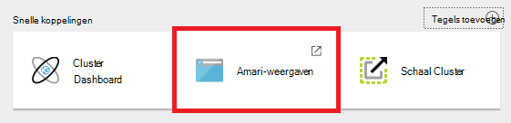
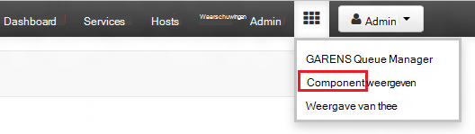
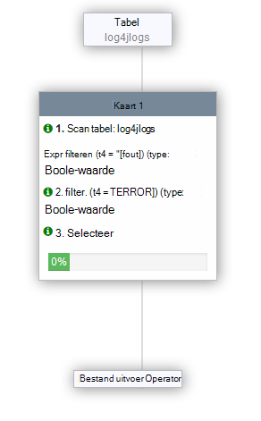

<properties
   pageTitle="Ambari weergaven gebruiken om te werken met de component in HDInsight (Hadoop) | Microsoft Azure"
   description="Informatie over hoe u de component-weergave van uw webbrowser gebruikt voor het indienen van query's component. De component-weergave maakt deel uit van de Ambari Web UI voorzien zijn van het HDInsight op basis van Linux-cluster."
   services="hdinsight"
   documentationCenter=""
   authors="Blackmist"
   manager="jhubbard"
   editor="cgronlun"
    tags="azure-portal"/>

<tags
   ms.service="hdinsight"
   ms.devlang="na"
   ms.topic="article"
   ms.tgt_pltfrm="na"
   ms.workload="big-data"
   ms.date="10/28/2016"
   ms.author="larryfr"/>

#Gebruik de component-weergave met Hadoop in HDInsight

[AZURE.INCLUDE [hive-selector](../../includes/hdinsight-selector-use-hive.md)]

Ambari is een beheer- en controleprogramma hulpprogramma met HDInsight Linux gebaseerde clusters. Een van de functies die beschikbaar zijn via de Ambari is een Web-UI dat kan worden gebruikt voor het uitvoeren van query's component. Dit is de __Component-weergave__, onderdeel van de cluster HDInsight Ambari-weergaven.

> [AZURE.NOTE] Ambari heeft een groot aantal mogelijkheden die won't in dit document worden besproken. Zie [clusters met behulp van de gebruikersinterface voor het Ambari Web HDInsight beheren](hdinsight-hadoop-manage-ambari.md)voor meer informatie.

##Vereisten

- Een HDInsight op basis van Linux-cluster. Zie [aan de slag met Linux-gebaseerde HDInsight](hdinsight-hadoop-linux-tutorial-get-started.md)voor meer informatie over het maken van een nieuw cluster.

##Open de component

U kunt weergaven vanaf de Portal Azure; Ambari Selecteer het cluster HDInsight en __Ambari weergaven__ selecteert in de sectie __Snelkoppelingen__ .

U kunt ook rechtstreeks naar Ambari gaan door te gaan naar de https://CLUSTERNAME.azurehdinsight.net in een webbrowser (waar de __CLUSTERNAAM__ de naam van het cluster HDInsight is) en selecteer vervolgens de van kwadraten in het Paginamenu (naast de koppeling __Admin__ en de knop aan de linkerkant van de pagina) aan de lijst met beschikbare weergaven. Selecteer de __component weergeven__.

.

> [AZURE.NOTE] Bij de toegang tot Ambari, wordt u gevraagd om de site te verifiëren. Voer de admin (standaard `admin`,) account en het wachtwoord dat u gebruikt bij het maken van het cluster.

Een pagina met de volgende strekking worden weergegeven:

##Tabellen weergeven

Selecteer __de standaardwaarde op het tabblad __Databases__ __ in de __Database Explorer__ -sectie van de pagina. Hiermee wordt een lijst met tabellen in de standaarddatabase weergegeven. Voor een cluster met nieuwe HDInsight, moet slechts één tabel bestaan; __hivesampletable__.

Als er nieuwe tabellen zijn toegevoegd door de stappen in dit document, kunt u het pictogram in de rechterbovenhoek van het venster Database voor het vernieuwen van de lijst met beschikbare tabellen.

##Met query editor

Gebruik de volgende stappen uit in de weergave van de component aan een component-query uitvoeren op gegevens die deel uitmaken van het cluster.

1. Plak de volgende instructies voor HiveQL in het werkblad in de __Query Editor__ -sectie van de pagina:

        DROP TABLE log4jLogs;
        CREATE EXTERNAL TABLE log4jLogs(t1 string, t2 string, t3 string, t4 string, t5 string, t6 string, t7 string)
        ROW FORMAT DELIMITED FIELDS TERMINATED BY ' '
        STORED AS TEXTFILE LOCATION 'wasbs:///example/data/';
        SELECT t4 AS sev, COUNT(*) AS cnt FROM log4jLogs WHERE t4 = '[ERROR]' GROUP BY t4;

    Deze instructies worden de volgende acties uitvoeren:

    - **DROP TABLE** - Hiermee verwijdert u de tabel en het gegevensbestand als de tabel al bestaat.
    - **Externe tabel maken** - maakt een nieuwe 'externe' tabel in een component. Externe tabellen slaat de definitie van de tabel in de component; de gegevens blijft op de oorspronkelijke locatie.
    - **Rij-indeling** : vertelt component hoe de gegevens zijn ingedeeld. In dit geval worden de velden in elk logboek gescheiden door een spatie.
    - **Locatie van opgeslagen als TEXTFILE** - vertelt component waarop de gegevens zijn opgeslagen (de map voorbeeld/gegevens) en dat deze wordt opgeslagen als tekst.
    - **Selecteer** - Hiermee selecteert u een telling van alle rijen waarin de t4 kolom de waarde [fout bevat].

    >[AZURE.NOTE] Externe tabellen moeten worden gebruikt wanneer u verwacht dat de onderliggende gegevens worden bijgewerkt door een externe bron, zoals een geautomatiseerde gegevens uploadproces of door een andere bewerking MapReduce, maar u wilt dat altijd component query's gebruiken de meest recente gegevens. Neerzetten van een externe tabel heeft *niet* verwijderen de gegevens, alleen de tabeldefinitie.

2. De __Execute__ -knop aan de onderkant van de Query Editor gebruiken om de query te starten. Het kleurt oranje en verandert de tekst niet meer __worden uitgevoerd__. Een gedeelte van de __Resultaten van de Query__ moet worden weergegeven onder Query Editor en informatie over de taak weergeven.

    > [AZURE.IMPORTANT] Sommige browsers kunnen gegevens van het logboek of de resultaten niet correct vernieuwd. Als u een taak uitvoert en deze lijkt te blijven uitvoeren zonder het bijwerken van het logboek of het opvragen van resultaten, gebruik Mozilla FireFox of Google Chrome in plaats daarvan.

3. Nadat de query is voltooid, wordt het gedeelte van de __Resultaten van de Query__ de resultaten van de bewerking weergegeven. Terug naar een groene knop voor __Execute__ ook verandert de knop __stoppen kan worden uitgevoerd__ . Het tabblad __resultaten__ moet de volgende gegevens bevatten:

        sev       cnt
        [ERROR]   3

    Het tabblad __Logboeken__ kan worden gebruikt om gegevens in het logboek wordt gemaakt door de taak weer te geven. U kunt dit gebruiken voor het oplossen van problemen als er problemen met een query zijn.

    > [AZURE.TIP] Opmerking het dialoogvenster vervolgkeuzelijst __resultaten opslaan__ in de linkerbovenhoek van de sectie __Queryresultaten proces__ ; u kunt dit gebruiken om de resultaten downloaden of opslaan in HDInsight opslag als een CSV-bestand.

3. Selecteer de eerste vier regels van deze query, en selecteer vervolgens __uitvoeren__. U ziet dat er geen resultaten wanneer de taak is voltooid. Dit komt omdat de geselecteerde overzichten worden alleen uitgevoerd met behulp van de knop __uitvoeren__ als onderdeel van de query is geselecteerd. De selectie opnemen niet in dit geval de laatste instructie waarmee rijen worden opgehaald uit de tabel. Als u alleen die regel selecteren en __uitvoeren__, moet u de verwachte resultaten zien.

3. Gebruik de knop __Nieuw werkblad__ aan de onderkant van de __Query Editor__ voor het maken van een nieuw werkblad. Voer de volgende instructies voor HiveQL in het nieuwe werkblad:

        CREATE TABLE IF NOT EXISTS errorLogs (t1 string, t2 string, t3 string, t4 string, t5 string, t6 string, t7 string) STORED AS ORC;
        INSERT OVERWRITE TABLE errorLogs SELECT t1, t2, t3, t4, t5, t6, t7 FROM log4jLogs WHERE t4 = '[ERROR]';

    Deze instructies worden de volgende acties uitvoeren:

    - **Maken van tabel als niet bestaat** - maakt een tabel, als deze nog niet bestaat. Aangezien de **externe** sleutelwoord niet gebruikt wordt, is dit een interne tabel die is opgeslagen in het gegevenswarehouse component en wordt volledig beheerd door component. In tegenstelling tot de externe tabellen wordt neerzetten van een interne tabel verwijderd en de onderliggende gegevens.
    - **Opgeslagen als ORC** - worden de gegevens opgeslagen in de indeling voor geoptimaliseerde rij in kolomvorm (ORC). Dit is een zeer geoptimaliseerd en efficiënte indeling voor het opslaan van gegevens van de component.
    - OVERSCHRIJVEN INSERT **... Selecteer** - rijen uit de tabel **log4jLogs** bevat [fout] selecteert en vervolgens de gegevens in de tabel **errorLogs** ingevoegd.

    Gebruik de knop __uitvoeren__ deze query uit te voeren. Het tabblad __resultaten__ zal bevatten geen informatie als er geen rijen worden geretourneerd door deze query, maar de status moet worden weergegeven als __geslaagd__.

###Component-instellingen

Selecteer het pictogram __Instellingen__ rechts van de editor.

Instellingen kunnen verschillende component instellingen wijzigen, zoals het wijzigen van de motor worden uitgevoerd voor de component uit Tez (de standaardinstelling), worden gebruikt voor MapReduce.

###Visual uitleggen

Selecteer het pictogram __Visual wordt uitgelegd__ aan de rechterkant van de editor.

Dit is de __Visuele uitleg__ weergave van de query, kan het handig zijn bij het begrijpen van de stroom van complexe query's zijn. U kunt een tekstuele equivalent van deze weergave weergeven met de knop __uitleg__ Query Editor.

###Tez

Selecteer het pictogram __Tez__ rechts van de editor.

De gestuurde acyclische grafiek (DAG) gebruikt door Tez voor deze query wordt weergegeven als deze beschikbaar is. Als u wilt weergeven van de DAG voor query's hebt u uitgevoerd in het verleden of het proces Tez debug gebruik de [Tez weergave](hdinsight-debug-ambari-tez-view.md) in plaats daarvan.

###Meldingen

Selecteer het pictogram __meldingen__ aan de rechterkant van de editor.

Berichten zijn berichten die worden gegenereerd bij het uitvoeren van query's. Zo ontvangt u een melding wanneer een query wordt verzonden of wanneer er een fout optreedt.

##Opgeslagen query 's

1. Uit de Query Editor een nieuw werkblad maken en voert u de volgende query:

        SELECT * from errorLogs;

    De query om te controleren of het werkt. De resultaten zijn als volgt:

        errorlogs.t1    errorlogs.t2    errorlogs.t3    errorlogs.t4    errorlogs.t5    errorlogs.t6    errorlogs.t7
        2012-02-03  18:35:34    SampleClass0    [ERROR]     incorrect   id  
        2012-02-03  18:55:54    SampleClass1    [ERROR]     incorrect   id  
        2012-02-03  19:25:27    SampleClass4    [ERROR]     incorrect   id

2. Gebruik de knop __Opslaan als__ onder in de editor. Deze query __Errorlogs__ en klik op __OK__. Houd er rekening mee dat de naam van het werkblad wordt gewijzigd in __Errorlogs__.

3. Selecteer het tabblad __Opgeslagen query's__ boven aan de pagina component weergeven. Houd er rekening mee dat __Errorlogs__ nu als een opgeslagen query weergegeven wordt. Blijft in de lijst totdat u deze verwijdert. De naam selecteren wordt geopend de query Query Editor.

##Query geschiedenis

De knop __Geschiedenis__ aan de bovenkant van de component-weergave kunt u query's weergeven u hebt eerder hebt uitgevoerd. Gebruik deze nu in en selecteer de zoekopdrachten die u eerder hebt uitgevoerd. Wanneer u een query selecteert, wordt geopend in de Query Editor.

##Door de gebruiker gedefinieerde functies (UDF)

Component kan ook worden uitgebreid door de **gebruiker gedefinieerde functies (UDF)**. Een UDF kunt u functionaliteit of logica die eenvoudig is niet gemodelleerd implementeren in HiveQL.

U kunt een UDF toevoegen als onderdeel van de instructies van de HiveQL in de query, kunt het UDF-tabblad boven de component-weergave u declareren en een set van UDF's die kunnen worden gebruikt met __Query Editor__opslaan.

Zodra u een UDF aan de component-weergave hebt toegevoegd, verschijnt een knop __Invoegen UDF's__ onderaan in de __Query Editor__. Hierdoor wordt een vervolgkeuzelijst van de gedetailleerde gebruikersfunctiespecifi gedefinieerd in de component-weergave weergegeven. Selecteren van een UDF wordt toegevoegd HiveQL-instructies toe aan de query de UDF inschakelen.

Bijvoorbeeld als u een UDF met de volgende eigenschappen hebt gedefinieerd:

* Resourcenaam: myudfs
* Bronpad: wasbs:///myudfs.jar
* UDF-naam: myawesomeudf
* UDF-klassenaam: com.myudfs.Awesome

Met behulp van de knop __Invoegen UDF's__ wordt een vermelding met de naam __myudfs__met een andere vervolgkeuzelijst voor elke UDF gedefinieerd voor de resource weergegeven. In dit geval __myawesomeudf__. Deze vermelding te selecteren Voeg de volgende aan het begin van de query:

    add jar wasbs:///myudfs.jar;

    create temporary function myawesomeudf as 'com.myudfs.Awesome';

U kunt vervolgens de UDF gebruiken in uw query. Bijvoorbeeld `SELECT myawesomeudf(name) FROM people;`.

Zie de volgende onderwerpen voor meer informatie over het gebruik van UDF's met de component in HDInsight:

* [Met behulp van Python en component en varken in HDInsight](hdinsight-python.md)

* [Een aangepaste component UDF toevoegen aan HDInsight](http://blogs.msdn.com/b/bigdatasupport/archive/2014/01/14/how-to-add-custom-hive-udfs-to-hdinsight.aspx)

##Volgende stappen

Voor algemene informatie over component in HDInsight:

* [Component gebruiken in combinatie met Hadoop op HDInsight](hdinsight-use-hive.md)

Voor informatie over andere manieren waarop kunt u werken met Hadoop op HDInsight:

* [Varken gebruiken in combinatie met Hadoop op HDInsight](hdinsight-use-pig.md)

* [MapReduce gebruiken in combinatie met Hadoop op HDInsight](hdinsight-use-mapreduce.md)
