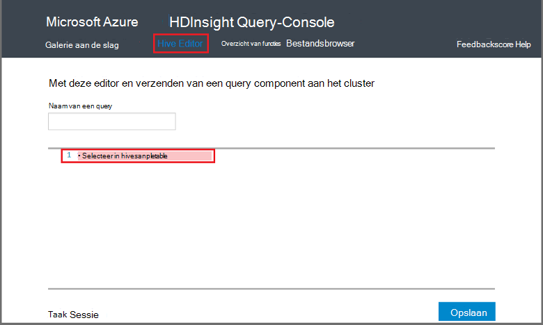

<properties
   pageTitle="Hadoop-component gebruiken in de Query-Console in de HDInsight | Microsoft Azure"
   description="Informatie over het gebruik van de Query op het web Console component query's uitvoeren op een cluster HDInsight Hadoop vanuit uw browser."
   services="hdinsight"
   documentationCenter=""
   authors="Blackmist"
   manager="jhubbard"
   editor="cgronlun"
    tags="azure-portal"/>

<tags
   ms.service="hdinsight"
   ms.devlang="na"
   ms.topic="article"
   ms.tgt_pltfrm="na"
   ms.workload="big-data"
   ms.date="09/20/2016"
   ms.author="larryfr"/>

# Component-query's met behulp van de Console van de Query uitvoeren

[AZURE.INCLUDE [hive-selector](../../includes/hdinsight-selector-use-hive.md)]

In dit artikel leert u hoe u met de Console van de Query HDInsight component query's uitvoeren op een cluster HDInsight Hadoop vanuit uw browser.

> [AZURE.IMPORTANT] De Query HDInsight Console is alleen beschikbaar op Windows gebaseerde HDInsight clusters. Zie [component uitvoeren van query's met de component-weergave](hdinsight-hadoop-use-hive-ambari-view.md)als u een HDInsight op basis van Linux-cluster.

##Vereisten

Als u de stappen in dit artikel hebt uitgevoerd, moet u het volgende.

* Een cluster van Windows-gebaseerde HDInsight Hadoop

* Een moderne webbrowser

##Component-query's met behulp van de Console van de Query uitvoeren

1. Open een webbrowser en Ga naar __https://CLUSTERNAME.azurehdinsight.net__, waar de __CLUSTERNAAM__ de naam van het cluster HDInsight is. Typ desgevraagd de gebruikersnaam en het wachtwoord dat u gebruikt bij het maken van het cluster.

2. Selecteer de koppelingen boven aan de pagina **Component Editor**. Een formulier dat kan worden gebruikt om de HiveQL instructies invoeren die u wilt uitvoeren in het cluster HDInsight worden weergegeven.

    

    Vervang de tekst `Select * from hivesampletable` met de volgende instructies voor HiveQL:

        set hive.execution.engine=tez;
        DROP TABLE log4jLogs;
        CREATE EXTERNAL TABLE log4jLogs (t1 string, t2 string, t3 string, t4 string, t5 string, t6 string, t7 string)
        ROW FORMAT DELIMITED FIELDS TERMINATED BY ' '
        STORED AS TEXTFILE LOCATION 'wasbs:///example/data/';
        SELECT t4 AS sev, COUNT(*) AS count FROM log4jLogs WHERE t4 = '[ERROR]' AND INPUT__FILE__NAME LIKE '%.log' GROUP BY t4;

    Deze instructies worden de volgende acties uitvoeren:

    * **DROP TABLE**: Hiermee verwijdert u de tabel en het bestand als de tabel al bestaat.
    * **Externe tabel maken**: een nieuwe 'externe'-tabel gemaakt in een component. Externe tabellen slaat de definitie van de tabel in de component; de gegevens blijft op de oorspronkelijke locatie.

    > [AZURE.NOTE] Externe tabellen moeten worden gebruikt wanneer u de onderliggende gegevens worden bijgewerkt door een externe bron (zoals een geautomatiseerde gegevens uploadproces) of door een andere bewerking van MapReduce verwacht, maar u wilt dat altijd component query's gebruiken de meest recente gegevens.
    >
    > Neerzetten van een externe tabel heeft **niet** verwijderen de gegevens, alleen de tabeldefinitie.

    * **Rij-indeling**: vertelt component hoe de gegevens zijn ingedeeld. In dit geval worden de velden in elk logboek gescheiden door een spatie.
    * **Opgeslagen als TEXTFILE locatie**: vertelt component waarop de gegevens zijn opgeslagen (het voorbeeld/data directory) en wordt deze opgeslagen als tekst
    * **Selecteren**: Selecteer een telling van alle rijen waarin de kolom **t4** waarde **[fout]**bevatten. Dit moet een waarde van **3** retourneren omdat er drie rijen die deze waarde bevatten.
    * **INPUT__FILE__NAME zoals '%.log'** - die we alleen gegevens van bestanden die eindigen ophalen moeten vertelt component. log. Hiermee beperkt u de zoekopdracht naar het sample.log bestand dat de gegevens bevat en blijft van het retourneren van gegevens uit andere voorbeeld gegevensbestanden die niet overeenkomen met het schema dat is gedefinieerd.

2. Klik op **indienen**. De **Taak sessie** onderaan de pagina details voor de taak moet worden weergegeven.

3. Als het veld **Status** wordt gewijzigd in **voltooid**, selecteert u **Details weergeven** voor de taak. Op de detailpagina van de **Uitvoer van de taak** bevat `[ERROR]   3`. U kunt de knop **downloaden** onder dit veld downloaden van een bestand met de uitvoer van de taak.

##Samenvatting

Zoals u zien kunt, biedt de Console Query gemakkelijk component query's uitvoeren in een cluster van HDInsight, de taakstatus controleren en ophalen van de uitvoer.

Voor meer informatie over het gebruik van Query-Console component component taken uitvoeren, selecteert u **Aan de slag** aan de bovenkant van de Query-Console en gebruik van de monsters die worden geleverd. Elk monster begeleidt bij het proces van het gebruik van de component voor het analyseren van gegevens, inclusief de uitleg over de HiveQL-instructies die worden gebruikt in het monster.

##Volgende stappen

Voor algemene informatie over component in HDInsight:

* [Component gebruiken in combinatie met Hadoop op HDInsight](hdinsight-use-hive.md)

Voor informatie over andere manieren waarop kunt u werken met Hadoop op HDInsight:

* [Varken gebruiken in combinatie met Hadoop op HDInsight](hdinsight-use-pig.md)

* [MapReduce gebruiken in combinatie met Hadoop op HDInsight](hdinsight-use-mapreduce.md)

Als u met Tez component, raadpleegt u de volgende documenten voor foutopsporing informatie:

* [Gebruik de gebruikersinterface Tez op Windows gebaseerde HDInsight](hdinsight-debug-tez-ui.md)

* [Gebruik de weergave Ambari Tez op Linux-gebaseerde HDInsight](hdinsight-debug-ambari-tez-view.md)

[1]: ../HDInsight/hdinsight-hadoop-visual-studio-tools-get-started.md

[hdinsight-sdk-documentation]: http://msdnstage.redmond.corp.microsoft.com/library/dn479185.aspx

[azure-purchase-options]: http://azure.microsoft.com/pricing/purchase-options/
[azure-member-offers]: http://azure.microsoft.com/pricing/member-offers/
[azure-free-trial]: http://azure.microsoft.com/pricing/free-trial/

[apache-tez]: http://tez.apache.org
[apache-hive]: http://hive.apache.org/
[apache-log4j]: http://en.wikipedia.org/wiki/Log4j
[hive-on-tez-wiki]: https://cwiki.apache.org/confluence/display/Hive/Hive+on+Tez
[import-to-excel]: http://azure.microsoft.com/documentation/articles/hdinsight-connect-excel-power-query/

[hdinsight-use-oozie]: hdinsight-use-oozie.md
[hdinsight-analyze-flight-data]: hdinsight-analyze-flight-delay-data.md

[hdinsight-storage]: hdinsight-hadoop-use-blob-storage.md

[hdinsight-provision]: hdinsight-provision-clusters.md
[hdinsight-submit-jobs]: hdinsight-submit-hadoop-jobs-programmatically.md
[hdinsight-upload-data]: hdinsight-upload-data.md
[hdinsight-get-started]: hdinsight-hadoop-linux-tutorial-get-started.md

[Powershell-install-configure]: powershell-install-configure.md
[powershell-here-strings]: http://technet.microsoft.com/library/ee692792.aspx

[img-hdi-hive-powershell-output]: ./media/hdinsight-use-hive/HDI.Hive.PowerShell.Output.png
