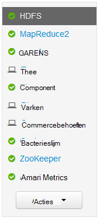
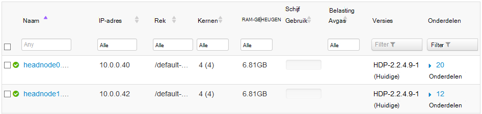
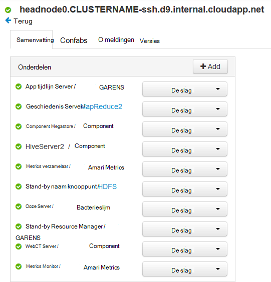
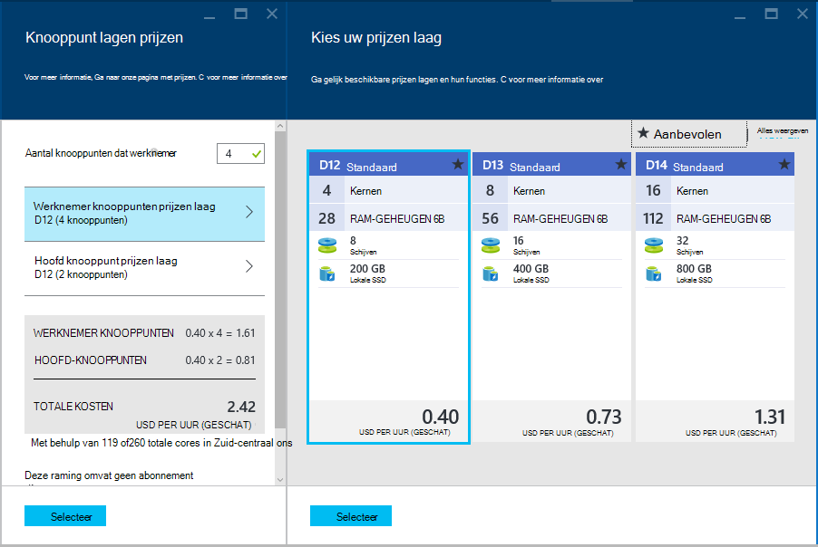

<properties
    pageTitle="Functies voor hoge beschikbaarheid van Linux-gebaseerde HDInsight (Hadoop) | Microsoft Azure"
    description="Meer informatie over hoe Linux-gebaseerde HDInsight clusters verbeteren de betrouwbaarheid en beschikbaarheid met behulp van een extra knooppunt head. Leert u hoe dit van invloed is Hadoop services, zoals Ambari en component, evenals als het afzonderlijk voor elk hoofd knooppunt via SSH verbinding te maken."
    services="hdinsight"
    editor="cgronlun"
    manager="jhubbard"
    authors="Blackmist"
    documentationCenter=""
    tags="azure-portal"/>

<tags
    ms.service="hdinsight"
    ms.workload="big-data"
    ms.tgt_pltfrm="na"
    ms.devlang="multiple"
    ms.topic="article"
    ms.date="09/13/2016"
    ms.author="larryfr"/>

#Beschikbaarheid en betrouwbaarheid van Hadoop clusters in HDInsight

Hadoop realiseert voor hoge beschikbaarheid en betrouwbaarheid van de distributie van kopieën van services en gegevens over de knooppunten in een cluster. Standaard verdelingen van Hadoop hebben echter meestal slechts één hoofd knooppunt. Een storing van het hoofd één knooppunt kan leiden tot het cluster niet meer werkt.

Om dit potentiële probleem, bieden HDInsight Linux gebaseerde clusters op Azure twee knooppunten head verhogen de beschikbaarheid en betrouwbaarheid van Hadoop services en taken die worden uitgevoerd.

> [AZURE.NOTE] De stappen in dit document zijn specifiek voor de HDInsight op basis van Linux-clusters. Zie als u een Windows-gebaseerde clusters, [beschikbaarheid en betrouwbaarheid van Windows gebaseerde Hadoop clusters in het HDInsight](hdinsight-high-availability.md) voor Windows-specifieke informatie.

##Wat zijn de knooppunten

Knooppunten in een cluster HDInsight worden geïmplementeerd met behulp van Azure Virtual Machines. In het geval dat een knooppunt uitvalt, off line wordt genomen en wordt een nieuw knooppunt gemaakt ter vervanging van het knooppunt. Terwijl het knooppunt off line is, wordt er een ander knooppunt van hetzelfde type worden gebruikt totdat het nieuwe knooppunt on line wordt gebracht.

> [AZURE.NOTE] Als het knooppunt is analyseren van gegevens is mislukt, wordt de voortgang van de taak wordt verwijderd. De taak die het knooppunt mislukte bezig was zal opnieuw worden ingediend bij een ander knooppunt.

De volgende secties worden de afzonderlijke knooppunttypen gebruikt in combinatie met HDInsight. Niet alle knooppunttypen worden gebruikt voor een cluster. Bijvoorbeeld, een type Hadoop cluster geen knooppunten Nimbus. Zie de sectie Cluster typen [Hadoop maken Linux gebaseerde](hdinsight-hadoop-provision-linux-clusters.md#cluster-types)clusters in HDInsight voor meer informatie over knooppunten die door HDInsight clustertypen.

###Hoofd-knooppunten

Sommige implementaties van Hadoop hebben één hoofd knooppunt waarop u de services en onderdelen die storingen in knooppunten werknemer probleemloos beheren. Maar eventuele storingen van services op het knooppunt head master zou ertoe leiden dat het cluster niet meer werken.

HDInsight clusters bieden een secundaire head knooppunt waarmee master services en onderdelen in te voeren op bij een storing op de primaire op het secundaire.

> [AZURE.IMPORTANT] Beide knooppunten head zijn tegelijkertijd actief en wordt uitgevoerd binnen het cluster. Sommige services, zoals HDFS of garens, zijn alleen actief op één knooppunt van de hoofd op een bepaalde tijd (en standby op het hoofd knooppunt). Andere services, zoals HiveServer2 of component MetaStore zijn tegelijkertijd actief zijn op beide knooppunten hoofd.

Knooppunten van het hoofd (en andere knooppunten in het HDInsight,) hebben een numerieke waarde als onderdeel van de hostnaam van het knooppunt. Bijvoorbeeld, `hn0-CLUSTERNAME` of `hn4-CLUSTERNAME`. 

> [AZURE.IMPORTANT] De numerieke waarde niet koppelen aan of een knooppunt primair of secundair is; de numerieke waarde is alleen aanwezig om u te voorzien van een unieke naam voor elk knooppunt.

###Nimbus-knooppunten

Storm clusters bieden de Nimbus-knooppunten vergelijkbare functionaliteit aan de Hadoop JobTracker door distributie van en de controle op verwerking op knooppunten van de werknemer. HDInsight biedt 2 Nimbus knooppunten voor de Storm clustertype.

###Zookeeper knooppunten

[ZooKeeper](http://zookeeper.apache.org/ ) knooppunten (ZKs) worden gebruikt voor leader verkiezing van master services op het hoofdkantoor knooppunten en om te zorgen dat services, gegevensknooppunten (werknemer) en gateways welk knooppunt hoofd weet een master-service actief is op. HDInsight biedt 3 ZooKeeper knooppunten.

###Werknemer knooppunten

Werknemer knooppunten uitvoeren van de analyse van werkelijke gegevens wanneer een taak wordt ingediend bij het cluster. Als een werknemer-knooppunt is mislukt, wordt de taak waarmee u bezig was onderworpen aan een ander knooppunt van de werknemer. Standaard maakt HDInsight 4 knooppunten van de werknemer; echter, kunt u dit nummer aan uw behoeften, zowel tijdens het maken van het cluster en na het maken van het cluster.

###Randknooppunt

Een randknooppunt neemt niet actief deel aan de analyse van gegevens binnen het cluster, maar in plaats daarvan wordt gebruikt door ontwikkelaars of gegevens wetenschappers bij het werken met Hadoop. Het randknooppunt woont in hetzelfde Azure virtuele netwerk als de andere knooppunten in het cluster en rechtstreeks toegang tot alle andere knooppunten. Omdat het niet betrokken is bij het analyseren van gegevens voor het cluster, kan het worden gebruikt zonder te vragen waarbij de bronnen van kritieke diensten van Hadoop of analyse taken.

R-Server op HDInsight is momenteel het enige clustertype dat die een randknooppunt standaard biedt. R-server op HDInsight, het randknooppunt wordt gebruikt test R code lokaal op het knooppunt voordat deze worden ingediend aan het cluster voor gedistribueerde verwerking.

[Een HDInsight op basis van Linux cluster met de kleurtoon op een randknooppunt maken](https://azure.microsoft.com/documentation/templates/hdinsight-linux-with-hue-on-edge-node/) is een van de voorbeeldsjabloon die kan worden gebruikt voor het maken van een clustertype Hadoop een randknooppunt is.

## Toegang tot de knooppunten

Toegang tot het cluster via het internet wordt verstrekt via een openbare gateway en is beperkt tot de verbinding met het hoofdkantoor knooppunten en (indien een R-Server-cluster HDInsight) het randknooppunt. Toegang tot services die worden uitgevoerd op de knooppunten head geschiedt niet door meerdere knooppunten head, zoals de openbare gateway stuurt aanvragen door naar het hoofd-knooppunt dat fungeert als host voor de aangevraagde service. Bijvoorbeeld als Ambari momenteel op het secundaire head bevindt zich, stuurt de gateway binnenkomende aanvragen voor Ambari naar dat knooppunt.

Bij de toegang tot het cluster met behulp van SSH, verbinding maken via poort 22 (de standaardinstelling voor SSH) verbinding maken met het primaire knooppunt hoofd; verbinding maken via de poort 23 maakt verbinding met het tweede knooppunt head. Bijvoorbeeld `ssh username@mycluster-ssh.azurehdinsight.net` maakt verbinding met de primaire kop knooppunt van het cluster met de naam __mijncluster__.

> [AZURE.NOTE] Dit geldt ook voor de protocollen op basis van SSH, zoals de SSH bestand Transfer Protocol (SFTP).

De randknooppunt R Server voorzien in HDInsight clusters kan ook rechtstreeks worden benaderd via SSH via poort 22. Bijvoorbeeld, `ssh username@RServer.mycluster.ssh.azurehdinsight.net` voor een R-Server op met de naam __mijncluster__HDInsight-cluster maakt verbinding met het randknooppunt. 

### Interne FQDN-namen (Fully Qualified Domain Name)

Knooppunten in een cluster HDInsight hebben een interne IP-adres en een FQDN-naam die alleen toegankelijk is vanuit het cluster (bijvoorbeeld een SSH-sessie aan het hoofd knooppunt of een taak die op het cluster worden uitgevoerd.) Bij het benaderen van services op het cluster met behulp van de interne FQDN-naam of IP-adres, moet u Ambari gebruiken om te controleren of het IP- of de FQDN-naam gebruikt om de service te openen.

Bijvoorbeeld de Oozie-service kan alleen worden uitgevoerd op één knooppunt van de kop en het gebruik van de `oozie` opdracht van een SSH-sessie moet de URL van de service. Deze kan worden opgehaald uit de Ambari met de volgende opdracht:

    curl -u admin:PASSWORD "https://CLUSTERNAME.azurehdinsight.net/api/v1/clusters/CLUSTERNAME/configurations?type=oozie-site&tag=TOPOLOGY_RESOLVED" | grep oozie.base.url

Deze waarde als resultaat als de volgende, waarin de interne URL te gebruiken met de `oozie` opdracht:

    "oozie.base.url": "http://hn0-CLUSTERNAME-randomcharacters.cx.internal.cloudapp.net:11000/oozie"

### Toegang tot andere knooppunttypen

U kunt verbinding maken met de knooppunten die niet rechtstreeks toegankelijk via het internet met behulp van de volgende methoden.

* __SSH__: wanneer een verbinding met een hoofd knooppunt via SSH, u kunt SSH van het knooppunt head verbinding maken met de andere knooppunten in het cluster.
* __SSH Tunnel__: als u nodig hebt voor toegang tot een webservice die worden gehost op een van de knooppunten die niet beschikbaar zijn voor het internet, moet u [een SSH tunnel te gebruiken](hdinsight-linux-ambari-ssh-tunnel.md).
* __Azure Virtual Network__: als uw cluster HDInsight deel van een virtueel netwerk Azure uitmaakt, elke bron op hetzelfde virtuele netwerk rechtstreeks toegang tot alle knooppunten in het cluster.

## Het controleren van de status van een service

De Ambari Web interface of de REST Ambari API kan worden gebruikt om te controleren van de status van services die worden uitgevoerd op de knooppunten van het hoofd.

###Ambari Web UI

De Ambari Web UI is zichtbaar op https://CLUSTERNAME.azurehdinsight.net. **CLUSTERNAAM** vervangen door de naam van het cluster. Geef desgevraagd de referenties van de HTTP-gebruiker voor uw cluster. De standaard HTTP-gebruikersnaam is **admin** en het wachtwoord is het wachtwoord dat u hebt opgegeven bij het maken van het cluster.

Bij het binnenkomen op de pagina Ambari, worden de geïnstalleerde services weergegeven aan de linkerkant van de pagina.

Er zijn een reeks pictogrammen die kunnen worden weergegeven naast een service om status te geven. Waarschuwingen met betrekking tot een service kunnen worden bekeken met behulp van de koppeling van **waarschuwingen** aan de bovenkant van de pagina. U kunt elke service voor meer informatie over het weergeven.

Terwijl de pagina vindt u informatie over de status en configuratie van elke service, biedt het geen informatie op welk knooppunt head op de service wordt uitgevoerd. Als u deze informatie, gebruikt u de **Hosts** -koppeling boven aan de pagina. Hosts binnen het cluster, met inbegrip van de hoofd-knooppunten wordt weergegeven.

De koppeling voor een van de hoofd-knooppunten te selecteren wordt weergegeven, de services en onderdelen die worden uitgevoerd op dat knooppunt.

###Ambari REST API

De REST Ambari API is beschikbaar via het internet en de openbare gateway routering van aanvragen naar de hoofd-knooppunt dat momenteel als host voor de REST-API optreedt worden verwerkt.

Controleer de status van een service via de API Ambari REST kunt u de volgende opdracht:

    curl -u admin:PASSWORD https://CLUSTERNAME.azurehdinsight.net/api/v1/clusters/CLUSTERNAME/services/SERVICENAME?fields=ServiceInfo/state

* Vervang **wachtwoord** met de HTTP-gebruiker (Administrator), wachtwoord

* Vervangen door de naam van het cluster **CLUSTERNAME**

* **SERVICENAAM** vervangen door de naam van de service de status van

Bijvoorbeeld, als u wilt controleren van de status van de service **HDFS** op een cluster met de naam **mijncluster**met een wachtwoord, **wachtwoord**, gebruikt u het volgende:

    curl -u admin:password https://mycluster.azurehdinsight.net/api/v1/clusters/mycluster/services/HDFS?fields=ServiceInfo/state

De respons is vergelijkbaar met het volgende:

    {
      "href" : "http://hn0-CLUSTERNAME.randomcharacters.cx.internal.cloudapp.net:8080/api/v1/clusters/mycluster/services/HDFS?fields=ServiceInfo/state",
      "ServiceInfo" : {
        "cluster_name" : "mycluster",
        "service_name" : "HDFS",
        "state" : "STARTED"
      }
    }

De URL geeft aan dat de service is actief op een hoofd knooppunt met de naam __Hn0 CLUSTERNAAM__.

De staat, vertelt ons dat de service wordt uitgevoerd of **gestart**.

Als u niet welke services worden geïnstalleerd op het cluster weet, kunt u het volgende om een lijst te halen:

    curl -u admin:PASSWORD https://CLUSTERNAME.azurehdinsight.net/api/v1/clusters/CLUSTERNAME/services

####Service-onderdelen

Services mogen onderdelen die u wilt controleren van de status van afzonderlijk. HDFS bevat bijvoorbeeld het onderdeel NameNode. Als u informatie over een onderdeel, zou de opdracht zijn:

    curl -u admin:PASSWORD https://CLUSTERNAME.azurehdinsight.net/api/v1/clusters/CLUSTERNAME/services/SERVICE/components/component

Als u niet welke onderdelen worden geleverd door een service weet, kunt u het volgende om een lijst te halen:

    curl -u admin:PASSWORD https://CLUSTERNAME.azurehdinsight.net/api/v1/clusters/CLUSTERNAME/services/SERVICE/components/component
    
## Toegang tot de logboekbestanden op de hoofd-knooppunten

###SSH

Verbinding gemaakt met een hoofd knooppunt via SSH en logbestanden vindt u onder **/var/log**. **/Var/log/hadoop-yarn/yarn** bevatten bijvoorbeeld logboeken voor garens.

Elk knooppunt hoofd kunt hebben unieke logboekvermeldingen, controleert u de logboekbestanden op beide.

###SFTP

U kunt ook verbinding maken met het hoofd knooppunt met de SSH File Transfer Protocol of het beveiligde bestand Transfer Protocol (SFTP) en de logboekbestanden rechtstreeks downloaden.

Vergelijkbaar met een SSH-client gebruiken wanneer u verbinding maakt met het cluster de SSH-gebruikersaccountnaam en de SSH-adres van het cluster bieden moet. Bijvoorbeeld `sftp username@mycluster-ssh.azurehdinsight.net`. U moet ook het wachtwoord opgeven voor de account of bieden een openbare sleutel met behulp van de `-i` parameter.

Wanneer een verbinding, wordt weergegeven met een `sftp>` vragen. Vanaf deze prompt kunt u mappen wijzigen, uploaden en downloaden van bestanden. De volgende opdrachten zijn bijvoorbeeld mappen wijzigen in de map **/var/log/hadoop/hdfs** en download alle bestanden in de map.

    cd /var/log/hadoop/hdfs
    get *

Voer voor een lijst met beschikbare opdrachten, `help` op de `sftp>` vragen.

> [AZURE.NOTE] Er zijn ook grafische interfaces waarmee u het bestandssysteem bij verbinding via SFTP visualiseren. [MobaXTerm](http://mobaxterm.mobatek.net/) kunt u bladeren naar het bestandssysteem via een interface die vergelijkbaar is met Windows Verkenner.

###Ambari

> [AZURE.NOTE] Logboekbestanden openen via Ambari is vereist, een SSH-tunnel, de websites voor de afzonderlijke services niet openbaar beschikbaar op het Internet. Zie [Gebruik SSH Tunneling voor toegang tot Ambari web UI, ResourceManager, JobHistory, NameNode, Oozie, en andere web UI van](hdinsight-linux-ambari-ssh-tunnel.md)voor meer informatie over het gebruik van een SSH-tunnel.

Selecteer de service die u wilt weergeven van Logboeken voor (bijvoorbeeld garens) via de Ambari Web interface, en vervolgens **Snelkoppelingen** gebruiken om te selecteren welk knooppunt hoofd weer te geven van de logboeken voor.

## Het configureren van de grootte van het knooppunt ##

De grootte van de een knooppunt kan alleen worden geselecteerd tijdens het maken van het cluster. Voor HDInsight, met inbegrip van de core, geheugen en lokale opslag voor elk van de [HDInsight prijzen pagina](https://azure.microsoft.com/pricing/details/hdinsight/)vindt u een overzicht van de verschillende VM formaten beschikbaar.

Wanneer u een nieuw cluster maakt, kunt u de grootte van de knooppunten. De volgende informatie geven over de omvang opgeven met behulp van de [Portal Azure][preview-portal], [Azure PowerShell][azure-powershell], en de [CLI Azure][azure-cli]:

* **Azure Portal**: wanneer u een nieuw cluster maakt, krijgt u de optie van het instellen van de grootte (prijzen laag) van het hoofd, werknemer en (indien gebruikt door de clustertype) ZooKeeper knooppunten van het cluster:

    

* **Azure CLI**: bij het gebruik van de `azure hdinsight cluster create` opdracht, kunt u de grootte van de kop, werknemer en ZooKeeper knooppunten instellen met behulp van de `--headNodeSize`, `--workerNodeSize`, en `--zookeeperNodeSize` parameters.

* **Azure PowerShell**: bij het gebruik van de `New-AzureRmHDInsightCluster` cmdlet, kunt u de grootte van de kop, werknemer en ZooKeeper knooppunten instellen met behulp van de `-HeadNodeVMSize`, `-WorkerNodeSize`, en `-ZookeeperNodeSize` parameters.

##Volgende stappen

In dit document hebt u geleerd hoe Azure HDInsight biedt een hoge beschikbaarheid voor Hadoop. Gebruik de volgende voor meer informatie over zaken die in dit document worden vermeld.

- [Ambari overige verwijzing](https://github.com/apache/ambari/blob/trunk/ambari-server/docs/api/v1/index.md)

- [Installeer en configureer de Azure-CLI](../xplat-cli-install.md)

- [Installeer en configureer Azure PowerShell](../powershell-install-configure.md)

- [Beheren met behulp van Ambari HDInsight](hdinsight-hadoop-manage-ambari.md)

- [HDInsight Linux gebaseerde clusters inrichten](hdinsight-hadoop-provision-linux-clusters.md)

[preview-portal]: https://portal.azure.com/
[azure-powershell]: ../powershell-install-configure.md
[azure-cli]: ../xplat-cli-install.md
