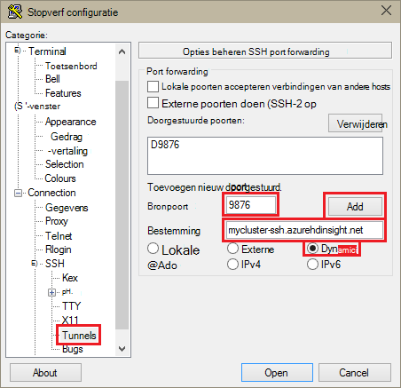
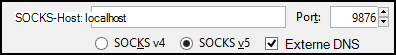

<properties
pageTitle="SSH Tunneling gebruiken voor toegang tot Ambari web UI, ResourceManager, JobHistory, NameNode, Oozie en andere UI van web"
description="Informatie over het gebruik van een tunnel SSH veilig surfen webbronnen die worden gehost op de knooppunten van het Linux-gebaseerde HDInsight."
services="hdinsight"
documentationCenter=""
authors="Blackmist"
manager="jhubbard"
editor="cgronlun"/>

<tags
ms.service="hdinsight"
ms.devlang="na"
ms.topic="article"
ms.tgt_pltfrm="na"
ms.workload="big-data"
ms.date="10/17/2016"
ms.author="larryfr"/>

# SSH Tunneling gebruiken voor toegang tot Ambari web UI, JobHistory, NameNode, Oozie en andere UI van web

Linux-gebaseerde HDInsight clusters bieden toegang tot Ambari web UI via Internet, maar sommige functies van de gebruikersinterface niet. Bijvoorbeeld, de webgebruikersinterface voor andere services die zijn opgehaald via Ambari. Voor de volledige functionaliteit van het web Ambari UI, moet u een SSH-tunnel naar de kop van het cluster.

## Wat is een SSH-tunnel?

Verschillende van de menu's in Ambari wordt niet volledig gevuld zonder een SSH-tunnel als ze gebaseerd zijn op websites en diensten die door andere Hadoop services op het cluster weergegeven. Deze websites zijn vaak niet beveiligd, dus het is niet veilig worden rechtstreeks op het internet worden blootgesteld. De service wordt soms de website op een ander clusterknooppunt zoals een knooppunt Zookeeper uitgevoerd.

Diensten die Ambari web UI gebruikt, die niet toegankelijk zijn zonder een SSH-tunnel zijn:

* JobHistory,
* NameNode,
* Thread-Stacks
* Oozie web UI
* Gebruikersinterface van Logboeken en HBase Master

Als u acties Script gebruikt voor het aanpassen van het cluster, moet de services en hulpprogramma's die u installeert die een web UI tonen een SSH-tunnel. Als u tint met behulp van de actie van een Script installeert, moet u een SSH-tunnel gebruiken voor toegang tot de kleurtoon webgebruikersinterface.

## Wat is een SSH-tunnel?

[Secure Shell (SSH) tunneling](https://en.wikipedia.org/wiki/Tunneling_protocol#Secure_Shell_tunneling) verkeer verzonden naar een poort op uw lokale werkstation, via een SSH-verbinding met uw HDInsight hoofd clusterknooppunt, waar de aanvraag vervolgens is opgelost als bron op het knooppunt hoofd routes. Het antwoord is vervolgens weer via de tunnel naar uw werkstation verzonden.

## Vereisten

Wanneer u een SSH-tunnel voor webverkeer, hebt u het volgende:

* SSH-client. Distributies van Linux en Unix of Macintosh OS X, de `ssh` opdracht wordt geleverd bij het besturingssysteem. Voor Windows, het is raadzaam [stopverf](http://www.chiark.greenend.org.uk/~sgtatham/putty/download.html)

    > [AZURE.NOTE] Als u wilt een SSH-client gebruiken andere dan `ssh` of stopverf, Raadpleeg de documentatie voor de client op het opzetten van een SSH-tunnel.

* Een webbrowser die kan worden geconfigureerd voor het gebruik van een SOCKS-proxy

## Met de opdracht SSH tunnel maken

Gebruik de volgende opdracht maakt u een SSH-tunnel met behulp van de `ssh` opdracht. __Gebruikersnaam__ vervangen door een SSH-gebruiker voor uw cluster HDInsight en __CLUSTERNAAM__ vervangen door de naam van het cluster HDInsight

    ssh -C2qTnNf -D 9876 USERNAME@CLUSTERNAME-ssh.azurehdinsight.net

Hiermee maakt u een verbinding die verkeer naar de lokale poort 9876 aan het cluster worden doorgestuurd via SSH. De opties zijn:

* **D 9876** - de lokale poort die het doorsturen van verkeer via de tunnel.

* **C** - alle gegevens comprimeren omdat webverkeer voornamelijk uit tekst wordt.

* **2** - force SSH protocol versie 2 alleen proberen.

* **q** - stille modus.

* **T** - pseudo-tty toewijzing uitschakelen, omdat we alleen van een haven doorsturen.

* **n** - te voorkomen dat het lezen van STDIN, omdat we alleen van een haven doorsturen.

* **N** - een externe opdracht niet uitvoeren omdat we alleen van een haven doorsturen.

* **f** - op de achtergrond uitgevoerd.

Als u het cluster hebt geconfigureerd met een SSH-sleutel, moet u wellicht gebruik de `-i` parameter en geeft u het pad naar de persoonlijke sleutel voor SSH.

Nadat de opdracht is voltooid, wordt verkeer verzonden naar poort 9876 op de lokale computer worden gerouteerd via wordt Secure Sockets Layer (SSL) aan het cluster knooppunt head en er afkomstig lijken te zijn.

## Maken van een tunnel met stopverf

Gebruik de volgende stappen voor het maken van een SSH-tunnel met stopverf.

1. Open PuTTY en geef de verbindingsgegevens. Als u niet bekend met stopverf bent, Zie [Gebruiken SSH met Linux-gebaseerde Hadoop op HDInsight van Windows](hdinsight-hadoop-linux-use-ssh-windows.md) voor informatie over het gebruik in combinatie met HDInsight.

2. In de sectie **categorie** aan de linkerkant van het dialoogvenster **verbinding**Vouw, uit van **SSH**en selecteer vervolgens de **Tunnels**.

3. Geef de volgende gegevens op het formulier **Opties beheren SSH port forwarding** :

    * **Bronpoort** - de poort op de client die u wilt doorsturen. Bijvoorbeeld **9876**.

    * **Bestemming** - de SSH-adres voor het cluster Linux-gebaseerde HDInsight. Bijvoorbeeld **mijncluster ssh.azurehdinsight.net**.

    * **Dynamische** - schakelt dynamische SOCKS-proxy-routering.

    

4. Klik op **toevoegen** om de instellingen en klik vervolgens op **openen** als u wilt openen een SSH-verbinding.

5. Wanneer dat wordt gevraagd, aanmelden bij de server. Dit zal een SSH-sessie tot stand brengen en inschakelen van de tunnel.

## De tunnel vanuit uw browser gebruiken

> [AZURE.NOTE] De stappen in deze sectie gebruikt de FireFox-browser is vrij beschikbaar voor Linux, Unix, Macintosh OS X en Windows-systemen. Andere moderne browsers die ondersteuning voor het gebruik van een SOCKS-proxy werken ook.

1. De browser voor het gebruik van **localhost:9876** als een **SOCKS v5** proxy configureren. Hier ziet u hoe de instellingen van Firefox eruit. Als u een andere poort dan 9876 gebruikt, moet u de poort wijzigen in die u gebruikt:

    

    > [AZURE.NOTE] Selecteren van **Externe DNS** oplossing Domain Name System (DNS) aanvragen met behulp van het cluster HDInsight. Als dit niet geselecteerd is, wordt DNS lokaal worden opgelost.

2. Controleer of dat verkeer wordt omgeleid via de tunnel door een site zoals [http://www.whatismyip.com/](http://www.whatismyip.com/) vising met de proxy-instellingen in- en uitgeschakeld in Firefox. Terwijl de instellingen zijn ingeschakeld, worden het IP-adres voor een machine in het datacenter Microsoft Azure.

##Controleer of met Ambari web UI

Nadat het cluster is vastgesteld, gebruikt u de volgende stappen uit om te controleren of u toegang hebt tot service web UI's vanaf het Ambari Web:

1. In uw browser, gaat u naar http://headnodehost:8080. De `headnodehost` adres aan het cluster via de tunnel wordt verzonden en worden omgezet in de headnode die op Ambari wordt uitgevoerd. Voer desgevraagd de gebruikersnaam admin (admin) en het wachtwoord voor uw cluster. Wordt u mogelijk gevraagd een tweede keer door de Ambari web UI. In dat geval de informatie opnieuw invullen.
    
    > [AZURE.NOTE] Wanneer u verbinding maakt met het cluster via het adres http://headnodehost:8080, maakt u verbinding rechtstreeks via de tunnel naar de hoofd-knooppunt dat Ambari wordt uitgevoerd met behulp van HTTP- en communicatie wordt beveiligd met behulp van de tunnel SSH. Wanneer u verbinding maakt via het internet zonder gebruik te maken van een tunnel, communicatie, is beveiligd met HTTPS. Gebruiken om via internet met behulp van HTTPS verbinding maken, https://CLUSTERNAME.azurehdinsight.net, waarbij de __CLUSTERNAAM__ de naam van het cluster is.

2. Selecteer de Ambari Web UI HDFS uit de lijst aan de linkerkant van de pagina.

    

3. Wanneer de HDFS-informatie wordt weergegeven, selecteert u de __Snelkoppelingen__. Een overzicht van de clusterknooppunten head verschijnt. Selecteer een van de knooppunten van het hoofd, en selecteer vervolgens __NameNode UI__.

    

    > [AZURE.NOTE] Als u een trage internetverbinding hebt of als het hoofd knooppunt bezet is, krijgt u mogelijk een wait-indicator in plaats van een menu als u __Snelkoppelingen__selecteren. Als dit het geval is, wacht een minuut of twee voor de gegevens van de server worden ontvangen en probeer de lijst opnieuw.
    >
    > Als u een lagere resolutie of uw browser niet is gemaximaliseerd, sommige vermeldingen in het menu __Snelkoppelingen__ wordt mogelijk afgekapt door aan de rechterkant van het scherm. Zo ja, vouw het menu met de muis en vervolgens de pijltoets-rechts gebruiken om te schuiven van het scherm aan de rechterzijde voor een overzicht van de rest van het menu.

4. Een pagina met de volgende strekking weergegeven:

    

    > [AZURE.NOTE] U ziet de URL voor deze pagina. moet vergelijkbaar zijn met __http://hn1-CLUSTERNAME.randomcharacters.cx.internal.cloudapp.net:8088/cluster__. Dit is met behulp van de interne FQDN-naam (Fully Qualified Domain Name) van het knooppunt en is niet toegankelijk zonder een SSH tunnel te gebruiken.

## Volgende stappen

U hebt geleerd hoe u kunt maken en gebruiken van een SSH-tunnel, Zie de volgende onderwerpen voor informatie over het controleren en beheren van het cluster met behulp van Ambari:

* [HDInsight clusters beheren met behulp van Ambari](hdinsight-hadoop-manage-ambari.md)

Zie de volgende onderwerpen voor meer informatie over het gebruik van SSH in HDInsight:

* [SSH gebruiken met Linux-gebaseerde Hadoop op HDInsight van Linux, Unix of OS X](hdinsight-hadoop-linux-use-ssh-unix.md)

* [SSH met Linux-gebaseerde Hadoop op HDInsight van Windows gebruiken](hdinsight-hadoop-linux-use-ssh-windows.md)
