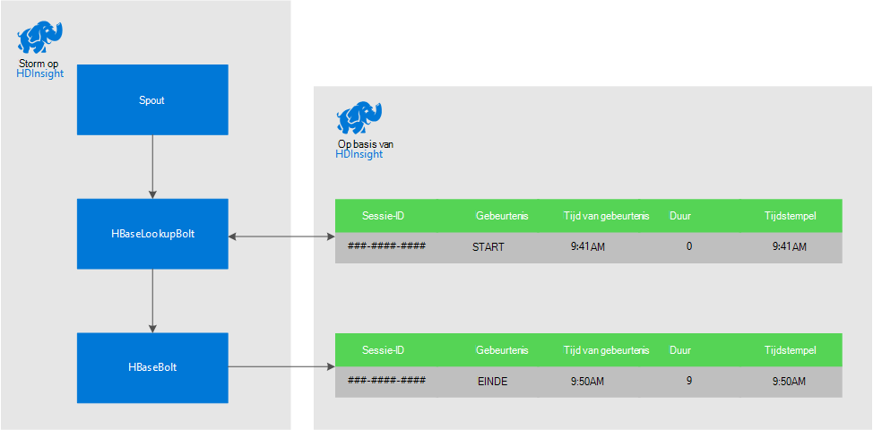
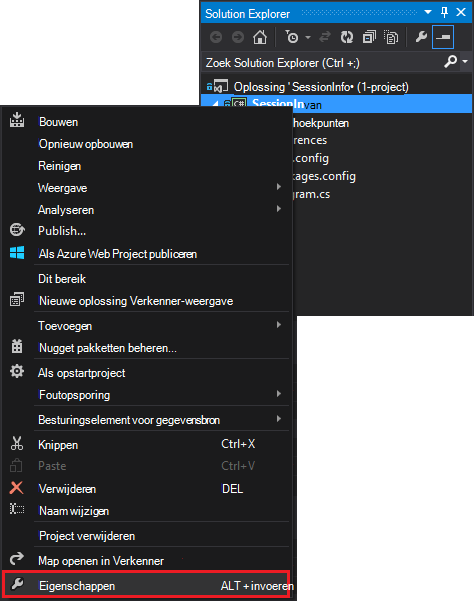
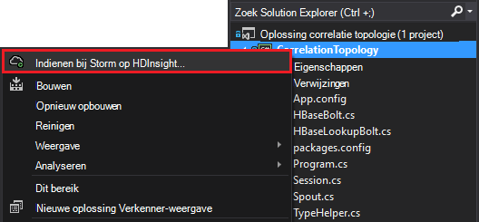

<properties
 pageTitle="Gebeurtenissen na verloop van tijd correleren met Storm en HBase op HDInsight"
 description="Informatie over gebeurtenissen die op verschillende tijdstippen binnenkomen met behulp van Storm en HBase op HDInsight correleren."
 services="hdinsight"
 documentationCenter=""
 authors="Blackmist"
 manager="jhubbard"
 editor="cgronlun"
 tags="azure-portal"/>

<tags
 ms.service="hdinsight"
 ms.devlang="dotnet"
 ms.topic="article"
 ms.tgt_pltfrm="na"
 ms.workload="big-data"
 ms.date="10/27/2016"
 ms.author="larryfr"/>

# Gebeurtenissen na verloop van tijd correleren met Storm en HBase op HDInsight

Een blijvende gegevensopslag met Storm Apache gebruikt, kunt u gegevens die op verschillende tijdstippen binnenkomen correleren. Koppelen, gebeurtenissen aan- en afmelden voor een gebruikerssessie om te berekenen hoe lang de sessie heeft geduurd.

In dit document leert u het maken van een eenvoudig C# Storm topologie die gebeurtenissen aan- en afmelden voor gebruikerssessies bijgehouden en berekent de duur van de sessie. De topologie gebruikt HBase als een permanente gegevensarchief. HBase kunt u batch-query's uitvoeren op de historische gegevens voor de productie van aanvullende informatie, zoals hoeveel sessies zijn begonnen of geëindigd gedurende een bepaalde periode.

## Vereisten

- Visual Studio en de HDInsight's voor Visual Studio: Zie [aan de slag met de HDInsight's voor Visual Studio](../HDInsight/hdinsight-hadoop-visual-studio-tools-get-started.md) voor informatie over de installatie.

- Apache Storm op HDInsight van het cluster (Windows-programma). Hiermee voert de topologie Storm, waarin binnenkomende gegevens worden verwerkt en opgeslagen op HBase.

    > [AZURE.IMPORTANT] Terwijl SCP.NET topologieën worden ondersteund op Storm Linux gebaseerde clusters gemaakt na 28-10/2016, werkt de HBase SDK voor .NET pakket beschikbaar vanaf 28-10/2016 niet goed op Linux.

- HBase Apache op cluster HDInsight (Linux of Windows-programma). Dit is de gegevensopslag voor dit voorbeeld.

## Architectuur

Correleren van gebeurtenissen is een algemene ID vereist voor de bron. For example, een gebruikers-ID, sessie-ID, of andere gegevens die unieke a) en b) deel uitmaken van alle gegevens die worden verzonden naar de Storm. In dit voorbeeld wordt een GUID-waarde voor een sessie-ID.

In dit voorbeeld bestaat uit twee clusters van HDInsight:

-   HBase: permanente gegevensarchief voor historische gegevens

-   Storm: gebruikt om aan te nemen van de binnenkomende gegevens

De gegevens willekeurig wordt gegenereerd door de Storm-topologie en bestaat uit de volgende onderdelen:

-   Sessie-ID: een GUID die is uniek voor elke sessie

-   Gebeurtenis: een begin- of gebeurtenis. In dit voorbeeld START altijd treedt op vóór einde

-   Tijd: de tijd van de gebeurtenis.

Deze gegevens worden verwerkt en opgeslagen in HBase.

### Storm-topologie

Wanneer een sessie wordt gestart, wordt een gebeurtenis **START** ontvangen door de topologie en HBase vastgelegd. Wanneer **een gebeurtenis** is ontvangen, wordt de topologie **de begingebeurtenis** opgehaald en berekent de tijd tussen twee gebeurtenissen. Deze waarde voor de **duur** wordt vervolgens opgeslagen in HBase samen met informatie over de gebeurtenis van het **einde** .

> [AZURE.IMPORTANT] Terwijl deze topologie het basispatroon ziet, moet een productie-oplossing te ontwerpen voor de volgende scenario's:
>
> - Gebeurtenissen die aankomen uit order
> - Dubbele gebeurtenissen
> - Verloren-gebeurtenissen

De topologie van het monster bestaat uit de volgende onderdelen:

-   Session.CS: simuleert een gebruikerssessie door het maken van een willekeurige sessie-ID, begin tijd en hoe lang de sessie duurt

-   Spout.CS: 100 sessies maakt, genereert een startgebeurtenis, wacht de willekeurige time-out voor elke sessie en vervolgens genereert een gebeurtenis. Vervolgens wordt gerecycled afgelopen sessies om nieuwe te genereren.

-   HBaseLookupBolt.cs: de sessie-ID wordt sessie informatie zoeken op HBase. Wanneer een gebeurtenis wordt verwerkt, vindt u de bijbehorende gebeurtenissen voor het starten en de duur van de sessie wordt berekend.

-   HBaseBolt.cs: Slaat gegevens op in HBase.

-   TypeHelper.cs: Helpt bij het typeconversie wanneer van lezen / schrijven naar HBase.

### HBase schema

In HBase, worden de gegevens opgeslagen in een tabel met de volgende schema/instellingen:

-   Rijsleutel: de sessie-ID wordt gebruikt als sleutel voor rijen in deze tabel

-   Kolom-familie: de naam van de familie 'cf' is. Kolommen die zijn opgeslagen in deze familie zijn:

    -   gebeurtenis: begin of einde

    -   tijd: de tijd in milliseconden die de gebeurtenis heeft plaatsgevonden

    -   duur: de lengte tussen de begin- en gebeurtenis

-   VERSIES: de familie 'cf' is ingesteld op 5 versies van elke rij behouden

    > [AZURE.NOTE] Versies zijn een logboek van de vorige waarden opgeslagen voor een bepaalde rij-sleutel. Standaard retourneert HBase alleen de waarde voor de meest recente versie van een rij. In dit geval wordt dezelfde rij gebruikt voor elke versie van een rij wordt geïdentificeerd door de tijdstempel waarde alle gebeurtenissen (begin, einde.). Dit geeft een historisch overzicht van gebeurtenissen die zijn vastgelegd voor een bepaalde ID.

## Het project downloaden

Voorbeeld van het project kan worden gedownload van [https://github.com/Azure-Samples/hdinsight-storm-dotnet-event-correlation](https://github.com/Azure-Samples/hdinsight-storm-dotnet-event-correlation).

Deze download bevat de volgende C#-projecten:

-   CorrelationTopology: C# Storm topologie die willekeurig begin- en gebeurtenissen voor gebruikerssessies genereert. Elke sessie duurt tussen 1 en 5 minuten.

-   SessionInfo: C# consoletoepassing die wordt gemaakt in de tabel HBase en bevat voorbeeldquery om gegevens over opgeslagen sessiegegevens als resultaat.

## De tabel maken

1. Open het **SessionInfo** -project in Visual Studio.

2. In de **Solution Explorer**met de rechtermuisknop op het **SessionInfo** -project en selecteer **Eigenschappen**.

    

3. Selecteer **Instellingen**en stel vervolgens de volgende waarden:

    -   HBaseClusterURL: de URL van het cluster HBase. Bijvoorbeeld: https://myhbasecluster.azurehdinsight.net

    -   HBaseClusterUserName: de admin/HTTP-gebruikersaccount voor de cluster

    -   HBaseClusterPassword: het wachtwoord voor de gebruikersaccount admin/HTTP

    -   HBaseTableName: de naam van de tabel voor gebruik met dit voorbeeld

    -   HBaseTableColumnFamily: De kolom familienaam

    

5. De oplossing wordt uitgevoerd. Wanneer daarom wordt gevraagd, selecteert u de toets 'c' voor het maken van de tabel op het cluster HBase.

## Bouw en implementeer de Storm-topologie

1.  Open de **CorrelationTopology** -oplossing in Visual Studio.

2.  Klik met de rechtermuisknop op het project **CorrelationTopology** in de **Solution Explorer**en selecteer Eigenschappen.

3.  Selecteer **Instellingen** en geef de volgende informatie in het eigenschappenvenster. De eerste 5 moet zijn dezelfde waarden die worden gebruikt door het **SessionInfo** -project:

    -   HBaseClusterURL: de URL van het cluster HBase. Bijvoorbeeld: https://myhbasecluster.azurehdinsight.net

    -   HBaseClusterUserName: de admin/HTTP-gebruikersaccount voor de cluster

    -   HBaseClusterPassword: het wachtwoord voor de gebruikersaccount admin/HTTP

    -   HBaseTableName: de naam van de tabel voor gebruik met dit voorbeeld. Dit moet de naam hetzelfde als in het SessionInfo-project bevatten

    -   HBaseTableColumnFamily: De kolom familienaam. Dit moet de kolom familienaam die u gebruikt in het SessionInfo-project bevatten

    > [AZURE.IMPORTANT] Wijzig de HBaseTableColumnNames, niet als de standaardinstellingen de namen die door **SessionInfo** wordt gebruikt zijn voor het ophalen van gegevens.

4.  De eigenschappen opslaan en vervolgens het project samenstellen.

5.  Klik met de rechtermuisknop op het project in de **Solution Explorer**en selecteer **indienen bij Storm op HDInsight**. Geef desgevraagd de referenties voor uw abonnement op Azure.

    

6.  Selecteer het cluster Storm die deze topologie wordt uitgevoerd in het dialoogvenster **Topologie indienen** .

    > [AZURE.NOTE] De eerste keer dat u een topologie indient duurt een paar seconden voor het ophalen van de naam van uw HDInsight-clusters.

7.  Nadat de topologie is geüpload en voorgelegd aan het cluster, de **Storm-topologie weergeven** en selecteer de topologie uitgevoerd. Selecteer de **CorrelationTopology** en gebruik de knop Vernieuwen boven aan de pagina voor het vernieuwen van de gegevens over de topologie.

    

    Wanneer de topologie begint het genereren van gegevens, wordt de waarde in de kolom **van deze lichten** verhoogd.

    > [AZURE.NOTE] Als de **Storm-topologie weergeven** niet automatisch wordt geopend, gebruikt u de volgende stappen uit om deze te openen:
    >
    > 1. Vouw **Azure**in de **Solution Explorer**en vouw vervolgens **HDInsight**.
    >
    > 2. Klik met de rechtermuisknop de Storm-cluster met de topologie op en selecteer vervolgens **Weergave Storm topologieën**

## Query de gegevens

Wanneer gegevens emissie, gebruik de volgende stappen de gegevens opvragen.

1. Terug naar het **SessionInfo** -project. Als niet wordt uitgevoerd, start u een nieuw exemplaar van het.

2. Wanneer dat wordt gevraagd, selecteert u **s** om te zoeken naar gebeurtenissen voor het starten. U wordt gevraagd een begin- en tijd voor het definiëren van een tijdsbereik - invoeren wordt alleen gebeurtenissen tussen deze twee tijden geretourneerd.

    Gebruik de volgende opmaak wanneer u de begin- en eindtijden invoert: uu: mm en de 'M' of 'pm'. Bijvoorbeeld: 11:20 uur.

    Omdat de topologie is overgeschakeld, gebruik een begintijd van voordat deze is geïmplementeerd, en een eindtijd van nu. Dit moet de START gebeurtenissen die zijn gegenereerd tijdens het starten de meeste vastleggen. Wanneer de query wordt uitgevoerd, moet u een overzicht van de volgende vermeldingen:

        Session e6992b3e-79be-4991-afcf-5cb47dd1c81c started at 6/5/2015 6:10:15 PM. Timestamp = 1433527820737

Zoeken naar gebeurtenissen einde werkt hetzelfde als START gebeurtenissen. EINDE gebeurtenissen zijn echter willekeurig gegenereerd tussen 1 en 5 minuten na de gebeurtenis START. U moet dus bereiken met een paar keer proberen te vinden de gebeurtenissen eind. EINDE gebeurtenissen bevat ook de duur van de sessie - het verschil tussen de gebeurtenis begintijd en eindtijd van de gebeurtenis. Hier volgt een voorbeeld van gegevens voor einde gebeurtenissen:

    Session fc9fa8e6-6892-4073-93b3-a587040d892e lasted 2 minutes, and ended at 6/5/2015 6:12:15 PM

> [AZURE.NOTE] Wanneer de tijdwaarden die u invoert in de lokale tijd, de tijd die wordt geretourneerd door de query worden UTC.

##Stop de topologie

Wanneer u klaar bent om te stoppen, de topologie, terug naar het **CorrelationTopology** -project in Visual Studio. In de **Storm-topologie weergeven**, selecteert u de topologie en gebruik vervolgens de **Kill-** knop aan de bovenkant van de weergave van de topologie.

##Het cluster te verwijderen

[AZURE.INCLUDE [delete-cluster-warning](../../includes/hdinsight-delete-cluster-warning.md)]

##Volgende stappen

Zie voor meer voorbeelden van Storm [voorbeeld topologieën voor Storm op HDInsight](hdinsight-storm-example-topology.md).
 
