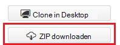
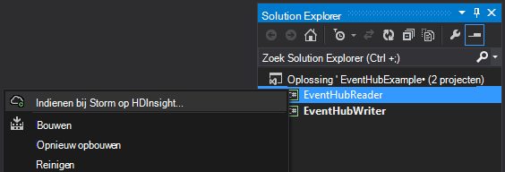
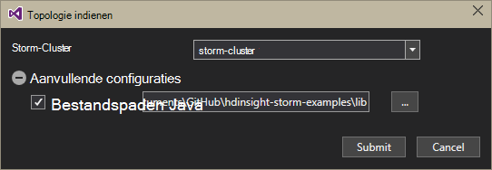
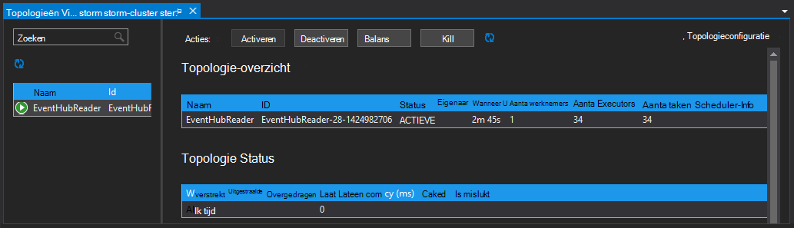

<properties
   pageTitle="Gebeurtenissen van gebeurtenis Hubs met Storm op HDInsight | Microsoft Azure"
   description="Informatie over het verwerken van gegevens van de gebeurtenis Hubs met een C# Storm topologie gemaakt in Visual Studio met behulp van de HDInsight's voor Visual Studio."
   services="hdinsight,notification hubs"
   documentationCenter=""
   authors="Blackmist"
   manager="jhubbard"
   editor="cgronlun"/>

<tags
   ms.service="hdinsight"
   ms.devlang="dotnet"
   ms.topic="article"
   ms.tgt_pltfrm="na"
   ms.workload="big-data"
   ms.date="10/27/2016"
   ms.author="larryfr"/>

# Gebeurtenissen laten verwerken Azure gebeurtenis Hubs met Storm op HDInsight (C#)

Azure gebeurtenis Hubs kunt u enorme hoeveelheden gegevens van websites, toepassingen en apparaten te verwerken. De gebeurtenis Hubs spout maakt het gemakkelijk te gebruiken Apache Storm op HDInsight voor het analyseren van deze gegevens in real-time. Met behulp van de gebeurtenis Hubs bout kunt u ook gegevens op gebeurtenis Hubs van Storm schrijven.

In deze zelfstudie leert u hoe u met de Visual Studio-sjablonen met HDInsight Tools for Visual Studio geïnstalleerd twee topologieën voor het werken met Azure gebeurtenis Hubs maken.

* **EventHubWriter**: willekeurig gegevens genereert en schrijft u deze naar de gebeurtenis Hubs

* **EventHubReader**: leest gegevens van de gebeurtenis Hubs en de gegevens geregistreerd in de logboekbestanden voor de Storm

> [AZURE.NOTE] Terwijl u de stappen in dit document zijn gebaseerd op een Windows-ontwikkelomgeving met Visual Studio, kan de gecompileerde project naar een Linux- of HDInsight op basis van het Windows-cluster worden verzonden. Alleen Linux gebaseerde clusters gemaakt na 28-10/2016 ondersteuning SCP.NET topologieën.
>
> Als u wilt een C#-topologie met een Linux-gebaseerde cluster gebruikt, moet u het pakket Microsoft.SCP.Net.SDK NuGet gebruikt door uw project naar versie 0.10.0.6 of hoger bijwerken. De versie van het pakket moet ook overeenkomen met de primaire versie van Storm geïnstalleerd op HDInsight. Gebruik bijvoorbeeld Storm op HDInsight versie 3.3 en 3.4 Storm versie 0.10.x, terwijl de HDInsight 3.5 met Storm 1.0.x.
> 
> C#-topologieën op Linux gebaseerde clusters moeten gebruik .NET 4.5, en Mono uit te voeren op de cluster HDInsight. De meeste dingen werken, echter u moet de [Compatibiliteit met Mono-](http://www.mono-project.com/docs/about-mono/compatibility/) document controleren op potentiële compatibiliteitsproblemen.
>
> Zie voor een Java-versie van dit project, ook op een cluster op basis van Linux of Windows werken zal [Azure gebeurtenis Hubs met Storm op HDInsight (Java) gebeurtenissen laten verwerken](hdinsight-storm-develop-java-event-hub-topology.md).

## Vereisten

* Een [Storm Apache op HDInsight cluster](hdinsight-apache-storm-tutorial-get-started.md)

* Een [Hub Azure, gebeurtenis](../event-hubs/event-hubs-csharp-ephcs-getstarted.md)

* De [SDK voor .NET Azure](http://azure.microsoft.com/downloads/)

* De [Extra HDInsight voor Visual Studio](hdinsight-hadoop-visual-studio-tools-get-started.md)

## Voltooid project

U kunt een volledige versie van het project gemaakt in deze zelfstudie van GitHub downloaden: [eventhub-storm-hybride](https://github.com/Azure-Samples/hdinsight-dotnet-java-storm-eventhub). U moet echter nog steeds configuratieinstellingen kan leveren aan de hand van de stappen in deze zelfstudie.

## Gebeurtenis Hubs spout en bout

De gebeurtenis Hubs spout en bolt zijn Java components waardoor u gemakkelijk werken met Hubs van Apache Storm gebeurtenis. Hoewel deze onderdelen zijn geschreven in Java, kunt de HDInsight's voor Visual Studio u maken hybride topologieën die meng C#- en Java-onderdelen.

De spout en bout zijn verspreid als één Java archive (JAR)-bestand met de naam **eventhubs-storm-spout-#.#-jar-with-dependencies.jar**, waarbij ## is de versie van het bestand.

### Het JAR-bestand downloaden

De meest recente versie van het jar-bestand is opgenomen in het project [HDInsight Storm voorbeelden](https://github.com/hdinsight/hdinsight-storm-examples) onder de map **lib/eventhubs** . Het bestand te downloaden, een van de volgende methoden te gebruiken.

> [AZURE.NOTE] De spout en bout zijn ingediend voor opneming in het project Storm Apache. Zie voor meer informatie [STORM 583: inchecken voor hubs storm gebeurtenis de eerste](https://github.com/apache/storm/pull/336/files) in de GitHub.

* **Download een ZIP-bestand**: Selecteer van de site [HDInsight Storm voorbeelden](https://github.com/hdinsight/hdinsight-storm-examples) **Downloaden ZIP** in het rechterdeelvenster naar een ZIP-bestand downloaden dat het project bevat.

    

    Nadat het bestand is gedownload, kunt u het archief uitpakken en het bestand zal worden in de **lib** directory.

* **Kloon van het project**: als u [Git](http://git-scm.com/) geïnstalleerd hebt, gebruik de volgende opdracht te klonen lokaal in de bibliotheek, wordt het bestand niet vinden in de **lib** directory.

        git clone https://github.com/hdinsight/hdinsight-storm-examples

## Hubs gebeurtenis configureren

Gebeurtenis Hubs is de gegevensbron voor dit voorbeeld. Gebruik de informatie in de sectie __een gebeurtenis Hub maken__ van het document [aan de slag met de gebeurtenis Hubs](../event-hubs/event-hubs-csharp-ephcs-getstarted.md) .

3. Nadat de gebeurtenis hub is gemaakt, de blade EventHub bekijken in het Portal Azure en selecteer __gedeelde toegang beleid__. Gebruik de vermelding __+ toevoegen__ aan de volgende beleidsregels toevoegen:

  	| Naam | Machtigingen |
  	| ----- | ----- |
  	| schrijver | Verzenden |
  	| Reader | Luisteren |

    

5. Selecteer het beleid van de __lezer__ en __schrijver__ . Kopiëren en opslaan van de waarde van de __Primaire sleutel__ voor het beleid, zoals deze wordt later gebruikt.

## De EventHubWriter configureren

1. Als u de meest recente versie van de HDInsight's zijn niet voor Visual Studio hebt geïnstalleerd, ziet u [aan de slag met de HDInsight's voor Visual Studio](hdinsight-hadoop-visual-studio-tools-get-started.md).

2. De oplossing van [eventhub-storm-hybride](https://github.com/Azure-Samples/hdinsight-dotnet-java-storm-eventhub)downloaden. Open de oplossing en enige tijd duren om de code voor het project __EventHubWriter__ .

4. Open het bestand __App.config__ in het project __EventHubWriter__ . De gegevens van de gebeurtenis Hub die u eerder hebt geconfigureerd gebruiken om de waarde voor de volgende sleutels:

  	| Sleutel | Waarde |
  	| ----- | ----- |
  	| EventHubPolicyName | schrijver (als u een andere naam voor het beleid met de machtiging _verzenden_ in plaats daarvan gebruiken.) |
  	| EventHubPolicyKey | De sleutel voor het beleid van de schrijver |
  	| EventHubNamespace | De naamruimte waarin de gebeurtenis Hub |
  	| EventHubName | De naam van de gebeurtenis Hub |
  	| EventHubPartitionCount | Het aantal partities in uw Hub-gebeurtenis |

4. Opslaan en sluit het bestand **App.config** .

## De EventHubReader configureren

1. Open het project __EventHubReader__ en neemt een paar momoents om de code.

2. Open de __App.config__ voor de __EventHubWriter__. De gegevens van de gebeurtenis Hub die u eerder hebt geconfigureerd gebruiken om de waarde voor de volgende sleutels:

  	| Sleutel | Waarde |
  	| ----- | ----- |
  	| EventHubPolicyName | Reader (als u een andere naam voor het beleid met de machtiging _luisteren_ gebruiken.) |
  	| EventHubPolicyKey | De sleutel voor het beleid van de lezer |
  	| EventHubNamespace | De naamruimte waarin de gebeurtenis Hub |
  	| EventHubName | De naam van de gebeurtenis Hub |
  	| EventHubPartitionCount | Het aantal partities in uw Hub-gebeurtenis |

3. Opslaan en sluit het bestand **App.config** .

## Implementeren van de topologieën

1. In **Solution Explorer**met de rechtermuisknop op het **EventHubReader** -project en selecteer **indienen bij Storm op HDInsight**.

    

2. Selecteer uw **Storm Cluster**op het scherm **Topologie indienen** . Vouw **Aanvullende configuraties** **Java paden**, selecteert u **...** en selecteer Selecteer de map waarin het **eventhubs-storm-spout-0.9-jar-with-dependencies.jar** -bestand dat u eerder hebt gedownload. Klik tot slot op **verzenden**.

    

3. Wanneer de topologie is ingediend, wordt de **Storm topologieën Viewer** weergegeven. Selecteer de topologie van de **EventHubReader** in het linkerdeelvenster om statistieken voor de topologie te bekijken. Op dit moment moet niets gebeuren omdat er geen gebeurtenissen zijn geschreven met Hubs gebeurtenis nog.

    

4. In **Solution Explorer**met de rechtermuisknop op het **EventHubWriter** -project en selecteer **indienen bij Storm op HDInsight**.

2. Selecteer uw **Storm Cluster**op het scherm **Topologie indienen** . Vouw **Aanvullende configuraties** **Java paden**, selecteert u **...** en selecteer Selecteer de map waarin het **eventhubs-storm-spout-0.9-jar-with-dependencies.jar** bestand dat u eerder hebt gedownload. Klik tot slot op **verzenden**.

5. Wanneer de topologie is ingediend, vernieuw de lijst topologie in de **Storm topologieën Viewer** controleren of beide topologieën op het cluster worden uitgevoerd.

6. Selecteer de topologie van de **EventHubReader** in de **Storm topologieën Viewer**.

4. Dubbelklik op het onderdeel van de __LogBolt__ in de grafiekweergave. Hiermee opent u de pagina __Component Summary__ voor de bout.

3. Selecteer een van de koppelingen in de kolom __poort__ in de sectie __Executors__ . Gegevens die zijn vastgelegd door de component wordt weergegeven. De geregistreerde gegevens is vergelijkbaar met het volgende:

        2016-10-20 13:26:44.186 m.s.s.b.ScpNetBolt [INFO] Processing tuple: source: com.microsoft.eventhubs.spout.EventHubSpout:7, stream: default, id: {5769732396213255808=520853934697489134}, [{"deviceId":3,"deviceValue":1379915540}]
        2016-10-20 13:26:44.234 m.s.s.b.ScpNetBolt [INFO] Processing tuple: source: com.microsoft.eventhubs.spout.EventHubSpout:7, stream: default, id: {7154038361491319965=4543766486572976404}, [{"deviceId":3,"deviceValue":459399321}]
        2016-10-20 13:26:44.335 m.s.s.b.ScpNetBolt [INFO] Processing tuple: source: com.microsoft.eventhubs.spout.EventHubSpout:6, stream: default, id: {513308780877039680=-7571211415704099042}, [{"deviceId":5,"deviceValue":845561159}]
        2016-10-20 13:26:44.445 m.s.s.b.ScpNetBolt [INFO] Processing tuple: source: com.microsoft.eventhubs.spout.EventHubSpout:7, stream: default, id: {-2409895457033895206=5479027861202203517}, [{"deviceId":8,"deviceValue":2105860655}]

## Stop de topologieën

Als u wilt stoppen met de topologieën, elke topologie selecteren in de **Storm topologie Viewer**en kies **Kill**.

## Het cluster te verwijderen

[AZURE.INCLUDE [delete-cluster-warning](../../includes/hdinsight-delete-cluster-warning.md)]

## Notities

### Controlepuntbeheer

De EventHubSpout regelmatig herstelpunten de status naar het knooppunt Zookeeper de huidige verschuiving voor berichten slaat in de wachtrij lezen. Hierdoor kunt het onderdeel wilt ontvangen berichten op de verschuiving van de opgeslagen in de volgende scenario's:

* De componentinstantie is mislukt en wordt opnieuw gestart.

* U vergroot of verkleint het cluster door het toevoegen of verwijderen van knooppunten.

* De topologie is afgebroken en opnieuw gestart **met dezelfde naam**.

U kunt ook exporteren en importeren in de permanente controlepunten WASB (de Azure opslag die wordt gebruikt door het cluster HDInsight.) De scripts om dit te doen, bevinden zich op de Storm-cluster HDInsight op **c:\apps\dist\storm-0.9.3.2.2.1.0-2340\zkdatatool-1.0\bin**.

>[AZURE.NOTE] Het versienummer in het pad kan afwijken, zoals de versie van de Storm op het cluster is geïnstalleerd in de toekomst kan veranderen.

De scripts in deze map zijn:

* **stormmeta_import.cmd**: alle Storm metagegevens importeren uit het cluster standaard opslag container in Zookeeper.

* **stormmeta_export.cmd**: alle Storm metagegevens exporteren van Zookeeper naar het cluster standaard opslag container.

* **stormmeta_delete.cmd**: alle Storm metagegevens verwijderen uit Zookeeper.

Exporteren is die importeren u controlepunten gegevens behouden blijven kunt wanneer u nodig hebt om het cluster te verwijderen, maar u wilt gaan met de verwerking van de huidige verschuiving in de hub wanneer u een nieuw cluster weer on line brengen.

> [AZURE.NOTE] Aangezien de gegevens naar de standaard opslag container blijft behouden, het nieuwe cluster **moet** dezelfde account voor opslag en container gebruiken als de vorige cluster.

## Volgende stappen

In dit document, u hebt geleerd hoe u de Java gebeurtenis Hubs Spout en bout uit een C#-topologie voor het werken met gegevens in Azure gebeurtenis Hub. Zie de volgende onderwerpen voor meer informatie over het maken van topologieën voor C#.

* [Ontwikkelen van C# topologieën voor Apache Storm op HDInsight met behulp van Visual Studio](hdinsight-storm-develop-csharp-visual-studio-topology.md)

* [SCP programming guide](hdinsight-storm-scp-programming-guide.md)

* [Voorbeeld van de topologieën voor Storm op HDInsight](hdinsight-storm-example-topology.md)
 
