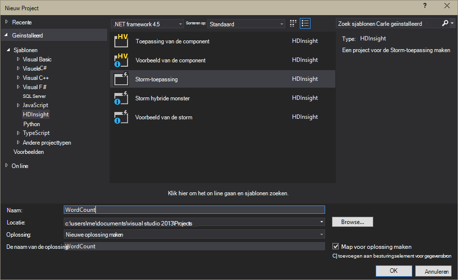
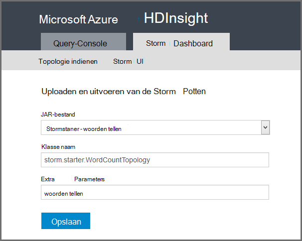

<properties
    pageTitle="Inleiding tot de Storm Apache op HDInsight | Microsoft Azure"
    description="Kennismaking met Apache Storm en informatie over hoe u kunt Storm op HDInsight om real-time gegevens analytics oplossingen in de cloud te maken."
    services="hdinsight"
    documentationCenter=""
    authors="Blackmist"
    manager="jhubbard"
    editor="cgronlun"
    tags="azure-portal"/>

<tags
   ms.service="hdinsight"
   ms.devlang="na"
   ms.topic="get-started-article"
   ms.tgt_pltfrm="na"
   ms.workload="big-data"
   ms.date="10/11/2016"
   ms.author="larryfr"/>

#Inleiding tot de Storm Apache op HDInsight: Real-time analytics voor Hadoop

Apache Storm op HDInsight kunt u voor het maken van gedistribueerde, real-time analytics oplossingen in de Azure-omgeving met behulp van [Apache Hadoop](http://hadoop.apache.org).

##Wat is Apache Storm?

Apache Storm is een berekening van gedistribueerde, fouttolerantie, open source systeem waarmee u gegevens in real-time met Hadoop. Storm solutions biedt gegarandeerde verwerking van gegevens, met de mogelijkheid om replay-gegevens die de eerste keer niet correct verwerkt.

##Waarom Storm op HDInsight gebruiken?

Apache Storm op HDInsight is een beheerde cluster geïntegreerd in de Azure-omgeving. De volgende belangrijke voordelen biedt:

* Wordt uitgevoerd als een beheerde service met een SLA van 99,9% van de tijd

* Gebruikt u de taal van uw keuze: biedt ondersteuning voor de Storm-onderdelen die zijn geschreven in **Java**, **C#**en **Python**

    * Ondersteunt een reeks van programmeertalen: lezen van gegevens met behulp van Java en vervolgens verwerkt met behulp van C#
    
        > [AZURE.NOTE] C# topologieën worden alleen ondersteund op Windows gebaseerde HDInsight clusters.

    * De **Trident** Java interface gebruiken maken Storm topologieën die ondersteuning bieden voor 'eenmaal precies' verwerking van berichten, 'transactionele' datastore persistentie en een reeks gemeenschappelijke stream analytics bewerkingen

* Bevat ingebouwde functies voor schaal-up- en schaal-down: een HDInsight cluster zonder invloed op Storm topologieën met schalen

* Integreren met andere Azure diensten, met inbegrip van de gebeurtenis Hub, virtueel netwerk Azure SQL-Database, Blob-opslag en DocumentDB

    * De mogelijkheden van meerdere clusters van HDInsight combineren met behulp van Azure Virtual Network: analytische pijpleidingen die gebruikmaken van HDInsight, HBase of Hadoop-clusters maken

Zie voor een lijst van bedrijven die voor hun real-time analytics oplossingen Apache Storm gebruiken [Storm van bedrijven met behulp van Apache](https://storm.apache.org/documentation/Powered-By.html).

Om te beginnen met de Storm, Zie [aan de slag met Storm op HDInsight][gettingstarted].

###Eenvoudig ingericht

U kunt een nieuwe Storm op HDInsight cluster inrichten in minuten. Geef de naam van het cluster, grootte, administrator-account en de account voor de opslag. Azure maakt het cluster, waaronder topologieën monster en een web management dashboard.

> [AZURE.NOTE] U kunt ook Storm clusters inrichten met behulp van de [CLI Azure](../xplat-cli-install.md) of [Azure PowerShell](../powershell-install-configure.md).

Hebt u een nieuwe Storm cluster uitgevoerd en gereed voor de eerste real-time analytics pipeline binnen 15 minuten na het indienen van de aanvraag.

###Gebruiksgemak

__Storm voor Linux gebaseerd op HDInsight, clusters__, kunt u verbinding maken met het cluster via SSH en gebruik de `storm` de opdracht om te starten en beheren van topologieën. Bovendien kunt u Ambari voor het controleren van de Storm-service en de Storm UI bewaken en beheren van topologieën uitgevoerd.

Zie voor meer informatie over het werken met de Storm Linux gebaseerde clusters [aan de slag met Apache Storm op Linux-gebaseerde HDInsight](hdinsight-apache-storm-tutorial-get-started-linux.md).

__Storm voor Windows is gebaseerd op HDInsight, clusters__, de HDInsight's voor Visual Studio kunt u maken van C# en hybride C# / Java-topologieën en legt deze aan de Storm op de cluster HDInsight.  

Extra HDInsight voor Visual Studio biedt tevens een interface waarmee u kunt controleren en Storm topologieën op een cluster beheren.

Zie voor een voorbeeld van het gebruik van de HDInsight's voor het maken van een toepassing Storm, [ontwikkelen C# Storm topologieën met de HDInsight's voor Visual Studio](hdinsight-storm-develop-csharp-visual-studio-topology.md).

Zie voor meer informatie over de HDInsight's voor Visual Studio [aan de slag met de HDInsight's voor Visual Studio](../HDInsight/hdinsight-hadoop-visual-studio-tools-get-started.md).

Elke Storm op de cluster HDInsight biedt tevens een webgebaseerd Storm Dashboard u indienen kunt, controleren en beheren van Storm topologieën op het cluster.

Zie voor meer informatie over het gebruik van het Dashboard Storm [implementeren en beheren van Apache Storm topologieën op HDInsight](hdinsight-storm-deploy-monitor-topology.md).

Storm op HDInsight biedt ook eenvoudige integratie met Azure gebeurtenis Hubs door middel van de **Gebeurtenis Hub Spout**. De meest recente versie van dit onderdeel is beschikbaar op [https://github.com/hdinsight/hdinsight-storm-examples/tree/master/lib/eventhubs](https://github.com/hdinsight/hdinsight-storm-examples/tree/master/lib/eventhubs). Zie de volgende documenten voor meer informatie over het gebruik van dit onderdeel.

* [Ontwikkelen van een C#-topologie met Azure gebeurtenis Hubs](hdinsight-storm-develop-csharp-event-hub-topology.md)

* [Ontwikkelen van een Java-topologie met Azure gebeurtenis Hubs](hdinsight-storm-develop-java-event-hub-topology.md)

###Betrouwbaarheid

Apache Storm altijd zorgt ervoor dat elk inkomend bericht volledig verwerkt wordt, zelfs als de analyse van de gegevens zijn verdeeld over honderden nodes.

Het **knooppunt Nimbus** vergelijkbare functionaliteit biedt voor de Hadoop JobTracker en taken toewijzen aan andere knooppunten in het cluster via **Zookeeper**. Zookeeper knooppunten bieden coördinatie voor het cluster en communicatie mogelijk tussen Nimbus en het proces van de **toezichthouder** op de knooppunten van de werknemer. Als één verwerkingsknooppunt uitvalt, wordt het knooppunt Nimbus in kennis wordt gesteld en de taak en de bijbehorende gegevens toewijzen aan een ander knooppunt.

De standaardconfiguratie voor Apache Storm is dat slechts één knooppunt van Nimbus. Storm op HDInsight wordt uitgevoerd twee Nimbus knooppunten. Als het primaire knooppunt uitvalt, schakelen de cluster HDInsight naar het tweede knooppunt terwijl het primaire knooppunt is hersteld.

###Schaal

Maar u het aantal knooppunten in het cluster tijdens het maken opgeven kunt, kunt u vergroten of verkleinen van het cluster overeenkomt met de belasting. Alle HDInsight clusters kunnen u het aantal knooppunten in het cluster wijzigen tijdens het verwerken van gegevens.

> [AZURE.NOTE] Als u wilt profiteren van nieuwe knooppunten toegevoegd via schalen, moet u opnieuw gestart voordat de cluster groter topologieën.

###Ondersteuning

Storm op HDInsight wordt geleverd met 24 x 7 ondersteuning voor enterprise-niveau. Storm op HDInsight heeft ook een SLA van 99,9%. Dit betekent dat wij garanderen dat het cluster externe connectiviteit ten minste 99,9% van de tijd hebben zal.

##Algemene use-cases voor real-time analytics

Hier volgen enkele algemene scenario's waarvoor kunt u Apache storm op HDInsight. Voor meer informatie over concrete scenario's, [hoe bedrijven Storm gebruiken](https://storm.apache.org/documentation/Powered-By.html).

* Internet van dingen (IoT)
* Fraude-opsporing
* Sociale analytics
* Uitpakken, transformeren, laden (ETL)
* Netwerk controleren
* Zoeken
* Betrokkenheid bij de mobiele

##Hoe gegevens in HDInsight Storm verwerkt?

Apache Storm **topologieën** in plaats van de MapReduce-taken die u bekend met HDInsight of Hadoop wellicht uitgevoerd. Een Storm op HDInsight cluster bevat twee typen knooppunten: head knooppunten waarop **Nimbus** en werknemer knooppunten waarop **Supervisor**.

* **Nimbus**: vergelijkbaar met de JobTracker in Hadoop, is verantwoordelijk voor de verspreiding van de code in het cluster, taken toewijzen aan virtuele machines en controle is mislukt. HDInsight biedt twee knooppunten Nimbus, zodat er geen potentieel risico voor de Storm op HDInsight

* **Toezichthouder**: de supervisor voor elk knooppunt werknemer verantwoordelijk is voor het starten en stoppen van **werkprocessen** op het knooppunt.

* **Werkprocessen**: een subset van een **topologie**wordt uitgevoerd. Een topologie met verdeeld is over veel werkprocessen binnen het cluster.

* **Topologie**: Hiermee definieert u een grafiek van de berekening waarmee **gegevensstromen** verwerkt. In tegenstelling tot MapReduce-taken uitvoeren topologieën totdat u ze stoppen.

* **Stream**: een niet-afhankelijke **tuples**-collectie. Streams worden geproduceerd door **spouts** en **bolts**en ze worden verbruikt door **bolts**.

* **Tupel**: een benoemde lijst met waarden dynamisch getypeerde.

* **Spout**: gegevens uit een gegevensbron worden verbruikt en genereert een of meer **streams**.

    > [AZURE.NOTE] In veel gevallen worden gegevens gelezen van een wachtrij, zoals Kafka, Azure Service Bus wachtrijen of gebeurtenis hubs. De wachtrij wordt ervoor gezorgd dat gegevens persistent gemaakt als er een storing.

* **Bout**: verbruikt **streams**en **streams**kan uitstralen **tuples**verwerking uitvoert. Bouten zijn ook verantwoordelijk voor het schrijven van gegevens naar een extern opslagmedium, zoals een wachtrij, HDInsight, HBase, een blob of andere gegevensarchief.

* **Apache-Thrift**: een kader met software voor het ontwikkelen van schaalbare meertalige service. U kunt services die tussen C++, Java, Python, PHP, Ruby, Erlang, Perl, Haskell, C#, cacao, JavaScript, Node.js, Smalltalk en andere talen werken te maken.

    * **Nimbus** is een Thrift-service en een **topologie** is de definitie van een Thrift, zodat het mogelijk is te ontwikkelen met behulp van een aantal verschillende programmeertalen topologieën.

Zie voor meer informatie over Storm onderdelen, de [Storm zelfstudie] [ apachetutorial] op apache.org.

##Welke talen kan ik gebruiken?

De Storm op de cluster HDInsight biedt ondersteuning voor C#, Java en Python.

### C & #35;

De HDInsight's voor Visual Studio kunnen ontwikkelaars ontwerpen en implementeren van een topologie in C# .NET. U kunt ook hybride topologieën met Java en C#-componenten maken.

Zie voor meer informatie, [ontwikkelen C# topologieën voor Apache Storm op HDInsight met behulp van Visual Studio](hdinsight-storm-develop-csharp-visual-studio-topology.md).

###Java

De meeste Java voorbeelden er zijn gewoon Java of Trident. Trident is een high-level abstractie die het makkelijker om bijvoorbeeld joins, aggregaties, groeperen en filteren. Trident fungeert echter in batches van tupels, dat een ruwe Java-oplossing een stream een tupel tegelijk worden verwerkt.

Zie voor meer informatie over Trident de [Trident zelfstudie](https://storm.apache.org/documentation/Trident-tutorial.html) op apache.org.

Zie de [lijst met voorbeeld Storm topologieën](hdinsight-storm-example-topology.md) of de storm starter voorbeelden op het cluster HDInsight voor voorbeelden van topologieën Java en Trident.

De storm starter voorbeelden bevinden zich in de map __/usr/hdp/current/storm-client/contrib/storm-starter__ op Linux gebaseerde clusters en de map **%storm_home%\contrib\storm-starter** op Windows gebaseerde clusters.

##Wat zijn sommige algemene ontwikkeling patronen?

###Gegarandeerde berichtverwerking

Storm kan bieden verschillende niveaus van gegarandeerde berichtverwerking. Bijvoorbeeld: een basistoepassing Storm in de minst eens verwerking kan garanderen en Trident precies kan garanderen-eenmaal verwerkt.

Zie voor meer informatie, [garanties voor de gegevensverwerking](https://storm.apache.org/about/guarantees-data-processing.html) op apache.org.

###IBasicBolt

Het patroon van het lezen van een input-tupel, dat nul of meer tuples, en vervolgens de tupel invoer onmiddellijk aan het einde van de methode execute acking is erg veel en Storm biedt de [IBasicBolt](https://storm.apache.org/apidocs/backtype/storm/topology/IBasicBolt.html) -interface voor het automatiseren van dit patroon.

###Joins

Lid worden van de twee stromen van gegevens tussen toepassingen variëren. Bijvoorbeeld, u kan deelnemen aan elke tupel van meerdere streams in één nieuwe stream of u kan deelnemen aan tuples voor een specifiek venster partijen. In beide gevallen lidmaatschap kunt u doen met behulp van [fieldsGrouping](http://javadox.com/org.apache.storm/storm-core/0.9.1-incubating/backtype/storm/topology/InputDeclarer.html#fieldsGrouping%28java.lang.String,%20backtype.storm.tuple.Fields%29), dat is een manier om te definiëren hoe tuples worden gerouteerd naar Bouten.

In het volgende voorbeeld van de Java wordt fieldsGrouping gebruikt voor het routeren van tupels die afkomstig van onderdelen "1", "2" en "3" om de bout **MyJoiner zijn** .

    builder.setBolt("join", new MyJoiner(), parallelism) .fieldsGrouping("1", new Fields("joinfield1", "joinfield2")) .fieldsGrouping("2", new Fields("joinfield1", "joinfield2")) .fieldsGrouping("3", new Fields("joinfield1", "joinfield2"));

###Batchverwerking

Batchen kan op verschillende manieren plaatsvinden. Met een eenvoudige Java Storm-topologie kan u eenvoudig batch X aantal tuples teller voordat die ze gebruiken of gebruikt een interne timing zogenaamd 'tick tupel' uitzenden van een batch elke X seconden.

Zie voor een voorbeeld van het gebruik van maatstreepjes tuples, [sensor-gegevens analyseren met Storm en HBase op HDInsight](hdinsight-storm-sensor-data-analysis.md).

Als u een Trident gebruikt, is gebaseerd op het verwerken van batches van tuples.

###In cache plaatsen

Cache in het geheugen wordt vaak gebruikt als een mechanisme om sneller te verwerken, omdat deze vaak houdt activa in het geheugen gebruikt. Omdat een topologie wordt verdeeld over meerdere knooppunten en meerdere processen binnen elk knooppunt, moet u overwegen [fieldsGrouping](http://javadox.com/org.apache.storm/storm-core/0.9.1-incubating/backtype/storm/topology/InputDeclarer.html#fieldsGrouping%28java.lang.String,%20backtype.storm.tuple.Fields%29) om ervoor te zorgen dat met de velden die worden gebruikt voor het opzoeken van cache tuples altijd hetzelfde proces worden gerouteerd. Zo voorkomt u dubbele vermeldingen in de cache in processen.

###Streaming top N

Wanneer uw topologie op de berekening van een 'top N'-waarde, zoals de bovenste 5 trends op Twitter, is afhankelijk van de waarde top N parallel te berekenen en u vervolgens de resultaten van die berekeningen samenvoegen met een algemene waarde. Dit kan worden gedaan via [fieldsGrouping](http://javadox.com/org.apache.storm/storm-core/0.9.1-incubating/backtype/storm/topology/InputDeclarer.html#fieldsGrouping%28java.lang.String,%20backtype.storm.tuple.Fields%29) op de route door het veld op de parallelle bouten (die de gegevens door de waarde van het veld partities) en vervolgens de route naar een bout die globaal de waarde van de top N bepaalt.

Zie voor een voorbeeld hiervan het voorbeeld [RollingTopWords](https://github.com/nathanmarz/storm-starter/blob/master/src/jvm/storm/starter/RollingTopWords.java) .

##Wat voor soort logboekregistratie gebruik Storm?

Storm maakt gebruik van Apache Log4j gegevens. Een grote hoeveelheid gegevens wordt geregistreerd en kan het lastig om te sorteren via de informatie. Een configuratiebestand voor logboekregistratie kunt u opnemen als onderdeel van uw topologie Storm logging gedrag bepalen.

Zie voor een voorbeeld van de topologie die laat zien hoe u logboekregistratie configureren, [op basis van Java WordCount](hdinsight-storm-develop-java-topology.md) voorbeeld voor Storm op HDInsight.

##Volgende stappen

Meer informatie over real-time analytics oplossingen met Apache Storm in HDInsight:

* [Aan de slag met Storm op HDInsight][gettingstarted]

* [Voorbeeld van de topologieën voor Storm op HDInsight](hdinsight-storm-example-topology.md)

[stormtrident]: https://storm.apache.org/documentation/Trident-API-Overview.html
[samoa]: http://yahooeng.tumblr.com/post/65453012905/introducing-samoa-an-open-source-platform-for-mining
[apachetutorial]: https://storm.apache.org/documentation/Tutorial.html
[gettingstarted]: hdinsight-apache-storm-tutorial-get-started-linux.md
