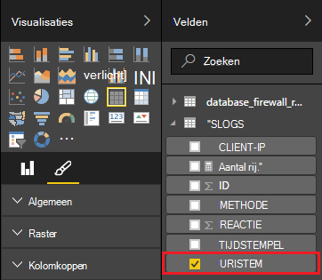

<properties
 pageTitle="Storm Apache gebruiken met Power BI | Microsoft Azure"
 description="Power BI rapporten maken met gegevens uit een C#-topologie op een cluster Apache Storm in HDInsight."
 services="hdinsight"
 documentationCenter=""
 authors="Blackmist"
 manager="jhubbard"
 editor="cgronlun"
    tags="azure-portal"/>

<tags
 ms.service="hdinsight"
 ms.devlang="dotnet"
 ms.topic="article"
 ms.tgt_pltfrm="na"
 ms.workload="big-data"
 ms.date="10/27/2016"
 ms.author="larryfr"/>

# Power BI kunt visualiseren van gegevens uit een topologie Apache Storm

Power BI kunt u gegevens visueel weergeven als rapporten. Met de Visual Studio-sjablonen voor Storm op HDInsight, kunt u gemakkelijk gegevens op te slaan van een topologie die wordt uitgevoerd op een Apache Storm op de cluster HDInsight in SQL Azure gebruiken en vervolgens de gegevens visualiseren met Power BI.

In dit document leert u hoe een rapport van gegevens gegenereerd door een Storm Apache-topologie en opgeslagen in Azure SQL-Database maken met Power BI.

> [AZURE.NOTE] Terwijl u de stappen in dit document zijn gebaseerd op een Windows-ontwikkelomgeving met Visual Studio, kan de gecompileerde project naar een Linux- of HDInsight op basis van het Windows-cluster worden verzonden. Alleen Linux gebaseerde clusters gemaakt na 28-10/2016 ondersteuning SCP.NET topologieën.
>
> Als u wilt een C#-topologie met een Linux-gebaseerde cluster gebruikt, moet u het pakket Microsoft.SCP.Net.SDK NuGet gebruikt door uw project naar versie 0.10.0.6 of hoger bijwerken. De versie van het pakket moet ook overeenkomen met de primaire versie van Storm geïnstalleerd op HDInsight. Gebruik bijvoorbeeld Storm op HDInsight versie 3.3 en 3.4 Storm versie 0.10.x, terwijl de HDInsight 3.5 met Storm 1.0.x.
> 
> C#-topologieën op Linux gebaseerde clusters moeten gebruik .NET 4.5, en Mono uit te voeren op de cluster HDInsight. De meeste dingen werken, echter u moet de [Compatibiliteit met Mono-](http://www.mono-project.com/docs/about-mono/compatibility/) document controleren op potentiële compatibiliteitsproblemen.
>
> Zie voor een Java-versie van dit project, ook op een cluster op basis van Linux of Windows werken zal [Azure gebeurtenis Hubs met Storm op HDInsight (Java) gebeurtenissen laten verwerken](hdinsight-storm-develop-java-event-hub-topology.md).

## Vereisten

- Een abonnement op Azure. Zie [Azure krijg gratis proefperiode](https://azure.microsoft.com/documentation/videos/get-azure-free-trial-for-testing-hadoop-in-hdinsight/).

* Azure Active Directory-gebruiker met toegang tot de [Power BI](https://powerbi.com)

* Visual Studio (een van de volgende versies)

    * Visual Studio 2012 met [update 4](http://www.microsoft.com/download/details.aspx?id=39305)

    * Visual Studio 2013 met [update 4](http://www.microsoft.com/download/details.aspx?id=44921) of [Visual Studio 2013 Gemeenschap](http://go.microsoft.com/fwlink/?linkid=517284&clcid=0x409)

    * [Visual Studio 2015](https://www.visualstudio.com/downloads/download-visual-studio-vs.aspx)

* De HDInsight's voor Visual Studio: Zie [aan de slag met de HDInsight's voor Visual Studio](../HDInsight/hdinsight-hadoop-visual-studio-tools-get-started.md) voor meer informatie over de installatie-informatie.

## Hoe het werkt

In dit voorbeeld bevat een C# Storm topologie die willekeurig wordt gegenereerd logboekgegevens voor Internet Information Services (IIS). Deze gegevens worden vervolgens naar een SQL-Database geschreven en van daaruit wordt gebruikt om rapporten te genereren in Power BI.

Hier volgt een lijst van de bestanden die de hoofdfunctionaliteit van dit voorbeeld te implementeren.

* **SqlAzureBolt.cs**: informatie geproduceerd in de Storm-topologie met SQL-Database geschreven.

* **IISLogsTable.sql**: de Transact-SQL-instructies voor het genereren van de gegevens worden opgeslagen in de database.

> [AZURE.WARNING] Voordat u begint met de topologie op de HDInsight-cluster moet u de tabel in SQL-Database maken.

## In het voorbeeld downloaden

Download het [voorbeeld HDInsight C# Storm Power BI](https://github.com/Azure-Samples/hdinsight-dotnet-storm-powerbi). Als u wilt downloaden, vork/clone [git](http://git-scm.com/)met of gebruik de koppeling **downloaden** om te downloaden van een zip van het archief.

## Een database maken

1. Gebruik de stappen in het document van de [SQL-Database-zelfstudie](../sql-database/sql-database-get-started.md) voor het maken van een nieuwe SQL-Database.

2. Verbinding maken met de database met behulp van de stappen in het document [verbinden met een SQL-Database met Visual Studio](../sql-database/sql-database-connect-query.md) voor verbinding met de database.

4. Klik met de rechtermuisknop op de database in Object Explorer en maak een __Nieuwe Query__. De inhoud van het bestand __IISLogsTable.sql__ is opgenomen in het gedownloade project in het query-venster plakken en vervolgens de query gebruiken Ctrl + Shift + E. U ontvangt een bericht dat de-opdracht(en) is voltooid.

    Nadat dit is voltooid, wordt er een nieuwe tabel met de naam __IISLOGS__ in de database.

## Het monster configureren

1. Selecteer de SQL-database vanaf de [portal Azure](https://portal.azure.com). Selecteer de __Essentials__ -sectie van de SQL-database blade, __tekenreeksen voor een databaseverbinding wordt weergegeven__. In de lijst die wordt weergegeven, kopieert u de gegevens __ADO.NET (SQL-verificatie)__ .

1. Open het monster in Visual Studio. Open het bestand **App.config** in **Solution Explorer**en zoek de volgende vermelding:

        <add key="SqlAzureConnectionString" value="##TOBEFILLED##" />
    
    Vervang de waarde __# TOBEFILLED ##__ met de verbindingsreeks in de vorige stap hebt gekopieerd. Vervang __{uw\_gebruikersnaam}__ en __{uw\_wachtwoord}__ met de gebruikersnaam en het wachtwoord voor de database.

2. Opslaan en sluiten van de bestanden.

## Implementatie van het monster

1. In **Solution Explorer**met de rechtermuisknop op het **StormToSQL** -project en selecteer **indienen bij Storm op HDInsight**. Selecteer het cluster HDInsight uit het dialoogvenster **Storm Cluster** dropdown.

    > [AZURE.NOTE] Het duurt een paar seconden voor de vervolgkeuzelijst **Storm Cluster** aan te vullen met de namen van de servers.
    >
    > Voer desgevraagd de inloggegevens voor uw abonnement op Azure. Als er meer dan één abonnement, aanmelden bij de database met de Storm op de cluster HDInsight.

2. Wanneer de topologie is ingediend, weergegeven de Storm topologieën voor het cluster. Selecteer de vermelding SqlAzureWriterTopology in de lijst informatie weergeven over de actieve topologie.

    

    In deze weergave kunt u informatie bekijken over de topologie, of dubbelklik op items (zoals de SqlAzureBolt) voor informatie die specifiek is voor een onderdeel in de topologie.

3. Nadat de topologie is uitgevoerd voor een paar minuten terug naar het venster van SQL query dat u gebruikt om de database te maken. De bestaande overzichten vervangen door het volgende.

        select * from iislogs;
    
    Gebruik Ctrl + Shift + E voor het uitvoeren van de query en u ontvangt de volgende resultaten.
    
        1   2016-05-27 17:57:14.797 255.255.255.255 /bar    GET 200
        2   2016-05-27 17:57:14.843 127.0.0.1   /spam/eggs  POST    500
        3   2016-05-27 17:57:14.850 123.123.123.123 /eggs   DELETE  200
        4   2016-05-27 17:57:14.853 127.0.0.1   /foo    POST    404
        5   2016-05-27 17:57:14.853 10.9.8.7    /bar    GET 200
        6   2016-05-27 17:57:14.857 192.168.1.1 /spam   DELETE  200

    Dit zijn gegevens die uit de Storm-topologie is geschreven.

## Een rapport maken

1. Verbinding maken met de [Azure SQL Database connector](https://app.powerbi.com/getdata/bigdata/azure-sql-database-with-live-connect) voor Power BI.

2. In __Databases__, selecteer __ophalen__.

3. __Azure SQL-Database__selecteren en selecteer vervolgens __verbinding maken__.

4. Voer de gegevens voor verbinding met uw Azure SQL-Database. U vindt de [Azure portal](https://portal.azure.com) bezoeken en selecteert u de SQL-database.

    > [AZURE.NOTE] U kunt ook het interval voor vernieuwen en aangepaste filters instellen met behulp van __Geavanceerde opties inschakelen__ in het dialoogvenster verbinding maken.

5. Nadat u verbinding hebt gemaakt, ziet u een nieuwe gegevensset met dezelfde naam als u verbinding met hebt de-database. Selecteer de gegevensset om te beginnen met het ontwerpen van een rapport.

3. Vouw de vermelding __IISLOGS__ van __velden__. Schakel het selectievakje voor __URISTEM__. Hiermee maakt u een nieuw rapport waarin de stengels URI (/ foo, / staaf-, enz.) geregistreerd in de database.

    

5. En sleep de __methode__ voor het rapport. Het rapport wordt bijgewerkt als u de stengels en de bijbehorende HTTP-methode die wordt gebruikt voor de HTTP-aanvraag.

    

4. Selecteer het pictogram van de __velden__ uit de kolom __Visualisaties__ en selecteer vervolgens de pijl-omlaag naast de __methode__ in de sectie __waarden__ . Selecteer in de lijst __tellen__. Hiermee wijzigt u de lijst een telling van het aantal keren dat een bepaalde URI is geopend.

    

6. Selecteer vervolgens de __gestapeld kolomdiagram__ wijzigen hoe de informatie wordt weergegeven.

    

7. Als u het rapport hebt hoe u dat wilt, de vermelding __Opslaan__ in het menu gebruiken om een naam en sla het rapport.

## Stop de topologie

De topologie blijft actief totdat u het stopt of de Storm op de cluster HDInsight verwijdert. Voer de volgende stappen uit als u wilt stoppen, de topologie.

1. Terug naar de topologie viewer in Visual Studio en selecteer de topologie.

2. Klik op de knop **Afsluiten** te stoppen, de topologie.

    

## Het cluster te verwijderen

[AZURE.INCLUDE [delete-cluster-warning](../../includes/hdinsight-delete-cluster-warning.md)]

## Volgende stappen

In dit document, hebt u geleerd hoe gegevens van een topologie Storm verzenden naar de SQL-Database en vervolgens de gegevens visualiseren met Power BI. Zie de volgende onderwerpen voor meer informatie over het werken met andere Azure technologieën met Storm op HDInsight:

* [Voorbeeld van de topologieën voor Storm op HDInsight](hdinsight-storm-example-topology.md)
