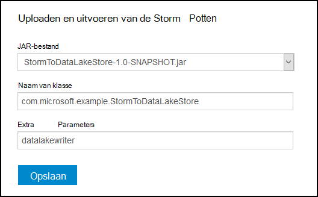
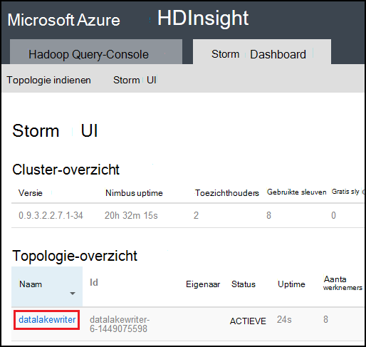

<properties
pageTitle="Gebruik Azure Lake gegevensarchief met Apache Storm op Azure HDInsight"
description="Informatie over het schrijven van gegevens naar Azure Lake gegevensarchief uit de topologie van een Apache Storm op HDInsight. Dit document en de bijbehorende voorbeeld laten zien hoe de HdfsBolt component kan worden gebruikt om te schrijven naar gegevensarchief Lake."
services="hdinsight"
documentationCenter="na"
authors="Blackmist"
manager="jhubbard"
editor="cgronlun"/>

<tags
ms.service="hdinsight"
ms.devlang="na"
ms.topic="article"
ms.tgt_pltfrm="na"
ms.workload="big-data"
ms.date="09/06/2016"
ms.author="larryfr"/>

#Gebruik Azure Lake gegevensarchief met Apache Storm met HDInsight

Azure Lake gegevensarchief is een HDFS compatibel cloud storage service met hoge doorvoer, beschikbaarheid, duurzaamheid en betrouwbaarheid voor uw gegevens. In dit document leert u een topologie op basis van Java Storm gebruiken om gegevens te schrijven naar de gegevensopslag Lake Azure gebruikmaken van [HdfsBolt](http://storm.apache.org/javadoc/apidocs/org/apache/storm/hdfs/bolt/HdfsBolt.html) , dat wordt geleverd als onderdeel van Apache Storm.

> [AZURE.IMPORTANT] De topologie die in dit document wordt gebruikt, is afhankelijk van onderdelen die zijn opgenomen in de Storm op clusters van HDInsight en kunnen worden gewijzigd om te werken met Azure Lake gegevensopslag gebruikt in combinatie met andere clusters Apache Storm.

##Vereisten

* [Java JDK 1.7](https://www.oracle.com/technetwork/java/javase/downloads/jdk7-downloads-1880260.html) of hoger
* [Maven 3.x](https://maven.apache.org/download.cgi)
* Een abonnement op Azure
* Een Storm op HDInsight cluster versie 3.2. U maakt een nieuwe Storm op de cluster HDInsight, gebruik de stappen in het document [HDInsight met Lake gegevensarchief gebruiken met behulp van Azure](../data-lake-store/data-lake-store-hdinsight-hadoop-use-portal.md) . De stappen in dit document helpt u bij het maken van een nieuw cluster HDInsight en Azure Lake gegevensarchief.  

    > [AZURE.IMPORTANT] Als u het cluster HDInsight maakt, moet u __Storm__ als __3.2__ als de versie en het clustertype. Het besturingssysteem is Windows of Linux.  

###Omgevingsvariabelen configureren

De volgende omgevingsvariabelen ingesteld tijdens de installatie van Java en de JDK op uw werkstation ontwikkeling. Echter, moet u controleren dat ze bestaan en dat ze de juiste waarden voor uw systeem bevatten.

* __JAVA_HOME__ - verwijzen naar de map waarin u de Java runtime environment (JRE) is geïnstalleerd. Bijvoorbeeld in een Unix- of Linux-distributie, moet er een waarde van ongeveer `/usr/lib/jvm/java-7-oracle`. In Windows heeft deze een waarde vergelijkbaar met `c:\Program Files (x86)\Java\jre1.7`.

* __Pad__ - mogen de volgende paden:

    * __JAVA\_HOME__ (of het equivalente pad)
    
    * __JAVA\_HOME\bin__ (of het equivalente pad)
    
    * De map waarin de Maven is geïnstalleerd

##Topologie-implementatie

In het voorbeeld gebruikt in dit document is geschreven in Java en gebruikt de volgende onderdelen:

* __TickSpout__: de gegevens die worden gebruikt door andere onderdelen van de verbindingsstatusdatabase wordt gegenereerd.

* __PartialCount__: gebeurtenissen die worden gegenereerd door TickSpout telt.

* __FinalCount__: samengestelde waarden tellen gegevens uit PartialCount.

* __ADLStoreBolt__: schrijft gegevens naar Azure Lake gegevensarchief maken met het onderdeel [HdfsBolt](http://storm.apache.org/javadoc/apidocs/org/apache/storm/hdfs/bolt/HdfsBolt.html) .

Het project met deze topologie is beschikbaar als een download van [https://github.com/Azure-Samples/hdinsight-storm-azure-data-lake-store](https://github.com/Azure-Samples/hdinsight-storm-azure-data-lake-store).

###Wat zijn ADLStoreBolt

De ADLStoreBolt is de naam die wordt gebruikt voor het exemplaar van de HdfsBolt in de topologie die u naar Azure gegevens Lake schrijft. Dit is een speciale versie van de HdfsBolt die zijn gemaakt door Microsoft. het echter afhankelijk zijn van configuratiewaarden core-site zoals Hadoop-onderdelen die zijn opgenomen in Azure HDInsight voor communicatie met meer gegevens.

Met name wanneer u een cluster HDInsight maakt, kunt u deze koppelen met een Azure-gegevensarchief Lake. Deze schrijft posten in de kern-site voor het gegevensarchief Lake u hebt geselecteerd, die worden gebruikt door onderdelen van de hadoop-client en hadoop hdfs voor communicatie met het gegevensarchief Lake.

> [AZURE.NOTE] Microsoft heeft bijgedragen code naar de Apache Hadoop en Storm projecten waarmee communicatie met Azure Lake gegevensopslag en Azure Blob opslag, maar deze functies zijn mogelijk niet opgenomen in andere Hadoop en Storm distributies standaard.

De configuratie voor HdfsBolt in de topologie is als volgt:

    // 1. Create sync and rotation policies to control when data is synched
    //    (written) to the file system and when to roll over into a new file.
    SyncPolicy syncPolicy = new CountSyncPolicy(1000);
    FileRotationPolicy rotationPolicy = new FileSizeRotationPolicy(0.5f, Units.KB);
    // 2. Set the format. In this case, comma delimited
    RecordFormat recordFormat = new DelimitedRecordFormat().withFieldDelimiter(",");
    // 3. Set the directory name. In this case, '/stormdata/'
    FileNameFormat fileNameFormat = new DefaultFileNameFormat().withPath("/stormdata/");
    // 4. Create the bolt using the previously created settings,
    //    and also tell it the base URL to your Data Lake Store.
    // NOTE! Replace 'MYDATALAKE' below with the name of your data lake store.
    HdfsBolt adlsBolt = new HdfsBolt()
        .withFsUrl("adl://MYDATALAKE.azuredatalakestore.net/")
        .withRecordFormat(recordFormat)
        .withFileNameFormat(fileNameFormat)
        .withRotationPolicy(rotationPolicy)
        .withSyncPolicy(syncPolicy);
    // 4. Give it a name and wire it up to the bolt it accepts data
    //    from. NOTE: The name used here is also used as part of the
    //    file name for the files written to Data Lake Store.
    builder.setBolt("ADLStoreBolt", adlsBolt, 1)
      .globalGrouping("finalcount");
      
Als u bekend bent met behulp van HdfsBolt, ziet u dat dit redelijk standaard configuratie, met uitzondering van de URL is. De URL bevat het pad naar de hoofdmap van uw Azure-gegevensarchief Lake.

Sinds het schrijven naar het gegevensarchief Lake HdfsBolt en is slechts een wijziging van de URL, moet u kunnen nemen van alle bestaande topologie die u schrijft naar HDFS of WASB met HdfsBolt en gemakkelijk wijzigen via Azure Lake gegevensarchief.

##Bouwen en de topologie van pakket

1. Download het voorbeeldproject van [https://github.com/Azure-Samples/hdinsight-storm-azure-data-lake-store](https://github.com/Azure-Samples/hdinsight-storm-azure-data-lake-store
) op uw ontwikkelomgeving.

2. Open de `StormToDataLake\src\main\java\com\microsoft\example\StormToDataLakeStore.java` -bestand in een editor en zoek de regel met `.withFsUrl("adl://MYDATALAKE.azuredatalakestore.net/")`. __MYDATALAKE__ de naam wijzigt van de Azure Data Lake Store u gebruikt bij het maken van uw server HDInsight.

3. Van de opdracht prompt, terminal of een shell-sessie mappen naar de hoofdmap van het gedownloade project wijzigen en voer de volgende opdrachten te pakken van de topologie.

        mvn compile
        mvn package
    
    Nadat de build en de verpakking is voltooid, zal er een nieuwe map met de naam `target`, waarin een bestand met de naam `StormToDataLakeStore-1.0-SNAPSHOT.jar`. Dit document bevat de gecompileerde topologie.

##Implementeren en uitvoeren op Linux-gebaseerde HDInsight

Als u een Linux-gebaseerde Storm op HDInsight cluster hebt gemaakt, gebruik de volgende stappen uit om te implementeren en uitvoeren van de topologie.

1. Gebruik de volgende opdracht als u de topologie kopiëren naar het cluster HDInsight. __Gebruiker__ vervangen door de SSH-gebruikersnaam die u gebruikt bij het maken van het cluster. __CLUSTERNAAM__ vervangen door de naam van het cluster.

        scp target\StormToDataLakeStore-1.0-SNAPSHOT.jar USER@CLUSTERNAME-ssh.azurehdinsight.net:StormToDataLakeStore-1.0-SNAPSHOT.jar
    
    Voer desgevraagd het wachtwoord dat wordt gebruikt bij het maken van de gebruiker SSH voor het cluster. Als u een openbare sleutel in plaats van een wachtwoord gebruikt, moet u mogelijk gebruik van de `-i` parameter geeft u het pad naar de bijbehorende persoonlijke sleutel.
    
    > [AZURE.NOTE] Als u voor de ontwikkeling van een Windows-client gebruikt, hebt u geen een `scp` opdracht. Als dat zo is, kunt u `pscp`, dat verkrijgbaar is bij [http://www.chiark.greenend.org.uk/~sgtatham/putty/download.html](http://www.chiark.greenend.org.uk/~sgtatham/putty/download.html).

2. Nadat het uploaden is voltooid, gebruikt u de volgende verbinding maken met de HDInsight-cluster met behulp van SSH. __Gebruiker__ vervangen door de SSH-gebruikersnaam die u gebruikt bij het maken van het cluster. __CLUSTERNAAM__ vervangen door de naam van het cluster.

        ssh USER@CLUSTERNAME-ssh.azurehdinsight.net

    Voer desgevraagd het wachtwoord dat wordt gebruikt bij het maken van de gebruiker SSH voor het cluster. Als u een openbare sleutel in plaats van een wachtwoord gebruikt, moet u mogelijk gebruik van de `-i` parameter geeft u het pad naar de bijbehorende persoonlijke sleutel.
    
    > [AZURE.NOTE] Als u een Windows-client gebruikt voor ontwikkeling, volgt u de informatie in [verbinding maken met de Linux-gebaseerde HDInsight met SSH van Windows](hdinsight-hadoop-linux-use-ssh-windows.md) voor meer informatie op met behulp van de stopverf client verbinding maken met het cluster.
    
3. Zodra verbonden, gebruikt u de volgende de topologie te starten:

        storm jar StormToDataLakeStore-1.0-SNAPSHOT.jar com.microsoft.example.StormToDataLakeStore datalakewriter
    
    Hiermee start u de topologie met een beschrijvende naam `datalakewriter`.

##Implementeren en uitvoeren op Windows gebaseerde HDInsight

1. Open een webbrowser en Ga naar HTTPS://CLUSTERNAME.azurehdinsight.net, waar de __CLUSTERNAAM__ de naam van het cluster HDInsight is. Geef desgevraagd de gebruikersnaam admin (`admin`) en het wachtwoord dat u voor deze account gebruikt bij het maken van het cluster.

2. Uit het Dashboard Storm, selecteert u __Bladeren__ in de vervolgkeuzelijst __Jar-bestand__ en selecteer vervolgens het bestand StormToDataLakeStore-1.0-SNAPSHOT.jar van de `target` directory. De volgende waarden gebruiken voor de overige vermeldingen op het formulier:

    * Klassenaam: com.microsoft.example.StormToDataLakeStore
    * Aanvullende Parameters: datalakewriter
    
    

3. Selecteer de knop __verzenden__ wilt uploaden en start de topologie. Vergelijkbaar met de volgende informatie moet worden weergegeven in het resultaatveld onder de knop __indienen__ nadat de topologie is gestart:

        Process exit code: 0
        Currently running topologies:
        Topology_name        Status     Num_tasks  Num_workers  Uptime_secs
        -------------------------------------------------------------------
        datalakewriter       ACTIVE     68         8            10        

##Gegevens in de uitvoer

Er zijn verschillende manieren om de gegevens weer te geven. In dit gedeelte gebruiken we de Azure Portal en de `hdfs` de opdracht om de gegevens weer te geven.

> [AZURE.NOTE] U mag de topologieën gedurende enkele minuten voordat u controleert de uitvoergegevens uitvoeren zodat de gegevens naar meerdere bestanden op Azure Lake gegevensopslag heeft zijn gesynchroniseerd.

* __Vanaf de [Portal Azure](https://portal.azure.com)__: Selecteer de Azure Lake gegevensopslag die u gebruikt in combinatie met HDInsight In de portal.

    > [AZURE.NOTE] Als u niet het gegevensarchief Lake aan de Azure portal dashboard vastmaken, vindt u deze selecteert u __Bladeren__ onder aan de lijst aan de linkerkant, vervolgens __Gegevensarchief Lake__, en ten slotte de winkel selecteren.
    
    Selecteer de pictogrammen boven in het gegevensarchief Lake __Data Explorer__.
    
    
    
    Selecteer vervolgens de map __stormdata__ . Een lijst met tekstbestanden moet worden weergegeven.
    
    
    
    Selecteer een van de bestanden om de inhoud ervan weer te geven.

* __Uit het cluster__: als u verbinding hebt met het HDInsight-cluster via SSH (Linux, cluster) of extern bureaublad (Windows, cluster), kunt u het volgende om de gegevens weer te geven. __DATALAKE__ vervangen door de naam van uw gegevensopslagplaats Lake

        hdfs dfs -cat adl://DATALAKE.azuredatalakestore.net/stormdata/*.txt

    Dit wordt aaneenschakelen de tekstbestanden opgeslagen in de map en de informatie wordt met de volgende strekking:
    
        406000000
        407000000
        408000000
        409000000
        410000000
        411000000
        412000000
        413000000
        414000000
        415000000
        
##Stop de topologie

Storm topologieën wordt uitgevoerd totdat deze wordt gestopt, of het cluster is verwijderd. Gebruik de volgende gegevens om te stoppen met de topologieën.

__Voor Linux-gebaseerde HDInsight__:

Gebruik de volgende opdracht vanaf een SSH-sessie aan het cluster:

    storm kill datalakewriter

__Voor HDInsight op basis van Windows__:

1. Selecteer de __Storm UI__ koppeling boven aan de pagina van het Dashboard Storm (https://CLUSTERNAME.azurehdinsight.net).

2. Zodra de Storm-gebruikersinterface wordt geladen, selecteert u de koppeling __datalakewriter__ .

    

3. Selecteer __Kill__ en selecteer vervolgens OK in het dialoogvenster dat wordt weergegeven in de sectie __Acties van de topologie__ .

    

## Het cluster te verwijderen

[AZURE.INCLUDE [delete-cluster-warning](../../includes/hdinsight-delete-cluster-warning.md)]

##Volgende stappen

U hebt geleerd hoe Storm gebruiken om te schrijven naar de gegevensopslag Lake Azure, Ontdek andere [voorbeelden van de Storm voor HDInsight](hdinsight-storm-example-topology.md).
