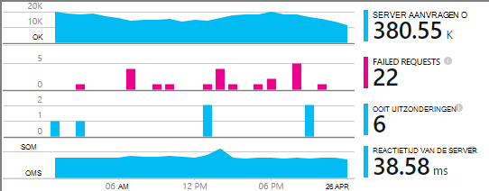

<properties
    pageTitle="Voorbeeld van de MyDriving Azure IoT: bouwen | Microsoft Azure"
    description="Bouwen van een app die een uitgebreide demonstratie van het bouwen van een IoT-systeem met behulp van Microsoft Azure, met inbegrip van de Stream Analytics, Machine Learning en Hubs gebeurtenis is."
    services=""
    documentationCenter=".net"
    suite=""
    authors="harikmenon"
    manager="douge"/>

<tags
    ms.service="multiple"
    ms.workload="tbd"
    ms.tgt_pltfrm="ibiza"
    ms.devlang="dotnet"
    ms.topic="article"
    ms.date="03/25/2016"
    ms.author="harikm"/>


# <a name="build-and-deploy-the-mydriving-solution-to-your-environment"></a>Bouwen en implementeren van de MyDriving-oplossing voor uw omgeving

MyDriving is een Internet dingen (IoT) waarin gegevens worden verzameld uit uw auto, verwerkt met behulp van machine learning en gepresenteerd op je mobiele telefoon. De back-end bestaat uit een aantal services van Microsoft Azure. De clients kunnen telefoons met Android, iOS of Windows 10 zijn.

Wij bieden u een aan de slag bij het maken van uw eigen IoT-oplossing voor de MyDriving. Uit de [MyDriving-bibliotheek op GitHub](https://github.com/Azure-Samples/MyDriving)krijgt u de scripts voor de implementatie van de back-end-architectuur in uw eigen account Azure Azure Resource Manager. Vanaf dat punt, kunt u de verschillende services configureren, de query's aanpassen aan uw eigen gegevens, enzovoort te wijzigen. U vindt deze scripts--samen met de code voor de mobiele app, het project Azure App Service API en meer--in de bibliotheek MyDriving.

Als u de app nog niet hebt geprobeerd, bekijkt u de [Get-handleiding](iot-solution-get-started.md).

Er is een gedetailleerd overzicht van de architectuur in de [Naslaggids voor MyDriving](http://aka.ms/mydrivingdocs). Kortom Maak er verschillende stukken die we ingesteld en dat stelt u maximaal een gelijksoortig project:

* Een **clienttoepassing** wordt uitgevoerd op Android, iOS en Windows 10-telefoons. We gebruiken het platform Xamarin delen een groot deel van de code die is opgeslagen op GitHub onder `src/MobileApp`. De app heeft eigenlijk twee verschillende functies:
 * Het relais telemetrie van het apparaat van diagnostische boordsystemen (OBD) en van zijn eigen locatie van het systeem cloud back-end-service.
 * Het is een gebruikersinterface waar gebruikers kunnen query op hun opgenomen ritten.
* Een **cloud-service** de gegevens over de weg reis in real-time ingests en verwerkt deze. De belangrijkste werkzaamheden van het maken van deze service is te kiezen en wire-tal van Azure services voorzien. Sommige van de onderdelen moet filteren en de binnenkomende gegevens verwerken van scripts. We een sjabloon Azure Resource Manager gebruiken voor het configureren van alle onderdelen.
* Een **mobiele-app** is de webservice achter het deel van de gebruikersinterface van de app van het apparaat. De belangrijkste taak is opgeslagen, verwerkt de gegevens in de database opvragen. De code is op GitHub onder `src/MobileAppService`.
* **Visual Studio met Xamarin** is onze ontwikkelomgeving. Xamarin dat bestaat als een onderdeel van Visual Studio en als een zelfstandige geïntegreerde ontwikkelomgeving (IDE), wordt gebruikt voor de cross-platform apparaatcode bouwen. Als de i/o-code, is het nodig om een exemplaar van Xamarin op een computer met OS X. Indien nodig, kan deze worden uitgevoerd als een agent, beheerd vanuit Visual Studio.
* In Xamarin Test wolk wordt **eenheid testen** van apps in het apparaat uitgevoerd.
* **GitHub** is de opslagplaats waar we de code, scripts en sjablonen opslaat.
* **Visual Studio Team Services** is een cloud-service die wordt gebruikt voor het beheren van de continue build en test van de service- en webtoepassingen.
* **HockeyApp** wordt gebruikt voor het distribueren van de versies van de apparaatcode. Verzamelt ook crash en gebruiksrapporten en feedback van gebruikers.
* Het mobiele web-service controleert de **Inzichten van Visual Studio-toepassing** .

Dus laten we zien hoe we ingesteld die alle. Houd er rekening mee dat veel van de stappen optioneel zijn.

## <a name="sign-up-for-accounts"></a>Aanmelden voor accounts

-   [Visual Studio Dev Essentials](https://www.visualstudio.com/products/visual-studio-dev-essentials-vs.aspx). Dit gratis programma biedt eenvoudige toegang tot veel ontwikkelprogramma's en -services, met inbegrip van Visual Studio, Visual Studio Team Services en Azure. Je krijgt een krediet van $25 per maand op Azure voor 12 maanden. Het bevat ook abonnementen op Pluralsight training en Xamarin University. U kunt zich ook aanmelden afzonderlijk voor gratis lagen van [Azure](https://azure.com) en [Visual Studio Team Services](https://www.visualstudio.com/products/visual-studio-team-services-vs.aspx), maar deze geen Azure credits.

-   [HockeyApp](https://rink.hockeyapp.net/) (optioneel), voor het beheren van de distributie van mobiele toepassingen testen en het verzamelen van telemetrie.

-   [Xamarin](https://xamarin.com/) (vereist), voor het maken van de mobiele app en foutopsporing wordt uitgevoerd en tests uitgevoerd op [Xamarin Test wolk](https://xamarin.com/test-cloud).

-   [GitHub](https://github.com/Azure-Samples/MyDriving/) (optioneel), voor het maken van de gratis openbare opslagplaatsen voor uw eigen code (persoonlijke opslagplaatsen worden betaald). U kunt ook het basisniveau in Visual Studio Team Services voor particuliere opslagplaatsen.

-   [Power BI](https://powerbi.microsoft.com/) (optioneel), rich visualisaties van gegevens over het gehele systeem te maken.

> [AZURE.NOTE] U hoeft niet een GitHub-account toegang tot de code MyDriving in [de bibliotheek GitHub MyDriving](https://github.com/Azure-Samples/MyDriving).

## <a name="install-development-tools"></a>Ontwikkelprogramma's installeren

De volgende instellingen zijn voor de ontwikkeling van de volledige oplossing: een iOS, Android en Windows 10 Mobile app cross-platform, met een Azure back-end.

Als alternatief kunt u Xamarin Studio op Windows of Mac voor het ontwikkelen van mobiele toepassingen als werken niet op de Azure back-end.

Er is een [langere beschrijving van deze installatie](https://msdn.microsoft.com/library/mt613162.aspx).

### <a name="windows-development-machine"></a>Windows-computer voor ontwikkeling

De centrale tool in Windows is Visual Studio voor het werken met de MyDriving app voor Android en Windows de App Service API project, en de microservice-extensies.

Xamarin, Git, emulators en andere nuttige onderdelen zijn allemaal geïntegreerd met Visual Studio.

Installeren:

-   [Visual Studio 2015 met Xamarin](https://www.visualstudio.com/products/visual-studio-community-vs) (elke editie--Gemeenschap is gratis).

-   [SQLite voor Universal Windows Platform](https://visualstudiogallery.msdn.microsoft.com/4913e7d5-96c9-4dde-a1a1-69820d615936). Vereist voor het maken van de code van Windows 10 Mobile.

-   [Azure SDK voor Visual Studio 2015](https://go.microsoft.com/fwlink/?linkid=518003&clcid=0x409). Hebt u de SDK voor het uitvoeren van apps in Azure, samen met het opdrachtregelprogramma voor het beheren van Azure.

-   [Azure Service Fabric SDK](http://www.microsoft.com/web/handlers/webpi.ashx?command=getinstallerredirect&appid=MicrosoftAzure-ServiceFabric). Vereist voor het bouwen van de [microservice](../service-fabric/service-fabric-get-started.md) -extensie.

Zorg ervoor dat de juiste extensies voor Visual Studio. Controleer of onder **Extra**, ziet u de **Android, iOS, Xamarin...**. Als dat niet het geval is, opent u het Configuratiescherm en selecteer **programma's en onderdelen** > **Microsoft** > **Visual Studio 2015** > **wijzigen**. Selecteer onder **ontwikkeling voor verschillende platforms**, **C\#/.Net (Xamarin)**. Terwijl u er bent, moet u controleren dat **Git voor Windows** is geïnstalleerd.

### <a name="mac-development-machine"></a>Mac ontwikkeling machine

De Mac (Yosemite of hoger) is vereist als u wilt ontwikkelen voor iOS. Hoewel we met Visual Studio met Xamarin in Windows te ontwikkelen en beheren van alle code, Xamarin maakt gebruik van een agent is geïnstalleerd op een Mac te bouwen en de iOS code ondertekenen.


(Als alternatief kunt u Xamarin Studio rechtstreeks op de Mac voor het ontwikkelen van toepassingen voor meerdere platforms.)

De Mac is niet nodig als u niet wilt opnemen iOS als doelplatform.

Installeren:

-   [Xamarin Studio voor iOS](https://developer.xamarin.com/guides/ios/getting_started/installation/mac/). U kunt ook Visual Studio en Xamarin op een Mac met een virtuele Windows-computer instellen. Zie [installatie, installatie, en keuringen voor Mac-gebruikers](https://msdn.microsoft.com/library/mt488770.aspx) op MSDN.

-   [Azure ontwikkelprogramma 's](https://azure.microsoft.com/downloads/) (optioneel).

Schakel externe aanmelding op de Mac. Open **Systeemvoorkeuren** > **delen**en selecteer vervolgens **Externe aanmelding**.

Wanneer u een iOS-project in Visual Studio, Windows openen, wordt de invoegtoepassing Xamarin u gevraagd voor de ID van de Mac.

## <a name="fetch-the-github-repository"></a>De opslagplaats GitHub ophalen

Een lokale kopie van [de bibliotheek GitHub MyDriving](https://github.com/Azure-Samples/MyDriving) ophalen met behulp van de knop **Downloaden ZIP-** in GitHub, Visual Studio, of een andere client van Git.

Pak het bestand naar een map met een korte padnaam, bijvoorbeeld C:\\code.

Ook als u wilt houden met, of bijdragen aan onze code klonen de opslagplaats als volgt:

**GIT clone https://github.com/Azure-Samples/MyDriving.git**

## <a name="get-a-bing-maps-api-key"></a>Een Bing maps API-sleutel ophalen

[Registreren voor een Bing Maps API-sleutel](https://msdn.microsoft.com/library/ff428642.aspx).

U moet dit vervangen in regel 22 in `src/MobileApps/MyDriving/MyDriving.Utils/Logger.cs`.


## <a name="build-the-demo-app"></a>De demo-app bouwen

Deze oplossingen in Visual Studio openen:

-   src\MobileApps\MyDriving.sln

-   src\MobileAppService\MyDrivingService.sln

-   src\Extensions\ServiceFabric\VINLookUpApplication\VINLookUpApplication.sln

Hebt u vragen aan:

-   Sommige projecten mogelijk onbetrouwbare vertrouwen. Kies de optie om ze te openen als u wilt doorgaan.

-   Ontwikkelaarsmodus ingesteld als u op een nieuwe Windows 10 machine werkt.

-   Geef uw referenties Xamarin.

-   Verbinding maken met de Mac Xamarin. Als u niet over een Macintosh-computer, klik met de rechtermuisknop op het iOS-project in Visual Studio en selecteer **project verwijderen**.

De oplossing bouwen.

Als u problemen ondervindt bij het bouwen, probeert de quirks die we hebben gevonden oplossingen:

-   *VINLookupApplication project niet laden*: Zorg ervoor dat u de [SDK voor Visual Studio 2015 Azure](https://go.microsoft.com/fwlink/?linkid=518003&clcid=0x409)geïnstalleerd.

-   *Service Fabric-project niet maken*: eerst de interface projecten bouwen en zorg ervoor dat u de Service Fabric SDK hebt geïnstalleerd.

-   *Android app niet maken*:

    -   Open **hulpprogramma's** > **Android** > **Android SDK Manager**, en zorg ervoor dat Android 6 (23 API) / Platform SDK is geïnstalleerd.

    -   Deze map te verwijderen en vervolgens opnieuw maken:<br/>
        `%LocalAppData%\Xamarin\zips`

## <a name="get-to-know-the-code"></a>Kennismaking met de code

In de oplossing vindt u hier:

-   Azure-extensies: Fabric Service.

-   Azure HDInsight: Scripts voor de verwerking van gegevens van de reis in Azure.

-   Mobiele Apps: Het apparaat apps.

-   MobileAppsService/MyDrivingService: Het web weer beëindigen.

-   Power BI: Definitie van het rapport.

-   Scripts:

    -   Resource Manager: sjablonen maken de Azure bronnen.

    -   PowerShell: Scripts voor het uitvoeren van de Resource Manager-sjablonen.

    -   Azure SQL-Database: Foutopsporing databases.

-   SQL-Database: CreateTables: schemadefinities.

-   Azure Stream Analytics: Query's die de binnenkomende gegevensstroom transformeren.

## <a name="run-the-apps-in-development-mode"></a>De apps worden uitgevoerd in de modus voor ontwikkeling

Maatregelen voor het uitvoeren van de apps, op basis van het apparaat dat u gebruikt:

-  Back-end: Set MyDrivingService als het opstartproject en druk op F5 en de back-end webservice uit te voeren. Een browserweergave van de API-aanbieding wordt geopend.

-  Mobiele clients: de [mobiele toepassingen worden ontwikkeld in Xamarin](https://developer.xamarin.com/guides/cross-platform/deployment,_testing,_and_metrics/debugging_with_xamarin/).
 -  Android: Zie [Android foutopsporing in Xamarin](http://developer.xamarin.com/guides/android/deployment,_testing,_and_metrics/debugging_with_xamarin_android/).

 -  iOS: Zie [Foutopsporing in iOS](http://developer.xamarin.com/guides/ios/deployment,_testing,_and_metrics/debugging_in_xamarin_ios/).

 -  Windows Phone: Zie [Xamarin + Windows Phone](https://developer.xamarin.com/guides/cross-platform/windows/phone/).

## <a name="upload-the-mobile-app-to-hockeyapp"></a>De mobiele app uploaden naar HockeyApp

HockeyApp beheert de distributie van uw app voor Android, iOS of Windows-gebruikers, testen, waarschuwen gebruikers van nieuwe releases. Verzamelt ook handig foutenrapporten, feedback van gebruikers met screenshots en gebruik statistieken.

[Start met het uploaden van](http://support.hockeyapp.net/kb/app-management-2/how-to-create-a-new-app) uw app bouwen. Vervolgens aanmelden bij [HockeyApp](https://rink.hockeyapp.net) vanaf de ontwikkelcomputer. Op het dashboard ontwikkelaar op **Nieuwe App**en sleep vervolgens de gemaakte bestanden naar het venster. (Later kunt u automatiseren uw build service hiervoor.)

U kunt nu in het dashboard van de app.


Herhaal dit proces voor elk platform dat op uw app wordt uitgevoerd. Vervolgens kunt u het volgende doen:

-  Gebruik de [app-ID](http://support.hockeyapp.net/kb/app-management-2/how-to-find-the-app-id) van het dashboard crash gegevens en feedback verzenden vanuit uw app. Werk in de MyDriving, de id's in src/MobileApps/MyDriving/MyDriving.Utils/Logger.cs.

-  [Testgebruikers uitnodigen](http://support.hockeyapp.net/kb/app-management-2/how-to-invite-beta-testers). U krijgt een URL werft testers gebruikers. Ze zult kunnen aanmelden voor uw team, download de app en u feedback sturen.

-  Als u liever een meer open bètaversie, stelt u de verdeling publiek. Klik op **beheren App** > **verdeling** > **Download Public =**. Iedereen kan nu uw app downloaden en u feedback sturen en een melding wordt weergegeven wanneer u een nieuwe versie boekt. U kan sommige foutenrapporten van hen te krijgen.

    

-  [Koppeling foutenrapporten naar Visual Studio Team Services](http://support.hockeyapp.net/kb/third-party-bug-trackers-services-and-webhooks/how-to-use-hockeyapp-with-visual-studio-team-services-vsts-or-team-foundation-server-tfs). Klik op **beheren App** > **Visual Studio teamservices**. HockeyApp kan automatisch werkitems in Team Services maken wanneer er rapporten over vastlopen of wanneer feedback is ontvangen.

Lees meer op de [site HockeyApp](https://hockeyapp.net).

## <a name="test-the-mobile-app-on-xamarin-test-cloud"></a>Test de mobiele app van Xamarin Test wolk

[Xamarin Test wolk](https://developer.xamarin.com/guides/testcloud/introduction-to-test-cloud/) automatiseert UI testen op echte apparaten in de cloud. Met behulp van het kader NUnit schrijft u tests die uw toepassing via de gebruikersinterface uitvoeren.

Voor het gebruik van Xamarin opnemen u [Xamarin.UITests](https://developer.xamarin.com/guides/testcloud/uitest/intro-to-uitest/) SDK in uw app die wordt geleverd als NuGet-pakket. Vindt u deze in de demo-app en wanneer u een nieuwe Testprojecten met de Xamarin maken is opgenomen.


Een voorbeeld van de test-project is opgenomen in de app in de opslagplaats. [MyDriving](https://github.com/Azure-Samples/MyDriving/tree/master/src/MobileAppService), kijk onder [src](https://github.com/Azure-Samples/MyDriving/tree/master/src)/MobileApps/[MyDriving](https://github.com/Azure-Samples/MyDriving/tree/master/src/MobileApps/MyDriving)/MyDriving.UITests/.

Als u een gecompileerde versie van Visual Studio Team Services gebruikt, is het gemakkelijk om te schrijven Xamarin UI-controles en ze uit te voeren als onderdeel van uw build.

## <a name="deploy-azure-services"></a>Azure services implementeren

Raadpleeg de gedetailleerde instructies in **scripts/README.md**voor het uitvoeren van een automatische implementatie van Azure en Team Services bouwen diensten.

Microsoft Azure biedt een schat aan andere services die u gebruiken kunt om cloud-toepassingen te bouwen. Hoewel veel kunnen worden gebruikt (zoals App Service/Web Apps) afzonderlijk, kunt ze op hun best zijn wanneer ze onderling aan een geïntegreerd systeem, zoals verbonden zijn die we gebruiken in MyDriving formulier.

Is het mogelijk te maken en interconnect Azure services handmatig, maar het is veel sneller en betrouwbaarder Azure Resource Manager gebruiken sjablonen. [Resource Manager](../azure-resource-manager/resource-group-overview.md) kunt u de implementatie van een oplossing van resources en de onderlinge verbindingen tussen deze automatiseren.

Hebt u de sjabloon voor het systeem van MyDriving in de bibliotheek GitHub onder [scripts/ARM](https://github.com/Azure-Samples/MyDriving/tree/master/scripts/ARM). Het biedt een uitgebreide en beknopte weergave van hoe de verschillende services in onze architectuur met elkaar zijn verbonden. Kunnen deze in de [Naslaggids voor MyDriving](http://aka.ms/mydrivingdocs)in detail uitgelegd, maar veel meer door te lezen via de sjabloon zelf.

> [AZURE.NOTE] Meest Azure services hebben een bijbehorende kosten, afhankelijk van de prijzen laag. Als u nog nooit een Azure, kunt u [proberen om gratis](https://azure.microsoft.com/free/). Als u niet dat bepaalde onderdelen in het systeem MyDriving gebruikt wilt, wel te verwijderen, om te voorkomen dat kosten. De sectie 'Operationele kosten ramen' verderop in dit artikel wordt een overzicht van de typische servicekosten.

### <a name="edit-the-template"></a>De sjabloon bewerken

Voor het aanpassen van uw implementatie mogelijk onnodige om onderdelen te verwijderen of toe te voegen, controleert u eerst een kopie van het scenario\_scenario en complete.params.json\_complete.json waarin wijzigingen aanbrengen.

U kunt het scenario\_complete.params.json bestand overschrijven verschillende standaardwaarden, zoals de service SKU of het replicatietype van opslag, zoals beschreven in de volgende tabel. De goedkoopste opties selecteert u de standaardwaarden.

| **Parameter**         | **Beschrijving**                | **Standaardwaarde** |
|--------|---------|-------|
| IoT Hub SKU           | Laag voor Azure IoT Hub service | F1                |
| Soort opslag  | Opslagtype-replicatie       | Standaard LRS      |
| SQL Service doelstelling | Gelijktijdigheid sleuf verbruik   | DW100             |
| Hosting Plan SKU      | Serviceplan voor App-Service   | F1                |

In scenario\_complete.json:

-   'BaseName' zoeken en wijzigen in een naam waaraan u de voorkeur geeft.

-   Zoek naar 'Maken'. Elk van deze secties maakt u een bron.

-   SqlServerAdminLogin en sqlServerAdminPassword naar de passende waarden instellen.

-   Voordat u een sectie waarmee een resource wordt gemaakt verwijdert, moet u controleren of er kinderen door te zoeken naar de naam in het bestand ergens anders. Houd er rekening mee dat elke sectie waarmee een service een *dependsOn* sectie waarin de bijbehorende afhankelijkheden.

Hier is wat de sjabloon wordt geconfigureerd. Er zijn in de [Naslaggids voor](http://aka.ms/mydrivingdocs)details.

| **Service**                 | **Beschrijving en details**  
|---|----
| Opslag-accounts            | De sjabloon wordt gemaakt van drie accounts:                                                                                                                                                                       
|| -Er is een SQL-database die geaggregeerde telemetrie van Stream Analytics ontvangt, en fungeert als de back-uparchief voor Azure App Service tabellen waarbij deze gegevens via de API eindpunten.                      
|| -Blob opslag die historische gegevens van een andere taak kan worden verwerkt door HDInsight Stream Analytics worden bij elkaar opgeteld.                                                                                         
|| -Er is een SQL-database die wordt verwerkt door de HDInsight voor gebruik met Power BI resultaten ontvangt.                                                                                                                 
| Azure IoT Hub                     | Maakt een bilaterale verbinding met elke aangesloten apparaat. In de oplossing van MyDriving fungeert de mobiele app als een gateway veld om gegevens te verzenden naar Azure IoT Hub. Azure IoT Hub fungeert vervolgens als invoer voor Stream Analytics. |
| Azure gebeurtenis Hubs                   | Uitvoer voor een Stream Analytics taak die de uitvoer die zijn gemaakt met Azure Service Fabric-extensies in de wachtrij geplaatst.                                                                                               
| Azure SQL datawarehouse          |                                                                                                                                                                                                            
| Stream Analytics taken | Ingangen en uitgangen verbinden met een query die wordt gebruikt voor het onderbrengen van zowel real-time en historische gegevens voor de App-API's, Azure Machine Learning extensions en Power BI.                               
| Machine Learning werkruimte  | Experimenten, R-code en API-service bevat.                                                                                                                                                              
| Azure Data Factory                | Geplande bijscholing van Machine Learning.                                                                                                                                                                     
| Fabric service hosting plan | Voor uitbreidingen.                                                                                                                                                                                            
| App-Service ("mobiele App')  | De host van het project Mobile Apps API met eindpunten voor de mobiele app. De API-code moet worden geïmplementeerd op App-Service vanuit Visual Studio.                                                         
| Waarschuwingsregels                 | Stuurt dat u een e-mail als de antwoorden van de app fouten aangeven.                                                                                                                                            
| Inzichten van toepassing        | Voor het controleren van de prestaties van de API's in de App-Service. U moet de verbinding instellen in Visual Studio.                                                                                          
| Azure sleutel kluis                   | Voor het opslaan van het web service cluster certificaat.                                                                                                                                                                

### <a name="run-the-template"></a>De sjabloon wordt uitgevoerd

In **scripts/README.md**zijn er gedetailleerde instructies voor het uitvoeren van de sjabloon.

Doe het volgende om deze services in uw eigen account Azure bepaling met behulp van het script:

-   PowerShell gebruiken:

    ```

    cd scripts/PowerShell;
    deploy.ps1 *location* *resourceGroupName*
    ```

 -   *locatie* is de [Azure locatie](https://azure.microsoft.com/regions/), zoals `North Europe` of `West US`. Gebruik `Get-AzureLocation` voor een lijst met beschikbare locaties vinden.

 -   *resourceGroupName* is de naam die u toekennen aan de groep die wilt tot alle bronnen behoren. Wanneer u klaar met de resources bent, kunt u ze allemaal tegelijk verwijderen door het verwijderen van deze groep.

-   Voer DeploymentScripts/Bash/deploy.sh uit met Bash.

-   Open en de DeploymentScripts/VS/DeployARM.sln van Visual Studio-oplossing bouwen.

Houd er rekening mee dat telkens wanneer de sjabloon wordt uitgevoerd, wordt een nieuwe set bronnen gemaakt met nieuwe namen. De bronnen verwijderen, gaat u naar de portal en de resourcegroep verwijderen.

Als het script om een of andere reden mislukt, kunt u het opnieuw uitvoeren.

Het script kunt u continue integratie in Visual Studio Team Services configureren. Als u een project Team Services hebt ingesteld, hebt u een URL: https://yourAccountName.visualstudio.com. Wanneer u wordt gevraagd, voert u de volledige URL. U kunt daarvoor een nieuwe of bestaande naam voor een project Team Services.

## <a name="set-up-build-and-test-definitions-in-visual-studio-team-services"></a>Build instellen en testen van de definities in de Visual Studio Team Services

We Team Services gebruiken voor dit project vooral voor het bouwen en testen van functies. Maar biedt ook ondersteuning voor uitstekende samenwerking, zoals het Taakbeheer van de met kanbanborden, code-revisie gated en geïntegreerd met taken en het besturingselement is gebaseerd. Geïntegreerd met andere hulpprogramma's zoals GitHub, Xamarin, HockeyApp en natuurlijk Visual Studio. Kunt u deze openen via de webinterface of via Visual Studio, indien dat eenvoudig is te allen tijde.

De stappen in de definities van build en versie gebruiken tal van invoegtoepassing services die beschikbaar in het Team Services [Marketplace zijn](https://marketplace.visualstudio.com/VSTS). Er zijn services die roepen builds door Xamarin, Android en andere leveranciers en die verbinding maken met de HockeyApp naast de basic utilities opdrachtregels uitvoeren of kopiëren van bestanden.


### <a name="build-definitions"></a>Definities maken

We hebben de definities maken voor elk van de belangrijkste doelen. We hebben ook variaties voor functie en regressie testen. Dat geeft ons:

-   MyDriving.Services (de back-end web app voor de mobiele app)

-   MyDriving.Xamarin.Android

    -   MyDriving.Xamarin.Android-functie

    -   MyDriving.Xamarin.Android regressie

-   MyDriving.Xamarin.iOS

    -   MyDriving.Xamarin.iOS-functie

    -   MyDriving.Xamarin.iOS regressie

-   MyDriving.Xamarin.UWP

    -   MyDriving.Xamarin.UWP-functie

    -   MyDriving.Xamarin.UWP regressie

Als u wilt dat de volledige details van onze configuratie, zie punt 4.7 van de [MyDriving Reference Guide](http://aka.ms/mydrivingdocs)'Build en versie-configuratie' Ze volgen algemeen hetzelfde patroon. Het script:

1.  Hiermee herstelt u het pakket NuGet. We bewaren niet gecompileerde code in de opslagplaats, zodat de eerste stappen van elke build zijn de vereiste NuGet pakketten herstellen.

2.  Hiermee activeert u de licentie. De build wordt uitgevoerd in de cloud, zodat wanneer we een licentie--in het bijzonder voor de Xamarin build service--we hebben onze licentie op de huidige build-computer te activeren. Vervolgens deactiveren wij onmiddellijk daarna te laten op een andere computer worden gebruikt.

3.  Hiermee maakt u met behulp van de desbetreffende service. We Xamarin opbouw gebruiken voor mobiele toepassingen en Visual Studio voor de back-end-webservice is gebaseerd.

4.  Gebaseerd op tests.

5.  Tests uitgevoerd. We de mobiele app tests uitgevoerd in Xamarin Test wolk.

6.  Het resultaat van de build publiceert naar de doellocatie.

De trigger voor de belangrijkste opbouw is ingesteld op doorlopende integratie. Dat wil zeggen de build is elke keer uitvoeren dat code gecontroleerd om de master branch in.


### <a name="release-definitions"></a>Release-definities

Release-definities worden ingesteld op ongeveer dezelfde manier.

Voor de webservice instellen wij implementatie als een Azure web app:


En we stellen de trigger release op continue implementatie. Dat wil zeggen, elk selectievakje in gevolgd door een voltooide build resulteert in een update naar de web app.


Voor mobiele toepassingen implementeren we op HockeyApp:


## <a name="explore-telemetry-by-using-application-insights"></a>Telemetrie verkennen met behulp van inzichten van toepassing

[Toepassing inzichten](../application-insights/app-insights-overview.md) verzamelt telemetrie over de prestaties en het gebruik van de webservices. De toepassing inzichten SDK verzendt telemetrie van de service aan de resource toepassing inzichten in Azure.

Blader naar de resource toepassing inzichten die de sjabloon is ingesteld. Daar vindt u de grafieken van de prestaties van uw [project Mobile App-Service](https://github.com/Azure-Samples/MyDriving/tree/master/src/MobileAppService). Deze serveraanvragen en responstijden, stroomstoringen, weergeven en uitzondering telt. Er zijn grafieken van afhankelijkheid responstijden--, aanroepen naar de database en REST API's zoals Machine Learning. Als er problemen met de prestaties, zult u kunnen zien welk deel van het systeem veroorzaken.



Als u een webservice die u handmatig hebt ingesteld, is het gemakkelijk om de grafieken dezelfde. Klik op **Tools**op het web service-blade > **extensies** > **toevoegen**. Selecteer de **inzichten van toepassing**.


De functie werkt door het opzetten van uw toepassing met de SDK van toepassing inzichten.

U kunt aangepaste telemetrie (of een toepassing die wordt uitgevoerd, ergens buiten Azure instrument) door [de SDK toepassing inzichten toe te voegen](../application-insights/app-insights-asp-net.md) ontwikkeling tegelijk toevoegen. Dit is handig voor het logboek maatstaven die afhankelijk van de toepassing, zoals de reis van gemiddelde lengte van gebruikers of het totaal aantal kilometers zijn. Klik met de rechtermuisknop op het project in Visual Studio en **Inzichten die toepassing toevoegen**selecteert.


Inzichten van toepassing ontvangt waarschuwingsberichten als het ongebruikelijk aantal antwoorden fout ziet. U kunt ook uw eigen berichten over diverse cijfers zoals responstijden instellen.

Gewoon om er zeker van dat uw webservice is altijd actueel en wordt uitgevoerd, kunt u instellen [beschikbaarheid tests](../application-insights/app-insights-monitor-web-app-availability.md). Deze tests ping van uw site vanuit verschillende locaties over de hele wereld om de 15 minuten. Nogmaals, krijgt u een e-mail als er een probleem zijn.

## <a name="estimate-operational-costs"></a>Operationele kosten ramen

Het is opmerkelijk goedkoop een app zoals dit op kleine schaal uitvoeren. Veel van de diensten zijn gratis op instapniveau lagen, zodat ontwikkeling en kleinschalige exploitatie weinig kosten. En natuurlijk uw eigen apps niet alle functies gedemonstreerd in MyDriving.

Hier is een ruwe schatting van de kosten bij het instellen van de configuratie van de ontwikkeling van MyDriving. We enkele alternatieven die we hebben gedaan te weten *niet* gebruiken. Deze informatie kan nuttig zijn als u uw eigen kosten ramen.

We ervan uitgaan dat:

-   Een team van niet meer dan vijf (plus inachtneming van belanghebbenden).

-   Over een maand uitgevoerd.

-   100 gebruikers met vier trips per dag.

>[AZURE.NOTE] Bent u nieuw in Azure, is er een [gratis account](https://azure.microsoft.com/free/).

| **Service-onderdeel**  | **Notities** | **Kosten per maand** |
|--------|--------|----------------|
| [Visual Studio 2015 Gemeenschap](https://www.visualstudio.com/products/visual-studio-community-vs) met [Xamarin](https://visualstudiogallery.msdn.microsoft.com/dcd5b7bd-48f0-4245-80b6-002d22ea6eee) <br/>Cross-platform dev omgeving| Visual Studio-Gemeenschap. (Moet [Visual Studio Professional](https://www.visualstudio.com/vs-2015-product-editions) voor [Xamarin.Forms](https://xamarin.com/forms)voor het ontwerpen van cross-platform van één codebasis.)  | $0   |
| [Azure IoT Hub](https://azure.microsoft.com/pricing/details/iot-hub/) <br/>Tweezijdige gegevensverbinding met apparaten | berichten van 8000 + 0,5 KB/bericht vrij. | $0             |
| [Stream Analytics](https://azure.microsoft.com/pricing/details/stream-analytics/)  <br/>   Stroom van grote hoeveelheden gegevens verwerken                                                                                                                                                              | De kosten van $0.031 per eenheid per uur, streaming terwijl ingeschakeld. U kiest het nummer van de streaming-eenheden die u wilt. meer te vergroten. | $23            |
| [Machine Learning](https://azure.microsoft.com/documentation/services/machine-learning/)<br/> Adaptieve reacties                                                                                                                                                                              |  seat-$10/maand. <br/>                                                                                                                                                                                 + 3 uur experiment \* $1 / experimenteren uur. <br/>                                                                                                                                                           + 3,5 uur API CPU \* $2 / uur productie CPU. <br/>                                                                                                                                                          API CPU-tijd wordt uitgegaan van 5 min per dag bijscholing, hoewel dit met meer invoergegevens toenemen zou.                   <br/>                                                                                                                                                                     + 2 min. per dag score 400 trips per dag verwerkt.  | $20            |
| [App-Service](https://azure.microsoft.com/pricing/details/app-service/)  <br/> Host voor mobiele back-end                                                                                                                                                                              | Laag B1--productie web apps. | $56            |
| [Visual Studio teamservices](https://azure.microsoft.com/pricing/details/visual-studio-team-services/)  <br/> Bouwen, testen van eenheden en release management; Taakbeheer | Particuliere agenten vijf gebruikers.| $0             |
| [Inzichten van toepassing](https://azure.microsoft.com/pricing/details/application-insights/) <br/>Controle van prestaties en het gebruik van webservices en sites| Vrij laag.  | $0             |
| [HockeyApp](http://hockeyapp.net/pricing/) <br/> Distributie van beta apps, plus een verzameling van feedback, gebruik en crash-gegevens                                                                                                                                      | Twee gratis apps voor nieuwe gebruikers.<br/> $30 per maand daarna.  | $0    |
| [Xamarin](https://store.xamarin.com/)<br/> Code op een uniform platform voor meerdere apparaten | Gratis proefperiode. <br/>25 dollar per maand daarna.| $0    |
| [SQL-Database](https://azure.microsoft.com/pricing/details/sql-database/) voor Azure App-Service| Basic laag; model van één database. | $5             |
| [Service-Fabric](https://azure.microsoft.com/pricing/details/service-fabric/) (optioneel)  | Een lokale cluster worden uitgevoerd. | $0             |
| [Power BI](https://powerbi.microsoft.com/pricing/)<br/> Veelzijdige geeft en het onderzoek van gestreamde en statische gegevens| Vrij laag: 1 GB, 10.000 rijen per uur, dagelijks vernieuwen. <br/> $10 per gebruiker/maand voor [hogere grenswaarden](https://powerbi.microsoft.com/documentation/powerbi-power-bi-pro-content-what-is-it/), meer opties, samenwerking.    | $0             |
| [Opslag](https://azure.microsoft.com/pricing/details/storage/)   | L (lokaal redundant) &lt; 0.024 $ 100 G/GB.  | $3             |
| [Data Factory](https://azure.microsoft.com/pricing/details/data-factory/)                                                                                                                       | $0,60 per activiteit \* (8-5-FOC).| $2             |
| [HDInsight](https://azure.microsoft.com/pricing/details/hdinsight/) <br/>  Cluster voor dagelijkse bijscholing op verzoek   | Drie A3 knooppunten op $0,32 per uur voor 1 uur per dag * 31 dagen. | $30            |
| [Gebeurtenis Hubs](https://azure.microsoft.com/pricing/details/event-hubs/)  | Basic met doorvoer-eenheid $11/ maand + $0.028 ingress. | $11            |
| OBD-dongle  || $12            |
| **Totaal**|    | **$157**       |

Zie voor meer informatie:

-   Samenvatting van [quota Azure service en limieten](../azure-subscription-service-limits.md#iot-hub-limits)

-   Azure [prijzen calculator](https://azure.microsoft.com/pricing/calculator/)

## <a name="send-us-your-feedback"></a>Stuur ons uw feedback

Omdat wij MyDriving om aan de slag met uw eigen systemen IoT, willen we zeker horen over hoe goed het werkt. Laat het ons weten als:

-  U ondervindt problemen of uitdagingen.

-  Er is een uitbreidingspunt waardoor deze beter geschikt is voor uw scenario zou zijn.

-  U vindt een efficiëntere manier voor het uitvoeren van bepaalde behoeften.

-  Hebt u suggesties voor verbetering van MyDriving of deze documentatie.

Om feedback te geven, een probleem op GitHub bestand of een hieronder commentaar (en-us edition).

Wij hopen graag van u!

## <a name="next-steps"></a>Volgende stappen

Wij raden de [MyDriving Reference Guide](http://aka.ms/mydrivingdocs), dat een uitgebreide beschrijving van het ontwerp van het systeem en de bijbehorende onderdelen.
