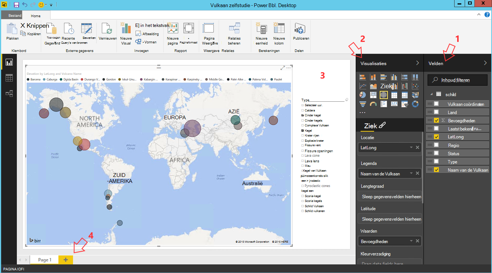

<properties
    pageTitle="Tien dingen die u op de wetenschap gegevens virtuele Machine doen kunt | Microsoft Azure"
    description="Verschillende gegevens te verkennen en modellering taak uitvoeren op gegevens science virtuele Machine."
    services="machine-learning"
    documentationCenter=""
    authors="bradsev"
    manager="jhubbard"
    editor="cgronlun"  />

<tags
    ms.service="machine-learning"
    ms.workload="data-services"
    ms.tgt_pltfrm="na"
    ms.devlang="na"
    ms.topic="article"
    ms.date="08/29/2016"
    ms.author="gokuma;weig;bradsev" />

# <a name="ten-things-you-can-do-on-the-data-science-virtual-machine"></a>Tien dingen die u kunt doen op de wetenschap gegevens virtuele Machine

Microsoft Data Science Virtual Machine (DSVM) is een krachtige data science ontwikkelomgeving waarmee u verschillende gegevens te verkennen en modellering taken uit te voeren. De omgeving is al gebouwd en geleverd met verschillende populaire data analytics hulpprogramma's waarmee u snel aan de slag met uw analyse voor On-premises Cloud of hybride implementaties. De DSVM werkt nauw samen met veel Azure services en kunnen lezen en verwerken van gegevens die al zijn opgeslagen op Azure, Azure SQL Data Warehouse, Azure gegevens Lake, Azure opslag of DocumentDB is. Het kan ook gebruikmaken van andere analytische hulpmiddelen zoals Azure Machine Learning en Azure Data Factory.


In dit artikel bekijken we u hoe u uw DSVM met verschillende data science taken uitvoeren en communiceren met andere Azure diensten. Hier zijn enkele dingen die u op de DSVM doen kunt:

1. Gegevens verkennen en ontwikkelen van modellen die lokaal op de Server Microsoft R, Python met DSVM
2. Een notitieblok Jupyter gebruiken om te experimenteren met uw gegevens op een browser met behulp van Python, 2, 3, Python, Microsoft R een klaar enterprise-versie van R is ontworpen voor schaalbaarheid en prestaties
3. Modellen gebouwd met behulp van R en Python Azure Machine leren zodat toepassingen die toegang heeft tot uw modellen met behulp van een eenvoudige web services-interface mogelijk maken
4. Via Azure portal of Powershell Azure resources beheren
5. De opslagruimte uitbreiden en delen van grote datasets / code in uw hele team door een bestand Azure opslag maken als een koppelbaar station op uw DSVM
6. Code delen met uw team met behulp van Github en toegang tot de bibliotheek met behulp van de vooraf geïnstalleerde Git clients - Git Bash, Git-GUI.
7. Toegang tot verschillende Azure data en analytics services zoals Azure blobopslag Azure gegevens Lake, Azure, HDInsight (Hadoop), DocumentDB, Azure, Azure SQL Data Warehouse & databases
8. Rapporten en dashboard met de Power BI-Desktop met daarop de DSVM bouwen en implementeren op de cloud
9. Dynamisch schalen van uw DSVM aan de projectbehoeften van uw
10. Extra's op de virtuele machine installeren   


>[AZURE.NOTE] Extra kosten wordt voor een groot deel van de extra opslag en analyse van gegevens die in dit artikel toegepast. Raadpleeg de pagina met [Azure prijzen](https://azure.microsoft.com/pricing/) voor meer informatie.


**Vereisten**

- U moet een Azure-abonnement. U kunt zich aanmelden voor een gratis proefperiode [hier](https://azure.microsoft.com/free/).

- Instructies voor het inrichten van een Data Science virtuele Machine op de Azure portal vindt u in het [maken van een virtuele machine](https://portal.azure.com/#create/microsoft-ads.standard-data-science-vmstandard-data-science-vm).

## <a name="1-explore-data-and-develop-models-using-microsoft-r-server-or-python"></a>1. gegevens verkennen en ontwikkelen van modellen met behulp van Microsoft R Server of Python

U kunt talen zoals R en Python doet uw analytics gegevens rechts op de DSVM.

R kunt u een IDE 'Revolutie R Enterprise 8.0' die u in het startmenu of het bureaublad vinden kunt. Microsoft heeft verstrekt aanvullende bibliotheken op de Open source/CRAN-R om schaalbare analytics en de mogelijkheid om groter is dan de geheugengrootte die wordt toegestaan door de parallelle analyse van gesegmenteerde gegevens te analyseren. U kunt ook een IDE R van uw keuze, zoals de [RStudio](https://www.rstudio.com/products/rstudio-desktop/)installeren.

Python kunt u een IDE zoals Visual Studio Community Edition heeft de Python's voor Visual Studio (PTVS) uitbreiding vooraf is geïnstalleerd. Een eenvoudige Python 2.7 wordt standaard geconfigureerd op PTVS (zonder de bibliotheek analytics zoals SciKit, Pandas). U moet inschakelen Anaconda Python 2.7 en 3.5, doet u het volgende:

* Het maken van aangepaste omgevingen voor elke versie door te navigeren naar **Extra** -> **Extra Python** -> **Python omgevingen** en vervolgens te klikken op '**+ aangepaste**' in Visual Studio 2015 Community Edition
* Geef een omschrijving en de omgeving voorvoegsel paden instellen als *c:\anaconda* voor Anaconda Python 2.7 of *c:\anaconda\envs\py35* voor Anaconda Python 3.5
* Klik op **Automatische detectie** en **toepassen** om op te slaan van het milieu.

Hier ziet u hoe de instellingen van de aangepaste omgeving er uitziet in Visual Studio.


Zie de [PTVS documentatie](https://github.com/Microsoft/PTVS/wiki/Selecting-and-Installing-Python-Interpreters#hey-i-already-have-an-interpreter-on-my-machine-but-ptvs-doesnt-seem-to-know-about-it) voor meer informatie over het maken van Python omgevingen.

Nu u een instellen voor het maken van een nieuw project van Python. Navigeer naar het **bestand** -> **Nieuw** -> **Project** -> **Python** en selecteer het type Python-toepassing die u maakt. U kunt de Python omgeving voor het huidige project instellen op de gewenste versie (Anaconda 2.7 of 3,5-inch): klik met de rechtermuisknop op de **omgeving van Python** **Software Python omgevingen**, en selecteer vervolgens selecteert u de gewenste omgeving te koppelen aan het project. U vindt meer informatie over het werken met PTVS op de productpagina [documentatie](https://github.com/Microsoft/PTVS/wiki) .

## <a name="2-using-a-jupyter-notebook-to-explore-and-model-your-data-with-python-or-r"></a>2. met behulp van een laptop Jupyter te verkennen en het model van uw gegevens met Python of R

De Jupyter-laptop is een krachtige omgeving waarmee u een browser gebaseerde "IDE" verkennen en modellering. Kunt u 2 Python, Python 3 of R (Open Source en de Server van Microsoft R) in een laptop met Jupyter.

De laptop Jupyter Klik op het pictogram van het menu start starten / pictogram op het bureaublad met de titel **Jupyter laptop**. Op de DSVM u kunt ook zoeken naar "https://localhost:9999 /" toegang tot de Jupiter-laptop. Als wordt u gevraagd om een wachtwoord, gebruikt u de instructies in de sectie voor ***het maken van een sterk wachtwoord op de server Jupyter laptop*** van het onderwerp van de [voorziening Microsoft Data Science Virtual Machine](machine-learning-data-science-provision-vm.md) voor het maken van een sterk wachtwoord voor toegang tot de Jupyter-laptop. 

Nadat u de laptop hebt geopend, ziet u een map met daarin een paar voorbeeld laptops die voorverpakt in de DSVM zijn. U kunt nu het volgende doen:

- Klik op de laptop voor een overzicht van de code.
- elke cel uitvoeren door op **SHIFT + ENTER**te drukken.
- het hele notitieblok uitvoeren door te klikken op de **cel** -> **uitvoeren**
- een nieuw notitieblok maken door te klikken op het pictogram Jupyter (linker bovenhoek) en vervolgens te klikken op de knop **Nieuw** op de rechterkant en kies de taal van de laptop (ook bekend als kernels).   


>[AZURE.NOTE] Momenteel ondersteunen we Python 2.7, Python 3.5 en R. De R-kernel programmeren in zowel Open source R als de onderneming ondersteunt schaalbare Server van Microsoft R.   


Zodra u het notitieblok dat u kunt verkennen worden uw gegevens, het model bouwen, testen van het model, waarbij de keuze van bibliotheken.


## <a name="3-build-models-using-r-or-python-and-operationalize-them-using-azure-machine-learning"></a>3. bouwen modellen R of Python gebruiken en ze met Azure Machine Learning mogelijk maken

Zodra u hebt ontwikkeld en gevalideerd uw model is de volgende stap meestal te implementeren in productie. Hierdoor kan de client toepassingen aan te roepen van de modelvoorspellingen op een real-time of op basis van batch-modus. Azure Machine Learning biedt een mechanisme voor het mogelijk maken een model gebouwd in R of Python.

Wanneer u uw model in Azure Machine Learning mogelijk maken, is een webservice waarmee clients kunnen de overige bellen die in input parameters doorgeven en ontvangen van voorspellingen van het model als uitgangen blootgesteld.   


>[AZURE.NOTE] Als u nog geen aangemeld voor AzureML, kunt u een gratis werkruimte of een standaard werkruimte door de introductiepagina [AzureML Studio](https://studio.azureml.net/) bezoeken en op "Aan de slag" te klikken.   


### <a name="build-and-operationalize-python-models"></a>Modellen bouwen en Python mogelijk maken

Hier is een fragment van code die is ontwikkeld in een laptop met Python Jupyter die u maakt een eenvoudig model met de bibliotheek voor meer informatie op SciKit.

    #IRIS classification
    from sklearn import datasets
    from sklearn import svm
    clf = svm.SVC()
    iris = datasets.load_iris()
    X, y = iris.data, iris.target
    clf.fit(X, y)

De methode voor het implementeren van de modellen van python op Azure Machine Learning loopt de voorspelling van het model in een functie en het wordt verfraaid met kenmerken die door de vooraf geïnstalleerde Azure Machine Learning python bibliotheek geven uw werkruimte Azure Machine Learning ID, API-sleutel en de invoer en parameters terug.  

    from azureml import services
    @services.publish(workspaceid, auth_token)
    @services.types(sep_l = float, sep_w = float, pet_l=float, pet_w=float)
    @services.returns(int) #0, or 1, or 2
    def predictIris(sep_l, sep_w, pet_l, pet_w):
    inputArray = [sep_l, sep_w, pet_l, pet_w]
    return clf.predict(inputArray)

Een client kan nu bellen naar de webservice. Er zijn gemak wrappers die de REST API-verzoeken samen. Hier volgt een voorbeeldcode voor de webservice in beslag nemen.

    # Consume through web service URL and keys
    from azureml import services
    @services.service(url, api_key)
    @services.types(sep_l = float, sep_w = float, pet_l=float, pet_w=float)
    @services.returns(float)
    def IrisPredictor(sep_l, sep_w, pet_l, pet_w):
    pass

    IrisPredictor(3,2,3,4)


>[AZURE.NOTE] De bibliotheek Azure Machine Learning wordt alleen ondersteund op Python 2.7 momenteel.   


### <a name="build-and-operationalize-r-models"></a>Modellen bouwen en R mogelijk maken

U kunt implementeren R modellen gebouwd op de Data Science virtuele Machine of elders op Azure Machine Learning op een wijze die vergelijkbaar is met hoe het Python wordt uitgevoerd. Haar de volgende stappen uitvoeren:

- Maak een bestand settings.json zoals hieronder om uw werkruimte-ID en auth token.
- Schrijf een wrapper voor het model van de functie voorspellen.
- Bel ```publishWebService``` in de bibliotheek Azure Machine Learning worden doorgegeven in de functie-wrapper.  

Hier is de procedure en de code fragmenten die kunnen worden gebruikt voor het instellen, bouwen, publiceren en een model als een webservice in Azure Machine Learning verbruiken.

#### <a name="setup"></a>Setup

1.  De R AzureML-pakket installeren door te typen ```install.packages("AzureML")``` in de revolutie R Enterprise 8.0 IDE of uw R-IDE.
2.  Download RTools van [hier](https://cran.r-project.org/bin/windows/Rtools/). U moet het zip-programma in het pad (en met de naam zip.exe) mogelijk maken van het pakket R in AzureML.
3.  Maak een settings.json bestand in een map met de naam ```.azureml``` onder de basismap en geeft u de parameters van uw werkruimte Azure ML:

Settings.JSON bestandsstructuur:

    {"workspace":{
    "id"                  : "ENTER YOUR AZUREML WORKSPACE ID",
    "authorization_token" : "ENTER YOUR AZUREML AUTH TOKEN"
    }}


#### <a name="build-a-model-in-r-and-publish-it-in-azure-ml"></a>Bouwen van een model in R en publiceren in Azure ML

    library(AzureML)
    ws <- workspace(config="~/.azureml/settings.json")

    if(!require("lme4")) install.packages("lme4")
    library(lme4)
    set.seed(1)
    train <- sleepstudy[sample(nrow(sleepstudy), 120),]
    m <- lm(Reaction ~ Days + Subject, data = train)

    # Define a prediction function to publish based on the model:
    sleepyPredict <- function(newdata){
        predict(m, newdata=newdata)
    }

    ep <- publishWebService(ws, fun = sleepyPredict, name="sleepy lm", inputSchema = sleepstudy, data.frame=TRUE)

#### <a name="consume-the-model-deployed-in-azure-ml"></a>Het model dat is geïmplementeerd in Azure ML verbruiken

Het model van een clienttoepassing in beslag neemt, gebruiken we de Azure Machine Learning bibliotheek opzoeken in de gepubliceerde web-service met behulp van de naam van de `services` API-aanroep om te bepalen van het eindpunt. Vervolgens u alleen roept de `consume` - en werken in het gegevensframe worden voorspeld.
De volgende code wordt gebruikt om het model als een webservice Azure Machine Learning gepubliceerd in beslag nemen.


    library(AzureML)
    library(lme4)
    ws <- workspace(config="~/.azureml/settings.json")

    s <-  services(ws, name = "sleepy lm")
    s <- tail(s, 1) # use the last published function, in case of duplicate function names

    ep <- endpoints(ws, s)

    # OK, try this out, and compare with raw data
    ans = consume(ep, sleepstudy)$ans

Meer informatie over de bibliotheek Azure Machine Learning R vindt u [hier](https://cran.r-project.org/web/packages/AzureML/AzureML.pdf).


## <a name="4-administer-your-azure-resources-using-azure-portal-or-powershell"></a>4. uw Azure resources via Azure portal of Powershell beheren

De DSVM niet alleen kunt u uw analytics oplossing lokaal maken op de virtuele machine maar ook hebt u toegang tot services op Microsoft Azure cloud. Azure biedt verschillende compute, storage, analytics-gegevens en andere services die u kunt beheren en openen van uw DSVM.

U kunt uw browser gebruiken en wijs de [Azure portal](https://portal.azure.com)voor het beheren van uw Azure abonnement en cloud resources. U kunt ook Azure Powershell gebruiken voor het beheren van uw abonnement Azure en bronnen via een script.
Azure Powershell kunt u uitvoeren via een snelkoppeling op het bureaublad of via het startmenu met de titel 'Microsoft Azure Powershell'. Raadpleeg [de documentatie bij Microsoft Azure Powershell](../powershell-azure-resource-manager.md) voor meer informatie over hoe u uw abonnement op Azure en bronnen met behulp van Windows Powershell-scripts kunt beheren.


## <a name="5-extend-your-storage-space-with-a-shared-file-system"></a>5. de opslagruimte uitbreiden met een gedeelde bestandssysteem uitbreiden

Wetenschappers van de gegevens kunnen delen grote gegevenssets, code of andere bronnen binnen het team. De DSVM zelf is 70GB ruimte beschikbaar. Om uit te breiden uw opslag, kunt u het bestand Azure Service en dit hetzij op de DSVM koppelen krijgen via een API van de REST.   


>[AZURE.NOTE] De maximale ruimte van de share Azure File Service 5TB en maximale individuele bestandsgrootte is 1TB.   


Azure Powershell kunt u een share Azure File Service maken. Hier is het script uit te voeren onder Azure PowerShell een Azure bestandsshare-service maken.

    # Authenticate to Azure.
    Login-AzureRmAccount
    # Select your subscription
    Get-AzureRmSubscription –SubscriptionName "<your subscription name>" | Select-AzureRmSubscription
    # Create a new resource group.
    New-AzureRmResourceGroup -Name <dsvmdatarg>
    # Create a new storage account. You can reuse existing storage account if you wish.
    New-AzureRmStorageAccount -Name <mydatadisk> -ResourceGroupName <dsvmdatarg> -Location "<Azure Data Center Name For eg. South Central US>" -Type "Standard_LRS"
    # Set your current working storage account
    Set-AzureRmCurrentStorageAccount –ResourceGroupName "<dsvmdatarg>" –StorageAccountName <mydatadisk>

    # Create a Azure File Service Share
    $s = New-AzureStorageShare <<teamsharename>>
    # Create a directory under the FIle share. You can give it any name
    New-AzureStorageDirectory -Share $s -Path <directory name>
    # List the share to confirm that everything worked
    Get-AzureStorageFile -Share $s


Nu dat u een bestandsshare Azure hebt gemaakt, kunt u deze koppelen in een virtuele machine in Azure. Het is raadzaam dat de VM in dezelfde Azure datacenter met latentie en data transfer kosten als de opslag is. Hier ziet u de opdrachten voor het koppelen van het station op de DSVM die u op Azure Powershell uitvoeren kunt.


    # Get storage key of the storage account that has the Azure file share from Azure portal. Store it securely on the VM to avoid prompted in next command.
    cmdkey /add:<<mydatadisk>>.file.core.windows.net /user:<<mydatadisk>> /pass:<storage key>

    # Mount the Azure file share as Z: drive on the VM. You can chose another drive letter if you wish
    net use z:  \\<mydatadisk>.file.core.windows.net\<<teamsharename>>


U kunt dit station nu openen als een normale station op de VM.

## <a name="6-share-code-with-your-team-using-github"></a>6. code delen met uw team met behulp van Github

Github is een code repository vindt u een groot aantal voorbeelden van code en bronnen voor verschillende functies met behulp van verschillende technologieën die worden gedeeld door de Gemeenschap van ontwikkelaars. Wordt gebruikt Git de technologie voor het bijhouden en opslaan van versies van de codebestanden. Github is ook een platform waar u uw eigen bibliotheek opslaan van de gedeelde code en documentatie van uw team, versiebeheer implementeren en ook bepalen die toegang hebben tot het bekijken en bijdragen code kunt maken. Ga naar de [Github help-pagina's](https://help.github.com/) voor meer informatie over het gebruik van Git. U kunt de Github als een van de manieren om samen te werken met uw team, gebruikt u code die is ontwikkeld door de Gemeenschap en code terug naar de Gemeenschap bijdragen.

De DSVM al wordt geleverd met clientprogramma's geladen op beide opdrachtregel en GUI voor toegang tot de opslagplaats van Github. Het opdrachtregelprogramma voor het werken met Git en Github heet Git Bash. Visual Studio is geïnstalleerd op de DSVM heeft de Git extensies. Voor deze hulpprogramma's in het startmenu en het bureaublad kunt u pictogrammen startfase vinden.

Downloaden van code van een Github opslagplaats die u wilt gebruiken de ```git clone``` opdracht. Zo wetenschap gegevensopslagplaats gepubliceerd door Microsoft in de huidige map downloaden kunt u de volgende opdracht uitvoeren zodra u ```git-bash```.

    git clone https://github.com/Azure/Azure-MachineLearning-DataScience.git

U kunt in Visual Studio de kopieerbewerking hetzelfde doen. De-schermafdruk hieronder laat zien hoe Git en Github hulpprogramma's in Visual Studio openen.


U vindt meer informatie over het gebruik van Git werken met de opslagplaats Github uit verschillende bronnen die beschikbaar zijn op github.com. Het [blad cheats](https://training.github.com/kit/downloads/github-git-cheat-sheet.pdf) is een nuttige verwijzing.


## <a name="7-access-various-azure-data-and-analytics-services"></a>7. toegang tot verschillende Azure data en analytics services

### <a name="azure-blob"></a>Azure Blob

Azure blob is een betrouwbare, voordelige cloud opslag voor groot en klein. Laten we bekijken hoe u gegevens naar Azure Blob en toegang tot gegevens die zijn opgeslagen in een Azure Blob verplaatsen kunt.

**Vereiste**

- **Uw account Azure Blob-opslag van [Azure portal](https://portal.azure.com)maken.**


- Bevestigen dat u de vooraf geïnstalleerde AzCopy opdrachtregelprogramma gebruiken vinden op ```C:\Program Files (x86)\Microsoft SDKs\Azure\AzCopy\azcopy.exe```. U kunt de map met de azcopy.exe aan de omgevingsvariabele PATH om te voorkomen dat het volledige pad typen wanneer u dit hulpprogramma toevoegen. Raadpleeg voor meer informatie over het hulpprogramma AzCopy [AzCopy documentatie](../storage/storage-use-azcopy.md)

- Start het hulpprogramma Opslagverkenner Azure. Het kan worden gedownload van [Microsoft Azure Opslagverkenner](http://storageexplorer.com/). 


**Gegevens verplaatsen van VM naar Azure Blob: AzCopy**

Als gegevens wilt verplaatsen tussen uw lokale bestanden en blob-opslag, kunt u AzCopy in PowerShell of de opdrachtregel:

    AzCopy /Source:C:\myfolder /Dest:https://<mystorageaccount>.blob.core.windows.net/<mycontainer> /DestKey:<storage account key> /Pattern:abc.txt

**C:\myfolder** op het pad waarin het bestand is opgeslagen, **mystorageaccount** om uw accountnaam blob storage, **mycontainer** op de containernaam, de toegangstoets blob storage **opslag account sleutel** te vervangen. De referenties van uw opslag kunt u vinden in [Azure portal](https://portal.azure.com).


AzCopy-opdracht uitvoeren vanaf een opdrachtprompt of in PowerShell. Hier ziet u enkele voorbeeld gebruik van de opdracht AzCopy:


    # Copy *.sql from local machine to a Azure Blob
    "C:\Program Files (x86)\Microsoft SDKs\Azure\AzCopy\azcopy" /Source:"c:\Aaqs\Data Science Scripts" /Dest:https://[ENTER STORAGE ACCOUNT].blob.core.windows.net/[ENTER CONTAINER] /DestKey:[ENTER STORAGE KEY] /S /Pattern:*.sql

    # Copy back all files from Azure Blob container to Local machine

    "C:\Program Files (x86)\Microsoft SDKs\Azure\AzCopy\azcopy" /Dest:"c:\Aaqs\Data Science Scripts\temp" /Source:https://[ENTER STORAGE ACCOUNT].blob.core.windows.net/[ENTER CONTAINER] /SourceKey:[ENTER STORAGE KEY] /S


Nadat de opdracht AzCopy te kopiëren naar een Azure blob ziet u uw bestand wordt in Opslagverkenner Azure binnenkort.


**Gegevens verplaatsen van VM naar Azure Blob: Azure Opslagverkenner**

U kunt ook gegevens uit een lokaal bestand in uw VM met Azure Opslagverkenner uploaden:

- Uploaden van gegevens naar een container, de doelcontainer selecteren en klik op de knop **uploaden** .
- Klik op de **...** rechts van **het vak** , selecteert u een of meerdere bestanden voor het uploaden van het bestandssysteem en klik op **uploaden** om te beginnen met het uploaden van de bestanden.


**Gegevens lezen van Azure Blob: AML reader module**

In Azure Machine Learning Studio kunt u een **module gegevens importeren** gebruiken om gegevens te lezen uit de blob.


**Gegevens lezen van Azure Blob: Python ODBC**

**BlobService** -bibliotheek kunt u gegevens rechtstreeks uit de blob in een Jupyter laptop of Python lezen.

Eerste vereiste pakketten importeren:

    import pandas as pd
    from pandas import Series, DataFrame
    import numpy as np
    import matplotlib.pyplot as plt
    from time import time
    import pyodbc
    import os
    from azure.storage.blob import BlobService
    import tables
    import time
    import zipfile
    import random

Vervolgens sluit u de accountreferenties Azure Blob en gegevens lezen van de Blob:

    CONTAINERNAME = 'xxx'
    STORAGEACCOUNTNAME = 'xxxx'
    STORAGEACCOUNTKEY = 'xxxxxxxxxxxxxxxx'
    BLOBNAME = 'nyctaxidataset/nyctaxitrip/trip_data_1.csv'
    localfilename = 'trip_data_1.csv'
    LOCALDIRECTORY = os.getcwd()
    LOCALFILE =  os.path.join(LOCALDIRECTORY, localfilename)

    #download from blob
    t1 = time.time()
    blob_service = BlobService(account_name=STORAGEACCOUNTNAME,account_key=STORAGEACCOUNTKEY)
    blob_service.get_blob_to_path(CONTAINERNAME,BLOBNAME,LOCALFILE)
    t2 = time.time()
    print(("It takes %s seconds to download "+BLOBNAME) % (t2 - t1))

    #unzipping downloaded files if needed
    #with zipfile.ZipFile(ZIPPEDLOCALFILE, "r") as z:
    #    z.extractall(LOCALDIRECTORY)

    df1 = pd.read_csv(LOCALFILE, header=0)
    df1.columns = ['medallion','hack_license','vendor_id','rate_code','store_and_fwd_flag','pickup_datetime','dropoff_datetime','passenger_count','trip_time_in_secs','trip_distance','pickup_longitude','pickup_latitude','dropoff_longitude','dropoff_latitude']
    print 'the size of the data is: %d rows and  %d columns' % df1.shape

De gegevens worden gelezen als een gegevensframe:


### <a name="azure-data-lake"></a>Azure gegevens Lake

Azure gegevensopslag Lake is een hyperscale '-opslagplaats voor big data analytics werkbelasting en compatibel met Hadoop Distributed bestand System (HDFS). Het werkt met het Hadoop-ecosysteem en de Azure gegevens Lake Analytics. We zien hoe u gegevens verplaatsen naar de Azure Lake gegevensopslag en uitvoeren met behulp van Azure gegevens Lake Analytics analytics.

**Vereiste**

- Maak uw Analytics Azure gegevens Lake in [Azure portal](https://portal.azure.com).


- De **Azure gegevens meer hulpprogramma's** in **Visual Studio** vindt u op deze [koppeling](https://www.microsoft.com/download/details.aspx?id=49504) is al op Visual Studio Community Edition op de virtuele machine geïnstalleerd. Na het starten van Visual Studio en registratie van uw abonnement op Azure, ziet u uw Azure Data Analytics-account en de opslag in het linkerpaneel van Visual Studio.


**Gegevens verplaatsen van VM naar gegevens Lake: Azure Data Lake Explorer**

**Azure Data Lake Explorer** kunt u gegevens uit de lokale bestanden op de virtuele Machine naar Lake gegevens opslag uploaden.


U kunt ook een pijplijn gegevens uw gegevens verplaatsen of naar Azure gegevens Lake productionize maken met behulp van de [Azure gegevens Factory(ADF)](https://azure.microsoft.com/services/data-factory/). Wij verwijzen u naar dit [artikel](https://azure.microsoft.com/blog/creating-big-data-pipelines-using-azure-data-lake-and-azure-data-factory/) u kunnen helpen bij het samenstellen van de gegevens pijpleidingen.

**Gegevens lezen van Azure Blob voor meer gegevens: U SQL**

Als uw gegevens bevinden zich in Azure Blob-opslag, kunt u rechtstreeks gegevens lezen uit opslag Azure blob in U SQL-query. Controleer voordat U SQL query opstellen, of dat uw blob storage-account is gekoppeld aan uw gegevens Azure Lake. Ga naar **Azure portal**, uw Azure gegevens Lake Analytics dashboard, klik op **Gegevensbron toevoegen**, selecteer opslagtype naar **Azure opslag** en sluit u uw accountnaam voor Azure opslag en sleutel. Vervolgens kun je verwijzen naar gegevens die zijn opgeslagen in de opslag.


In Visual Studio kunt u gegevens lezen van blob-opslag, gegevens manipuleren doen, technische functie en de resulterende gegevens uitvoeren naar Azure gegevens Lake of Azure Blob-opslag. Als u verwijst naar de gegevens in de blob-opslag, **wasb: / /**; Als u verwijst naar de gegevens in Azure gegevens Lake, **swbhdfs: / /**


U kunt de volgende U SQL-query's in Visual Studio:

    @a =
        EXTRACT medallion string,
                hack_license string,
                vendor_id string,
                rate_code string,
                store_and_fwd_flag string,
                pickup_datetime string,
                dropoff_datetime string,
                passenger_count int,
                trip_time_in_secs double,
                trip_distance double,
                pickup_longitude string,
                pickup_latitude string,
                dropoff_longitude string,
                dropoff_latitude string

        FROM "wasb://<Container name>@<Azure Blob Storage Account Name>.blob.core.windows.net/<Input Data File Name>"
        USING Extractors.Csv();

    @b =
        SELECT vendor_id,
        COUNT(medallion) AS cnt_medallion,
        SUM(passenger_count) AS cnt_passenger,
        AVG(trip_distance) AS avg_trip_dist,
        MIN(trip_distance) AS min_trip_dist,
        MAX(trip_distance) AS max_trip_dist,
        AVG(trip_time_in_secs) AS avg_trip_time
        FROM @a
        GROUP BY vendor_id;

    OUTPUT @b   
    TO "swebhdfs://<Azure Data Lake Storage Account Name>.azuredatalakestore.net/<Folder Name>/<Output Data File Name>"
    USING Outputters.Csv();

    OUTPUT @b   
    TO "wasb://<Container name>@<Azure Blob Storage Account Name>.blob.core.windows.net/<Output Data File Name>"
    USING Outputters.Csv();


Nadat de query naar de server is verzonden, wordt is een diagram waarin de status van de taak weergegeven.


**Gegevens in Lake gegevens opvragen: U SQL**

Nadat de dataset wordt geconsumeerd in Azure gegevens Lake, kunt [U SQL-taal](../data-lake-analytics/data-lake-analytics-u-sql-get-started.md) op te vragen en de gegevens verkennen. U SQL-taal is vergelijkbaar met T-SQL, maar sommige functies van C# combineert, zodat gebruikers aangepaste modules, de gebruiker gedefinieerde functies en enz schrijven kunnen. U kunt de scripts in de vorige stap.

Nadat de query wordt verzonden naar de server, tripdata_summary. CSV vindt u binnenkort in **Azure Data Lake Explorer**, u kan een voorbeeld de gegevens door met de rechtermuisknop op het bestand.


Voor een overzicht van de gegevens:


### <a name="hdinsight-hadoop-clusters"></a>HDInsight Hadoop-Clusters

Azure HDInsight is een beheerde service voor Apache Hadoop, Spark, HBase en Storm van de wolk. U kunt gemakkelijk werken met Azure HDInsight clusters van de virtuele machine voor data science.

**Vereiste**

- Uw account Azure Blob-opslag van [Azure portal](https://portal.azure.com)maken. Deze opslag rekening wordt gebruikt voor het opslaan van gegevens voor HDInsight-clusters.


- Azure HDInsight Hadoop Clusters van [Azure portal](machine-learning-data-science-customize-hadoop-cluster.md) aanpassen

  - De opslag-account gemaakt met het cluster HDInsight wanneer deze wordt gemaakt, moet u koppelen. Deze opslag rekening wordt gebruikt voor toegang tot gegevens die binnen het cluster kan worden verwerkt.


  - Aan het hoofd knooppunt van het cluster moet u **Externe toegang** inschakelen nadat deze is gemaakt. Vergeet niet de RAS-referenties die u hier opgeeft (anders dan die voor het cluster op het werd gemaakt): moet u ze hieronder.


  - Maak een werkruimte Azure ML. Uw Machine Learning experimenten worden opgeslagen in deze werkruimte ML. De gemarkeerde opties selecteren in de Portal zoals in de screenshot hieronder.


  - Voer vervolgens de parameters voor uw werkruimte Azure ML


  - Uploaden van gegevens met behulp van IPython-laptop. Eerste vereiste importpakketten, sluit u referenties, een database maken in uw account voor de opslag en laden van gegevens naar HDI clusters.


        #Import required Packages
        import pyodbc
        import time as time
        import json
        import os
        import urllib
        import urllib2
        import warnings
        import re
        import pandas as pd
        import matplotlib.pyplot as plt
        from azure.storage.blob import BlobService
        warnings.filterwarnings("ignore", category=UserWarning, module='urllib2')


        #Create the connection to Hive using ODBC
        SERVER_NAME='xxx.azurehdinsight.net'
        DATABASE_NAME='nyctaxidb'
        USERID='xxx'
        PASSWORD='xxxx'
        DB_DRIVER='Microsoft Hive ODBC Driver'
        driver = 'DRIVER={' + DB_DRIVER + '}'
        server = 'Host=' + SERVER_NAME + ';Port=443'
        database = 'Schema=' + DATABASE_NAME
        hiveserv = 'HiveServerType=2'
        auth = 'AuthMech=6'
        uid = 'UID=' + USERID
        pwd = 'PWD=' + PASSWORD
        CONNECTION_STRING = ';'.join([driver,server,database,hiveserv,auth,uid,pwd])
        connection = pyodbc.connect(CONNECTION_STRING, autocommit=True)
        cursor=connection.cursor()


        #Create Hive database and tables
        queryString = "create database if not exists nyctaxidb;"
        cursor.execute(queryString)

        queryString = """
                        create external table if not exists nyctaxidb.trip
                        (
                            medallion string,
                            hack_license string,
                            vendor_id string,
                            rate_code string,
                            store_and_fwd_flag string,
                            pickup_datetime string,
                            dropoff_datetime string,
                            passenger_count int,
                            trip_time_in_secs double,
                            trip_distance double,
                            pickup_longitude double,
                            pickup_latitude double,
                            dropoff_longitude double,
                            dropoff_latitude double)  
                        PARTITIONED BY (month int)
                        ROW FORMAT DELIMITED FIELDS TERMINATED BY ',' lines terminated by '\\n'
                        STORED AS TEXTFILE LOCATION 'wasb:///nyctaxidbdata/trip' TBLPROPERTIES('skip.header.line.count'='1');
                    """
        cursor.execute(queryString)

        queryString = """
                        create external table if not exists nyctaxidb.fare
                        (
                            medallion string,
                            hack_license string,
                            vendor_id string,
                            pickup_datetime string,
                            payment_type string,
                            fare_amount double,
                            surcharge double,
                            mta_tax double,
                            tip_amount double,
                            tolls_amount double,
                            total_amount double)
                        PARTITIONED BY (month int)
                        ROW FORMAT DELIMITED FIELDS TERMINATED BY ',' lines terminated by '\\n'
                        STORED AS TEXTFILE LOCATION 'wasb:///nyctaxidbdata/fare' TBLPROPERTIES('skip.header.line.count'='1');
                    """
        cursor.execute(queryString)


        #Upload data from blob storage to HDI cluster
        for i in range(1,13):
            queryString = "LOAD DATA INPATH 'wasb:///nyctaxitripraw2/trip_data_%d.csv' INTO TABLE nyctaxidb2.trip PARTITION (month=%d);"%(i,i)
            cursor.execute(queryString)
            queryString = "LOAD DATA INPATH 'wasb:///nyctaxifareraw2/trip_fare_%d.csv' INTO TABLE nyctaxidb2.fare PARTITION (month=%d);"%(i,i)  
            cursor.execute(queryString)


- Ook kunt u in dit [scenario](machine-learning-data-science-process-hive-walkthrough.md) RDAM Taxi gegevens uploaden naar HDI cluster volgen. Er zijn belangrijke stappen:

    - AzCopy: ingepakte CSV van openbare blob downloaden naar uw lokale map
    - AzCopy: uploaden uitgepakt CSV van uit een lokale map met HDI cluster
    - Log in op het hoofd knooppunt van het cluster Hadoop en analyse van experimentele gegevens voorbereiden

Nadat de gegevens zijn geladen met HDI cluster, kunt u uw gegevens in Azure Opslagverkenner kunt controleren. En u hebt een nyctaxidb database is gemaakt in een cluster HDI.


**Verkennen: component query's in Python**

Omdat de gegevens zich in Hadoop cluster, kunt u het pakket pyodbc verbinding maken met Clusters van Hadoop en query database component exploratie en technische functie te gebruiken. Hier ziet u de bestaande tabellen die in de vereiste stap is gemaakt.

    queryString = """
        show tables in nyctaxidb2;
        """
    pd.read_sql(queryString,connection)


Bekijk het aantal records in elke maand en de frequentie van de fooien of niet in de tabel van de reis:

    queryString = """
        select month, count(*) from nyctaxidb.trip group by month;
        """
    results = pd.read_sql(queryString,connection)

    %matplotlib inline

    results.columns = ['month', 'trip_count']
    df = results.copy()
    df.index = df['month']
    df['trip_count'].plot(kind='bar')


    queryString = """
        SELECT tipped, COUNT(*) AS tip_freq
        FROM
        (
            SELECT if(tip_amount > 0, 1, 0) as tipped, tip_amount
            FROM nyctaxidb.fare
        )tc
        GROUP BY tipped;
        """
    results = pd.read_sql(queryString,connection)

    results.columns = ['tipped', 'trip_count']
    df = results.copy()
    df.index = df['tipped']
    df['trip_count'].plot(kind='bar')


We kunnen ook berekent de afstand tussen de ophaallocatie en locatie van de dropoff en vergelijk deze met de afstand van de reis.

    queryString = """
                    select pickup_longitude, pickup_latitude, dropoff_longitude, dropoff_latitude, trip_distance, trip_time_in_secs,
                        3959*2*2*atan((1-sqrt(1-pow(sin((dropoff_latitude-pickup_latitude)
                        *radians(180)/180/2),2)-cos(pickup_latitude*radians(180)/180)
                        *cos(dropoff_latitude*radians(180)/180)*pow(sin((dropoff_longitude-pickup_longitude)*radians(180)/180/2),2)))
                        /sqrt(pow(sin((dropoff_latitude-pickup_latitude)*radians(180)/180/2),2)
                        +cos(pickup_latitude*radians(180)/180)*cos(dropoff_latitude*radians(180)/180)*
                        pow(sin((dropoff_longitude-pickup_longitude)*radians(180)/180/2),2))) as direct_distance
                        from nyctaxidb.trip
                        where month=1
                            and pickup_longitude between -90 and -30
                            and pickup_latitude between 30 and 90
                            and dropoff_longitude between -90 and -30
                            and dropoff_latitude between 30 and 90;
                """
    results = pd.read_sql(queryString,connection)
    results.head(5)


    results.columns = ['pickup_longitude', 'pickup_latitude', 'dropoff_longitude',
                       'dropoff_latitude', 'trip_distance', 'trip_time_in_secs', 'direct_distance']
    df = results.loc[results['trip_distance']<=100] #remove outliers
    df = df.loc[df['direct_distance']<=100] #remove outliers
    plt.scatter(df['direct_distance'], df['trip_distance'])


Nu gaan we een gedownsampled (% 1) set gegevens voorbereiden voor modellering. Deze gegevens gebruiken we de AML reader module.


        queryString = """
        create  table if not exists nyctaxi_downsampled_dataset_testNEW (
        medallion string,
        hack_license string,
        vendor_id string,
        rate_code string,
        store_and_fwd_flag string,
        pickup_datetime string,
        dropoff_datetime string,
        pickup_hour string,
        pickup_week string,
        weekday string,
        passenger_count int,
        trip_time_in_secs double,
        trip_distance double,
        pickup_longitude double,
        pickup_latitude double,
        dropoff_longitude double,
        dropoff_latitude double,
        direct_distance double,
        payment_type string,
        fare_amount double,
        surcharge double,
        mta_tax double,
        tip_amount double,
        tolls_amount double,
        total_amount double,
        tipped string,
        tip_class string
        )
        row format delimited fields terminated by ','
        lines terminated by '\\n'
        stored as textfile;
        """
        cursor.execute(queryString)

        --- now insert contents of the join into the above internal table

        queryString = """
        insert overwrite table nyctaxi_downsampled_dataset_testNEW
        select
        t.medallion,
        t.hack_license,
        t.vendor_id,
        t.rate_code,
        t.store_and_fwd_flag,
        t.pickup_datetime,
        t.dropoff_datetime,
        hour(t.pickup_datetime) as pickup_hour,
        weekofyear(t.pickup_datetime) as pickup_week,
        from_unixtime(unix_timestamp(t.pickup_datetime, 'yyyy-MM-dd HH:mm:ss'),'u') as weekday,
        t.passenger_count,
        t.trip_time_in_secs,
        t.trip_distance,
        t.pickup_longitude,
        t.pickup_latitude,
        t.dropoff_longitude,
        t.dropoff_latitude,
        t.direct_distance,
        f.payment_type,
        f.fare_amount,
        f.surcharge,
        f.mta_tax,
        f.tip_amount,
        f.tolls_amount,
        f.total_amount,
        if(tip_amount>0,1,0) as tipped,
        if(tip_amount=0,0,
        if(tip_amount>0 and tip_amount<=5,1,
        if(tip_amount>5 and tip_amount<=10,2,
        if(tip_amount>10 and tip_amount<=20,3,4)))) as tip_class
        from
        (
        select
        medallion,
        hack_license,
        vendor_id,
        rate_code,
        store_and_fwd_flag,
        pickup_datetime,
        dropoff_datetime,
        passenger_count,
        trip_time_in_secs,
        trip_distance,
        pickup_longitude,
        pickup_latitude,
        dropoff_longitude,
        dropoff_latitude,
        3959*2*2*atan((1-sqrt(1-pow(sin((dropoff_latitude-pickup_latitude)
        radians(180)/180/2),2)-cos(pickup_latitude*radians(180)/180)
        *cos(dropoff_latitude*radians(180)/180)*pow(sin((dropoff_longitude-pickup_longitude)*radians(180)/180/2),2)))
        /sqrt(pow(sin((dropoff_latitude-pickup_latitude)*radians(180)/180/2),2)
        +cos(pickup_latitude*radians(180)/180)*cos(dropoff_latitude*radians(180)/180)*pow(sin((dropoff_longitude-pickup_longitude)*radians(180)/180/2),2))) as direct_distance,
        rand() as sample_key

        from trip
        where pickup_latitude between 30 and 90
            and pickup_longitude between -90 and -30
            and dropoff_latitude between 30 and 90
            and dropoff_longitude between -90 and -30
        )t
        join
        (
        select
        medallion,
        hack_license,
        vendor_id,
        pickup_datetime,
        payment_type,
        fare_amount,
        surcharge,
        mta_tax,
        tip_amount,
        tolls_amount,
        total_amount
        from fare
        )f
        on t.medallion=f.medallion and t.hack_license=f.hack_license and t.pickup_datetime=f.pickup_datetime
        where t.sample_key<=0.01
        """
        cursor.execute(queryString)

Na een tijdje ziet u dat de gegevens in clusters van Hadoop is geladen:

    queryString = """
        select * from nyctaxi_downsampled_dataset limit 10;
        """
    cursor.execute(queryString)
    pd.read_sql(queryString,connection)


**Gegevens lezen van HDI met AML: reader-module**

U kunt ook de **reader** -module in de machinetaal AML studio toegang tot de database in het Hadoop-cluster. De referenties van de HDI clusters en Azure opslag Account sluit, en is het mogelijk om machine learning modellen met database in HDI clusters te maken.


De dataset scored kan vervolgens worden weergegeven:


### <a name="azure-sql-data-warehouse--databases"></a>Azure SQL Data Warehouse & databases

Een datawarehouse elastische is Azure SQL Data Warehouse als service beleving in SQL Server enterprise-klasse.

U kunt uw Azure SQL Data Warehouse inrichten volgens de instructies in dit [artikel](../sql-data-warehouse/sql-data-warehouse-get-started-provision.md). Zodra u uw Azure SQL Data Warehouse inrichten, kunt u in dit [scenario](machine-learning-data-science-process-sqldw-walkthrough.md) gegevens uploaden, exploratie en modellering met behulp van de gegevens in het SQL-datawarehouse.

#### <a name="azure-documentdb"></a>Azure DocumentDB

Azure DocumentDB is een database NoSQL in de cloud. Deze kunt u werken met documenten, zoals JSON en kunt u voor de opslag en de documenten opvragen.

U moet de volgende stappen per materiaal voor toegang tot DocumentDB van de DSVM.

1. DocumentDB Python SDK installeren (uitvoeren ```pip install pydocumentdb``` vanaf de MS-DOS-prompt)
1. DocumentDB account en DB Document database maken vanuit [Azure portal](https://portal.azure.com)
1. 'DocumentDB-migratieprogramma' downloaden van [hier](http://www.microsoft.com/downloads/details.aspx?FamilyID=cda7703a-2774-4c07-adcc-ad02ddc1a44d) en uitpakken naar een map van uw keuze
1. JSON-gegevens (gegevens Vulkaan) opgeslagen op een [openbare blob](https://cahandson.blob.core.windows.net/samples/volcano.json) in DocumentDB met de opdrachtparameters na het migratieprogramma (dtui.exe uit de map waarin u het migratieprogramma DocumentDB geïnstalleerd) importeren. Voer de bron en doel locatieparameters hieronder.

    /s:JsonFile /s.Files:https://cahandson.blob.core.windows.net/samples/volcano.json /t:DocumentDBBulk /t.ConnectionString:AccountEndpoint=https://[DocDBAccountName].documents.azure.com:443/; AccountKey = [[KEY]; Database = Vulkaan /t.Collection:volcano1

U kunt nadat u de gegevens importeert, gaat u naar Jupyter en open het notitieblok met de titel *DocumentDBSample* met python code om DocumentDB en enkele eenvoudige query's uitvoeren. U kunt weten over DocumentDB via de [documentatiepagina](https://azure.microsoft.com/documentation/learning-paths/documentdb/)


## <a name="8-build-reports-and-dashboard-using-the-power-bi-desktop"></a>8. het bouwen van rapporten en dashboard met de Power BI-Desktop

Laat ons de Vulkaan JSON-bestand die hebt gezien in het bovenstaande voorbeeld DocumentDB in Power BI krijgen visueel inzicht te krijgen in de gegevens visualiseren. Gedetailleerde stappen zijn beschikbaar in het [artikel Power BI](../documentdb/documentdb-powerbi-visualize.md). Het hoogste niveau stappen zijn hieronder:

1. Power BI bureaublad openen en voer 'Gegevens ophalen'. Geef de URL als: https://cahandson.blob.core.windows.net/samples/volcano.json
2. U ziet nu de JSON-records geïmporteerd als een lijst
3. De lijst converteren naar een tabel PowerBI te kunnen werken met dezelfde
4. De kolommen uitvouwen door te klikken op het uitvouwpictogram (de knop met het pictogram "pijl-links en een pijl naar rechts" aan de rechterkant van de kolom)
5. U ziet dat zich in een veld 'Record'. Vouw de record en selecteert u alleen de coördinaten. Coördinaat is een lijstkolom
6. Een nieuwe kolom toevoegen om te converteren coördinaat kolom van de lijst in door komma's gescheiden LatLong kolom samenvoegen van de twee elementen in de coördinaat lijstveld met de formule ```Text.From([coordinates]{1})&","&Text.From([coordinates]{0})```.
7. Vervolgens zet u de ```Elevation``` kolom decimalen en selecteer **sluiten** en **toepassen**.

U kunt de volgende code dat scripts en de bovenstaande stappen in de geavanceerde Editor in PowerBI waarmee u de gegevenstransformaties in een querytaal schrijven plakken in plaats van de bovenstaande stappen.


    let
        Source = Json.Document(Web.Contents("https://cahandson.blob.core.windows.net/samples/volcano.json")),
        #"Converted to Table" = Table.FromList(Source, Splitter.SplitByNothing(), null, null, ExtraValues.Error),
        #"Expanded Column1" = Table.ExpandRecordColumn(#"Converted to Table", "Column1", {"Volcano Name", "Country", "Region", "Location", "Elevation", "Type", "Status", "Last Known Eruption", "id"}, {"Volcano Name", "Country", "Region", "Location", "Elevation", "Type", "Status", "Last Known Eruption", "id"}),
        #"Expanded Location" = Table.ExpandRecordColumn(#"Expanded Column1", "Location", {"coordinates"}, {"coordinates"}),
        #"Added Custom" = Table.AddColumn(#"Expanded Location", "LatLong", each Text.From([coordinates]{1})&","&Text.From([coordinates]{0})),
        #"Changed Type" = Table.TransformColumnTypes(#"Added Custom",{{"Elevation", type number}})
    in
        #"Changed Type"


U hebt nu de gegevens in uw Power BI-gegevensmodel. Power BI bureaublad ziet er als volgt.


U kunt beginnen met het bouwen van rapporten en het gegevensmodel met visualisaties. U kunt de stappen in dit [artikel Power BI](../documentdb/documentdb-powerbi-visualize.md#build-the-reports) om een rapport te maken. Het eindresultaat is een rapport dat ziet er als volgt uit.



## <a name="9-dynamically-scale-your-dsvm-to-meet-your-project-needs"></a>9. dynamisch schalen van uw DSVM aan de projectbehoeften van uw

U kunt schalen en de DSVM om te voldoen aan de projectbehoeften van uw. U hoeft niet de VM gebruiken in de avond of in het weekend, dan kunt u vanuit de [portal voor Azure](https://portal.azure.com)VM alleen afsluiten.

>[AZURE.NOTE]  U zal berekenen kosten in rekening gebracht als u alleen de knop besturingssysteem op de VM.  

Als u een grootschalige analyse te verwerken en meer CPU, geheugen of schijfruimte capaciteit vindt u een grote selectie van de formaten VM CPU cores, geheugencapaciteit en schijftypen (inclusief Solid state harde schijven) die voldoen aan de budgettaire behoeften en rekenkracht nodig. De volledige lijst van VMs en hun uurtarief berekenen prijsstelling is beschikbaar op de pagina [Prijzen van Azure Virtual Machines](https://azure.microsoft.com/pricing/details/virtual-machines/) .

Op dezelfde manier als uw behoefte aan verwerkingscapaciteit VM wordt verkleind (bijvoorbeeld: u hebt een zware werkbelasting verplaatst naar een Hadoop of een cluster Spark), kunt u de schaal door het cluster uit de [Azure portal](https://portal.azure.com) en gaan de instellingen van uw exemplaar van de VM. Hier is een screenshot.


## <a name="10-install-additional-tools-on-your-virtual-machine"></a>10. Extra's op de virtuele machine installeren

We hebben verschillende hulpprogramma's die wij is het mogelijk geloven om veel van de algemene gegevens analytics moet verpakt en dat moet u tijd besparen door te vermijden dat u moet installeren en configureren van uw omgeving een voor een en u geld besparen door betaalt alleen voor de resources die u wilt gebruiken.

U kunt gebruikmaken van andere Azure services data en analytics profiel in dit artikel voor het verbeteren van uw analytics-omgeving. Wij begrijpen dat in sommige gevallen uw behoeften is mogelijk extra hulpmiddelen, met inbegrip van sommige derden eigen hulpprogramma's. U hebt volledige beheerdersbevoegdheden op de virtuele machine te installeren, nieuwe hulpmiddelen die u nodig hebt. U kunt ook extra pakketten installeren in Python en R die niet vooraf zijn geïnstalleerd. Voor Python gebruikt u een ```conda``` of ```pip```. Voor R kunt u de ```install.packages()``` in de R console of gebruik de IDE en kies '**pakketten** -> **Pakketten installeren**".

## <a name="summary"></a>Samenvatting
Dit zijn slechts enkele van de dingen die u op de Microsoft Data Science virtuele Machine kunt doen. Er zijn veel meer u kunt doen om het te maken een doeltreffende analytics omgeving.
