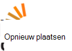

<properties
    pageTitle="Azure Media Services Community-overzicht | Microsoft Azure"
    description="Deze pagina van de Gemeenschap Azure Media Services (AMS) beschreven manieren waarop u kunt ophalen van updates over AMS, Zie nieuwe video's en podcasts, vragen en feedback geven. "
    services="media-services"
    documentationCenter=""
    authors="juliako"
    manager="erikre"
    editor=""/>

<tags
    ms.service="media-services"
    ms.workload="media"
    ms.tgt_pltfrm="na"
    ms.devlang="dotnet"
    ms.topic="article"
    ms.date="09/26/2016"  
    ms.author="juliako"/>

# Azure Media Services-Gemeenschap  

Deze pagina van de Gemeenschap Azure Media Services (AMS) beschreven manieren waarop u kunt updates over AMS downloaden, nieuwe video's en podcasts bekijken, vragen en feedback geven.   

##Video's en Podcasts

Aflevering|Luidspreker|Datum
---|---|---
[Bescherming van uw Media-inhoud met DRM](https://azure.microsoft.com/documentation/videos/azurefridayprotectingyourmediacontentdrm/)|Mingfei Yang|19-02/2016
[Bescherming van uw Media-inhoud met AES-codering](https://azure.microsoft.com/documentation/videos/azure-media-services-protecting-your-media-content-with-aes-encryption/)|Mingfei Yang|19-2/2016
[Azure Media Services Developer diep Kennismaking](https://azure.microsoft.com/documentation/videos/build-2015-azure-media-services-developer-deep-dive/)|Mingfei Yang|27-04/2015
[Azure Media indexeerfunctie Transcripten voor uw media automatisch gemaakt](https://azure.microsoft.com/documentation/videos/azure-media-indexer-autoatically-creates-transcripts-for-your-media-with-adarsh-solanki/)|Adarsh Solanki|07/09/2015
[Microsoft Hyperlapse in Azure mediaservices met Adarsh Solanki](https://azure.microsoft.com/documentation/videos/microsoft-hyperlapse-in-azure-media-services-with-adarsh-solanki/)|Adarsh Solanki|10/07/2015

##Stuur ons uw feedback en suggesties doen

[AZURE.INCLUDE [media-services-user-voice-include](../../includes/media-services-user-voice-include.md)]

##Discussie

###Twitter

Gebruik de [@MSFTAzureMedia](https://twitter.com/MSFTAzureMedia) greep de AMS nieuws en updates op Twitter volgen twitter. U kunt de [@AzureSupport](https://twitter.com/azuresupport) -ingang voor het aanvragen van ondersteuning op Twitter twitter.  
 
### Online forums

De volgende forums kunnen worden gebruikt voor het stellen van vragen over de huidige producten en onderdelen.

MSDN is momenteel de primaire forum AMS.

 

 

## Neem contact op met het team

Azure Media Services primaire e-mailadres is: **mediaservices@microsoft.com**.

De volgende tabel geeft een overzicht van e-mailadres van de functie sub teams:

Functie|E-mail
---|---
Azure Media Analytics|amsanalytics@microsoft.com
Azure MediaPlayer|ampinfo@microsoft.com 
Azure mediabalk van Internet Explorer|amse@microsoft.com
Workflow Designer|mepd@microsoft.com
