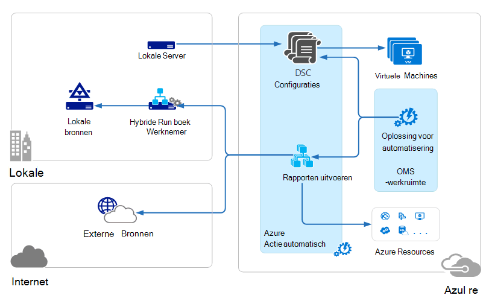

<properties 
   pageTitle="Architectuur van operations Management Suite (OMS) | Microsoft Azure"
   description="Microsoft Operations Management Suite (OMS) is Microsoft van cloud-gebaseerde IT-oplossing waarmee u beheren kunt en beveiligen van uw locatie op en cloud infrastructuur.  In dit artikel worden opgenomen in de OMS verschillende services en koppelingen naar gedetailleerde inhoud."
   services="operations-management-suite"
   documentationCenter=""
   authors="bwren"
   manager="jwhit"
   editor="tysonn" />
<tags 
   ms.service="operations-management-suite"
   ms.devlang="na"
   ms.topic="get-started-article"
   ms.tgt_pltfrm="na"
   ms.workload="infrastructure-services"
   ms.date="10/27/2016"
   ms.author="bwren" />

# OMS-architectuur

[Operations Management Suite (OMS)](https://azure.microsoft.com/documentation/services/operations-management-suite/) is een verzameling van cloud-gebaseerde services voor het beheren van uw locatie op en cloud-omgevingen.  Dit artikel beschrijft de verschillende op gebouwen en cloud onderdelen van OMS en hun hoge niveau cloud computing-architectuur.  U kunt verwijzen naar de documentatie voor elke service voor meer informatie.

## Logboek Analytics

Alle gegevens die zijn verzameld door [Analytics logboek](https://azure.microsoft.com/documentation/services/log-analytics/) wordt opgeslagen in de opslagplaats voor OMS die wordt gehost in Azure.  Verbonden bronnen gegevens worden verzameld in de opslagplaats OMS genereren.  Er zijn drie soorten verbonden bronnen wordt ondersteund.

- Een agent is geïnstalleerd op een [Windows](../log-analytics/log-analytics-windows-agents.md) - of [Linux](../log-analytics/log-analytics-linux-agents.md) -computer rechtstreeks verbonden met OMS.
- Een System Center Operations Manager (SCOM) management groep [verbonden met Analytics logboek](../log-analytics/log-analytics-om-agents.md) .  Agenten SCOM blijven communiceren met servers voor het beheer die gebeurtenissen en de prestatiegegevens naar logboek Analytics doorsturen.
- Een [account Azure opslag](../log-analytics/log-analytics-azure-storage.md) [Azure diagnostische](../cloud-services/cloud-services-dotnet-diagnostics.md) gegevens van een werknemer rol, rol website of virtuele machine in Azure verzamelt.

Gegevensbronnen de gegevens definiëren die logboek Analytics van verbonden bronnen verzamelt, met inbegrip van gebeurtenislogboeken en prestatiemeteritems.  Oplossingen functionaliteit toevoegen aan OMS en gemakkelijk kunnen worden toegevoegd aan de werkruimte vanuit de [Galerie met OMS oplossingen](../log-analytics/log-analytics-add-solutions.md).  Sommige oplossingen kunnen verlangen dat een directe verbinding naar het logboek Analytics SCOM agenten terwijl anderen kunnen eisen dat een extra agent worden geïnstalleerd.

Logboek Analytics is een web-based portal kunt u OMS-bronnen beheren, toevoegen en configureren van OMS oplossingen, en bekijken en analyseren van gegevens in de bibliotheek OMS.

## Azure automatisering

[Azure automatisering runbooks](http://azure.microsoft.com/documentation/services/automation) worden uitgevoerd in de Azure cloud en toegang tot bronnen in Azure, in andere cloud-services of via het openbare Internet toegankelijk zijn.  U kunt ook op de gebouwen, machines opgeven in uw lokale datacenter met [Hybride Runbook werknemer](../automation/automation-hybrid-runbook-worker.md) zodat runbooks toegang lokale bronnen tot.

[DSC-configuraties](../automation/automation-dsc-overview.md) worden opgeslagen in Azure automatisering kan rechtstreeks worden toegepast op Azure virtuele machines.  Andere fysieke en virtuele machines kunnen configuraties van de Azure automatisering DSC pull-server aanvragen.

Azure automatisering heeft een oplossing voor OMS die statistieken en koppelingen voor het starten van de Azure portal voor alle bewerkingen worden weergegeven.

## Azure back-up

Beveiligde gegevens in [Azure back-up](http://azure.microsoft.com/documentation/services/backup) wordt opgeslagen in een back-up kluis die zich in een bepaalde geografische regio.  De gegevens wordt gerepliceerd binnen dezelfde regio en, afhankelijk van het type kluis, kan ook worden gerepliceerd naar een andere regio voor meer redundantie.

Azure back-up heeft drie fundamentele scenario's.

- Windows-computer met Azure Backup agent.  Hierdoor kunt u back-up van bestanden en mappen van Windows server of client rechtstreeks naar uw Azure back-kluis.  
- System Center Data Protection Manager (DPM) of back-upserver Microsoft Azure. Hierdoor kunt u profiteren van DPM of Microsoft Azure back-up Server back-up van bestanden en mappen behalve de werkbelasting van toepassingen zoals SQL en SharePoint naar de lokale opslag en vervolgens gerepliceerd naar de Azure back-kluis.
- Azure Virtual Machine-extensies.  Hiermee kunt u back-up van uw Azure back-kluis voor Azure virtuele machines.

Azure back-up heeft een oplossing voor OMS die statistieken en koppelingen voor het starten van de Azure portal voor alle bewerkingen worden weergegeven.

## Azure-Site herstellen

[Azure-Site-Recovery](http://azure.microsoft.com/documentation/services/site-recovery) orchestrates replicatie, failover en failback van virtuele machines en fysieke servers. Replicatiegegevens worden uitgewisseld tussen de hosts van Hyper-V, VMware, hypervisors en fysieke servers in datacenters van primaire en secundaire of tussen het datacenter en opslag Azure.  Herstel van de site slaat metagegevens op zich in een bepaalde geografische regio Azure kluizen. Geen gerepliceerde gegevens wordt opgeslagen door de Site-Recovery-service.

Azure-Site-Recovery heeft drie fundamentele replicatiescenario's.

**Replicatie van Hyper-V virtuele machines**
- Als Hyper-V virtuele machines in de VMM wolken worden beheerd, kunt u een secundaire Datacenter of Azure opslag repliceren.  Replicatie naar Azure is via een beveiligde internetverbinding.  Replicatie naar een tweede datacenter is via het LAN.
- Als Hyper-V virtuele machines worden niet beheerd door VMM, kunt u naar Azure opslag alleen repliceren.  Replicatie naar Azure is via een beveiligde internetverbinding.
 
**Replicatie van VMWare virtuele machines**
- VMware virtuele machines kunt u een secundaire datacenter met de VMware of Azure opslag repliceren.  Azure-replicatie kan plaatsvinden via een site naar site VPN of Azure ExpressRoute of via een beveiligde internetverbinding. Replicatie naar een tweede datacenter plaatsvindt via het gegevenskanaal InMage Scout.
 
**Replicatie van fysieke servers van Windows en Linux** 
- Een secundaire datacenter of Azure opslag kunt u de fysieke servers repliceren. Azure-replicatie kan plaatsvinden via een site naar site VPN of Azure ExpressRoute of via een beveiligde internetverbinding. Replicatie naar een tweede datacenter plaatsvindt via het gegevenskanaal InMage Scout.  Azure-Site-Recovery is een oplossing voor OMS die bepaalde statistieken, maar u moet de Azure portal gebruiken voor alle bewerkingen.

## Volgende stappen

- Informatie over het [logboek Analytics](http://azure.microsoft.com/documentation/services/log-analytics).
- Informatie over [Azure automatisering](https://azure.microsoft.com/documentation/services/automation).
- Meer informatie over [back-up van Azure](http://azure.microsoft.com/documentation/services/backup).
- Informatie over het [herstellen van Azure-Site](http://azure.microsoft.com/documentation/services/site-recovery).
