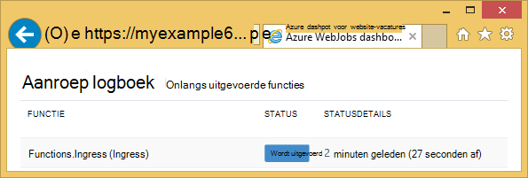

<properties
    pageTitle="Aan de slag met Azure opslag en Visual Studio verbonden services (WebJob projecten)"
    description="Hoe aan de slag met Azure tabel opslag in een Azure-WebJobs-project in Visual Studio nadat services verbinding maken met een opslag-account met behulp van Visual Studio worden verbonden"
    services="storage"
    documentationCenter=""
    authors="TomArcher"
    manager="douge"
    editor=""/>

<tags
    ms.service="storage"
    ms.workload="web"
    ms.tgt_pltfrm="vs-getting-started"
    ms.devlang="na"
    ms.topic="article"
    ms.date="07/18/2016"
    ms.author="tarcher"/>

# Aan de slag met Azure opslag (Azure WebJob projecten)

[AZURE.INCLUDE [storage-try-azure-tools-tables](../../includes/storage-try-azure-tools-tables.md)]

## Overzicht

In dit artikel wordt de C# codevoorbeelden waarin wordt aangegeven hoe de Azure WebJobs SDK versie 1.x met de tabel Azure storage-service. De codevoorbeelden gebruiken de [WebJobs SDK](../app-service-web/websites-dotnet-webjobs-sdk.md) versie 1.x.

De tabel Azure storage-service kunt u grote hoeveelheden gegevens gestructureerd worden opgeslagen. De service is een gegevensarchief NoSQL die geverifieerde oproepen van binnen en buiten de Azure cloud accepteert. Azure tabellen zijn ideaal voor het opslaan van gestructureerde en niet-relationele gegevens.  Zie [aan de slag met Azure tabel opslag met behulp van .NET](storage-dotnet-how-to-use-tables.md#create-a-table) voor meer informatie.

Sommige van de codefragmenten weergeven het kenmerk **tabel** gebruikt voor functies die worden genoemd handmatig, dat wil zeggen, niet door een van de kenmerken van de trigger.

## Entiteiten toevoegen aan een tabel

Als entiteiten aan een tabel toevoegen, kunt u een kenmerk in de **tabel** met een **ICollector<T> ** of **IAsyncCollector<T> ** parameter waar **T** geeft het schema van de entiteiten die u wilt toevoegen. De constructor kenmerk tekenreeksparameter een waarmee de naam van de tabel.

In het volgende voorbeeld wordt entiteiten **persoon** toegevoegd aan een tabel met de naam *Ingress*.

        [NoAutomaticTrigger]
        public static void IngressDemo(
            [Table("Ingress")] ICollector<Person> tableBinding)
        {
            for (int i = 0; i < 100000; i++)
            {
                tableBinding.Add(
                    new Person() {
                        PartitionKey = "Test",
                        RowKey = i.ToString(),
                        Name = "Name" }
                    );
            }
        }

Meestal het type dat u met de **ICollector** is afgeleid van **TableEntity** of **ITableEntity**wordt geïmplementeerd, maar deze niet hoeven te worden. Een van de volgende klassen van de **persoon** werken met de code die wordt weergegeven in de voorgaande **Ingress** methode.

        public class Person : TableEntity
        {
            public string Name { get; set; }
        }

        public class Person
        {
            public string PartitionKey { get; set; }
            public string RowKey { get; set; }
            public string Name { get; set; }
        }

Als u werken rechtstreeks met de Azure opslag API wilt, kunt u een parameter **CloudStorageAccount** toevoegen aan de handtekening van de methode.

## Realtime-controle

Omdat gegevens ingress-functies worden vaak grote hoeveelheden gegevens verwerken, kunt u het dashboard WebJobs SDK real-time bewaking verkregen gegevens. De sectie **Aanroep logboek** kunt u zien als de functie is nog actief.

De pagina **Details van de aanroep** van de functie voortgang (aantal entiteiten geschreven) rapporteert terwijl deze wordt uitgevoerd en hebt u de mogelijkheid om af te breken op deze.

Wanneer de functie is voltooid, meldt de **Aanroep** pagina het aantal rijen is geschreven.

## Het lezen van meerdere entiteiten uit een tabel

Om te lezen in een tabel, gebruikt u een kenmerk in de **tabel** met een **IQueryable<T> ** parameter waar **T** is afgeleid van **TableEntity** of **ITableEntity**wordt geïmplementeerd.

In het volgende voorbeeld leest en alle rijen uit de tabel **Ingress** Logboeken:

        public static void ReadTable(
            [Table("Ingress")] IQueryable<Person> tableBinding,
            TextWriter logger)
        {
            var query = from p in tableBinding select p;
            foreach (Person person in query)
            {
                logger.WriteLine("PK:{0}, RK:{1}, Name:{2}",
                    person.PartitionKey, person.RowKey, person.Name);
            }
        }

### Een enkele entiteit te lezen uit een tabel

Er is een **tabel** kenmerk constructor met twee extra parameters die u u de partitie en rijsleutel opgeven kunt als u wilt binden aan een enkele Tabelentiteit.

In het volgende voorbeeld wordt een rij in een tabel voor de entiteit van een **persoon** op basis van partitie-toets en de rij-sleutelwaarden in een wachtrij bericht ontvangen:  

        public static void ReadTableEntity(
            [QueueTrigger("inputqueue")] Person personInQueue,
            [Table("persontable","{PartitionKey}", "{RowKey}")] Person personInTable,
            TextWriter logger)
        {
            if (personInTable == null)
            {
                logger.WriteLine("Person not found: PK:{0}, RK:{1}",
                        personInQueue.PartitionKey, personInQueue.RowKey);
            }
            else
            {
                logger.WriteLine("Person found: PK:{0}, RK:{1}, Name:{2}",
                        personInTable.PartitionKey, personInTable.RowKey, personInTable.Name);
            }
        }

De klasse **persoon** in dit voorbeeld geen **ITableEntity**implementeren.

## Het gebruik van de API van .NET opslag direct te werken met een tabel

U kunt ook het kenmerk van de **tabel** met een **CloudTable** -object gebruiken voor meer flexibiliteit bij het werken met een tabel.

In het volgende voorbeeld wordt een **CloudTable** -object een enkele entiteit toevoegen aan de tabel *Ingress* .

        public static void UseStorageAPI(
            [Table("Ingress")] CloudTable tableBinding,
            TextWriter logger)
        {
            var person = new Person()
                {
                    PartitionKey = "Test",
                    RowKey = "100",
                    Name = "Name"
                };
            TableOperation insertOperation = TableOperation.Insert(person);
            tableBinding.Execute(insertOperation);
        }

Zie voor meer informatie over het gebruik van het object **CloudTable** [aan de slag met Azure tabel opslag met behulp van .NET](storage-dotnet-how-to-use-tables.md).

## Verwante onderwerpen waarvoor het artikel wachtrijen

Voor informatie over het afhandelen van tabellen verwerken die zijn gegenereerd door een bericht wachtrij of voor de WebJobs SDK's geen specifieke tabel verwerking, Zie [dat aan de slag met Azure Queue storage en Visual Studio verbonden services (WebJob projecten)](vs-storage-webjobs-getting-started-queues.md).

## Volgende stappen

Dit artikel heeft verstrekt codevoorbeelden waarin wordt aangegeven hoe u veelvoorkomende scenario's voor het werken met Azure tabellen verwerken. Zie voor meer informatie over het gebruik van Azure WebJobs en de WebJobs SDK [documentatiebronnen Azure WebJobs](http://go.microsoft.com/fwlink/?linkid=390226).
