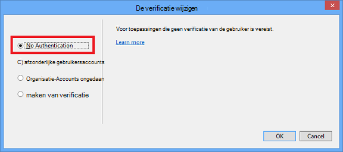

<properties
    pageTitle="Afbeeldingen maken in prijsverlaging"
    description="Wordt uitgelegd hoe u afbeeldingen maken in prijsverlaging volgens de richtlijnen die zijn ingesteld voor de Azure opslagplaatsen."
    services=""
    solutions=""
    documentationCenter=""
    authors="kenhoff"
    manager="ilanas"
    editor="tysonn"/>

<tags
    ms.service="contributor-guide"
    ms.devlang=""
    ms.topic="article"
    ms.tgt_pltfrm=""
    ms.workload=""
    ms.date="06/25/2015"
    ms.author="kenhoff" />

# <a name="create-images-in-markdown"></a>Afbeeldingen maken in prijsverlaging

## <a name="image-folder-creation-and-link-syntax"></a>Image-map maken en koppelen-syntaxis

Voor een nieuw artikel moet u een map te maken op de volgende locatie:

    /articles/<service-directory>/media/<article-name>/

Bijvoorbeeld:

    /articles/app-service/media/app-service-enterprise-multichannel-apps/

Nadat u de map en toegevoegde afbeeldingen maakt, gebruik de volgende syntaxis om images te maken in uw artikel:

```

```
Voorbeeld:

Zie [de prijsverlaging sjabloon](../markdown%20templates/markdown-template-for-new-articles.md) voor een voorbeeld.  De afbeeldingskoppelingen verwijzing in deze sjabloon prijsverlaging zijn ontworpen om te worden onder aan de sjabloon.

## <a name="guidelines-specific-to-azuremicrosoftcom"></a>Richtlijnen voor azure.microsoft.com

Als het niet mogelijk om te reproduceren stappen nemen screenshots momenteel aangemoedigd. Schrijf de inhoud zodat de inhoud zonder de screenshots staan indien nodig.

Gebruik de volgende richtlijnen bij het maken en met inbegrip van art-bestanden:
- Art-bestanden niet delen in documenten. Kopieer het bestand dat u nodig hebt en toe te voegen aan de map media voor uw specifieke onderwerp. Delen tussen bestanden wordt afgeraden omdat het eenvoudig verwijderen inhoud en afbeeldingen blijft de repo schoon afgeschaft.

- Bestandsindelingen: PNG-bestanden - hogere kwaliteit zijn en hun kwaliteit behouden tijdens de lokalisatie. Andere bestandsindelingen doet niet ook hun kwaliteit behouden. De JPEG-indeling is toegestaan, maar niet de voorkeur.  Geen GIF-bestanden.

- Rode vierkantjes van de standaardbreedte geleverd in Paint gebruiken (5 px) aandacht vestigen op bepaalde elementen in de screenshots.  

    Voorbeeld:

    

- Wanneer is het zinvol, gerust afbeeldingen bijsnijden zodat elementen van de gebruikersinterface in volledige grootte wordt weergegeven. Zorg ervoor dat het kader duidelijk, maar.

- Geen spatie op de randen van de screenshots. Als u een schermafbeelding op een manier die een witte achtergrond aan de randen verlaat bijsnijden, Voeg een enkele pixel grijze rand rond de afbeelding.  Als met verf, gebruikt u de lichtere grijstinten in het standaard kleurenpalet (0xC3C3C3). Als andere grafische toepassing wordt gebruikt, wordt de RGB-kleur R195, G195, 195. U kunt gemakkelijk een grijze rand rond een afbeelding toevoegen in Visio--doet, selecteert u de afbeelding, selecteert u lijn en ervoor te zorgen de juiste kleur is ingesteld en vervolgens wijzigt u de lijndikte in 1 1/2 pt.  Screenshots moet de grijze rand van 1 pixel breed hebben, zodat de witte gebieden op het screenshot niet doen vervagen in de webpagina.

    Voorbeeld:

    
    
    Zie [hulpprogramma voor AddACOMBorder - het automatiseren van het proces van het toevoegen van de vereiste 1 pixel grijze rand ACOM afbeeldingen](https://github.com/Azure/Azure-CSI-Content-Tools/tree/master/Tools/AddACOMImageBorder)voor een hulpprogramma voor het automatiseren van het proces van de vereiste rand aan afbeeldingen toe te voegen.

- De grijze rand nodig conceptuele beelden met een spatie is niet.  

    Voorbeeld:

    

- Probeer niet om een afbeelding te breed.  Afbeeldingen worden automatisch aangepast als ze te breed zijn. De grootte wordt soms veroorzaakt echter kleurbereik, dus het is raadzaam dat u de breedte van de afbeeldingen naar 780 beperken px en handmatig afbeeldingen vergroten/verkleinen voordat het wordt ingediend indien nodig.

- Opdracht uitvoer weergeven in screenshots.  Als uw artikel stappen waarbij de gebruiker binnen een shell werkt bevat, is het handig opdrachtuitvoer in screenshots weergeven. In dat geval de breedte van de shell te beperken tot ongeveer 72 tekens in het algemeen zorgt ervoor dat de afbeelding binnen het richtsnoer voor de breedte van 780 px blijft. Voordat u een schermafbeelding van de uitvoer, het formaat van het venster zodat alleen de gewenste opdracht en de uitvoer wordt weergegeven (eventueel met een lege regel aan beide zijden).

- Hele schermopnamen van windows mogelijk. Bij het nemen van een screenshot van een browservenster, het formaat van het browservenster op 780 px breed of minder en houd de hoogte van het browservenster als korte mogelijk zodanig dat de toepassing in het venster past.

    Voorbeeld:

    

- Wees voorzichtig met welke informatie wordt getoond in screenshots.  Niet bekendmaken interne bedrijfsgegevens of persoonlijke gegevens.

- Gebruik de officiële pictogrammen in de Cloud en Enterprise symbool en het pictogram in conceptual art of diagrammen. Een openbare set is beschikbaar op http://aka.ms/CnESymbols.

- Persoonlijke gegevens in screenshots vervangen door tijdelijke tekst tussen punthaken staan. Dit omvat de gebruikersnamen, abonnement-id's en andere gerelateerde informatie. Persoonlijke namen kunnen worden vervangen door een [erkend fictious naam](https://aka.ms/ficticiousnames)(link werknemer alleen-lezen). Gebruik niet de tip crayon of markering in Paint te vervagen van persoonlijke gegevens of bedekken.

  De volgende afbeelding is correct bijgewerkt en de werkelijke **abonnements-ID** met tijdelijke aanduidingen vervangen:

  

### <a name="contributors-guide-links"></a>Medewerkers handleiding voor koppelingen

- [Overzichtsartikel](./../README.md)
- [Index van artikelen](./contributor-guide-index.md)
