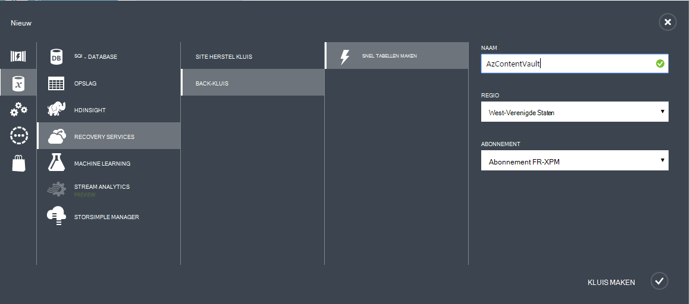

## Maak een back-kluis
Als u wilt back-up van bestanden en gegevens van Windows Server of Data Protection Manager (DPM) Azure of back-ups van VMs IaaS naar Azure, moet u een back-up kluis in de geografische regio waar u de gegevens op te slaan.

De volgende stappen helpt u bij het maken van de kluis die wordt gebruikt voor het opslaan van back-ups.

1. Aanmelden bij de [Portal beheren](https://manage.windowsazure.com/)
2. Klik op **Nieuw** > **Data Services** > **Recovery Services** > **Back-up kluis** en kies **Snel maken**.

    

3. Voer een beschrijvende naam ter identificatie van de back-kluis voor de parameter **Name** . Dit moet uniek zijn voor elk abonnement.

4. Selecteer de regio voor de back-kluis voor de parameter **regio** . De keuze bepaalt het geografisch gebied waarop de back-up gegevens worden verzonden. Als u een geografische regio dicht bij uw locatie, kunt u de netwerkvertraging verkleinen als back-up naar Azure.

5. Klik op de **Kluis maken** om de werkstroom te voltooien. Het kan even duren voor de kluis back-up moet worden gemaakt. U kunt de status kunt u de mededelingen onder in de portal te controleren.

    

6. Nadat de kluis back-up is gemaakt, het bericht dat de kluis heeft gemaakt. De kluis wordt ook vermeld in de bronnen voor Recovery Services als **actief**.

    

### Azure back-up - opslag redundantieopties

>[AZURE.IMPORTANT] De beste tijd voor het identificeren van uw opslag redundantie optie is direct na het maken van de kluis en voordat computers zijn geregistreerd op de kluis. Nadat u een item naar de kluis is geregistreerd, wordt de optie opslag redundantie is vergrendeld en kan niet worden gewijzigd.

Redundante opslag de Azure back-up back-end opslagruimte dient uw zakelijke behoeften te bepalen. Als u Azure als het eindpunt van een primaire back-up opslaan gebruikt (bv. u reservekopieën op Azure vanaf een Windows-Server), kunt u overwegen Geo-redundante opslagoptie kiezen (standaard). Dit wordt gezien onder de optie **configureren** van uw back-up kluis.

#### Geo-redundante opslag (GRS)
GRS houdt zes exemplaren van uw gegevens. GRS, uw gegevens drie keer wordt gerepliceerd binnen het primaire gebied en tevens drie keer worden gerepliceerd in een secundaire gebied honderden van mijl van de primaire regio, biedt het hoogste niveau van duurzaamheid. Bij een storing op de primaire regio, doordat gegevens in GRS, Azure back-up zorgt ervoor dat de gegevens duurzaam in twee afzonderlijke regio's.

#### Lokaal redundante opslag (LRS)
Lokaal redundante opslag (LRS) houdt drie exemplaren van uw gegevens. LRS wordt drie keer binnen één voorziening in een bepaalde regio worden gerepliceerd. LRS beveiligt u uw gegevens van normale hardwarefouten, maar niet van het mislukken van een hele Azure faciliteit.

Als u Azure als het eindpunt van een tertiaire back-up opslaan gebruikt (bv. u SCDPM gebruikt om een lokale back-up op gebouwen & Azure gebruiken voor de lange termijn bewaren kopiëren), kunt u overwegen lokaal redundante opslag kiezen van de optie **configureren** van uw back-up kluis. Dit brengt de kosten voor het opslaan van gegevens in Azure, terwijl een lager niveau van duurzaamheid voor uw gegevens die acceptabel voor tertiaire kopieën wellicht.

