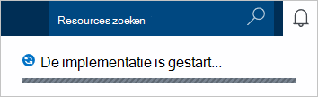
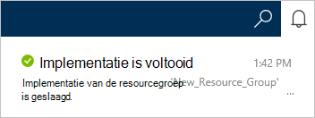
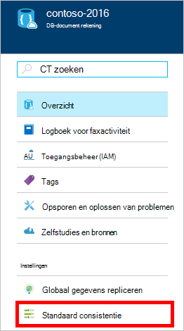
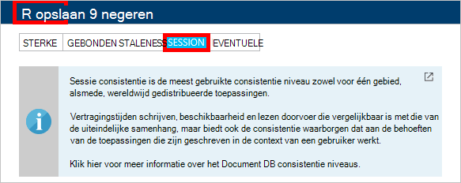

1.  Log in om de [Azure portal](https://portal.azure.com/).
2.  In de Jumpbar, klikt u op **Nieuw**, klikt u op **gegevens- en**en klik op **DocumentDB (NoSQL)**.

      

3. Geef de gewenste configuratie voor de account DocumentDB in de **nieuwe account** -blade.

    

    - Voer in het vak **ID** een unieke naam voor de account DocumentDB.  Wanneer de **ID** wordt gevalideerd, verschijnt er een groen vinkje in het vak **ID** . De **id-** waarde wordt de hostnaam van de in de URI. De **ID** bevat mogelijk alleen kleine letters, cijfers en '-' teken, en moet tussen 3 en 50 tekens. Houd er rekening mee dat *documents.azure.com* wordt toegevoegd aan de naam van het die u ook kiest, het resultaat hiervan het eindpunt van de account DocumentDB wordt.

    - Selecteer in het vak **NoSQL API** **DocumentDB**.  

    - Voor **abonnement**, selecteer het Azure abonnement dat u wilt gebruiken voor de account DocumentDB. Als uw account slechts één abonnement heeft, wordt die account is standaard ingeschakeld.

    - In de **Resourcegroep**of een resourcegroep voor uw DocumentDB-account maken.  Standaard wordt een nieuwe groep gemaakt. Zie [werken met de Azure portal Azure resources beheren](../articles/azure-portal/resource-group-portal.md)voor meer informatie.

    - **Locatie** opgeven van de geografische locatie die als host voor uw DocumentDB-account gebruiken. 

4.  Nadat de nieuwe accountopties voor DocumentDB zijn geconfigureerd, klikt u op **maken**. Controleert u de status van de implementatie, de hub meldingen.  

      

    

5.  Nadat de account DocumentDB wordt gemaakt, is deze gereed voor gebruik met de standaardinstellingen. De standaard consistentie van de DocumentDB-account is ingesteld op **sessie**.  De standaard consistentie kunt u aanpassen door te klikken op **Standaard consistentie** in het menu bron. Zie voor meer informatie over de consistentie niveaus aangeboden door DocumentDB, [consistentie niveaus in DocumentDB](../articles/documentdb/documentdb-consistency-levels.md).

      

      

[How to: Create a DocumentDB account]: #Howto
[Next steps]: #NextSteps
[documentdb-manage]:../articles/documentdb/documentdb-manage.md
