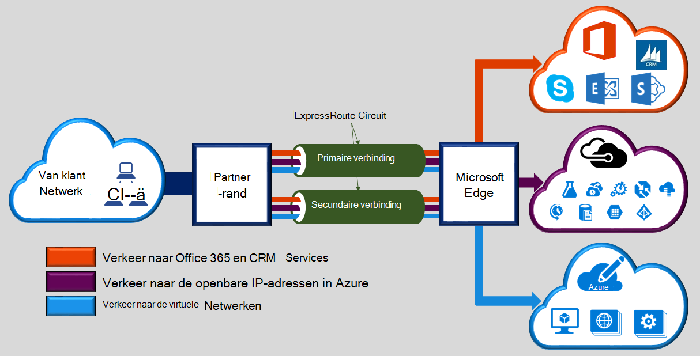

Microsoft Azure ExpressRoute kunt u uw netwerken op ruimten uitbreiden naar de cloud met Microsoft via een specifieke persoonlijke verbinding vergemakkelijkt door een provider connectiviteit. Met ExpressRoute, kunt u verbindingen met Microsoft cloud services, zoals Microsoft Azure, Office 365 en CRM Online maken. Verbinding kan van een any-to-any (VPN IP)-netwerk, een point-to-point Ethernet-netwerk of een virtuele cross-verbinding via een provider connectiviteit in een inrichting collocatie worden. ExpressRoute verbindingen gaan niet via het openbare Internet. Hierdoor ExpressRoute verbindingen biedt meer betrouwbaarheid, hogere snelheden, lagere vertragingstijden en een hogere mate van beveiliging dan de normale verbindingen via het Internet.  

